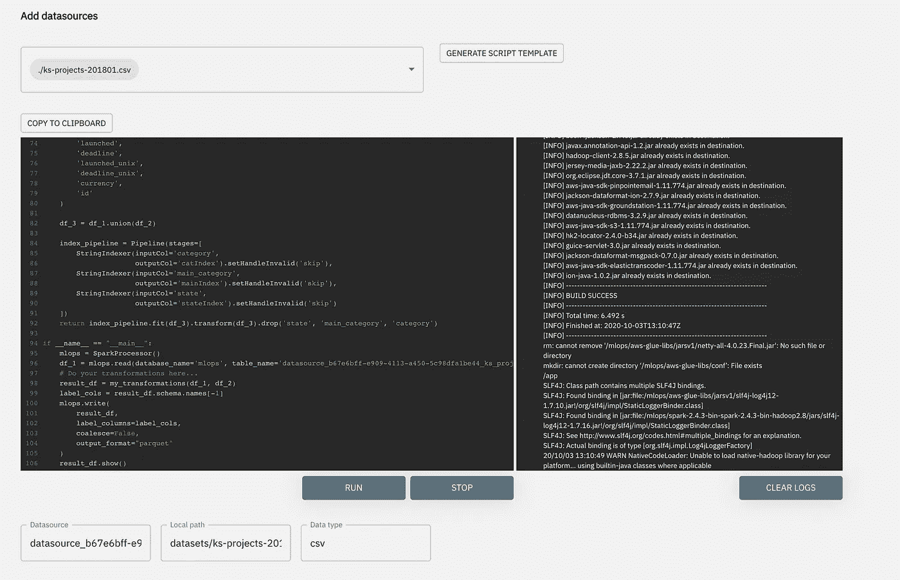
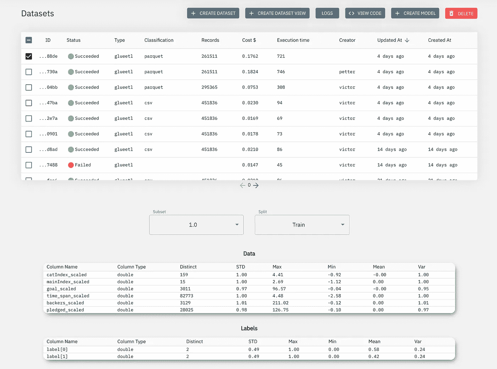
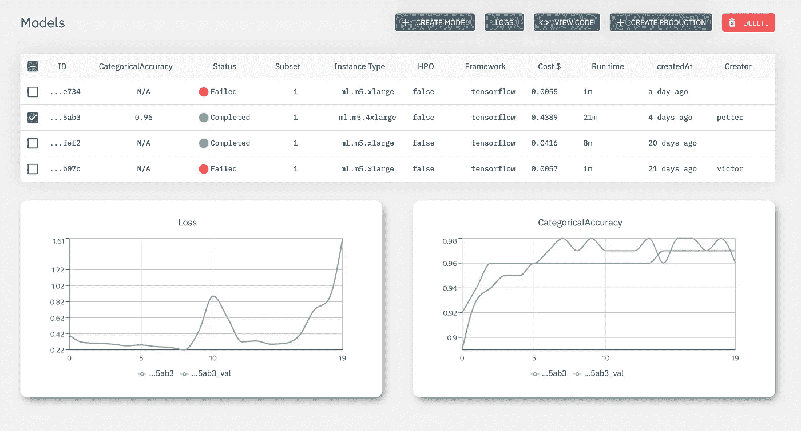
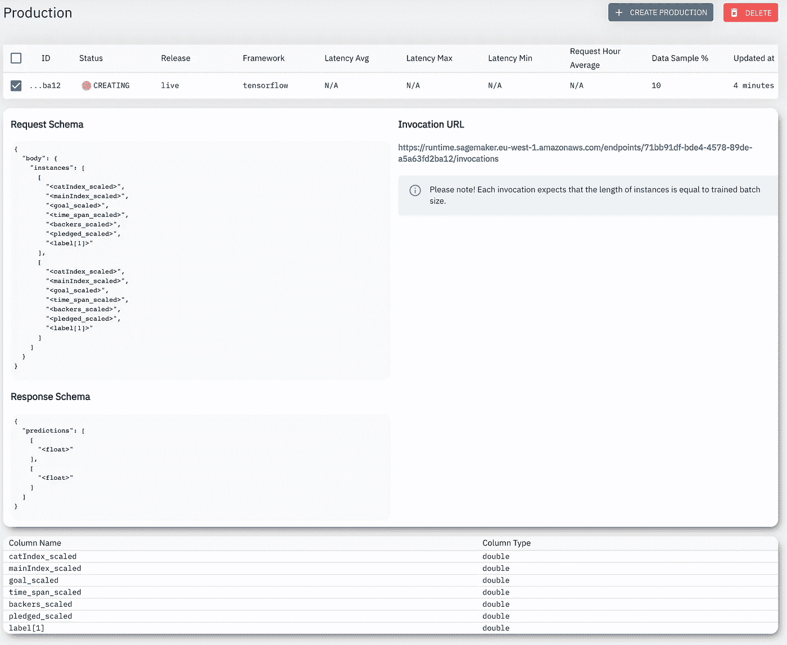

# 带有 MLOps 的 Kickstarter

> 原文：<https://towardsdatascience.com/kickstarter-with-mlops-cc672d65731f?source=collection_archive---------43----------------------->

## 使用 PySpark 和 TensorFlow 对 kickstarter 项目的成功进行分类。

# 介绍

对我来说，在 99 %的情况下，在 Kickstarter 上支持发明者会导致多年等待一个永远不会出现在我家门口的产品。因此，让我们用一个惊人的 kickstarter 成功分类器来彻底解决这个问题。我们将使用 [MLOps 平台](https://mlops.cloud)来获取我们的数据源(您可以在 [Kaggle](https://www.kaggle.com/kemical/kickstarter-projects) 上找到它)，然后使用 SDK 在本地开发我们的预处理和建模脚本，最后将整个包提交到我们的 AWS 帐户，以对其进行版本控制并为生产做好准备。毕竟，这可能是一个真正的赚钱机器。

# 使用 PySpark 进行预处理

有些人可能会认为对 50 MB 的数据集使用 Spark 可能有点大材小用。但我喜欢一致性和改进。毕竟，它对 MB 和 TB 一样有效。

让我们从定义我们的主要功能开始:

像往常一样，我使用 MLOps 平台生成脚本模板，从 S3 读取数据源。MLOps SDK 为我们不想考虑的所有事情提供了一个很好的包装——比如读、写和版本控制转换，这样我就可以专注于`my_transformations`中发生的事情。

接下来，让我们定义我将使用的 PySpark 类:

这里没有什么特别的，普通的 Spark 预处理类以及导入的 [MLOps SDK](https://docs.mlops.cloud/sdk/preprocessing/) 。

我们还需要我最喜欢的 PySpark 辅助函数，它将 PySpark 向量转换成列:

一旦我们完成了这些，我们就可以转到 main 函数了，它获取原始输入数据帧，执行所有转换，然后将其返回给 main 函数进行磁盘写入。我们从稍微清理一下数据帧开始，断言所有值都有正确的类型:

我们还通过减去项目的开始和结束时间来计算活动的总“在线”时间，并过滤掉一些小的子类，如非美元的货币(约 10 %的数据)和非成功或失败的州(约 6 %的数据)。

完成后，我们可以继续将所有分类字符串列转换为整数:

完成后，我们可以继续缩放所有列。这是深度学习的重要一步，因为我们不想让我们的权重失控。我将使用`StandardScaler`，一旦完成，我还将使用`OneHotEncoder`将我的项目状态列(成功/失败)转换成一个 hot 编码表示，因为这是 TensorFlow 需要的格式:

需要注意的一件重要事情是`OneHotEncoder`的`dropLast=False`论点，你只能通过痛苦的经历来了解这一点。我知道他们有理由默认这个给`True`，但是我真的认为有人在喝醉的时候决定的。

最后，我们可以将一个热编码向量分解成列，然后返回 main:

当我开发这个脚本时，我通过做`pip install mlops-local`来使用平台内部可用的 MLOps [本地测试环境](https://docs.mlops.cloud/getting_started/local_mode/)，这样我可以快速迭代数据的子集，直到我对我的转换满意为止:

然后，我可以在数据集视图中查看计算出的指标的最终结果:

# 使用 TensorFlow 训练

和往常一样，训练和预处理的设置是一样的。与预处理一样，我在 main 函数中有一点模板生成的代码，用于处理数据的读取、写入和发送回控制台。

除此之外，我有一个`my_network`函数，在那里我定义了我的架构。在控制台中，我为脚本提供我的超参数，在这种情况下是`batch_size`、`learning_rate`和`epochs`，然后在`mlops.hyperparameters`下连同数据矩阵一起用于训练、验证和测试。我将运行 20 个时期，这可能会超出数据量:

正如所料，我们看到一个快速上升到几乎 96 %的准确性，然后停滞不前，损失变得疯狂。严重过度训练。但话说回来，它在测试集上获得了稳定的 96 %的分数，这只是我玩玩而已。

# 投入生产

既然我们对我们的模型如此满意，是时候利用它赚钱了，把它公之于众(其实不是，它藏在一个 VPC 里，可以从你的云服务中访问)。我将创建一个活动端点，这意味着一个 24/7 全天候运行的托管 API，根据推理机的 CPU 利用率水平扩展实例。

我还将设置 10 %的数据采样百分比，这意味着对于每 10 个请求，MLOps 平台将保存来自推理的输入和输出，并对数据漂移、模式正确性等进行分析。在这一点上，我可以稍后设置一个警报，通知我的 DevOps 团队，如果大便击中风扇:

所以，对你来说这是一个端到端的魔术。希望很快在 [Slack 社区](https://join.slack.com/t/mlops-communitygroup/shared_invite/zt-f27d828w-XuVpXs0NIA9jJTOIYHdk1g)与您见面，在这里我们将从数据工程、数据科学和 DevOps 的角度讨论机器学习和操作，以及它们如何融合在一起！