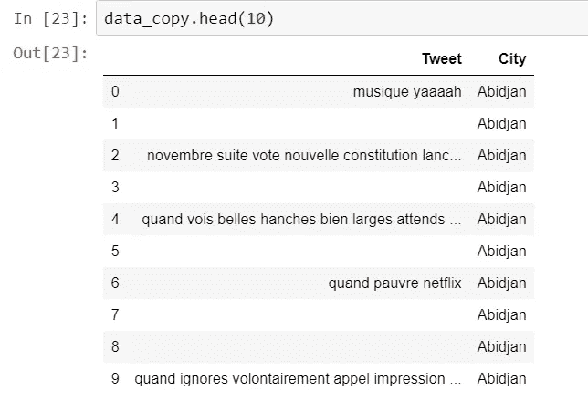
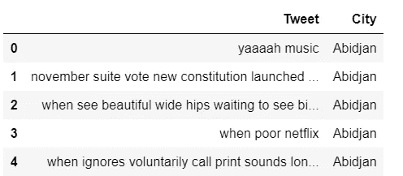
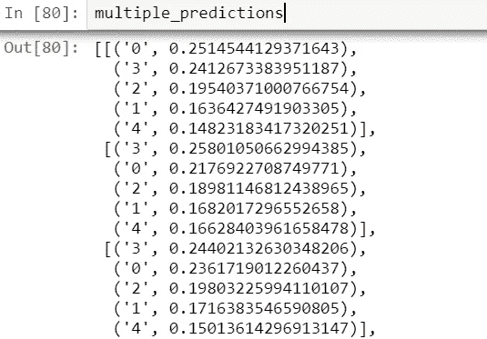
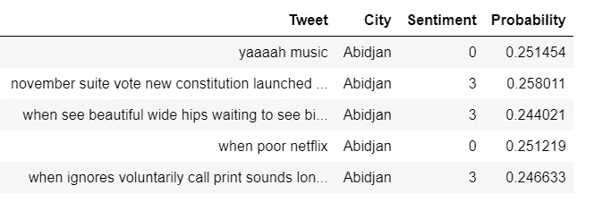

# 伯特在计算 2019 年城市幸福指数

> 原文：<https://towardsdatascience.com/kigali-the-2019-happiness-capital-a0085dc1efc4?source=collection_archive---------48----------------------->

随着时间的推移，非洲充满了负面含义。我没有立场来捍卫或支持这样的主张，因为在大多数情况下，我认为这样的观点只是支持者的观点。除此之外，我选择从数据的角度来看待非洲大陆的积极因素，更多的是整体公民的幸福感。在此之前，我深入分析了一下，请花点时间通读一下根据 [BBC](https://www.bbc.com/news/world-africa-50782677) 报道的 2019 年非洲大陆五大正面故事。老师 [**塔比奇**](https://www.globalteacherprize.org/person?id=7486) 必须在那里，可能是我太肯尼亚化了。如果我不提我最喜欢的合唱团在 AGT 的表演，恩德洛武青年合唱团以及跳羚队获得世界橄榄球冠军，非洲众神会不高兴的。

为了解开这个幸福理论，我写下了几个“研究问题”，我相信这些问题会引导我找到最终结果

*1。有可能获得关于非洲国家的重要数据来确定他们的幸福吗？
2。对于同样的问题，最好的计算方法是什么？
3。这些结果可以通过任何方式验证吗？有验证集吗？*

大多数国家都有关于幸福指数的数据，但通常涉及几个指标的组合，我不愿意走这条路，至少目前是这样。但愿这将在未来形成验证集，但愿如此。我训练过许多分析模型，所以使用正确的数据，这种方法并不难。

**按人口统计的最大城市的数据**

我最终收到了来自非洲不同城市的随机推文，这些推文是基于这些城市的人口数量和个人喜好。因此，预计数据和个人偏好会有一点偏差，但是结果仍然是确定的。这里列出了人口最多的城市。我最终融入了几个东非城市，尽管它们的人口规模很大。*阿比让、亚的斯亚贝巴、布琼布拉、开罗、达累斯萨拉姆、约翰内斯堡、坎帕拉、基加利、金沙萨、拉各斯、罗安达、摩加迪沙*和*内罗毕*在分析中受到关注。

**推文收藏**

地理定位在收集从这些城市传播的推文中至关重要。Twitter 有一个高级搜索功能，因此这个集合可以使用关键字“附近”。看看杰斐逊的 GetOldTweets [repo](https://github.com/Jefferson-Henrique/GetOldTweets-python) 来深入搜索和收集过去的推文。你以后会感谢我的。收集来自内罗毕的推文就像下面的 Python 命令一样简单。

通过上面的命令，你将能够收集来自/靠近肯尼亚内罗毕的 2019 年**传播的多达**1000 万条推文**。**

我感兴趣的是来自城市的一小部分推文，因此最终收集了 16942 条随机和独特的推文。挑战在于推文使用不同的语言，这与我的训练数据和选择的方法的要求相反。

**推文预处理和翻译**

与传统的英语文本不同，推特是独特的，因为它们被缩短以适应字符限制，并且在大多数情况下表达的语言是非传统的。因此，预处理同样是不同的。我用 Pandas 将 CSV 转换成数据帧，以便于操作。

令人感兴趣的是推文本身的**“text”**栏。因此，我删除了所有其他的专栏，删除了重复的，停用的词以及空的推文。这在推特上经常发生。下面的代码将处理所有这些过程。

不幸的是，这个过程将再次留下几条短推，如下所示。

解决方法是再次删除空值，如下所示，因为在空字段上训练模型是浪费资源。

上述过程的输出如下。

这是有道理的。不幸的是，我们的模型是在英语文本上训练的，因此需要将这些推文翻译成英语，尤其是来自阿比让和金沙萨等法语城市的推文。我使用了 GoogleTranslate API 键[将所有推文翻译成英语。这需要一些时间，但将使用下面的代码完成工作:](https://translatepress.com/docs/automatic-translation/generate-google-api-key/)

与城市字段连接后的输出如下。

**伯特在训练我们的模特**

**来自变形金刚的双向编码器表示(BERT)** 是 Google 基于变形金刚开发的自然语言处理(NLP)技术。来自谷歌[博客](https://www.blog.google/products/search/search-language-understanding-bert/)、*的消息称，这一突破是谷歌对变形金刚研究的结果:模型将单词与句子中的所有其他单词联系起来处理，而不是一个接一个地按顺序处理。因此，BERT 模型可以通过查看单词前后的单词来考虑单词的完整上下文，这对理解搜索查询背后的意图特别有用。”*

由于 [BERT 模型](/a-review-of-bert-based-models-4ffdc0f15d58)已经在数百万个句子和特征上被训练过，它们在许多开箱即用的 NLP 任务上表现得相当好。我使用了 [Fast-Bert](https://github.com/kaushaltrivedi/fast-bert) ，这是 PyTorch BERT 模块的一个优秀的简单包装器，用于在 tweets 的[数据集](https://www.kaggle.com/kazanova/sentiment140)上训练模型，以文本作为特征，以情感类别(0 到 4)作为标签。该模型随后在我们翻译的推文中进行了测试。

**先决条件**

不幸的是，BERT 模型非常庞大，有数百万个特征，因此运行模型的计算能力对我来说是个大问题。我选择了几个云选项，下面是我对我尝试过的几个选项的想法。

1.  **Kaggle** —有 GPU 支持的免费平台，但内存分配对我不利。由于内存相关问题，培训过程被终止。
2.  谷歌的 Colab——运行良好，但在经过数小时的训练后，它也分别关闭了，尽管与 Kaggle 的平台相比，它更适合这项任务。没有尝试 TPU 功能，因为 Pytorch 还不被支持。
3.  谷歌云平台——我最终选择了这个平台，因为我可以使用他们提供的 300 美元免费积分。我使用了相同的一小部分，所以这是任何有兴趣训练这样一个模型的人的最佳平台。首先，不要为 GCP 买单。因为您将使用虚拟机(VM ),所以只要满足于 CPU 和内存高的虚拟机就可以了。不要用付费的 GPU。我试过这个，结果除了支付 68 美元之外，什么也没训练。只需按照这篇文章在 GCP 上设置你的笔记本。你会节省很多时间。

**附加工具:**

**Python 3
Fast-Bert** 如果使用 CPU，请忽略此选项。
Ubuntu

我选择了 [**DistilBERT**](https://medium.com/huggingface/distilbert-8cf3380435b5) ，一个更小、更快、更便宜的模型来训练和设置 CPU 版本，因为我无法使用谷歌积分访问 GPU。下面的代码除了对训练集和验证集进行分段之外，还导入了模型训练所需的所有包。

**数据束**

建模的第一步是创建*数据束*。这只是一个对象，它接受训练、验证和测试 CSV 文件，并将它们转换为 BERT 及其变体(如 DistilBERT)的内部表示。它还根据**设备配置文件、batch_size** 和 **max_sequence_length** 实例化正确的数据加载器。

**学习者**

学习步骤以数据分组和相关参数作为输入。下面是 Python 中相同内容的表示，其中学习者封装了模型生命周期的关键逻辑，如训练、验证和推理。

然后模型被训练如下。

考虑到训练时间和资源，我只是将**纪元的数量**设置为 1。如果您有足够的资源，您可以更改这个数字以获得更好的准确性(不保证)。使用 16 个 vCPUs 和 64GB 内存，培训需要大约 19 个小时。建议保存模型，这样就不会进行重新训练。下面的预测器对象将模型和标签作为输入。

**对测试集进行情感分析**

使用下面的代码可以选择批量情绪预测。

如下所示的输出将是该推文属于情感类别的标签和概率。每条推文情感输出的概率总和应该等于 1。

因此，具有最高概率的标签是选择的预测标签。根据上面的输出，第一个 tweet 情感预测标签是 0，概率为 25%。为了选择列表中概率最高的标签，下面代码中的第一行起作用了。然后，输出被转换成第二行中的数据帧。

原始测试集和每条 tweet 的预测的串联产生了以下结果:-

**酸甜苦辣的时刻**

到现在为止，你一定已经对快乐在输出中意味着什么有了一个概念。与其余的相比，情绪标签 4 显示了更大程度的满足。另一方面，标签 0 表示不满，因此被解释为悲伤的感觉。因此，获得情绪得分的平均值，按城市分组，是计算一个城市总体幸福感的一个简单但似乎合理的答案。下面的代码表明。

***卢旺达基加利*** 摘得 13 个最幸福城市的桂冠。令人惊讶的是， ***摩加迪沙，索马里*** 位居第二，尽管我们读到过关于索马里这个国家的负面报道。 ***肯尼亚内罗毕*** 我的首都是继 ***乌干达坎帕拉*** 之后东非第二不快乐的城市。

**结论**

当使用数据驱动的解决方案来获得某些国家或城市的人们的幸福时，上述结果在某种程度上令人大开眼界。几点作为我的结论:—

1.  城市的选择纯粹是基于人口和个人喜好，特别是东非城市的选择。这是我讲述非洲故事的最好/唯一方式。随着时间和更多的资源，我将能够从非洲大多数国家的首都获得更多的推文，并进行更好的比较。
2.  20 万条随机推文的训练集(虽然在类中是平衡的)有点偏低。DistilBERT 模型也具有较少的特征( **66M** )，这在很小程度上损害了准确性。我计划用一个多语言的完整模型(**110 万**功能)和整个 160 万 tweets 训练集实现同样的功能。希望会有一些显著的不同。
3.  翻译是一项挑战，尤其是对推文中的缩写词和有语境挑战的词。原始上下文可能会丢失，但翻译者在人类评估者查看的几个样本上工作得相当好。
4.  验证我们的结果。这是一个棘手的部分。我们的数据基于社交数据，尤其是推特。推文描述了各个城市的日常聊天，因此最适合衡量传播者的总体幸福感。然而，目前使用的方法考虑了其他几个决定幸福感的因素。例如,[联合国世界幸福报告](https://s3.amazonaws.com/happiness-report/2019/WHR19.pdf)就是其中之一，因此如果模型中包含其他因素，将其作为基础事实将是有效的。这是可以讨论的。