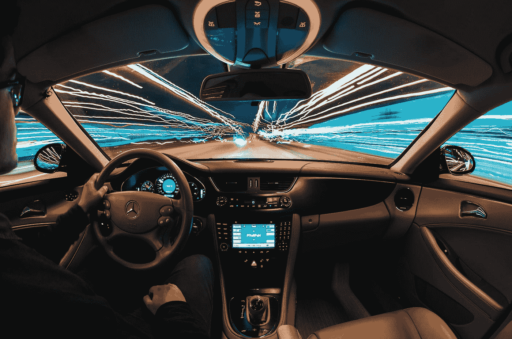

# 杀死汽车保险商

> 原文：<https://towardsdatascience.com/killing-the-motor-underwriter-cb11317cda98?source=collection_archive---------34----------------------->

## 正如我们所知，人工智能正在如何改变汽车保险

戴维·沃特基斯在 [Unsplash](https://unsplash.com?utm_source=medium&utm_medium=referral) 上的照片

在黎明降临这座城市之前，约翰起床去上班。这对他来说是重要的一天，因为他要向董事会做报告。由于他非常紧张，而且这一天似乎相当愉快，他决定开车去上班，而不是让自动驾驶汽车载他。约翰已经通过他的移动设备订阅了智能保险计划。这基本上意味着保险费率根据他的情况而变化。事实上，他决定关闭汽车的自动驾驶仪，这导致他的驾驶保险费略微增加了几美分。但这对他来说很好，因为他需要从演示中转移注意力。

每年，全世界有 125 万人死于车祸，另有 200 万人受伤。这些事故中有 94%是由于人为错误造成的，但随着每辆驾驶经验超过 60 年的自动驾驶汽车的扩散，死亡和受伤的数量下降了。安全性的提高最终导致全球保险费的下降。

由 [Samuele Errico Piccarini](https://unsplash.com/@samuele_piccarini?utm_source=medium&utm_medium=referral) 在 [Unsplash](https://unsplash.com?utm_source=medium&utm_medium=referral) 拍摄的照片

约翰一坐到驾驶座上，他的虚拟助手凯蒂就查看了他的日记，并给汽车的导航仪设置了程序。这条路线不仅考虑到了当时的交通状况加上驾驶时间，这将使他能够及时到达目的地，而且还考虑到了安全因素。由于所有汽车都与中央智能交通系统(ITS)实时连接，人工智能(AI)每天都会收集数百万辆汽车的数据。然后计算基本统计数据，如交通和事故热点、事故可能性等。该系统优化了整个道路网络，以减少交通和事故。

然而，John 决定不走这条路线，而是选择了一条风景更好但系统不推荐的路线。这一选择导致他的每日保险费进一步增加，因为风险稍高。这些增加的费用通过他的银行账户用微支付系统自动支付。

尤金·特里古巴在 [Unsplash](https://unsplash.com?utm_source=medium&utm_medium=referral) 上的照片

一路上，一个疯狂的司机开着一辆这样的车(没有撞坏传感器)径直撞上了他。这辆车有一个内部诊断系统，可以自动判断受损程度。约翰的虚拟助手凯蒂对事故进行了统计分析，将其归类为轻微事故，因此没有派出救护车。然而，它与约翰互动，以确保他感觉良好。此外，意识到约翰的演示要迟到了，凯蒂叫了一辆替换车尽快把他送到办公室。

与此同时，智能交通系统派出无人驾驶飞机用视频记录事故。凯蒂已经向在线保险公司提出了索赔，并上传了所有记录在案的证据。在这种情况下，事故相当简单，人工智能法官查明了另一名人类司机的过错。由于汽车仍在运行，因此不需要自动驾驶拖车，汽车会自动驾驶到附近的一家钣金厂进行维修。根据人工智能法官做出的决定，所有发生的费用都自动向另一名人类司机收取。当钣金工完成修理后，汽车自己开回了约翰的家。与此同时，凯蒂让约翰了解维修的最新情况。

照片由[罗斯·芬登](https://unsplash.com/@rossf?utm_source=medium&utm_medium=referral)在 [Unsplash](https://unsplash.com?utm_source=medium&utm_medium=referral) 拍摄

当然，这是一个未来的场景，但它可能比我们想象的要近得多。

*   无人驾驶汽车已经在美国的一些州出现并广泛使用。
*   从 SIRI 到 Cortana，虚拟助手几乎可以在任何手机中找到。这些助手已经在导航方面提供了帮助，并考虑到了实时交通、约会等因素。
*   许多国家都有智能交通系统，配备了大量摄像机和其他传感器，能够监测道路网络，并在必要时提供援助。
*   无人机越来越普及，越来越普及。他们在监视偏远地区和运送轻型货物方面已经非常成功。
*   人工智能法官已经做出了一些小的决定。例如，爱沙尼亚目前正在试行一种可以裁决小额索赔纠纷的“机器人法官”。

不同的组件是可用的。仍然缺少的是将它们连接在一起的粘合剂。然而，我们开始生活在上面提到的场景中只是时间问题。当我们做到了，我们的生活将永远改变。我们将会有更少的车祸和死亡。我们将能够专注于最重要的事情，而不会被驾驶压力所困扰。对于无聊的部分，总有我们的虚拟助手不知疲倦地工作，让我们的生活变得轻松。

*本文原载于*[*【https://www.businesstoday.com.mt】*](https://www.businesstoday.com.mt/people/people/517/interview__alexiei_dingli_malta_ideal_place_to_launch_and_deploy_ai_solutions)

[**Alexei Dingli**](http://www.dingli.org/)**Prof 是马耳他[大学](https://www.um.edu.mt/)的 AI 教授。二十多年来，他一直在人工智能领域进行研究和工作，协助不同的公司实施人工智能解决方案。他的工作被国际专家评为世界级，并赢得了几个当地和国际奖项(如欧洲航天局、世界知识产权组织和联合国等)。他已经出版了几本同行评审的出版物，并且是马耳他[的成员。由马耳他政府成立的人工智能工作组，旨在使马耳他成为世界上人工智能水平最高的国家之一。](https://malta.ai/)**