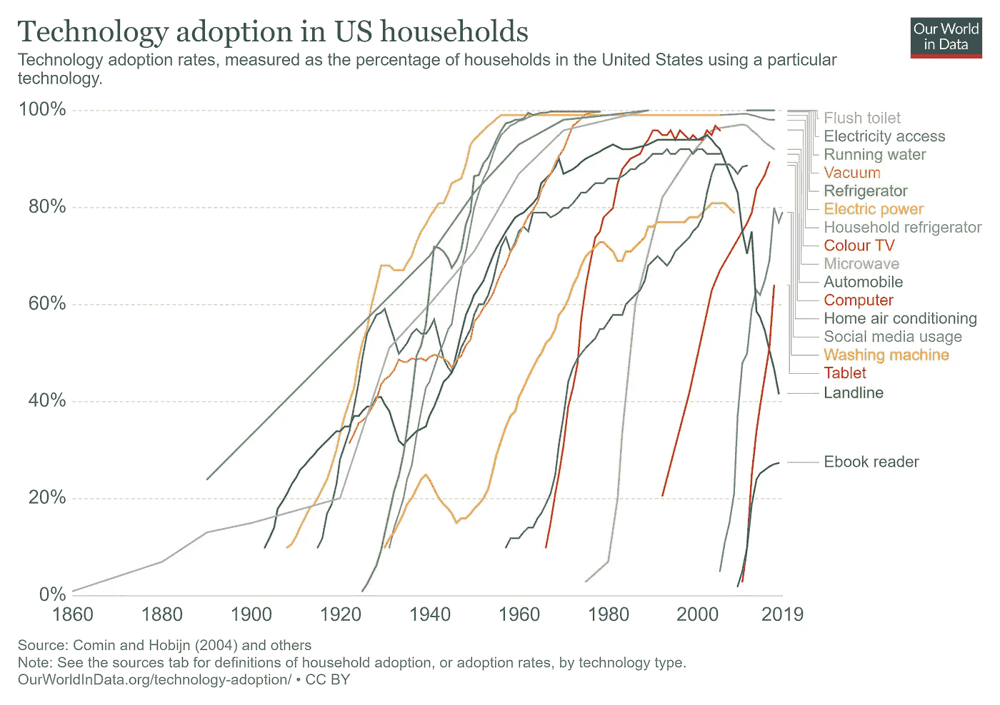
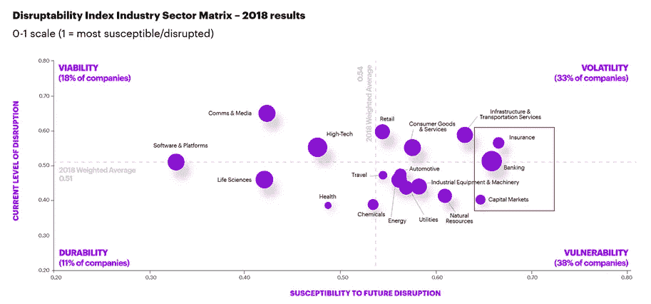
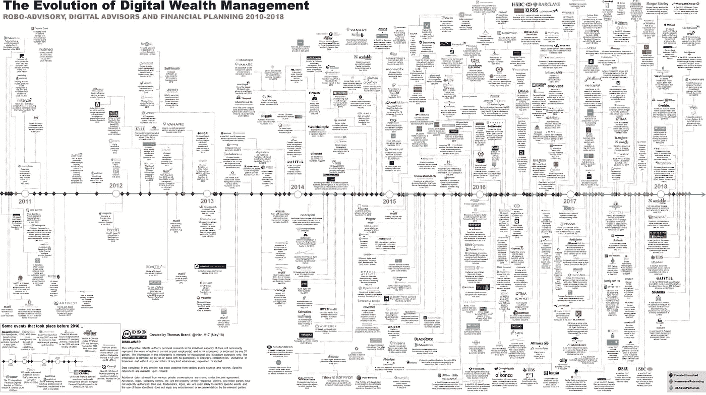
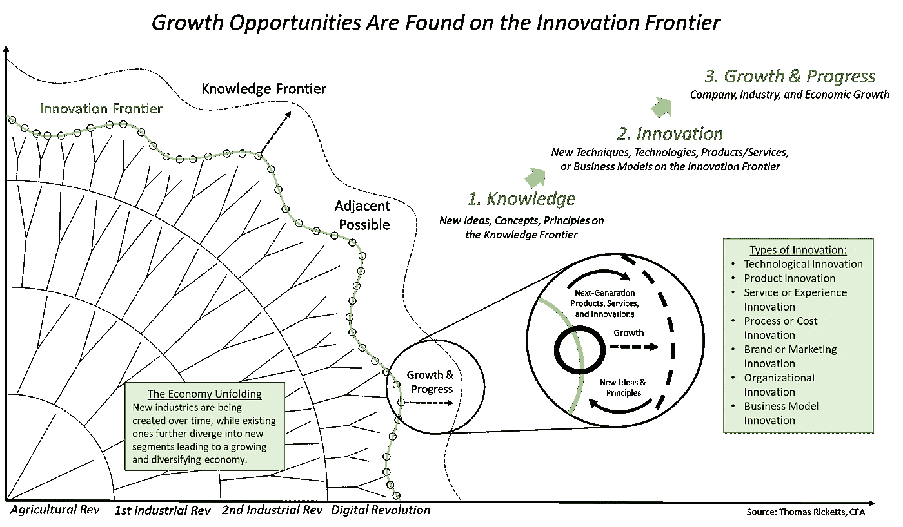
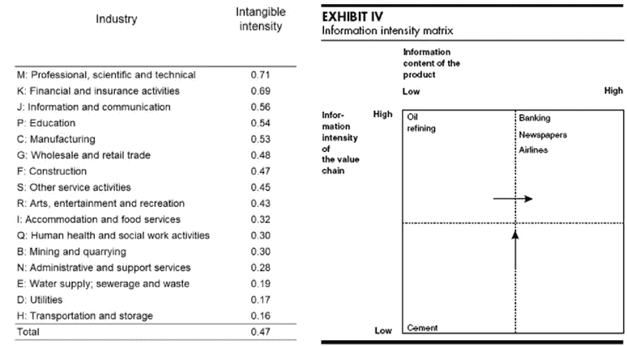
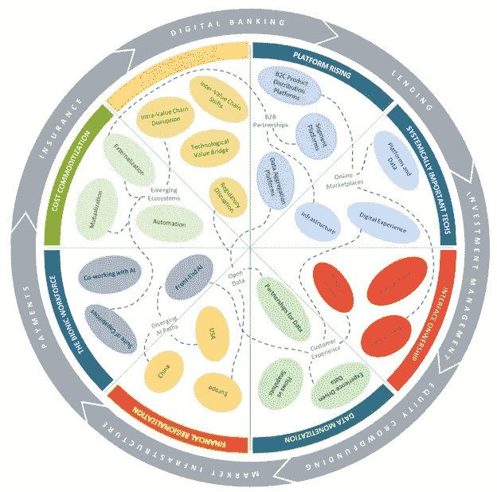
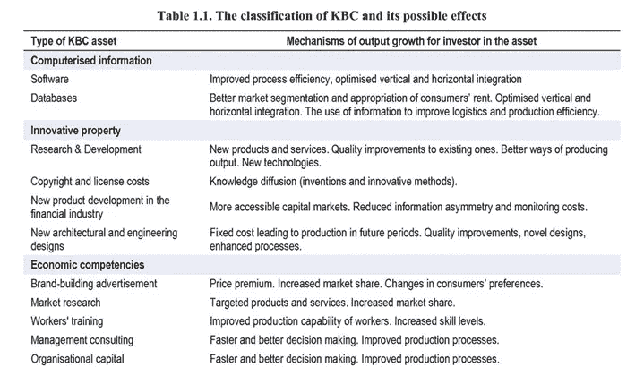
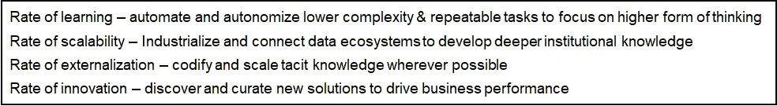
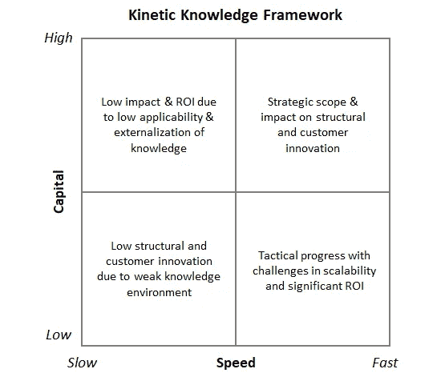

# 20 年代金融创新的动力知识

> 原文：<https://towardsdatascience.com/kinetic-knowledge-for-financial-innovation-in-the-20s-f137f46ba383?source=collection_archive---------43----------------------->

埃里克·达尔林普尔在 [Unsplash](https://unsplash.com?utm_source=medium&utm_medium=referral) 上拍摄的照片

**社会&商业正在加速变革，这在很大程度上要归功于技术！**

人们总是很容易说这个十年*将与之前的十年*有很大不同。直觉上，我们都知道这一点，然而，有时我们没有认识到变化的指数性质。技术可能是社会和商业变革的最大驱动力，作为一个例子，如果你研究美国家庭对技术的采用，你会发现变化的速度惊人。随着新技术以更快的速度传播，S 曲线变得越来越陡峭！从某种程度上来说，未来十年我们将经历比过去整个世纪更多的技术变革。

伟大的未来学家、《未来的冲击》一书的作者阿尔文·托夫勒早在 1970 年就对此做了很好的总结。*如果人类的存在已经大约。50，000 年(800 世)，相比之前 798 世的总和，我们在过去两世经历了更多的变化。直到 150 世以前，我们一直住在洞穴里，然而，在未来的 80 年里，世界人口的 85%将是城市人口！*

**20 年代:金融服务领域的技术十年=变革步伐加快=颠覆？**

近 700 年来，金融机构一直相当有弹性，并保持了其作为经济支柱的角色。从本质上讲，金融机构并没有发生太大变化，它们提供的是同样的服务:金融咨询、金融投资、存款/贷款/交易、流动性和信用管理以及风险管理，还有价值主张:专业知识、经验、规模、关系管理和市场理解。

当然，这并不是说没有发生变化。随着经济、监管、全球化、信息技术、企业和消费者的发展，银行也发生了重大转变。然而，当我们仔细观察时，这些变化大部分发生在过去的 100 年里，其中大部分发生在过去的 50 年里。拉古拉姆·拉扬在他的论文[中也提到了这一点，他的论文是《透过不完全契约的视角看商业银行的过去和未来](https://faculty.chicagobooth.edu/raghuram.rajan/research/papers/jmcb.pdf)。他写道，这种变化(至少在企业银行业)有三个关键因素——技术、信息处理和产权环境。

这也是有意义的。如果将银行视为处理信息以提供金融解决方案的大型数据存储，那么随着多种技术(区块链、人工智能、加密、云等)的入侵，银行似乎已经成熟。

2018 年，埃森哲研究了 10，000 家公司的 62 个参数，以确定各行业的中断状态。尽管金融服务业迄今仍有弹性，但它似乎最容易在未来受到冲击。

来源:埃森哲

金融服务的中断有时被认为是一种激进的观点，尽管人们普遍承认，银行业已经出现了加速变革和更新的破坏性力量。过去十年，金融机构在某些领域已经在解决这一问题上取得了进展。例如，在财富管理领域(如下图)，由于市场力量，数字化采用和服务创新变得咄咄逼人。同样，由于 MIFID 导致新的创新模型，我们正在见证买方和卖方的重大长期变化。

来源:ThomasBrand

也就是说，对金融机构进化的总体关注，以及由此带来的绩效和效率方面的结果，充其量只是适度的，并回避了一个问题——从更广泛的意义上讲，在颠覆性力量和技术进步的推动下，金融机构如何为加速变革的时代做好准备？

**引领金融行业的加速变革——动态知识可能是关键！**

Thomas Ricketts 在他的文章中，[*在创新前沿发现机遇*](https://evolutionarytree.com/Home/Opportunity-is-Found-on-the-Innovation-Frontier) 描述了知识如何在数字时代的行业创新中发挥关键作用，这些行业更加关注知识资本/无形资产/知识资本(下图)。据估计，现在标准普尔 500 指数 80%的企业价值是无形资产。

资料来源:托马斯·里基茨

对于金融服务来说，知识的作用变得更加突出，因为它具有最高的*无形强度*(无形资产占总资产的百分比)以及跨行业产品和流程中最高的信息强度。

资料来源:没有资本的资本主义:理解我们新的“知识”经济；迈克尔·波特的 HBR 文章

此外，还有几个影响金融服务的破坏性驱动因素，使得确定优先级和重点变得异常困难。

来源:世界经济论坛

因此，金融服务领域的知识是创新和效率的强大驱动力。在数据、信息和人工智能的数字时代，不仅仅是一个拥有智能人工智能的被动系统。

为了更全面更全面地利用知识的力量，我们需要一个新的框架，叫做**运动知识**。动能知识(很像动能——质量&速度)着眼于知识的两个维度(1)资本(2)速度:

(1)知识型资本(KBC)一般指无形形式的资本，包括一系列资产。经合组织为知识资本创建了一个框架，使这种资本的衡量更加科学:

资料来源:基于知识的资本、创新和资源分配经合组织

(2)第二个维度，即知识的速度或应用，虽然研究得不太科学，但却是创新前沿过程中缺失的一个关键方面。由于缺乏适用性，知识资本并没有产生预期的产出，适用性主要体现在四个方面:

我在之前的文章中也有详细介绍:[工业 4.0:向知识型企业演进](/industry-4-0-evolution-to-knowledge-based-enterprises-a0bda1b9a5f6)

理解和应用 ***动态知识框架*** 极大地增加了产品、流程和主张(3P)演变的机会，从而带来结构和客户创新。

资料来源:Amit Shanker

在过去的十年中，以技术、“决策工厂”和“创新实验室”的形式对知识资本进行了更大的投资，以开发尖端创新。然而，随着技术变得更加普及，所产生的知识的传播仍然薄弱，这些投资的效果可能会相对较快地消失。这就要求银行从根本上更加关注他们的运营模式和技术之间的平衡，以在整个 3P 生态系统中部署动态知识。金融机构需要创造新的“知识”角色，专注于知识的学习和传播方法，如应用不同学习理论开发智力资本的认知主义者和连接主义者。