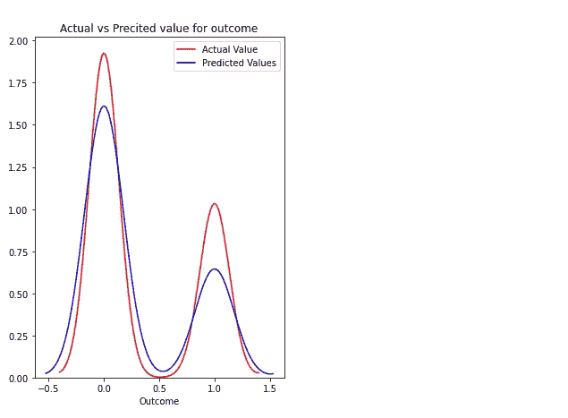

# KNN 算法:何时？为什么？怎么会？

> 原文：<https://towardsdatascience.com/knn-algorithm-what-when-why-how-41405c16c36f?source=collection_archive---------4----------------------->

KNN: K 近邻算法是机器学习的基本算法之一。机器学习模型使用一组输入值来预测输出值。KNN 是最简单形式的机器学习算法之一，主要用于分类。它根据相邻数据点的分类方式对数据点进行分类。


图片由 Aditya 提供

KNN 根据先前存储的数据点的相似性度量对新数据点进行分类。例如，如果我们有一个西红柿和香蕉的数据集。KNN 将存储类似的措施，如形状和颜色。当一个新的物体出现时，它会检查颜色(红色或黄色)和形状的相似性。

KNN 的 k 代表我们用来分类新数据点的最近邻的数量。


图片由 Aditya 提供

**我该如何选择 K？**

在我们有很多点的实际问题中，问题是如何选择 K 的值？

选择正确的 K 值称为参数调整，这是获得更好结果的必要条件。通过选择 K 的值，我们对数据集中可用的数据点的总数求平方根。

a.K = sqrt(数据点总数)。

b.总是选择 K 的奇数值，以避免两个类之间的混淆。

**KNN 是什么时候？**

a.我们有正确标记的数据。例如，如果我们预测某人是否患有糖尿病，最终标签可以是 1 或 0。它不能是 NaN 或-1。

b.数据无噪声。对于糖尿病数据集，我们不能将葡萄糖水平设为 0 或 10000。这几乎是不可能的。

c.小数据集。

**KNN 是如何工作的？**

我们通常用欧氏距离来计算最近邻。如果我们有两点(x，y)和(a，b)。欧几里德距离(d)的公式为

d = sqrt((x-a) +(y-b))


图片由 Aditya 提供

我们试图获得最小的欧几里德距离，并基于较小距离的数量来执行我们的计算。

让我们在一个数据库上尝试 KNN，看看它是如何工作的。数据可以从[https://github . com/adityakumar 529/Coursera _ Capstone/blob/master/diabetes . CSV](https://github.com/adityakumar529/Coursera_Capstone/blob/master/diabetes.csv)中提取。

```
import pandas as pd
import numpy as np
from sklearn.model_selection import train_test_split
from sklearn.preprocessing import StandardScaler
from sklearn.neighbors import KNeighborsClassifier
from sklearn.metrics import confusion_matrix
from sklearn.metrics import accuracy_score
from sklearn.metrics import f1_score
```

pd 和 np 是熊猫和 NumPy 图书馆的。最后 3 行(混淆矩阵、准确度分数和 f1 分数)用于检查模型的准确度。train_test_split 就是对数据进行拆分和训练。KNeighborsClassifier 代表 K 个最近邻。数据集的标准化是许多机器学习评估器的共同要求:如果单个特征看起来不像标准的正态分布数据，它们可能表现得很差。

```
data = pd.read_csv("../input/diabetes.csv")
data.head()
```


我们已经通过 pd.read_csv 读取了 CSV 文件。通过头部()我们可以看到前 5 行。有些因素的值不能为零。例如，对于人类来说，葡萄糖值不能为 0。同样，人类的血压、皮肤厚度、胰岛素和身体质量指数也不能为零。

```
non_zero = ['Glucose','BloodPressure','SkinThickness','Insulin','BMI']
for coloumn **in** non_zero:
    data[coloumn] = data[coloumn].replace(0,np.NaN)
    mean = int(data[coloumn].mean(skipna = True))
    data[coloumn] = data[coloumn].replace(np.NaN, mean)
    print(data[coloumn])0      148.0
1       85.0
2      183.0
3       89.0
4      137.0
       ...  
763    101.0
764    122.0
765    121.0
766    126.0
767     93.0
Name: Glucose, Length: 768, dtype: float64
0      72.0
1      66.0
2      64.0
3      66.0
4      40.0
       ... 
763    76.0
764    70.0
765    72.0
766    60.0
767    70.0
Name: BloodPressure, Length: 768, dtype: float64
0      35.0
1      29.0
2      29.0
3      23.0
4      35.0
       ... 
763    48.0
764    27.0
765    23.0
766    29.0
767    31.0
Name: SkinThickness, Length: 768, dtype: float64
0      155.0
1      155.0
2      155.0
3       94.0
4      168.0
       ...  
763    180.0
764    155.0
765    112.0
766    155.0
767    155.0
Name: Insulin, Length: 768, dtype: float64
0      33.6
1      26.6
2      23.3
3      28.1
4      43.1
       ... 
763    32.9
764    36.8
765    26.2
766    30.1
767    30.4
Name: BMI, Length: 768, dtype: float64
```

我们创建了非零值，该值包含预测结果值所需的所有列。我们需要确保这些列没有任何与零或 NaN 值相关的值。如果我们有 0，我们将替换为 NaN。然后用列的平均值替换 NaN。让我们绘制糖尿病数据的细节图。

```
import seaborn as sns
p=sns.pairplot(data, hue = 'Outcome')
```


我们用值不能为零的列定义了非零值。在每一列中，我们将首先检查是否有 0 个值。然后我们用 NaN 替换它。稍后，我们将创建该列的含义，并用 mean 替换前面的含义。

既然我们已经准备好了数据。是时候训练和测试数据了。

```
X =data.iloc[:,0:8]
y =data.iloc[:,8]
X_train,X_test,y_train, y_test = train_test_split(X, y, test_size=0.2,random_state=0, stratify=y)
```

对于数据 X，我们取范围从 0 到 7 的所有行和列。同样，对于 y，我们取第 8 列的所有行。

我们有在程序开始时导入的 train_test_split，我们将测试大小定义为 0.2，这意味着在所有数据中，20%将被保留下来，以便在稍后阶段测试数据。

```
*#feature Scaling*
sc_X = StandardScaler()
X_train = sc_X.fit_transform(X_train)
X_test = sc_X.transform(X_test)
```

标准缩放器执行标准化任务。通常，数据集包含不同规模的变量。例如，数据集将包含一个值范围为 20–70 的胰岛素列和一个值范围为 80–200 的葡萄糖列。由于这两个列的规模不同，因此在构建机器学习模型时，它们被标准化为具有共同的规模。

```
import math
math.sqrt(len(y_test))
```

外出:

```
12.409673645990857
```

我们用这个值得到 K 的值。我们需要 K 的一个奇数值，所以我们将它设为 12–1 或 12+1。

```
classifier = KNeighborsClassifier(n_neighbors=13,p=2,metric='euclidean')classifier.fit(X_train,y_train)
```

外出:

```
KNeighborsClassifier(algorithm='auto', leaf_size=30, metric='euclidean',
                     metric_params=None, n_jobs=None, n_neighbors=13, p=2,
                     weights='uniform')
```

让我们用分类器预测来预测我们的数据。

```
y_pred =  classifier.predict(X_test)
y_pred
```

外出:

```
array([0, 0, 0, 0, 0, 0, 1, 0, 0, 0, 0, 0, 0, 0, 0, 0, 0, 0, 0, 1, 0, 1,
       1, 0, 1, 1, 1, 0, 0, 0, 0, 0, 1, 0, 1, 0, 1, 0, 1, 0, 0, 0, 1, 0,
       1, 1, 0, 0, 1, 0, 0, 0, 0, 1, 0, 0, 0, 0, 0, 0, 1, 0, 1, 0, 0, 0,
       0, 0, 0, 0, 0, 1, 0, 0, 0, 0, 0, 0, 0, 1, 0, 0, 1, 0, 1, 1, 0, 0,
       0, 0, 0, 0, 0, 1, 1, 0, 1, 1, 1, 0, 1, 0, 0, 0, 0, 0, 0, 1, 0, 0,
       0, 0, 0, 1, 0, 0, 0, 0, 0, 0, 1, 0, 1, 0, 1, 0, 0, 1, 0, 0, 0, 1,
       0, 0, 0, 1, 1, 1, 1, 1, 0, 0, 1, 0, 0, 0, 0, 0, 1, 0, 0, 1, 0, 0])
```

我们有一系列数据，但我们需要评估我们的模型来检查准确性。让我们从一个混淆矩阵开始。

```
cm= confusion_matrix(y_test,y_pred)
cm
```

外出:

```
array([[86, 14],
       [24, 30]])
```

我们有一个混淆矩阵，其中 86 和 30 的对角线表示正确的值，14，24 表示我们错过的预测。

我们会检查 f1 的成绩。

```
print(f1_score(y_test,y_pred))
```

在外

```
0.6122448979591836print(accuracy_score(y_test,y_pred))
```

外出:

```
0.7532467532467533
```

我们的 f1 评分为 0.61，准确率为 0.75

让我们绘制实际数据和预测值的图表。

```
import matplotlib.pyplot as plt
plt.figure(figsize=(5, 7)) ax = sns.distplot(data['Outcome'], hist=False, color="r", label="Actual Value")
sns.distplot(y_pred, hist=False, color="b", label="Predicted Values", ax=ax) plt.title('Actual vs Precited value for outcome')
plt.show()
plt.close()
```



可在以下位置查看实际代码:

[](https://www.kaggle.com/adityakumar529/knn-algorithm) [## KNN 算法

### 使用 Kaggle 笔记本探索并运行机器学习代码|使用来自[私人数据源]的数据

www.kaggle.com](https://www.kaggle.com/adityakumar529/knn-algorithm) 

[https://git hub . com/aditykumar 529/Coursera _ Capstone/blob/master/KNN . ipynb](https://github.com/adityakumar529/Coursera_Capstone/blob/master/KNN.ipynb)。