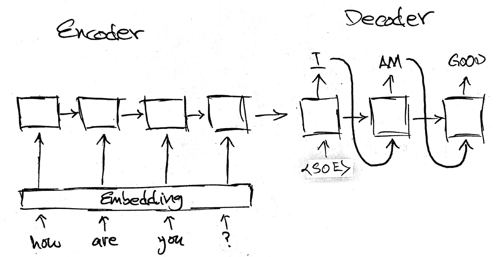
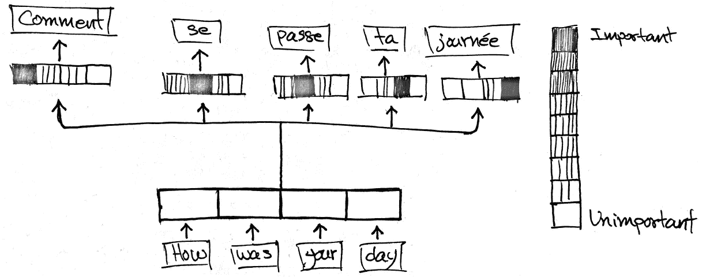
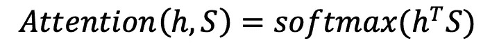
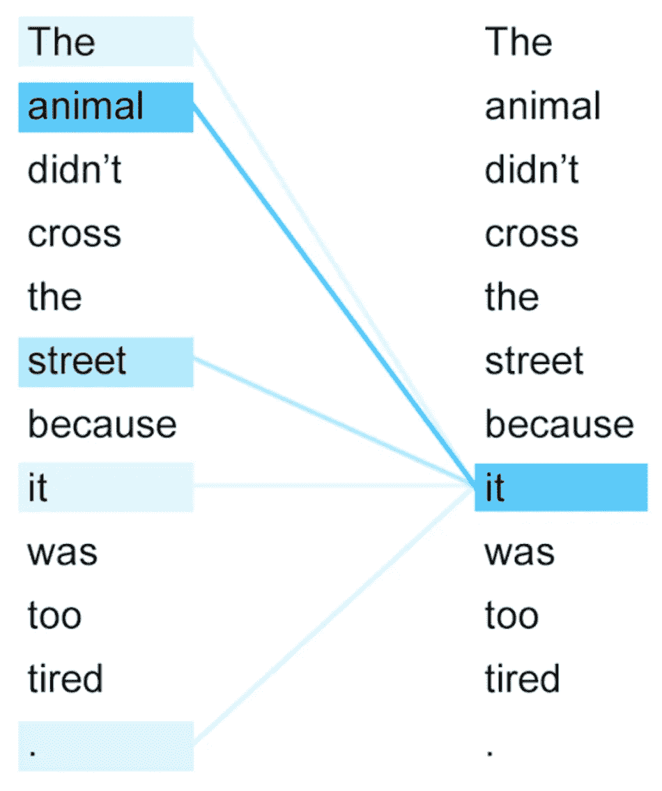
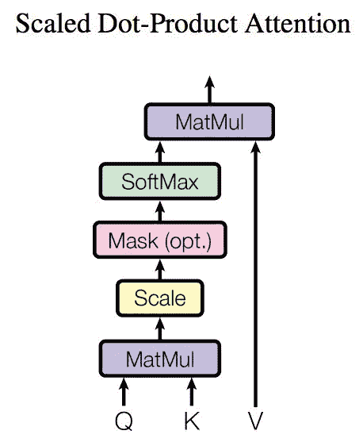
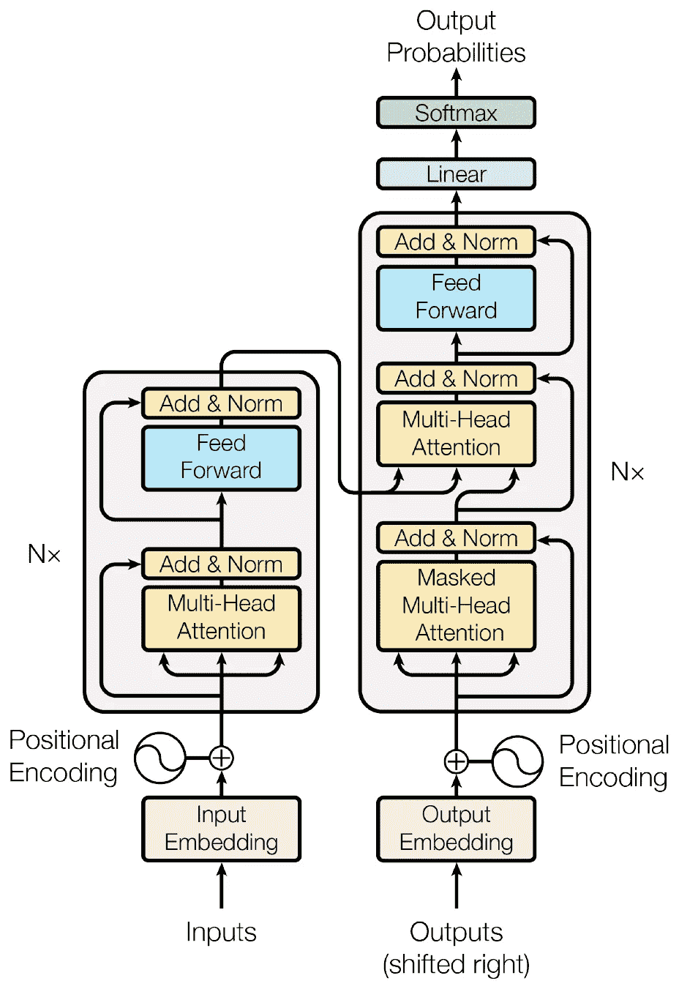
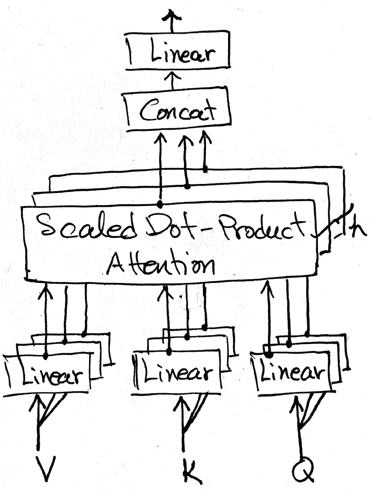
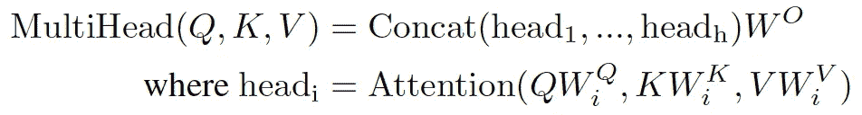
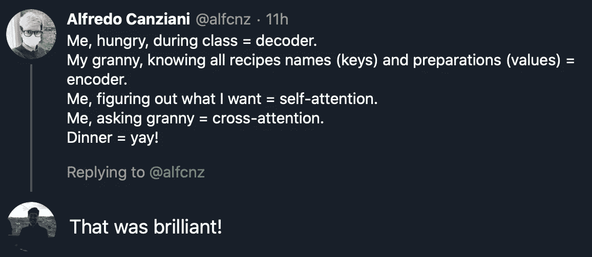

# 变压器并没有你想象的那么难理解

> 原文：<https://towardsdatascience.com/knocking-on-transformers-door-attention-mechanism-explained-intuitively-df5d4fcecdf8?source=collection_archive---------32----------------------->

## 破解注意事项—为了解最新的 SOTA 自然语言处理模型打下基础。


照片由来自[佩克斯](https://www.pexels.com/photo/person-holding-magnifying-glass-712786/?utm_content=attributionCopyText&utm_medium=referral&utm_source=pexels)的[毛里西奥·马斯卡罗](https://www.pexels.com/@maumascaro?utm_content=attributionCopyText&utm_medium=referral&utm_source=pexels)拍摄

T**transformer 的**架构已经成为许多最新 **SOTA** NLP 模型开发的基石。它主要依靠一种叫做**注意力**的机制。与之前的其他成功模型不同，它不涉及**卷积**或**递归**层。

如果你是这个模型的新手，你可能不会发现这个架构是最容易理解的。如果是这样的话，希望这篇文章能有所帮助。

我们将从常规**编码器-解码器**网络如何工作以及它可能会遇到哪些**困难**开始解释，常规编码器-解码器架构中使用的**注意** **机制**是什么，最后，它如何用于**变压器**。

## **用于神经机器翻译的编码器-解码器网络**



编码器-解码器架构。图片[来源](https://6chaoran.wordpress.com/2019/01/15/build-a-machine-translator-using-keras-part-1-seq2seq-with-lstm/)。

左边的图像显示了一个编码器-解码器架构，两个组件都由**递归**层组成。

在左边，编码器接收输入句子，每个单词由它们的**嵌入**表示，并期望为输入句子输出良好的**摘要**。这个概要被称为**上下文** **向量**(连接二者的箭头)，并作为其**初始** **状态**被馈送给解码器。

右边的**解码器**负责输出**翻译**，每步一个单词。在训练期间，它将**目标** **句子作为输入。**在进行预测时，它用来自**最后一个** **步骤**的**输出**进行自我反馈(如此处所示)。

这种架构优于更简单的**序列到序列** RNN，因为来自编码器的**上下文** **向量**整体上提供了对**输入**语句的更多**直接** **访问**。因此，解码器在输出单个翻译之前可以通过上下文向量查看整个句子，而常规的序列到序列 RNN 只能访问位于当前时间步长之前的单词。

在所有递归层中，**信息**通过**隐藏** **状态**从一个时间步传递到另一个时间步，随着更多时间步的执行，它们逐渐被**遗忘**。当编码一个**长的**序列时，输出上下文向量很可能已经忘记了关于句子的第一个****成分**的许多信息。这同样适用于解码器，如果序列太长**，包含在上下文向量**中的信息不会** **传递** **向下**到最后几个时间步。****

## ******注意事项******

****为了解决这个**内存** **问题**并提高模型性能，引入了**注意** **机制**、**双向**递归层，以及对模型结构的一些修改。****

****编码器现在由**双向** LSTM/GRU 组成，因此输入句子在**两个** **方向**被读取。除了**上下文** **向量**之外，编码器现在还输出由来自每个编码步骤的每个输入字的编码组成的**序列**。在每个时间步，编码序列在**被完全**传递给解码器。由于解码器每次输出一个字，所以**注意** **机制**用于**选择**要处理的编码序列的正确部分，以及编码器自己的输入。********

下图说明，尽管使用了相同的编码器输出，但不同的时间步长对编码器序列的不同部分给予不同程度的关注。



编码器输出的加权和。为了翻译每个单词，这个序列的不同部分被赋予不同的重要性。图片[来源](https://blog.floydhub.com/attention-mechanism/)。

这种选择是通过用一组**注意** **权重**对**编码器** **序列**执行**加权** **求和**来完成的，所述权重由求和为 1 的浮点组成。对于给定的时间步长，编码序列中只有少数部分值得**关注**，并且每一步使用不同的权重集。

```
Say that we have only one input sentence X = [x1, x2, ..., xn] in our batch, it has *N* words and each is represented by its embedding vector of length *M*. The input sentence is then a sequence with a shape of *N* x *M*.The encoder is used to output a good summary of the input sentence by transforming X into its encodings Z = [z1, z2, ..., zn], with zi being the encoding of the word in the i-th position.The dimension of each encoding vector z is determined by the number of neurons from the encoder's the last layer.A set of attention weights ⍺ = [⍺1, ⍺2, ..., ⍺n], at a given time step *t*, is a *N*-dimensional vector. Each element multiples one word encoding from Z, outputting a weighted sum, ∑⍺i x zi.
```

这些注意力权重是可学习的**参数**，通过测量编码器**序列*****S****与解码器的**最后** **隐藏** **状态** ***h*** 中每个元素的**兼容性**来确定。来自编码器序列的向量与该隐藏状态越相似，其对应的注意力权重就越大。*

**

*乘法/点积注意力。*

**h* 和 *S* 之间的**点** **积**测量 *S* 中的每个向量与 *h* 的**相似度**，通过应用 **softmax** 我们将结果转化为**分布**。整个过程可以看做是模型在使用**隐藏** **状态** ***h*** 作为**查询**来寻找**中最相似的**元素**。T* 要检索它们，用获得的注意力权重乘以 *S* 。**

```
**But why attentions are determined using the previous hidden state, and why is this similarity important?Say that we are using this model to translate a sentence from one language to another and we’ve just finished translating one word and we’re working on the next output.The hidden state of the decoder from the previous step contains information regarding the last output. Since the model is trained to predict the next word, this hidden state can be seen as something related to what the model wants to predict as the next word. It’s then logical to search for information similar to the hidden state from the encoder sequence to produce the next translation.**
```

## ****自我关注****

**到目前为止，**解码器**使用注意力来映射其隐藏状态，编码器输出用来找到需要注意的相关部分。在一个**转换器**中，这个机制也被它的**编码器**用来从一个句子中找到与句子本身相关的信息。换句话说，对于一个句子中的一个给定单词，在产生它的编码时要考虑更多的上下文。这叫**自我关注**。**

****

**对单词“it”的编码器自我注意分布从第 5 层到第 6 层的转换器被训练用于英语到法语的翻译。图片来源。**

**这张图片以一种形象的方式展示了自我关注。每个单词与单词***【it】***的相关性由连接它们的线的强度来表示。**

**在这种情况下，并不是所有的单词都与单词**'*' it*'**具有相同的**相关性，句子中的不同单词对该单词具有不同程度的重要性，包括非常 *'it'* 。****

**这就是**自我关注**所做的，每个单词的编码包含了它的**关系**和其他关于一个**句子**中所有单词的信息。这可以为编码器提供更好地理解单词的潜在**句法**和**语义**含义的能力。**

**用于执行自我关注的等式与上面所示的等式相同，只是现在不是使用**隐藏** **状态*h*，而是使用**句子** **本身**作为**查询**，并且 **softmax** 内的值被缩放以避免 softmax 具有**可忽略的** **梯度**。****

****

**成比例的点积注意力。图片来自[原纸](http://papers.nips.cc/paper/7181-attention-is-all-you-need.pdf)。**

**在引擎盖下，注意力只是模型执行**查找**的工具，将带有一组**键值**对的**查询**映射到输出。仅当相应的**关键字**与**查询**匹配时，才检索来自值的组件。**

**早期情况下， **Q** 为**隐藏** **状态*****h******K**和 **V** 均为**编码器输出 *S*** 。 ***S*** 和 ***h*** 用于查找**注意** **权重⍺** ，然后通过执行 **⍺ ⋅ S** 从 **S** 中检索**匹配**组件。***

**由于**循环**层的顺序性质，我们无法将所有隐藏状态打包在一个**矩阵**中，并一次性找到所有注意力权重。在每个**时间**步骤**找到注意力权重。****

**为了执行自我关注，所有的值 **Q** 、 **K** 和 **V** 都是来自**输入** **句子**的同一个单词列表，因此对**单词**和**本身**进行比较。与之前的情况不同，现在所有单词的所有注意力权重都可以在一个镜头中处理，因为它不受循环层的顺序性质的限制。**

**现在，让我们来看看**变压器**架构，还有更多值得挖掘的地方。**

## ****变压器和多头注意****

**该模型再次由一个**编码器-解码器**结构组成，每个编码器-解码器又由 N(=6)个编码器/解码器模块**相互堆叠**组成。**

****

**全变压器架构。图片来自[原创论文](http://papers.nips.cc/paper/7181-attention-is-all-you-need.pdf)**

**每个编码器/解码器块将其**输出**传递给下一个**编码块**，并且来自**最后一个**编码块的输出被传递给 N 个解码块中的每个编码块**。****

**每个编解码块中有不同的**子层**:**与层归一化层**跳过连接，一个由**两个** **密集** **层**组成的“**前馈**模块，最后一个是**多头关注**模块。在每个**解码器**块的底部增加了一个**屏蔽的**多头注意力，行为略有不同。这里的主要目标是理解**多头注意力**是如何运作的，以及注意力是如何在其中执行的。**

**如你所见，在这个模型中没有**卷积**或**递归**层，整个架构完全依赖于**注意**机制。**

****多头警示模块****

****

**多头注意力模式示意图**

**本质上，一个多头注意力模块只是一些**规模的点积注意力**并行工作。对于每个注意力，输入 ***Q*** 、 ***K*** 和 ***V*** 首先被**投影**到不同的**子空间**，使用不同的权重矩阵 ***、Wk 和 Wv*** 。通过这种方式，每个注意力开始处理输入的不同方面。它们的输出然后被线性组合。**

**它在**编码器**中的行为非常简单，它执行**自我关注**，其中 **Q** 、 **K** 、 **V** 都是**输入**语句中的单词的相同 l **ist。每个编码器模块将其输出传递给下一个，最后一个输出馈给所有解码器模块。****

****

**多头关注。**

**对于解码器来说，**屏蔽**多头注意力将自我注意力应用于**目标** **句子**(在训练期间)，其中**未来**单词被**屏蔽** **排除**，防止任何单词将其自身与位于其后的单词进行比较。在推断时间，解码器只能访问其最后的**输出，因此不需要屏蔽。该模块的**输出**作为 **Q** 传递给上方的多头注意力，多头注意力从**编码器**接收编码，并将其作为 **K** 和 **V** 。它的输出**与来自掩蔽注意模块的输出**重新组合，并被传递以供进一步处理。****

**最后，解码器输出被传递到一个**密集**层，最后的 **softmax** 输出当前步骤的翻译。**

## **最后的话**

****

**这是一个关于变形金刚的绝妙类比！**

**本文到此为止。如果你喜欢它的内容，可以看看我的其他作品。如果有任何错误，最好能在评论中看到。**

**PS:阿尔弗雷多有一门关于深度学习的[免费课程](https://www.youtube.com/channel/UCupQLyNchb9-2Z5lmUOIijw)。有兴趣就去看看，告诉我有多差！**

**[](/an-overview-for-text-representations-in-nlp-311253730af1) [## 自然语言处理中的文本表示综述

### 讨论自然语言处理中三种最常用的输入类型。

towardsdatascience.com](/an-overview-for-text-representations-in-nlp-311253730af1) [](/ensemble-learning-from-scratch-20672123e6ca) [## 从零开始的集成学习

### 引入集成学习，这是一种通过组合训练好的模型来提高性能的强大工具。

towardsdatascience.com](/ensemble-learning-from-scratch-20672123e6ca)**