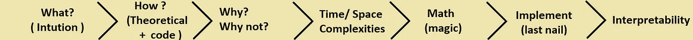

# 有效学习机器学习算法的诀窍

> 原文：<https://towardsdatascience.com/know-how-to-learn-machine-learning-algorithms-effectively-81766fe442e0?source=collection_archive---------19----------------------->

## 机器学习

## 我希望我在开始自学时就知道这一点。

多兰·埃里克森在 [Unsplash](https://unsplash.com?utm_source=medium&utm_medium=referral) 上的照片

# B ackdrop:

几天前，我的一个朋友过来嘲笑我，说“**你怎么花了这么长时间才学会机器学习？只是几个型号，我一个星期就学会了**”。这是他的原话。我只是对他笑笑，询问他学到了什么。他说出了几个机器学习算法的名字。我问他到底学到了什么，然后得到的明显回答是使用 Sklearn 的 fit 和 predict 方法，以及该算法如何工作的简要概述。

我脸上带着邪恶的笑容，问他为了得到最好的参数，他会怎么做？模型如何学习最佳权重？当我们有低延迟要求时，我们该怎么做？虽然这些都不是什么复杂的问题，他坐在那里默默地看着我的脸，我笑到了最后。

> 这个故事的要点是，机器学习不仅仅是简单的拟合和预测方法。

我们大多数人只是在 youtube 上看了几个视频，然后声称我们知道机器学习，结果很快就意识到我们的错误。对所有自学的人，只要**记住有成千上万像你我一样的人在学习机器学习/数据科学**。请记住，我们将与拥有数据科学相关领域硕士/博士学位的人竞争。因此，要想与他们竞争，我们需要在基本面上非常强大。

> 随着围绕机器学习的大量讨论，每天都有新的课程冒出来，目前有比实际工作更多的课程。面对如此巨大的资源，选择正确的道路是一个难题。

说实话，这些课程大多很平庸，没有深入覆盖。嗯，有一些好的课程，但他们都提供不同的课程。很少有人深入研究数学部分，很少有人擅长编码部分等等。所以今天我不会特别提到任何课程。我将分享我在故事中遵循并建议给同一个朋友的方法。我相信它也会对您的数据科学之旅有所帮助。

# 简介:

在我们进入算法部分之前，让我告诉你我们在机器学习项目中的确切位置。完成机器学习项目涉及许多阶段，每个阶段都同等重要。

机器学习项目的关键阶段

**建模**是我们的机器学习算法进入的阶段，它只是 ML 生命周期中的重要阶段之一。

好了，让我们进入机器学习算法的主题。

> 对于每一个算法，我们需要注意一些重要的事情。

学习 ML 算法的流水线

## 1.算法背后的直觉是什么

最初，我习惯于学习一个算法，过一段时间后就会忘记，每当我回去修改它时，我会发现很难理解我当时已经学过的内容。随着时间的推移，我意识到我们人类无法真正记住太理论化的东西，如果通过可视化来学习，我们更有可能记住很长时间。这就是几何学帮助我们以最简单的方式形象化算法核心的地方。如果我们有一些关于这些算法的很酷的现实生活中的例子，我们会更倾向于理解它。

> 一旦你从你选择的任何课程中完成了一个算法的学习，打开一个新的标签，开始寻找那个算法的直觉。相信我，网上有很多很酷的解释。首先，Quora 和 Medium 是最好的起点。

## 2.算法是如何工作的？

一旦你对它有了直觉，试着观察算法实际上是如何工作的。你需要检查的另一件事是算法如何处理各种形式的数据，比如文本/分类/数字。

在这个阶段，用多个因素进行实验，看看算法是如何工作的，你可以参考 Scikit-Learn 中现成的算法。检查算法的参数，并尝试使用它们，看看它们如何影响模型的性能。

## 3.哪里可以用/哪里不能用

这是大多数人经常忽略的最重要的因素，而他们更关注它是什么和如何工作的。为什么行得通，或者为什么行不通，这对于深入理解算法非常重要。

> 尝试体验并理解它是如何处理大型数据集和高维数据的。如果它倾向于离群值或不平衡的数据集。

在面试中，最棘手的问题不是什么和怎样，而是**为什么。**假设明天你在学习算法后做了一个个人项目，你用了一个特定的 X 算法来解决它，面试官很可能会回答**为什么是 X 算法为什么不是 Y 算法？**让我们假设你想出了准确性作为理由，然后是最困难的问题**为什么你认为它比其他的更好。**

> 哦，好家伙！这就是为什么你应该知道它在哪里工作，在哪里不工作。

例如，你需要给出这样的回答，因为我们的数据是高维的，本质上是非线性的，由于种种原因，算法 X 在处理非线性数据时往往比 Y 做得更好。

## 4.为什么算法的可解释性很重要

这是关键步骤之一，之所以重要，是因为作为一名数据科学家，你可能需要向完全没有技术知识的客户展示模型。在此期间，你可能需要让他们相信你的模型预测的是正确的结果，你需要提供一些他们应该适应它的好理由。你不能简单地把准确性扔给他们。如果你的算法是可解释的，那么你可以向他们展示为什么这个模型能预测一些东西。可解释性只意味着算法的特性重要性。

例如:如果你正在做一个医疗保健项目，你的模型预测一个人的疾病是阳性还是阴性。这是一个非常敏感的问题，他们不能犯错误，这就需要可解释性。如果你的模型向你展示了预测这个人积极/消极的原因(因为 X 特征(身体的某些水平)大于 X 值或其他什么)，这将变得更加容易和有意义。

## 5.为什么要学习算法的时间/空间复杂度？

当我们实时工作时，我们可能必须处理大量数据，如果需要低延迟，时间和空间复杂性可以帮助您选择正确的算法。

如果您的模型占用更多内存，那么实时运行它会非常昂贵，尤其是如果您使用云基础架构来运行模型。有时，一些业务问题伴随着低延迟要求，其中一些算法提供了良好的准确性，但由于其时间/空间复杂性的限制而无法满足要求。

Wikipedia 是一个很好的资源，可以获得每个算法的所有相关信息。

## 6.为什么我们需要理解算法背后的数学？

又是数学？是的，是的，我明白了。我们甚至可以通过简单地从 Scikit learn 导入来使用算法，即使不理解数学，但是让我告诉你，从长远来看，这是完全不推荐的。好吧，不管我们接受与否，我们肯定需要数学来更好地理解在引擎盖下到底发生了什么。这可能会让一些人失望，但我得到了好消息，我们不能避免数学，但我们可以简化它，避免严格的数学。

> 简单地说，大多数机器学习算法的工作是最小化实际输出和预测输出之间的差异(损失)。
> 
> 算法=最小化(损失)+正则化项

例如，我们应该最小化逻辑回归的对数损失和 SVM 等的铰链损失。

> 注意:并不是每个 ML 算法都是这样，这只对少数算法有效。

为了最大限度地减少这种损失，在内部这些算法使用优化技术，如梯度下降和其他涉及一点数学的味道。因此，如果你不太擅长数学，那么就试着理解每个算法的损失函数及其梯度下降，这样你就可以避免所有其他严格的数学，并保持目标不变。一旦你对此感到满意，你就可以深入研究更多的数学知识。

## 7.为什么要从头开始实施(可选):

如果假设你正在学习吉他，你会先从基础开始，然后慢慢地尝试复制别人已经创作的音乐，在这个阶段，如果你明白他们是如何创作音乐和曲调的，那么下一步就是创作你自己的音乐，对吗？

同样，我们可以通过复制现有算法来从头实现它们，从而更清楚地理解现有算法。您将学到一些要点，这些要点可以帮助您在将来构建更好的模型。请记住，由于一些问题，我们可能无法在我们的项目中始终使用 Scikit learn 版本的算法。在这种情况下，您必须准备好以满足您需求的方式优化或修改算法。

这说起来容易做起来难，这将花费你大量的时间来达到这一点，这就是为什么我把它标记为可选的。至少尝试实现一个算法来理解它实际上是如何工作的。如果你觉得很难编码，把算法分解成几个部分，先写伪代码，然后试着把它转换成实际代码。

**塞巴斯蒂安·拉什卡**的《Python 机器学习是一本真正的好书，可以指导你从零开始开发算法。

# 结论:

不要急于求成，慢慢来，用最好的方式学习，而不是学了一半又回来多次，每次都要参考。记住，目标不是完美，而是一个强大的基础，相信我，我们永远不能完美的事情，目标总是每天都变得更好。如果你能理解算法的要点，并且清楚算法是如何工作的，那么从长远来看，你肯定会感谢你自己。

在这个过程中，如果你不明白某件事或卡住了，把它放在一边，继续其他话题。不要一味的坚持，浪费自己宝贵的时间。稍后带着一个全新的想法回来，再次检查一下，相信我，你会感到惊讶的。万一你仍然不能理解某件事，寻找其他能以更简单的方式解释它的资源。

> 最后一步，将您的所有知识应用于不同数据类型和大小的多个数据集。要获得真正的知识，实践就是一切。比起单纯的阅读，你会学到很多东西，所以准备好动手吧。

如果你读到这里，你肯定有学习 ML 的热情，这是学习任何技能最重要的因素。不断学习，不要放弃。

如果您有任何建议或疑问，请随时在评论中告诉我，或者您可以通过我的 [Linkedin](https://www.linkedin.com/in/shareef-shaik-22738310b/) 与我联系。

编码快乐！回头见！！