# 了解雇主对 2020 年数据科学家的期望

> 原文：<https://towardsdatascience.com/know-what-employers-are-expecting-for-a-data-scientist-role-in-2020-65ad68553cc4?source=collection_archive---------3----------------------->

## 数据科学就业市场趋势

## 该分析是从 1000 多份最近的数据科学家工作中完成的，这些工作是使用网络搜集从工作门户中提取的。

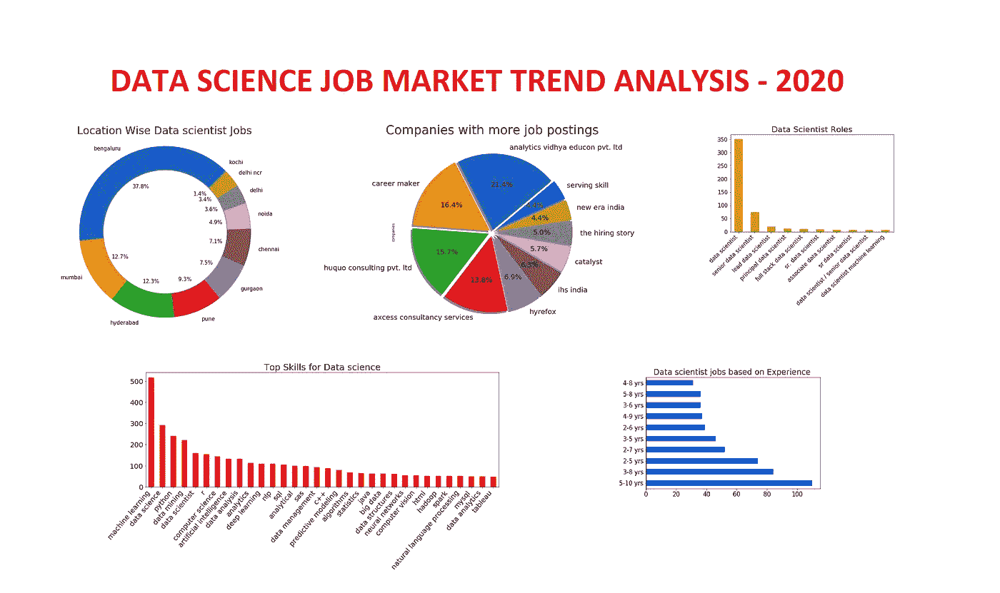

最近，我开始积极地寻找一份数据科学方面的工作，我没有任何像人工智能/机器学习方面的硕士或博士背景的正规教育。我开始学完全是出于自己的兴趣(不仅仅是因为炒作)。这是一个具有挑战性的选择加入的轨道，尤其是如果你同时从事其他一些技术。我通过参加许多 MOOCs(大规模开放在线课程)开始了我的旅程，并开始阅读多个博客。最初，它没有意义，最终在阅读了其他人的代码并接触了实时数据集之后。慢慢开始有意义了。

当我开始找工作时，一个有趣的新故事开始了。我在印度打开了一个顶级工作门户网站，开始搜索工作，我发现很少有工作与我正在寻找的相关，但当我打开其中一个时，令我惊讶的是，他们提到的要求对我来说是新的。抛开传统的数据分析、机器学习、深度学习不谈，一些 ETL 工具和多种大数据技术被提到是必备技能。我认为这没什么，因为如今每个公司都有自己对数据科学家的定义，并开设了另一个职位。这一次，它提出了对 AWS、Azure 和 Power BI 等其他技术的需求。

请记住，所有这些空缺职位都标有“仅数据科学家”字样。所有这些空缺都有共同的要求，如机器学习算法，统计学，数据分析，数据清洗和深度学习技术。除了这些技能，一些公司还希望候选人具备云知识(AWS、Azure 或 GCP)和数据可视化工具，如 Tableau、Power BI 和 ETL 工具，如 SSIS。通常，这些技术更多地与数据分析师/数据工程师角色有关，但数据科学家角色仍在不断发展，并没有真正坚持特定的技能组合。

我确实理解这样一个事实，即公司寻找一个符合他们职位空缺的申请人，并且拥有他们所寻求的技术技能。这肯定会为公司节省时间和金钱，而不是重新提供培训。

> **因此，我有了一个有趣的想法，来了解 IT 行业对实时数据科学家角色的确切期望，而不是 MOOCs 中通常教授的内容。**

**目标:**我们将努力找出目前业内最热门的技能和趋势。为此，我们将从工作门户获取数据。

> 注意:这整个分析是为印度市场的数据科学家角色而做的。

在本文中，我们将尝试找到几个重要问题的答案，这些问题是每个数据科学求职者都会想到的。

1.  公司寻找的顶尖技能有哪些？
2.  **业内最期望的经验水平是什么？**
3.  **在这个领域积极提供工作机会的公司有哪些？**
4.  **空缺较多的位置有哪些？**

> **注:**你可以在**结论**部分找到完整代码的链接。

# 1.网页抓取:

我从印度顶级求职门户网站-**Naukri.com**收集了所有相关的工作信息，如今几乎每个求职者和招聘人员都在使用这个网站。我使用 selenium-python 进行 web 抓取，因为传统的 BeautifulSoap 方法在这个站点上不太好用。

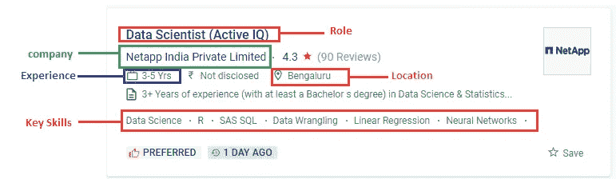

来自 Naukri.com 的工作列表示例

> **免责声明:网络搜集纯粹出于教育目的。**

我们将为每份工作收集这五个要素:角色、公司名称、经验、地点和关键技能。

**刮削代码:**

# **2。预处理:**

在开始之前，让我们做一些基本的预处理。

## 2.1.处理缺失值:

执行了基本的清理，找到丢失的值并删除它们。

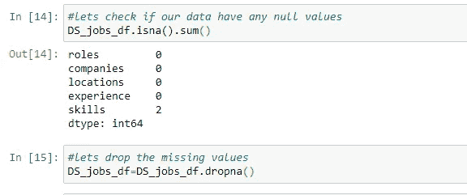

## 2.2.处理重复数据:

我们在处理重复数据时需要非常小心，因为一家公司可能会多次发布相同的要求，因为该职位仍然空缺**或**另一方面，该公司可能会寻找一个具有相同要求的全新职位。为了简单起见，我没有丢失任何数据。

## 2.3.标记位置和技能列

将所有字符串转换为小写以避免冗余，并将**位置**和**技能**列标记化，因为这些列中有多个值。

这是预处理后的样子。

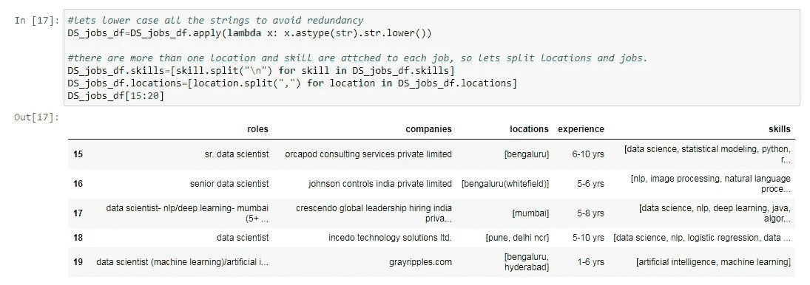

# 3.分析:

现在，我们有一切可以开始了。

# 3.1.哪个位置提供更多的机会？：

> 注意:如果你不是印度人，可以跳过这个位置部分。

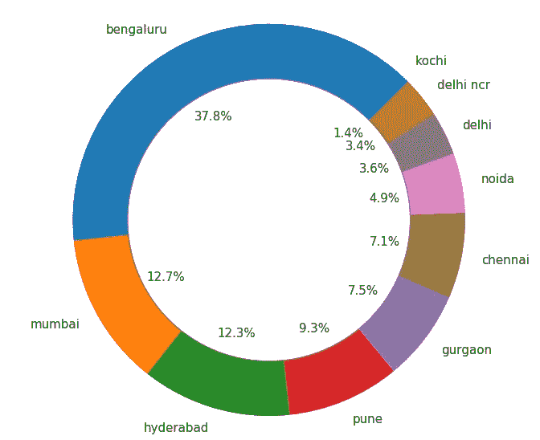

1.  如果我们观察上面的图，几乎有 **38%** 的工作岗位位于**孟加拉鲁鲁**。
2.  排名前四的城市，即**孟加拉鲁鲁、孟买、海德拉巴**和**浦那**构成了该国数据科学工作岗位总数的近 72 **%** 。
3.  因此，如果你来自这些城市中的任何一个，你获得数据科学家工作的机会可能会比其他城市多。

# 3.2.有哪些公司在积极招聘？：

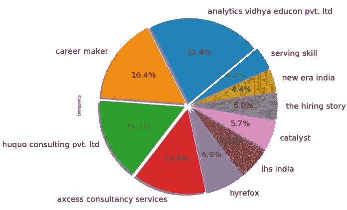

1.  分析 Vidhya **educon** 以几乎占**总职位列表 21%的比例高居榜首。**
2.  名单上还有许多咨询公司。这些咨询公司通常为他们的客户进行招聘。
3.  一般来说，求职网站的竞争会非常激烈。由于收到的申请数量巨大，大多数时候招聘人员甚至不会看到你的简介。有些情况下，即使是一个空缺职位，你也必须与数百名其他申请人竞争。最好了解那些正在积极招聘的公司，这样我们可以通过他们的官方网站直接申请，这增加了获得面试机会的概率。

# 3.3.最渴望的体验是什么？：

不同经验层次的工作机会。

1.  我们可以观察到，公司显然在寻找**有经验的候选人。有 5-10 年工作经验的候选人似乎有更多的空缺。**这很有意义因为数据科学家的工作涉及关键的决策技能，这些技能来自经验。
2.  至少有两年工作经验的候选人有相当好的机会。
3.  这并不意味着新生进不去，只是有经验的候选人比新生有更多的机会。公司通常不会从这些招聘门户网站上招聘应届生，他们会直接从校园招聘中招聘。大一新生总是可以选择为创业公司工作，以获得必要的经验。

# 3.4.需求中的角色有哪些:

这是调查的重要一步，因为在几个结果之后，工作门户通常会开始显示一些与我们正在搜索的工作无关的其他工作。为了确保我们寻找的是正确的角色，让我们来看看最常提到的 10 个角色。

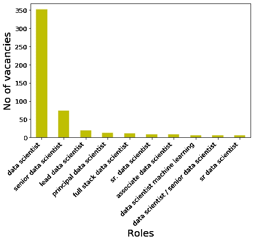

1.  如果我们在上一节中观察到，有更多的职位空缺给有更多经验的人，这给我们留下了一个基于角色的空缺问题。
2.  大部分空缺仍然被称为数据科学家。其次是高级数据科学家和首席数据科学家，这当然需要良好的经验。

# 3.5.公司寻找的技能:

终于，我们到了。你读这篇文章的主要原因。

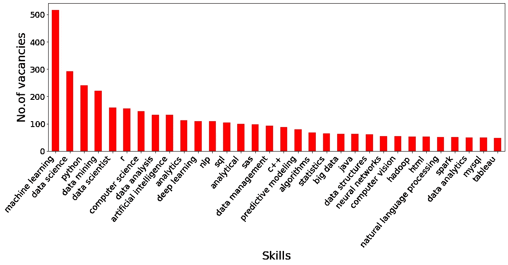

1.  看起来很复杂，别担心，我会在后面的部分分解它。我之所以在这个情节中包含了许多技能，是因为数据科学涉及的领域非常广泛。
2.  虽然我们能够在上面的情节中描绘出一些顶级技能，但它仍然不能服务于这个分析的目的。

> 让我们深入研究一下，以便更清楚地了解这些趋势。

## 3.5.1.必备技能？：

1.  **机器学习，**作为数据科学家最重要的技能，这并不奇怪。
2.  **数据挖掘**和**数据分析**是每个数据科学家必须经历的关键活动。

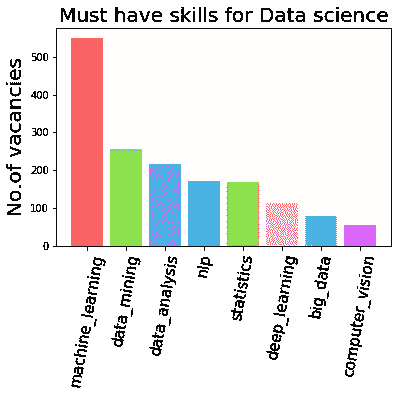

3.**强大的统计建模**是成为更好的数据科学家所需要的。

4.公司希望对深度学习有很好的了解，因为它提供了最先进的技术来解决一些有趣的实时问题，如 NLP 和计算机视觉。

5.由于每天记录的数据量大幅增加，雇主希望候选人具备大数据技术的知识。实际上，我们可能正在处理大型数据集，这些技能肯定会派上用场。

## 3.5.2.编程语言吃香？：

1.  如果您开始学习数据科学，在开始时，您肯定会发现很难选择正确的编程语言。虽然有许多语言，但竞争总是在 Python 和 R 本身之间进行。让我们看看数据告诉我们什么。

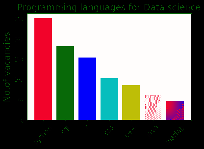

2.业界仍然支持 Python，因为它有丰富的库，随后是 R 语言。

3. **SQL** 是每个数据科学家的必备。虽然它不适合被当作编程语言，但我还是碰运气把它包含在这里:)。

4.在 python 和 R 之后，对 SAS T21 和 C++语言的需求似乎很大。

## 3.5.3.**深度学习框架可供选择？:**

1.  由于深度学习的突然兴起，许多深度学习框架从谷歌和脸书这样的巨头进入市场。

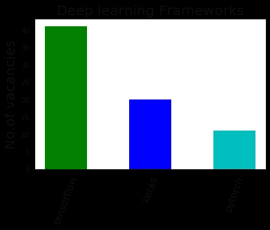

2.业界更赞成 **Tensorflow** 而不是 **PyTorch** 。

3.Keras 在市场上有很好的份额，人们喜欢它，因为它简单易用。

4.虽然有许多其他框架，如 Caffe，Maxnet，但似乎没有太多的机会。即使不在世界上，至少在印度。

## 3.5.4.哪种大数据技术具有优势？

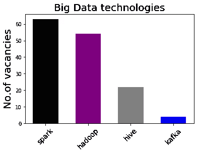

1.  **火花**高居榜首。你可以选择 python 版本的 spark -Pyspark。
2.  **Hadoop** 与 spark 几乎拥有相同的机会，只是略有不同。
3.  蜂巢也有相当多的空缺。

## **3.5.5。哪家云提供商需要 ML？**

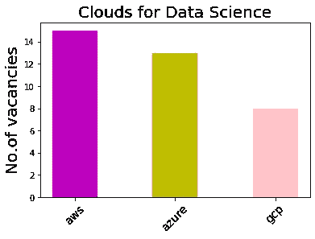

1.  训练模型涉及大量的计算，很容易变得非常昂贵。公司正在寻找更便宜的方式来完成工作，这就是这些云平台出现的原因。
2.  AWS 高居榜首，其次是 **Azure** 。
3.  企业正在迅速转向云选项。这些技术有更多的机会在未来的数据科学中发挥重要作用。

## 3.5.6。数据可视化工具有需求吗？

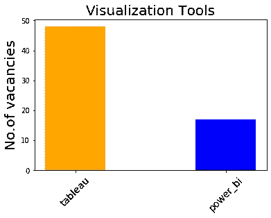

1.  雇主们对数据可视化的**表格**表现出了更大的兴趣。
2.  而微软的 **Power BI** 依然落后。

# 结论:

为了得到一份工作，你真的必须具备这篇文章中提到的所有技能吗？

也不尽然，如果你对自己的基础知识很在行，列表中没有什么工具是你在工作中容易掌握的。话虽如此，如果你只是在找工作，在简历上写下这些技能可能会帮助你获得面试机会。

如果你擅长所有提到的数据科学家必备技能，那么最好的方法应该是开始参加面试，同时尝试填补你理解中的空白，并学习你认为会让你比其他候选人更有优势的工具/技术。

> **你可以在我的**[**GitHub**](https://github.com/Shareef-shaik/Data-Science-Job-Market-Analysis)**上找到完整的代码。可以在**[**Linkedin**](https://www.linkedin.com/in/shareef-shaik-22738310b/)**上联系我。**

如果你觉得这很有帮助或者有任何问题，请在评论中告诉我。

回头见。快乐编码..！

# **参考文献:**

1.  [https://medium . com/@ krishnakumar/donut-chart-with-python-matplotlib-d 411033 c 960 b](https://medium.com/@krishnakummar/donut-chart-with-python-matplotlib-d411033c960b)
2.  [https://stack overflow . com/questions/51389377/unfolding-bag-of-words-in-pandas-column-python](https://stackoverflow.com/questions/51389377/unfolding-bag-of-words-in-pandas-column-python)
3.  [https://www.naukri.com](https://www.naukri.com)