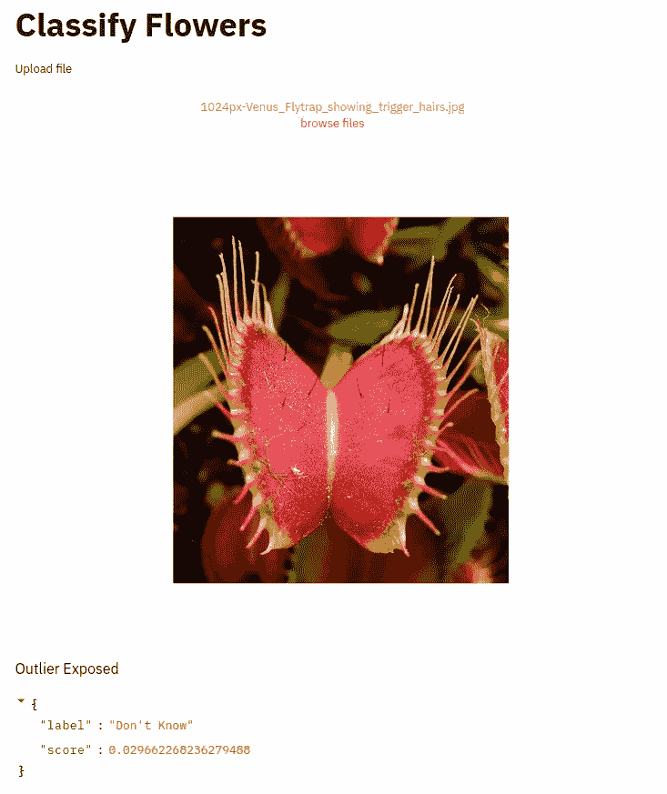

# 知道你不知道的:当对预测不确定时，获得可靠的信心分数

> 原文：<https://towardsdatascience.com/know-what-you-dont-know-getting-reliable-confidence-scores-when-unsure-of-a-prediction-882f2f146726?source=collection_archive---------19----------------------->

接触样本外的例子，作为获得更有意义的预测分数的一种方式。


Artem Sapegin 在 [Unsplash](https://unsplash.com/s/photos/sunrise?utm_source=unsplash&utm_medium=referral&utm_content=creditCopyText) 上拍摄的照片

Softmax 预测分数通常用作多类分类设置中的置信度分数。在本帖中，我们将展示在通过梯度下降进行常规经验风险最小化时，softmax 分数可能是没有意义的。我们还将应用[异常值暴露深度异常检测](https://arxiv.org/abs/1812.04606)中介绍的方法来缓解这一问题，并为 softmax 分数添加更多含义。

判别分类器(试图从数据中估计 P(y|x)的模型)往往在预测中过于自信，即使输入样本看起来与他们在训练阶段看到的任何东西都不一样。这使得这种模型的输出分数不能被可靠地用作置信度分数，因为该模型经常在它不应该有置信度的地方有置信度。

# 示例:

在这个合成示例中，我们有一个类别 0 的大聚类和另一个类别 1 的大聚类，外加两组较小的训练集中不存在的离群点。


玩具示例

如果我们对此应用常规分类器，我们会得到如下结果:


置信度得分基线

我们看到分类器在任何地方都过于自信，即使是离群样本也有很高的分数。**使用热图**显示置信度得分。

这使得直接使用 softmax 分数作为置信度分数不是一个好主意，如果分类器在训练中没有看到任何证据来支持它，那么它可能意味着置信度分数是错误的。

但是，如果我们使用[异常值暴露深度异常检测](https://arxiv.org/abs/1812.04606)中提出的方法，我们可以获得更合理的 Softmax 分数:


异常暴露

这个得分图更加合理，有助于了解模型在哪些地方有足够的信心，在哪些地方没有。异常区域具有非常低的置信度~0.5(相当于在两类设置中完全没有置信度)。

# 方法的描述

[异常值暴露的深度异常检测](https://arxiv.org/abs/1812.04606)中提出的想法是使用与您的训练/测试数据大不相同的外部数据，并强制模型预测该外部数据的均匀分布。

例如，如果您试图构建一个分类器来预测图像中的猫和狗，您可以获得一组熊和鲨鱼图像，并强制模型在这些图像上预测[0.5，0.5]。

# 数据和模型

我们将使用 102 朵花作为分布内数据集，使用 OpenImage 数据集的子集作为分布外数据集。在引言中引用的论文中，他们表明，对一组非分布样本的训练可以很好地推广到其他非分布样本。

我们使用 MobilenetV2 作为我们的分类架构，并用 Imagenet 初始化权重。

```
**def** get_model_classification(
    input_shape=(**None**, **None**, 3),
    weights=**"imagenet"**,
    n_classes=102,
):
    inputs = Input(input_shape)
    base_model = MobileNetV2(
        include_top=**False**, input_shape=input_shape, weights=weights
    ) x = base_model(inputs)
    x = Dropout(0.5)(x)
    out1 = GlobalMaxPooling2D()(x)
    out2 = GlobalAveragePooling2D()(x)
    out = Concatenate(axis=-1)([out1, out2])
    out = Dropout(0.5)(out)
    out = Dense(n_classes, activation=**"softmax"**)(out)
    model = Model(inputs, out)
    model.compile(
        optimizer=Adam(0.0001), loss=categorical_crossentropy, metrics=[**"acc"**]
    ) **return** model
```

我们将使用生成器从硬盘上一批一批地加载图像。在基线中，我们仅加载分布内图像，而在异常曝光模型中，我们从具有正确标签的分布内图像中加载一半，从具有统一目标的分布外图像中加载另一半= >:

```
target = [1 / n_label **for** _ **in** range(n_label)]
```

# 结果

两种训练配置对分布样本的准确率都略高于 90%。如果 softmax max 得分低于 0.15，我们选择预测“不知道”，从而放弃进行类别预测。

现在让我们看看每个模型是如何工作的！

## 常规培训:

您可以通过以下方式运行 web 应用程序:

```
streamlit run main.py
```


来自 Unsplash 的第一张**鸟**图像/来自 102 种花数据集的第二张**花**图像

我们训练了一个花卉分类，然后尝试对一张鸟的图片进行分类，该模型预测仙客来类具有相当高的置信度" **0.72** "，这不是我们想要的。

## 异常风险:

您可以通过以下方式运行 web 应用程序:

```
streamlit run ood_main.py
```


来自 Unsplash 的第一张**鸟**图像/来自 102 朵花数据集的第二张**花**图像

好多了！因为最大 softmax 分数是 0.01，所以鸟图片被分类为“不知道”。在两个模型之间，分布内花图像(右)的预测保持不变。

接下来是对来自维基百科的图像的预测，第一个(左)是 102 朵花数据集中的一朵花，第二个是分布中不存在的一种食肉植物。异常暴露模型表现如预期，分布内图像被正确分类，而模型避免对食肉植物进行分类预测。



修改第一张**花**图由 aftabnoori—Own work，CC BY-SA 4.0，【https://commons.wikimedia.org/w/index.php?curid=41960730】T2/修改第二张**植物**图:[https://commons . wikimedia . org/wiki/File:Venus _ fly trap _ showing _ trigger _ hairs . jpg](https://commons.wikimedia.org/wiki/File:Venus_Flytrap_showing_trigger_hairs.jpg)

# 结论

在这篇文章中，我们展示了 softmax 分数作为信心的衡量标准是多么的有缺陷。然后，我们应用了一种基于离群值暴露的方法来解决这个问题，并获得更有意义的置信度得分。这使我们能够在需要时可靠地避免做出预测，这在许多商业/研究应用中是一个至关重要的特性，在这些应用中，不做任何预测比做出明显错误的预测要好。

## 参考资料:

[具有异常暴露的深度异常检测](https://arxiv.org/abs/1812.04606)

## 代码:

[](https://github.com/CVxTz/learning_to_abstain) [## cvx tz/learning _ to _ absent

### 知道自己不知道的。通过在 GitHub 上创建一个帐户，为 CVxTz/learning _ to _ absent 开发做贡献。

github.com](https://github.com/CVxTz/learning_to_abstain)