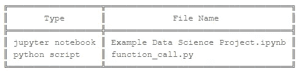
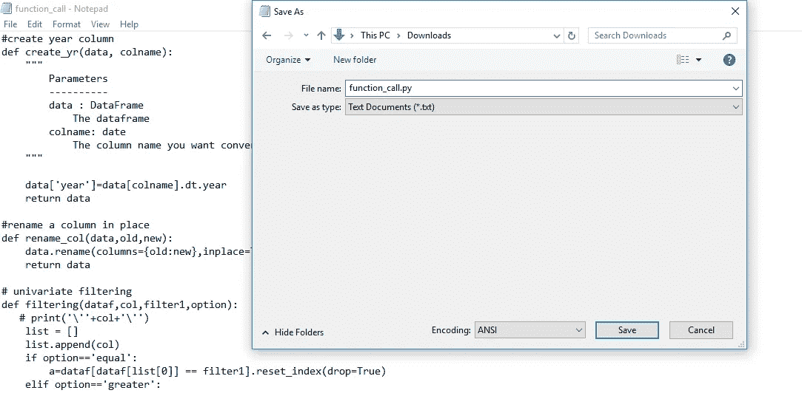
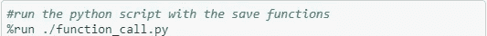

# 了解你的受众。如何展示你的数据科学项目！

> 原文：<https://towardsdatascience.com/know-your-audience-how-to-present-your-data-science-project-96a3c5d4d475?source=collection_archive---------26----------------------->

史蒂文·洛艾扎在 [Instagram](https://www.instagram.com/sloaiza___/) 上的照片

## 如何定义和调用将您的冗长代码隐藏在别处的函数。

# 介绍

你是否展示过一个项目，并开始一行一行地滚动代码，只是为了找到你想要展示的情节？

这从你打算展示的**有价值的信息**中拿走了。

你们中有人有像这样或者更长的 Jupyter 笔记本吗？

如果你这样做了，请记住几件事:

> 如果你的听众精通技术，他们不会在乎你能使用 pandas 来操作数据或者知道如何使用 matplotlib 上的选项。
> 
> 而商业利益相关者真正做的是 ***而不是*** 的关心。

这条建议特别适用于你必须向上级展示你的发现的工作环境。

# 更好的方法

你可以从 Github 下载 [jupyter 笔记本](https://github.com/StevenLoaiza/presentation/blob/master/Example%20Data%20Science%20Project.ipynb)和 [python 脚本](https://github.com/StevenLoaiza/presentation/blob/master/function_call.py)来跟进。

 [## StevenLoaiza/演示

### 开发工具来展示我们的机器学习模型和预测。-StevenLoaiza/演示

github.com](https://github.com/StevenLoaiza/presentation) 

下面，我们在笔记本上运行一个 Python 脚本。该脚本包含一些函数，这些函数将用于执行与上述示例完全相同的任务，但是代码行更少。

这段代码是可展示的，并没有把注意力从真正重要的东西上转移开，在这个例子中，就是图表。

我们如何做到这一点？

## 定义函数

要做的主要事情是定义一些函数。我知道我需要过滤数据，创建一个新列，更改列名并绘制数据图表。

我创建了几个函数来完成这些任务。下面是其中一个函数的例子— **create_yr()** 。

**我假设您已经知道如何用 python 编写函数* *

我建议你把所有的功能都写在笔记本上，这样你就可以验证它们是否有效。一旦你对它们感到满意，我们就要把它们从**视线**中移除！

照片由[塔拉斯·切尔纳斯](https://unsplash.com/@chernus_tr?utm_source=medium&utm_medium=referral)在 [Unsplash](https://unsplash.com?utm_source=medium&utm_medium=referral) 上拍摄

## 保存\运行脚本

将上面编写的函数复制并粘贴到记事本中。当您转到“另存为”时，将其从 ***更改为。txt** 文件到一个 ***。py** 文件。(我一般保存在笔记本的同一个目录下)

现在，您可以将脚本调用到您正在处理的数据科学笔记本中。这将允许您使用保存在 ***中的所有功能。py** 文件。

**如果不在同一个目录中，您可以将其更改为"**Path**/function _ call . py " *

照片由[pisuikan](https://unsplash.com/@pisauikan?utm_source=medium&utm_medium=referral)在 [Unsplash](https://unsplash.com?utm_source=medium&utm_medium=referral) 上拍摄

## 哦不！什么是 **create_yr()**

想象一下，你必须在几个月后重新访问这个项目。

当你阅读它的时候，你会看到许多用户定义的函数，但是你不记得它们是什么。

## 加载脚本

可以加载脚本了！这将把脚本的全部内容放在笔记本单元格中供您查看。

## 结论

我希望这些想法能在你的下一个项目中很好地为你服务。编码是一门艺术，在开始时有一些额外的步骤，你可以在将来为调试或重组笔记本节省无数的时间。

感谢您的阅读！

## 附加说明

熊猫。DataFrame.pipe:这是我在上面使用的操作符之一。这是一个很好的工具，可以用来创建像样的代码。从上面的例子中，您可以遵循对[代码执行操作的逻辑顺序。](#8f23)

 [## 熊猫。DataFrame.pipe - pandas 1.0.3 文档

### 应用于系列/数据框架的函数。、和被传递到。或者，数据关键字是字符串的元组…

pandas.pydata.org](https://pandas.pydata.org/pandas-docs/stable/reference/api/pandas.DataFrame.pipe.html)