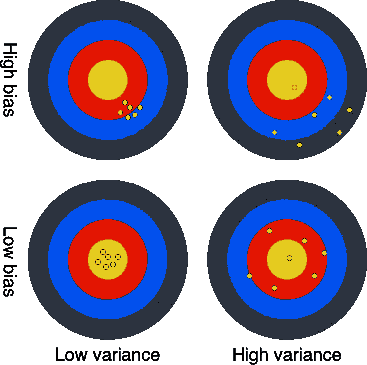

# 了解你的偏见

> 原文：<https://towardsdatascience.com/know-your-biases-757aa0584b0?source=collection_archive---------56----------------------->

## 你在收集数据时应该注意什么

在统计学中，你可能在每一步都会犯错误。你可能会问一个与你的问题无关的问题，错误地定义感兴趣的人群，在你的分析中犯一个错误，等等。

最脆弱的时刻之一是数据收集。因为你在这一步得到的是你最终决定的基础。今天，让我们来讨论几个常见的陷阱，它们会让你的完美数据收集过程大打折扣。

首先让我们介绍一下我们的主要敌人——偏见**。**在统计学中，**偏差**指的是数据的**系统性失真**(与方差相反，方差是混乱的)。你可以想象一个弓箭手射击一个目标，并一直击中正下方的中心。同样的，例如，由于设备故障，你的大学生身高数据可能会高估测量值。

虽然高方差意味着射手射遍所有地方，但高偏差会让他们朝同一个方向射失目标。[图片由 Grzegorz jurdzinski 提供]

问题是你并不总是知道你的数据是否以及如何被歪曲。这就是为什么意识到即将打破你的分析的危险是很重要的。

# 远程办公

由于持续的新冠肺炎疫情，许多公司被迫关闭办公室。只要有可能，工人们就在家工作。一些 IT 公司，如 Twitter 或脸书，甚至决定允许员工无限期在家工作。许多人怀疑这是否是一个好决定。毕竟，那时人们的工作效率不是更低吗？想象一下，你是一家科技公司的董事，正在考虑这样的举动。你可能想知道在这个行业工作的人对此感觉如何，以及他们这样工作是否有任何问题。

在家工作似乎是个不错的选择。但是有那么好吗？[图片由 [Dillon 在](https://unsplash.com/@dillonjshook?utm_source=medium&utm_medium=referral) [Unsplash](https://unsplash.com?utm_source=medium&utm_medium=referral) 上摇动

假设你准备了一张表格，上面有你感兴趣的问题，并把它发给*人*。我们来讨论一些场景。

# 覆盖不足偏差

场景一:你向所有员工发送了一封带有问题的电子邮件。

这很方便——你有所有的地址，也许你甚至相信你的员工不会说谎(下面会有更多关于这个问题的内容)。但是首先你想了解 IT 行业的所有人，而不仅仅是你的公司。你的同事很可能不会成为人口样本的代表。也许你有一个很酷的办公室，每个人都想回去？还是你的员工都是积极性很高的人，在家里没有注意力集中的问题？你不知道。

你收集数据的方法从样本中排除了一部分人口。因此它不具有代表性——这种偏差被称为**覆盖不足偏差**。

# 选择偏差

*场景二:为了接触更多的人，你将表格发布在公司的公共博客上。*

现在每个人都包括在内了——每个有互联网接入的人都可以访问您的表单(并且您假设所有 IT 人员都有互联网),因此您不会遗漏任何人。但是每个人回答你的问题的可能性都一样吗？由于文章发布在你公司的博客上，你的员工更有可能阅读它，从而填写你的表格(即使他们不是唯一这样做的人)。

你的取样方法更喜欢某些人，导致了**选择偏差**。

# 无反应偏差

*场景三:你雇佣了一家专门从事民意调查的公司来寻找 IT 行业员工的代表性样本，并向你提供他们的电子邮件地址。*

看起来很完美，对吧？你设法联系了你感兴趣的人群的代表性样本。还有一个问题——不是所有人都会回复。不回答你问题的人不会只是一些随机的人，他们可能有一些不回答的共同原因。

这就是为什么你可能会以**无反应偏差**而告终。仅仅接触一个代表性的样本是不够的——你的答案是你最终感兴趣的数据。

# 反应偏差

*场景四:厌倦了失败，你雇佣了一名黑客来封锁 IT 行业典型员工的电脑，直到他们填写了你的表格。*

这次一定要成功，对吧？没有人会为了避免填写一些简短的表格而扔掉他们的电脑。但是你得到了答案并不意味着他们是诚实的。毕竟，人们现在很愤怒，他们可能会撒谎。他们也知道你会以某种方式利用他们，所以他们可能会欺骗你相信适合他们的东西。也许他们害怕数据不会被适当地匿名化，他们不想承认他们没有生产力？或者也许他们想让你认为 WFH 很棒，他们会说他们喜欢它，只是因为他们想有这个选择？

这可能是最难防范的情况之一——你得到了答案，但你不知道它们是否是真的——我们称之为**反应偏差**。

# 不止如此

请注意，有更多种类的偏见可能会潜入您的数据中，您应该始终考虑什么可能是错误的。它们包括但不限于观察者偏差、损耗偏差、回忆偏差等。[维基百科](https://en.wikipedia.org/wiki/Bias_(statistics))描述了其中一些。还有一部关于生存偏见的伟大的 [xkcd 漫画](https://xkcd.com/1827/)。

总是分析你是如何收集数据的，错误就在等待着你去犯。[图片由[艾米丽·莫特](https://unsplash.com/@emilymorter?utm_source=medium&utm_medium=referral)在 [Unsplash](https://unsplash.com?utm_source=medium&utm_medium=referral) 上拍摄]

# 结束语

你的数据可能看起来非常完美，但它可能会让你得出错误的结论，即使它与现实略有出入。很难保护自己不受偏见的影响，但是意识到什么可能出错会帮助你避免许多错误。

如果你有兴趣看看现实生活中犯的一些错误，我们推荐你看一下最近由 Cassie Kozykov 写的关于纽约市新冠肺炎感染研究的文章。

*本文与* [*托马什·韦索斯基*](https://medium.com/@tom.wesolowski) *共同撰写。请看他的新* [*篇*](https://medium.com/@tom.wesolowski/the-difference-between-inference-and-prediction-the-ultimate-guide-49c2ba1c5d7a) *，在那里他描述了推断和预测的区别。*