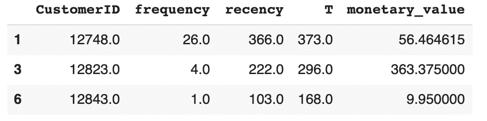

# 用 RFM 了解你的客户

> 原文：<https://towardsdatascience.com/know-your-customers-with-rfm-9f88f09433bc?source=collection_archive---------7----------------------->

## 最后更新于 2020 年 6 月

## 了解如何仅用三个数据点来细分你的客户:新近性、频率和货币价值。

来源:( [@annadziubinska](https://unsplash.com/@annadziubinska) )转自 [Unsplash](https://unsplash.com/photos/mVhd5QVlDWw)

在这篇文章中，我们将向你展示如何通过几个简单的步骤创建一个 RFM 模型。您还将学习如何用几行 Python 代码实现该模型。无论你是有技术背景的人还是非编码人员，我都强烈鼓励大家跟随我，去感受开发一个有价值的 RFM 模型是多么容易。在后续的博客文章中，我们将扩展 RFM 模型，并介绍来自统计学和机器学习领域的更先进的技术。

## 为什么你应该做 RFM 细分

RFM 细分将使您能够更好地了解您的客户群，并作为您的数据之旅和更高级的客户模型的良好起点。您将能够为您的企业的关键问题提供更准确的答案，例如:

*   谁是你最好的客户？
*   哪些客户处于流失的边缘？
*   谁有潜力转化为更有利可图的客户
*   哪些客户流失/不活跃？
*   留住哪些客户至关重要？
*   谁是你的忠实客户？
*   哪一组客户最有可能对您当前的活动做出回应？

## RFM —基础知识

RMF 是一种简单的统计方法，根据顾客的购买行为对他们进行分类。仅通过使用三个客户数据点来识别行为:购买的*最近度*(R)、购买的*频率*(F)和每次购买的平均*货币价值*(M)。在对 RFM 数据进行一些计算后，我们可以创建可操作且易于理解的客户细分，如下所示:

*   **冠军:**最近买的，经常买，花的最多
*   **忠诚客户:**定期购买。对促销有反应。
*   **潜在忠诚者:**平均频率的近期客户。
*   **最近客户:**最近购买，但不经常购买。
*   **前景看好:**最近有购物者，但还没花多少钱。
*   **需要关注:**高于平均新近度、频率和货币值。可能不是最近才买的。
*   **即将入睡:**低于平均新近度和频率。如果不重新激活，将会丢失它们。
*   **面临风险:**他们购买后已经有一段时间了。需要把他们带回来！
*   **不能丢了它们:**以前经常购买但很久没回过。
*   **冬眠:**上一次采购是长退，订单数少。可能会丢失。

上述细分市场和标签经常被用作一个起点，但你可以想出更适合你的客户群和商业模式的你自己的细分市场和标签。

对于每个细分市场，您可以设计适当的操作，例如:

*   **冠军:**奖励他们。他们可以成为新产品的传播者和早期采用者。
*   **忠诚客户:**追加销售更高价值的产品。与他们交战。求点评。
*   **潜在忠臣:**推荐其他产品。参与忠诚度计划。
*   **最近/新客户:**提供良好的入职流程。开始建立关系。
*   **有前途:**创造更多的品牌知名度。提供免费试用。
*   **需要注意:**重新激活它们。提供限时优惠。根据购买历史推荐新产品。
*   **即将睡眠:**重新激活它们。分享宝贵的资源。推荐热门产品。提供折扣。
*   **有风险:**发送个性化电子邮件或其他信息以重新建立联系。提供优惠并分享宝贵的资源。
*   **不能失去他们:**把他们赢回来。和他们谈谈。给他们特别优惠。让他们觉得自己有价值。
*   **冬眠:**再造品牌价值。提供相关产品和优惠。

# 准备我们的数据

在本帖中，我们将使用[在线零售](https://www.kaggle.com/vijayuv/onlineretail)数据集——在互联网上广泛用于不同的分析。看起来是这样的:

交易数据的起始表

经过一些调查，我们发现数据需要一些清理，所以我们做了一些过滤以获得更好的输出——记住:**垃圾输入，垃圾输出**。以下是我们所做的:

*   仅选择英国事务以获得不太复杂的组。不同国家的行为会受到不同活动、折扣、运费等的影响。我们也避免了不同货币可能带来的困难。
*   过滤掉所有没有正确 CustomerID 的交易。
*   筛选出数量或单价为零或更低的交易。
*   创建了一个 sum 列，我们通过将*数量*乘以*单价来计算每个订单行的收入。然后，我们将 *InvoiceNo* 上的交易分组，并创建 *InvoiceSum* 列来保存每张发票的收入。*

我们现在已经拥有了创建 RFM 模型所需要的一切。我们的事务表现在看起来像这样:

我们清理的交易表按发票号分组

# 从交易数据中创建 RFM 模型

为了使创建模型的过程更容易理解，我们将在进行过程中展示数据清单。

## 步骤#1 计算 RFM 值

为了创建 RFM 分数，我们必须获得每个客户的新近度、频率和货币价值的数据点。它们的定义如下:

**最近:**客户最后一次交易的年龄。这与香草 RFM 略有不同，在香草中，新近度是根据自上次购买后的天数来计算的。

**频率:**客户生命周期内的购买次数

**货币价值:**客户交易的平均货币价值。

这一步之后的结果应该是一个 RFM 汇总表，其中包含一个唯一的客户 id 以及最近、频率和平均货币值的数据。它应该是这样的:

我们的开始摘要 RFM 表

分割时，我们将只使用*频率*、*新近度*和*货币值*列。 *T* 列(客户的年龄)仅在内部用于计算 *recency* 的值，不会用于将来的计算。

首先，我们将快速检查一下我们的数据，看看它们是如何分布的。

**最近分布**

频率分布

正如我们所见，*频率*数字是高度倾斜的，因为大量的非重复交易。事实上，多达 85，3% 的顾客都是非回头客。为了创造更合理的细分市场，我们选择过滤掉非回头客。现在分布看起来像这样:

不考虑回头客的频率分布。

**新近分布**

回头客的新近分布

在过滤掉非回头客之后，新近数据也具有更好的分布。如果没有过滤器，图会严重偏向零。

**货币分配**

回头客的货币价值分布

这是具有挑战性的数据。正如我们所看到的，大多数客户的平均货币价值在 0 到 500 之间，但我们也有一些客户超过 2000，甚至超过 16000。这些顾客看起来像是局外人。对此的一个假设是，他们的行为更像是做生意，买了再卖。我们决定移除“异常值”并将阈值设置为 2k，这给出了以下分布:

没有“*异常值”*的货币价值分布

请注意，我们应该进一步调查*异常值*，而不仅仅是抛弃它们。

## 步骤 2:获得个人 RFM 分数

获得个人 RFM 分数有几种方法。你可以利用你自己的商业专长和启发，做出适合你的客户群的排名。在这种情况下，我们将走统计路线，使用四分位数对我们的客户进行排名。

通过将每个 RFM 值分成四分位数，创建四个或多或少相等的桶，来对各个 RFM 分数进行排名。然后，我们将每个桶从一到四进行排序；四是最好的。我们的汇总表现在应该看起来像这样:

RFM 个人得分表

得分最低的 A *recency* (R)为 1，表示已经有一段时间没有活动的客户。频率为 4，得分最高，是你最频繁的买家，以此类推。

## 第 3 步:计算总体 RFM 分数

这一步可以通过两种方式完成:

1.  **连接——创建片段** 这里我们只是像字符串一样连接(而不是添加)单个的 RFM 乐谱，并得到带标签的片段作为回报。我们最好的部分将是 444 分，最差的部分将是 111 分，这意味着在所有三个 RFM 类别中的最低分。
2.  **加法—创建一个分数** 在这里，我们将各个 RFM 分数(如数字)相加，并得到一个指示客户分数的数字作为回报。分数范围从 3 到 12，我们可以用它来创建更加人性化的标签类别。

如果我们选择同时进行串联*和*加法，我们的汇总表将如下所示:

包含 RFM 片段和分数的表格

## 步骤#4 用人类友好的名字分组和标记

即使像 411 和 243 这样的片段可以被人类理解，它们也不是对人类最友好的标签。但正如帖子开头所承诺的，为 RFM 片段和 RFM 分数创建更多可用的标签是可能的。对于 RFM 部分，我们将使用最常见的命名方案，如上所述。我们的汇总表现在将如下所示:

带有 RFM 线段的表格

如你所见，我们现在有冠军和冬眠者等等。就位。

如果您更喜欢附加方案，我们可以创建客户标签，如:青铜、白银、黄金和白金。

RFM 表与人类友好的分数标签。

# 看起来怎么样？

为了鸟瞰您的总体客户群，我们可以绘制一个简单的条形图，显示每个类别中有多少客户:

RFM 段计数

不幸的是，看起来我们的大多数客户都在冬眠，所以我们最好走了。好的一面是:我们有一些*冠军、*以及一些*有前途的*和*新*类别的客户。我们最好好好照顾他们。

我们可以对 RFM 分数做同样的绘图，看看它如何比较。

RFM 分数计数

自然，我们看到了相同的模式:少数最有价值的客户和大量需要关注和重新激活的客户。最好开始工作。我们学到了什么

# 我们学到了什么

如果 OnlineRetail 数据集中的客户是我们的客户，我们可以说我们已经了解了以下内容:

1.  我们 85%以上的客户都不是回头客——我们需要制定一个如何提高保留率的计划。
2.  我们的数据包含大量需要清理的垃圾——我们需要了解数据是如何生成的，并改进我们的数据验证。
3.  我们的数据包含离群值，离群值应该被调查，并可能被标记或删除。
4.  清理数据后，我们的 RFM 模型可用于为每个客户群创建更精确的行动计划。这可以对营销支出、转化率和客户保持率产生积极影响。

# 结论

如您所见，我们只需使用三个客户数据点就可以获得可操作的客户细分。如果您刚刚开始您的数据之旅，RFM 模型是一个有用的起点，它既快速又易于理解和实施。

# Python 代码的完整示例

## 准备数据

## **创建 RFM 模式**