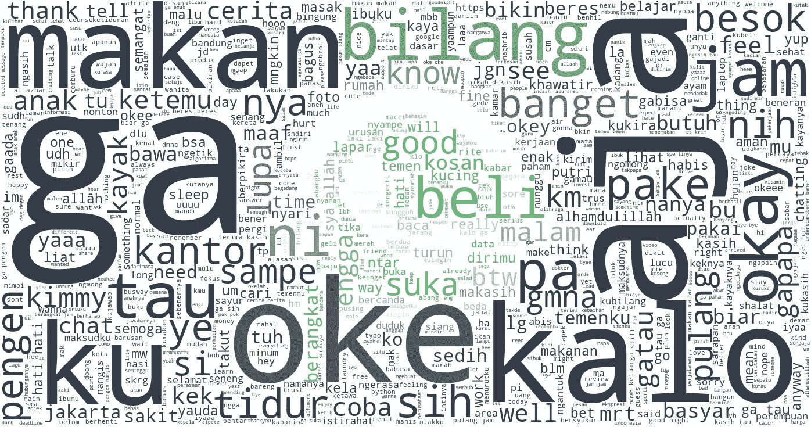
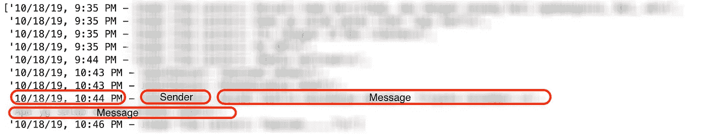
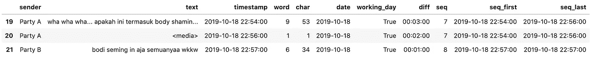
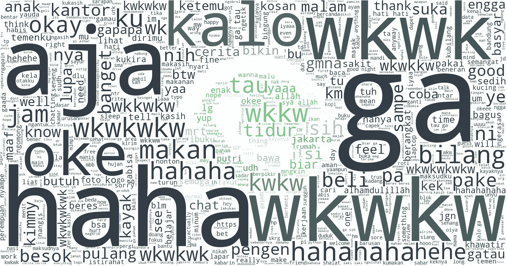
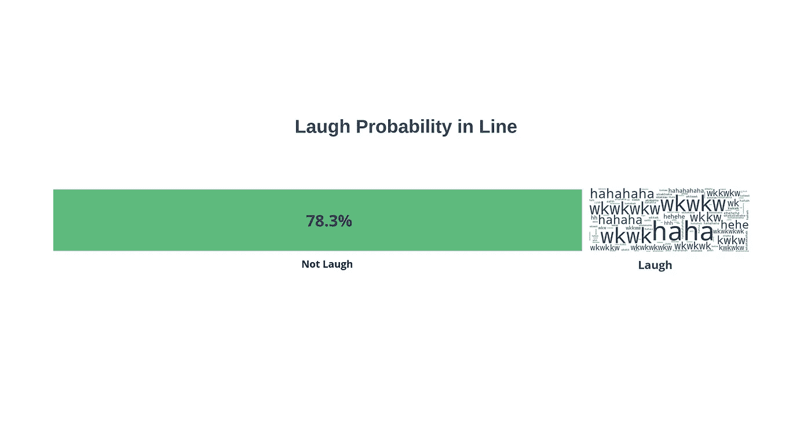

# 从你的 WhatsApp 聊天记录中了解自己

> 原文：<https://towardsdatascience.com/know-yourself-more-from-your-whatsapp-chat-history-8ec4b69c12c5?source=collection_archive---------40----------------------->

## 使用 python 对聊天数据进行简单的数据探索以发现新事物

由于新冠肺炎疫情，我被建议在家做远程工作。已经一个星期了，整天呆在家里让我厌烦，所以我随意地想，也许是时候做自我反省了。幸运的是，我记得不久前我导出了我的 WhatsApp 聊天。所以我一头扎进去，决定做快速的数据探索，以更多地了解我自己和我的对话者。让数据说话。

# 数据准备

WhatsApp 导出的聊天格式为`.txt`。消息的每一行都由`<timestamp> — <sender> : <message>`组成。在消息有多行的一些情况下，第二行和随后的行将仅用`<message>`表示，而没有`<timestamp> — <sender>`。结构见下例。

将数据转换成数据帧让我可以做更多的事情。这个任务的美妙之处在于它需要模式匹配来区分`timestamp`、`sender`和`message`。正则表达式将使工作变得容易得多。我将 Python 的`re`模块与其`f-string`字符串格式结合起来，发现这是一个很好的组合，尤其是在更复杂的模式上。下面是我将`.txt`文件转换成`dataframe`文件的代码。

够不够？不。我们可以检索更多的信息来帮助未来的分析。因此，我在下面的代码中做了更多的特性工程，并返回下面的`dataframe`。

# 探索性数据分析

现在数据已经准备好了，让我们从回答几个问题开始

## 1.最活跃的对话发生在什么时候

了解聊天行为是必须的。我认为调查谈话发生最多的时间将会很好地描述它。所以，在小时频率中，我取了平均值:

*   字数(`word`)，
*   字符数(`char`)，
*   被认为是**一个回复** ( `seq`)的行的顺序号
*   行数(`seq_line`)。

万一你把`seq`和`seq_line`搞混了，假设 A 和 B 之间有一段对话

*   A-A-B-B-B 将有 2 个序列和 5 个`seq_line`
*   A-B-A-B 将有 4 个序列和 4 个`seq_line`

从上面的图表中，我至少知道:

*   在工作日，我们倾向于在休息时间(12 点)停止聊天，而在周末，则是在下午 3 点。我能理解为什么我们在工作日的中午停止聊天。现在是休息时间。我吃午饭，快速休息，这让我远离我的手机。但是，我从没想过周末下午 3 点会那么低。
*   在工作日，seq 和 seq_line 之间的差距在中午变得更小，这意味着在这个时间每个回复包含的行数非常少。总体差距在周末要高得多，这意味着我们经常在周末回复更多的行。
*   如果我们放大到晚上 7-10 点，即使工作日和周末之间的行数(`seq_line`)相对相同，周末的字数(`word`)也要高得多。这意味着每一行在周末包含的单词比工作日多。我想这是“故事时间”。如果我必须讨论什么，我想我会在那个时候做。

我可以说，平均而言，我在下午 6 点开始积极聊天，每天晚上 10-11 点达到高峰，直到早上 6 点才停止聊天。

## 2.谁反应更快

我想知道，谁回复短信的时间更长。知道谁有反应，谁没有反应是非常重要的。我不想在没有任何证据的情况下，被人笼统地以“你回复晚了”来评判。所以，这又是关键时刻了。

我计算了甲方和乙方所有文本的平均值。我计算了甲方最后一次聊天和乙方第一次回复之间的差异(反之亦然)，进行了一些数据辩论，结果如下:

看起来甲方和乙方差不多。他们花了大约 10 分钟回复一条信息。然而，在乙方方面，差异更大，这意味着乙方有更大的机会需要更长的时间来回复。我想我知道乙方是谁了*哎。

## 3.最快的响应时间是什么时候

与前一个问题类似，但现在我想看看最快的反应发生在什么时候。从平均值来看，在工作日(周一至 Fri)，甲方和乙方的响应时间分别为凌晨 1 点和晚上 11 点。周末，甲方凌晨 0 点最快，乙方还在晚上 11 点。

你可以看到甲方和乙方的几个不同的峰值，但我想强调的是，这个事实支持了我之前的说法，即谈话在深夜更激烈。

## 4.谁写得更长或更快

我已经告诉你谁回答得更快了。但是如果用更长时间回复的一方用了更多的词呢？我对每个聚会的文本中使用的行、词和字符进行了简要总结。请注意，文本或回复可以包含多行。

如果我们仔细观察，就行数而言，乙方回复的行数比甲方多。这可能会导致一个结论，即甲方倾向于用一整行来总结回复，而乙方倾向于用不同的行来发送。

乙方在每次回复中发送的字数和字符数相对低于甲方，这意味着甲方比乙方写得更长。这也得到持续时间变量的支持，其中甲方比乙方写回复的持续时间更长。因此，甲方比乙方写得更长

在前面的问题中，我们知道乙方需要更长的时间来响应。我假设那是因为 B 写的比 A 长，实际上 A 写的更长。而且 B 写的甚至比 a 还快所以 B 没有借口哈哈。

## 5.词频

检查单词数据的一种最流行的方法是使用单词云可视化其词频。

我删除了几个停用词，以去除无意义的常用词。因为我在聊天中使用印度尼西亚语，所以我使用 [Elang](https://github.com/onlyphantom/elang) 来删除印度尼西亚语的停用词。现在，使用单词云，看看这些单词

有很多“哈哈”和“wkwk”，印度尼西亚人认为是笑的词。使用正则表达式，我删除了笑的单词，这是最后的单词云。

如果你听不懂的话我很抱歉，这是印尼语，而且多是非正式用语(反正谁在聊天中用正式用语)。

## 6.我们多久笑一次

之前我发现笑的单词占据了我的单词云很多空间。我们笑得那么频繁吗(通过短信)？为了找出答案，我提取了所有笑的单词，并将其数量与行数进行比较，以获得概率。

21.7%概率一句台词有笑点？太搞笑了。我没期望那么多。但事实就是如此。也许我在短信里是个有趣的人。我是吗？

# 摘要

我们在深夜进行了一次激烈的谈话，可能是在谈论彼此的经历。我们经常笑。甲方写的很多但是写的时间比较长，乙方写的比较短但是回复的时间比较长。

# 未来的工作

这些数据有许多应用。在未来的工作中，我想对聊天进行情感分析，看看我是否可以使用数据来预测对话的数量，并使用多个对话(多人)进行聚类

如果你认为我在这篇文章中遗漏了什么，请在下面留下评论。我也希望听到任何形式的问题/建议。

我的 git 库上有完整的代码

谢谢你。