# 用深度神经网络知道已知的未知

> 原文：<https://towardsdatascience.com/knowing-known-unknowns-with-deep-neural-networks-caac1c4c1f5d?source=collection_archive---------37----------------------->

## 深度神经网络中随机和认知不确定性的定义和量化

[深度神经网络](https://www.deeplearningbook.org/) (DNNs)是易于实现的通用机器学习模型，可以在许多领域实现最先进的性能(例如，[计算机视觉](https://arxiv.org/pdf/2004.08955v1.pdf)、[自然语言处理](https://arxiv.org/abs/2005.14165)、[语音识别](https://arxiv.org/pdf/2005.09629v1.pdf)、[推荐系统](https://dl.acm.org/doi/abs/10.1145/3285029))。然而，DNNs 并不完美。你可以阅读 [文章](https://www.aaai.org/ojs/index.php/aimagazine/article/view/2756)[博文](https://medium.com/@mijordan3/artificial-intelligence-the-revolution-hasnt-happened-yet-5e1d5812e1e7)[书籍](http://rebooting.ai/)中的任意[号](https://www.economist.com/technology-quarterly/2020/06/11/an-understanding-of-ais-limitations-is-starting-to-sink-in) [讨论有监督深度学习的各种问题。在本文中，我们将关注一个(相对)狭窄但重要的问题:标准 DNN 无法可靠地显示何时预测不确定。对于一个拉姆斯费尔德式的](https://arxiv.org/abs/1604.00289)来说:DNNs 没有能力知道“已知的未知”

作为 DNNs 中这种故障模式的一个简单例子，考虑为二进制分类任务训练 DNN。您可能会合理地假设 DNN 的 softmax(或 sigmoid)输出可用于测量 DNN 在其预测中的确定性或不确定性；您可能会认为，看到接近 0 或 1 的 softmax 输出表示确定性，接近 0.5 的输出表示不确定性。实际上，[soft max 输出很少接近 0.5](https://arxiv.org/pdf/1706.04599.pdf) ，并且通常接近 0 或 1，不管 DNN 是否做出正确的预测。不幸的是，这个事实使得天真的不确定性估计变得不可靠(例如，softmax 输出上的[熵](https://en.wikipedia.org/wiki/Entropy_(information_theory)))。

公平地说，不确定性估计并不是 DNN 的所有应用都需要的。如果一家社交媒体公司使用 DNN 来检测图像中的人脸，以便其用户可以更容易地标记他们的朋友，而 DNN 失败了，那么这种方法的失败几乎无关紧要。用户可能会稍感不便，但在社交媒体或广告等低风险环境中，不确定性评估对于从 DNN 中创造价值并不重要。

然而，在高风险环境中，如自动驾驶汽车、医疗保健或军事应用，衡量 DNN 预测的不确定性可能至关重要。不确定性度量可以降低部署模型的风险，因为它们可以提醒用户这样一个事实，即某个场景本身很难进行预测，或者该场景以前没有被模型看到过。

在自动驾驶汽车中，由于信噪比较低，DNN 在夜间的预测更不确定(至少在光学相机的测量中)，这似乎是合理的。在医疗保健领域，如果向诊断皮肤癌的 DNN 显示一幅特别模糊的图像，尤其是如果模型在训练集中没有看到如此模糊的例子，那么它应该更加不确定。在分割卫星图像的模型中，如果对手改变了他们伪装某些军事设施的方式，DNN 应该更加不确定。如果这些情况中固有的不确定性被传达给用户，该信息可以用于以更安全的方式改变系统的行为。

在本文中，我们探讨了如何估计两种类型的统计不确定性以及在 DNN 的预测。我们首先讨论这两种类型的不确定性的定义，然后我们强调一种流行的和易于实现的技术来估计这些类型的不确定性。最后，我们展示并实现了一些利用这些不确定性估计的分类和回归的例子。

对于那些对代码示例最感兴趣的人来说，这里有两个 Jupyter 笔记本，一个有[玩具回归示例](https://nbviewer.jupyter.org/gist/jcreinhold/cddf290b1d3722b0c88bbc3c82df38a3)，另一个有[玩具分类示例](https://nbviewer.jupyter.org/gist/jcreinhold/745385337944dbcc98b47578b5a769f9)。在下面的“示例和应用”一节中也有基于 PyTorch 的代码片段。

# 我们所说的“不确定性”是什么意思？

剑桥词典将不确定性[定义为:“某事未知的情况。”有些事情可能不为人知有几个原因，从统计学的角度来看，我们将讨论两种类型的不确定性，称为*偶然*(有时也称为*偶然*)和*认知*不确定性。](https://dictionary.cambridge.org/dictionary/english/uncertainty)

偶然不确定性与不确定性的客观或物理概念有关，它是数据生成过程中固有的一种不确定性。由于偶然的不确定性与数据的内在质量有关，我们假设它不能通过收集更多的数据来减少；即它是*不可约的*。

一个简单的例子可以很好地解释随机不确定性:假设我们有一个硬币，它有正面或反面的正概率。那么，即使硬币有偏差，我们也无法确定地预测下一次投掷会是什么，不管我们做了多少次观察。(例如，如果硬币有偏向，正面朝上的概率为 0.9，我们可能合理地猜测正面将在下一次投掷中出现，但我们不能确定它会发生。)

认知不确定性与主观或个人的不确定性概念有关——这是一种由于对真实数据生成过程的了解或无知而产生的不确定性。由于这种类型的不确定性与知识有关，我们假设它可以减少*(例如，当更多的数据被收集并用于训练时*)；也就是说，它是*可约的。*

认知的不确定性可以用回归的例子来解释。假设我们正在拟合一个线性回归模型，我们有-1 和 1 之间的自变量 ***x*** ，以及所有 ***x*** 的对应因变量 ***y*** 。假设我们选择了线性模型，因为我们相信当 ***x*** 在-1 和 1 之间时，模型是线性的。然而，我们不知道当一个测试样本 ***x* *** 远远超出这个范围时会发生什么；说是在 ***x*** * = 100。因此，在这种情况下，模型规格存在不确定性(例如，真实函数可能是二次的)，并且存在不确定性是因为模型没有看到测试样本范围内的数据。这些不确定性可以捆绑成关于真实数据生成分布的知识的不确定性，这是认知的不确定性。

关于概率和不确定性的术语*偶然性*和*认知性*，似乎是由伊恩·哈金在他的书《概率的出现[】中引入现代词典的，该书讨论了 1600 年至 1750 年的概率历史。对于外行读者来说，这些术语并不清楚，但它们的定义与概率和统计基础中最深层的问题有关:](https://www.goodreads.com/book/show/1446901.The_Emergence_of_Probability)[概率意味着什么](https://plato.stanford.edu/entries/probability-interpret/)？如果你熟悉术语*频率主义者*和*贝叶斯*，那么你会看到随机(客观)和认知(主观)不确定性之间各自的关系。我不打算在这篇博文中解决这个哲学问题，但我知道，运气和认知不确定性的定义是微妙的，什么属于哪一类是有争议的。为了更全面(但仍然适用)地回顾这些术语，请看文章:“[偶然性还是认知性？有关系吗？](https://www.sciencedirect.com/science/article/pii/S0167473008000556?casa_token=yWEYH7OP70sAAAAA:FnmF4crmHui1-NCqSx99tkamdl-ITjwAQ7TSlxlHFTpoYp_9xPtAVqtw0CH4ByYr7-gRC71c5Q)

为什么区分偶然的和认知的不确定性很重要？假设我们正在开发一辆自动驾驶汽车，我们拿出一辆在普通道路上训练过的原型车，让它驶过[蒙扎赛道](https://en.wikipedia.org/wiki/Autodromo_Nazionale_di_Monza)，这条赛道有着极其倾斜的弯道。

**图 1** :蒙扎赛道上的倾斜转弯

由于汽车之前没有见过这种情况，我们会认为自动驾驶汽车中的图像分割 DNN 是不确定的，因为它从未见过接近地面左侧的天空。在这种情况下，不确定性将被归类为认知性的，因为 DNN 人不了解这样的道路。

相反，假设我们乘坐同一辆自动驾驶汽车，在下雨天开车出去兜风；假设 DNN 已经在多种雨天条件下接受过训练。在这种情况下，仅仅由于较低的能见度，对道路上的物体有更多的不确定性。在这种情况下，不确定性将被归类为偶然的，因为数据中固有的随机性更大。

这两种情况应该区别对待。在赛道上，不确定性可能会告诉开发人员，他们需要收集特定类型的训练数据，以使模型更加鲁棒，或者不确定性可能会告诉汽车可以尝试安全地机动到一个位置，在那里它可以将控制权移交给司机。在雨天的情况下，这种不确定性可能会提醒系统简单地减速或启用某些安全功能。

# 估计 DNNs 中的不确定性

近年来出现了[聚宝盆](https://arxiv.org/abs/1505.05424)的[提出](http://proceedings.mlr.press/v37/hernandez-lobatoc15.pdf)的[方法](http://papers.nips.cc/paper/4329-practical-variational-inference-for-neural-networks.pdf)来估计 DNNS 中的不确定性。一般来说，不确定性估计是在贝叶斯统计的背景下制定的。在用于分类的标准 DNN 中，我们隐式地训练了一个[判别](https://en.wikipedia.org/wiki/Discriminative_model)模型，在该模型中，我们获得了神经网络权重的最大似然估计(取决于选择用于训练网络的损失函数)。这种对网络权重的点估计不利于理解模型知道什么和不知道什么。相反，如果我们找到权重的分布，而不是点估计，我们可以对网络权重进行采样，并以此计算相应的输出。

直观地说，这种网络权重的采样就像创建一个网络集合来完成任务:我们对一组“专家”进行采样来进行预测。如果专家意见不一致，认知的不确定性就会很高。如果专家认为做出准确的预测太困难，那么就有很高的偶然性不确定性。

在这篇文章中，我们将看看一个流行的和易于实施的方法来估计不确定性的 DNNs 由[亚林加尔和邹斌 Ghahramani](https://arxiv.org/abs/1506.02142) 。他们表明[辍学](http://jmlr.org/papers/v15/srivastava14a.html)可以用来学习 DNN 体重的近似分布(如前所述)。然后，在预测过程中，dropout 用于从拟合的近似分布中对权重进行采样，类似于创建专家集合。

认知不确定性是通过从样本权重中提取预测的样本方差来估计的。将样本方差与认知不确定性联系起来的直觉是，当模型预测几乎相同的输出时，样本方差将会很低，而当模型做出不一致的预测时，样本方差将会很高；这分别类似于当一组专家一致地做出预测时和当他们没有做出预测时。

同时，通过修改 DNN 以获得第二个输出，以及使用修改的损失函数来估计随机不确定性。随机不确定性将对应于输出的[估计方差](https://arxiv.org/abs/1703.04977) [。这个预测的方差与数据的内在数量有关，这就是为什么它与偶然的不确定性有关；这类似于一群专家判断形势太难做出预测。](https://ieeexplore.ieee.org/abstract/document/374138)

总的来说，最终的网络结构如图 2 所示。有一个输入 ***x*** 被馈送到 DNN，在每一层之后都有丢失(每一层之后的丢失是最初指定的，但是在实践中，每一层之后的丢失常常使训练变得太困难)。该 DNN 的输出是估计的目标 ***ŷ*** 和估计的方差或比例参数 ***σ̂*** 。

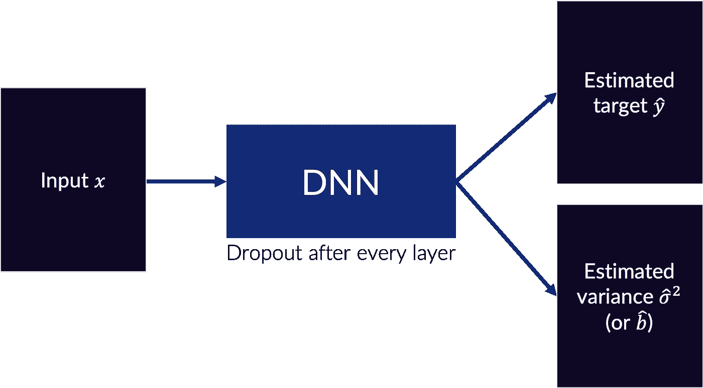

**图 2**:DNN 架构的例子，能够估计随机和认知的不确定性

这个 DNN 用一个损失函数来训练，比如:

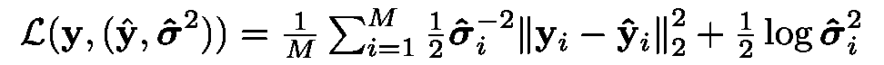

或者

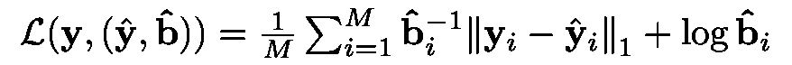

如果网络被训练用于回归任务。上面显示的第一个损失函数是具有不确定性的 MSE 变量，而第二个是 L1 变量。这些分别通过假设[似然](https://en.wikipedia.org/wiki/Posterior_probability#Definition)的高斯和[拉普拉斯](https://en.wikipedia.org/wiki/Laplace_distribution)分布得出，其中每个分量都是独立的，方差(或标度参数)由网络估计和拟合。

如上所述，这些损失函数有数学推导，但我们可以直观地理解为什么这个方差参数捕捉一种类型的不确定性:方差参数提供了方差和 MSE 或 L1 损失项之间的权衡。如果 DNN 可以容易地估计目标的真实值(即，使*接近真实值 ***y*** )，那么 DNN 应该在此基础上估计一个低方差项，以使损失最小化。然而，如果 DNN 不能估计目标的真实值(例如，信噪比低)，那么网络可以通过估计高方差来最小化损失。这将减少 MSE 或 L1 损失项，因为该项将除以方差；然而，网络不应该总是这样做，因为对数方差项不利于高方差估计。*

*如果网络正在接受分类(或分段)任务的训练，损失将类似于这个两部分损失函数:*

*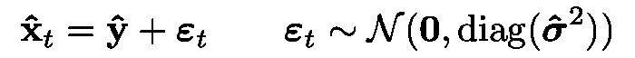***

*这种损失函数的直觉是:当 DNN 可以容易地估计组件的正确类别时，该类别的值*将会很高，并且 DNN 应该估计低的方差，以便最小化添加的噪声(以便所有样本将集中在正确的类别周围)。然而，如果 DNN 不能容易地估计组件的类别，则 ***ŷ*** 值应该较低，并且添加噪声可能会增加对正确类别的猜测，这可能会总体上最小化损失函数。(参见[第。Alex Kendall 的论文](https://alexgkendall.com/media/papers/alex_kendall_phd_thesis_compressed.pdf)的第 41 章，以获得关于这个损失函数的更多讨论。)**

**最后，在测试中，网络被采样 *T* 次以创建 *T* 估计目标和 *T* 估计方差输出。这些 *T* 输出然后以各种方式组合，以产生最终的估计目标和不确定性估计，如图 3 所示。**

**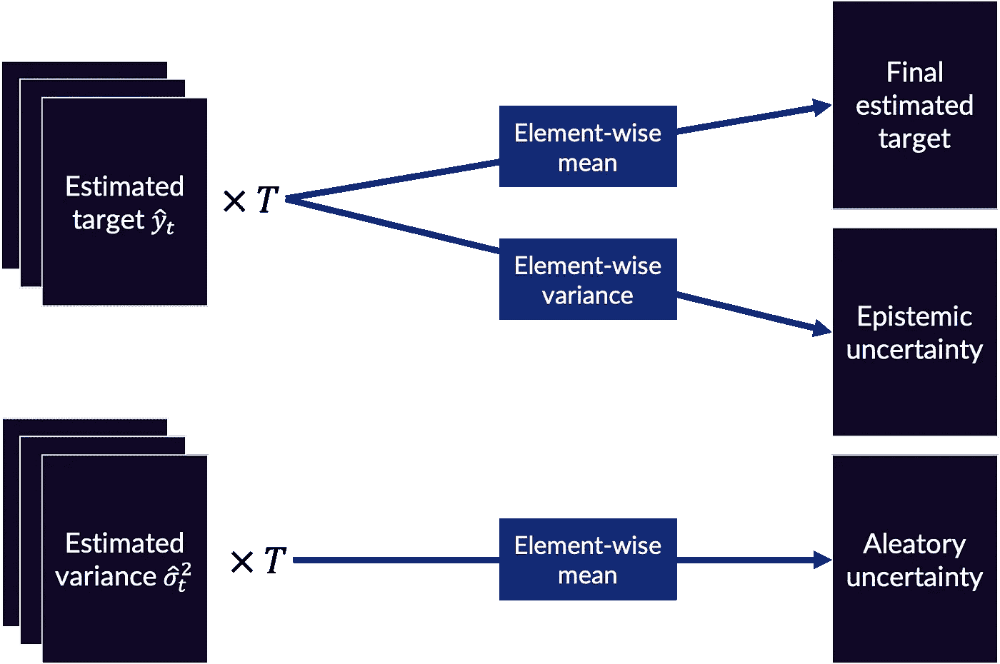**

****图 3** : DNN 输出到最终估计目标和不确定性估计**

**数学上，认知和偶然的不确定性是(对于 MSE 回归变量):**

**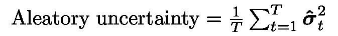****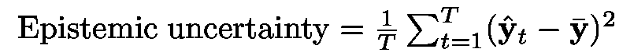**

**对于分类案例，认知不确定性有多种解释:[熵](https://arxiv.org/abs/1808.01200)，[样本方差](https://pubmed.ncbi.nlm.nih.gov/29259224/)，[互信息](https://arxiv.org/abs/1703.02910)。每一种都被证明是有用的，选择哪种类型取决于应用。**

# **示例和应用**

**为了使理论更加具体，我们将在 PyTorch 的回归和分类任务中通过两个玩具示例来评估 DNNs 的不确定性。下面的代码摘自 Jupyter 笔记本中提供的完整实现(在接下来的两个小节的开头会提到)。最后，我们将讨论在医学图像的真实世界数据示例中计算不确定性。**

## **回归示例**

**在[回归笔记本](https://nbviewer.jupyter.org/gist/jcreinhold/cddf290b1d3722b0c88bbc3c82df38a3)中，我们将一个非常简单的神经网络——由两个完全连接的层组成，在隐藏层上有漏失——拟合到具有不确定性损失的 MSE 变量的一维输入和输出数据(在下面实现)。**

**注意，我们不是直接拟合方差项，而是拟合方差项的*对数以获得数值稳定性。***

**在回归场景中，我们也可以使用不确定性损失的 L1 变量，该变量在笔记本中并在下面实现。**

**有时使用 L1 损失而不是 MSE 损失会为回归任务带来[更好的性能](https://ieeexplore.ieee.org/abstract/document/7797130)，尽管这取决于应用。**

**在这个场景中，随机的和认知的不确定性估计值是按照下面的实现来计算的(更多的上下文请看笔记本)。**

**在图 4 中，我们将拟合函数和不确定性结果可视化。在最右边的图中，我们展示了阈值认知不确定性，它展示了不确定性估计检测非分布数据的能力(至少在这个玩具场景中)。**

**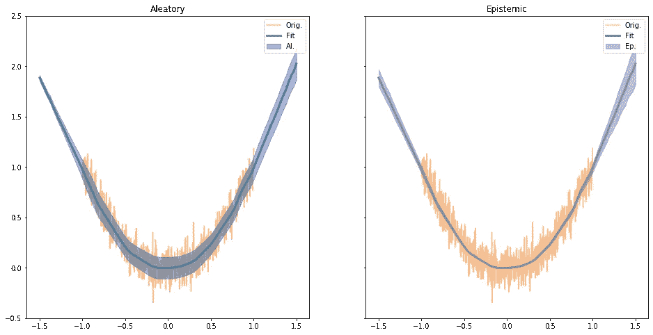****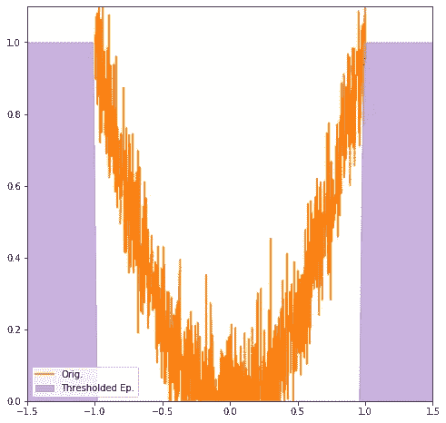**

****图 4** :回归实例的各种不确定性。橙色的原始训练数据。左边的两个图用蓝色显示了神经网络拟合的函数，第一个图和第二个图中分别具有偶然性和认知不确定性。最右边的图显示了临界的认知不确定性。完整实现见 [Jupyter 笔记本](https://nbviewer.jupyter.org/gist/jcreinhold/cddf290b1d3722b0c88bbc3c82df38a3)。**

## **分类示例**

**在[分类笔记本](https://nbviewer.jupyter.org/gist/jcreinhold/745385337944dbcc98b47578b5a769f9)中，我们再次拟合了一个由两个完全连接的层组成的神经网络，在隐藏层上有脱落。在这种情况下，我们尝试进行二元分类。因此，损失函数实现如下。**

**在这种情况下，我们可以计算许多不确定性估计值。在下面的实现中，我们计算认知、熵和偶然的不确定性。熵可以被合理地认为是属于一个偶然的和认知的不确定性，但下面它被分离出来，所以偶然的和认知的不确定性计算如前所述。**

**在图 5 中，我们可视化了训练数据上产生的认知和偶然的不确定性，以及熵。正如我们可以看到的，训练数据类重叠接近零，不确定性度量在那里达到峰值。在这个玩具的例子中，所有三个不确定性的测量都是高度相关的。在笔记本中为感兴趣的读者提供了关于原因的讨论。**

**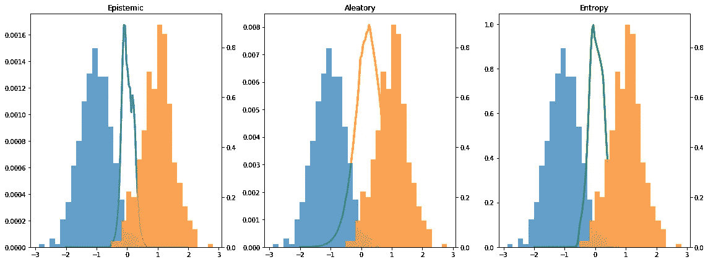**

****图 5** :二元分类示例的各种不确定性度量。参见 [Jupyter 笔记本](https://nbviewer.jupyter.org/gist/jcreinhold/745385337944dbcc98b47578b5a769f9)了解完整实现。**

## **医学图像示例**

**在最后一个例子中，我将展示作为会议论文发表的真实世界例子中不确定性的一些结果和应用([此处预印](https://arxiv.org/abs/2002.04626))。探索的任务是一个图像到图像的翻译任务，类似于著名的 [pix2pix](https://phillipi.github.io/pix2pix/) 的例子，但是使用的是医学图像。在这种情况下，我们希望使大脑的计算机断层扫描(CT)图像看起来像大脑的相应磁共振(MR)图像。这是一个回归损失，我们使用不确定性损失的 MSE 变量来训练一个 [U-Net](https://arxiv.org/abs/1505.04597) ，它被修改为在每一层之后具有[空间丢失](https://www.cv-foundation.org/openaccess/content_cvpr_2015/papers/Tompson_Efficient_Object_Localization_2015_CVPR_paper.pdf)(关于为什么*空间丢失*的讨论，请参见此处的[)，并且输出两幅图像而不是一幅图像；一个输出是估计的 MR 图像，另一个是像素方差。](/dropout-on-convolutional-layers-is-weird-5c6ab14f19b2)**

**图 6 示出了输入和输出的例子。最左边的 CT 图像在枕叶的左半球有一个异常(图像中大脑的左下方；它在右边相应的 MR 图像中更容易被可视化)。DNN 只在健康图像上训练，因此 DNN 应该不知道这种异常数据，并且它应该通过在该区域中具有高样本方差(即，高认知不确定性)来反映这一点-根据前面讨论的认知不确定性理论。**

**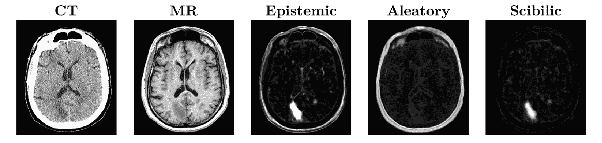**

****图 6** :从左到右——CT 图像输入网络，MR 图像为训练目标(此处显示是因为在左半球枕叶可见异常)，像素认知不确定性、像素认知随机不确定性以及认知与随机的像素比显示在标题“Scibilic”下，该标题清楚地突出了异常区域。**

**当这个图像被输入到网络中时，我们计算了认知和偶然的不确定性。这种异常在认知不确定性中得到了明确的强调，但还有许多其他区域也被预测具有高度的认知不确定性。如果我们采用认知和偶然不确定性的像素比例，我们会得到最右边显示的图像，标记为“Scibilic”(在预印本中有更多讨论)。该图像很容易被阈值化以预测异常(图像的分布外区域)。**

**这种异常检测方法绝非万无一失。实际上，这是相当易变的，但是它展示了一种将这种类型的不确定性估计应用于真实世界数据的方法。**

# **外卖食品**

**机器学习中的不确定性估计有可能降低在高风险场景中部署模型的风险。随机和认知的不确定性估计可以向用户或开发人员显示有关 DNN 性能的不同信息，并可用于修改系统以提高安全性。我们讨论并实现了一种不确定性估计的方法。这种方法并不完美，基于辍学的不确定性提供了一种获得某种(通常是合理的)不确定性度量的方法。该度量是否足够可信以用于部署是另一回事。实践者在实现这种方法时应该问自己的问题是，得到的具有不确定性估计的模型是否比没有不确定性估计的模型更有用——例如，更安全。**