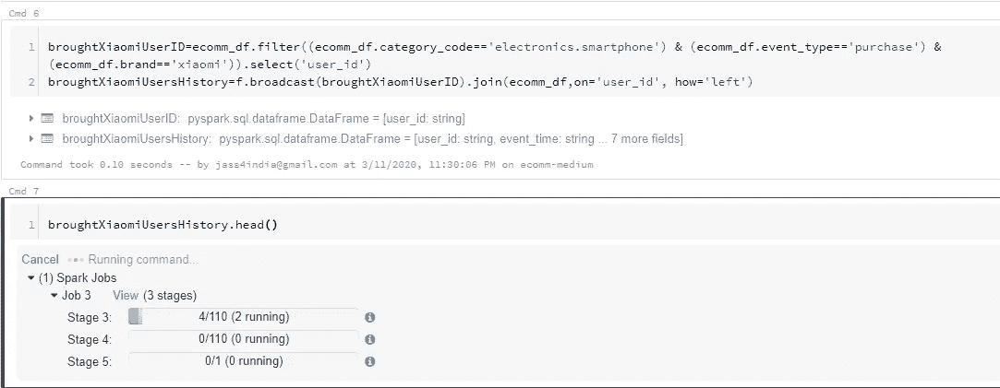
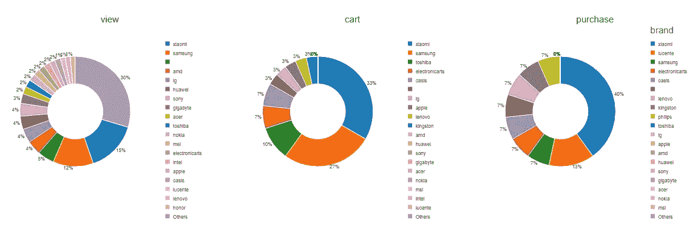
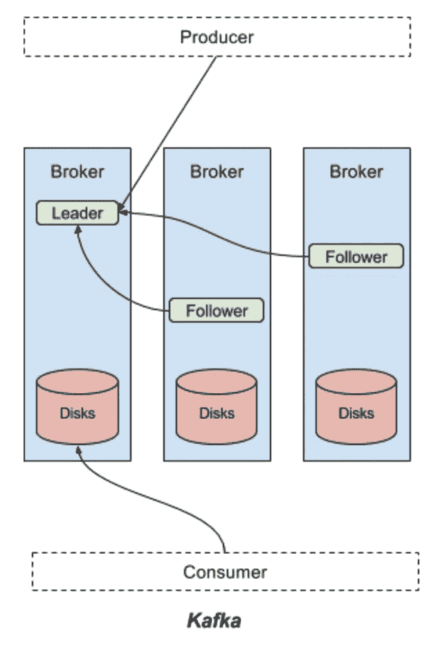
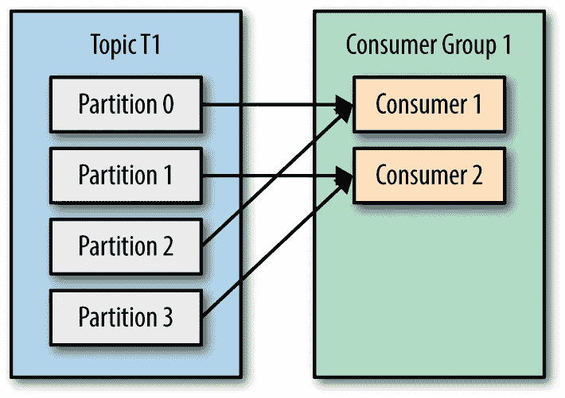
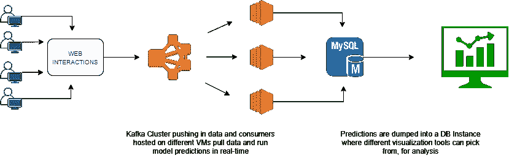

# 了解火花和卡夫卡:一亿个事件用例

> 原文：<https://towardsdatascience.com/knowing-pyspark-and-kafka-a-100-million-events-use-case-5910159d08d7?source=collection_archive---------14----------------------->

电子商务市场中典型的一天，每分钟处理 10，000 个事件，并选择正确的工具来处理这些事件


[Flaunter.com](https://unsplash.com/@flaunter?utm_source=medium&utm_medium=referral)在 [Unsplash](https://unsplash.com?utm_source=medium&utm_medium=referral) 上拍照

本文将帮助您重新创建一个场景，其中有大量数据流入，您不仅要存储这些数据，还要执行一些实时分析！

这只是**系统设计**的一个例子，在这里你必须开发一个高度可用和可伸缩的数据管道。虽然对于像电子商务这样的用例，可能有许多其他因素需要考虑，但为了本文的目的，我们将把它分成 3 个主要部分:

1.  摄取
2.  处理
3.  输出

简而言之，这是几乎所有系统设计的鸟瞰图，也是可能出错的地方。

## 摄入层

在开始使用我们的工具之前，让我们后退一步，看看我们在这里试图解决什么样的用例或问题。要了解我们的**输入或摄取**层，首先要了解我们的**输出**层。一般来说，你可以通过两种方式展示你的发现:

1.  **批处理:**如果您的分析只是一次性的，或者可能只是每日报告更新，或者只是团队中的随机演示，您可以选择批量接收数据。这可能意味着从您的数据库中取出一个小的数据转储，并用它进行一些分析。
2.  **实时处理:**也称为**流数据**是一种在新数据分析至关重要时可以采用的方法。最常见于 B2C 场景，在这种场景中，您可以即时执行操作。

批处理的好处是，它消除了构建实时管道的开销，并且您永远不会处理完整的数据集。不过，这并不适用于 B2C 环境，尤其是电子商务，在电子商务中，你必须推荐新产品、跟踪用户行程或设计实时仪表板。

既然我们知道我们的**输出层**将是实时的，我们将相应地选择我们的**摄取工具**。当然，有成千上万的工具可供你从中获取数据，但根据受欢迎程度、社区实力和各种用例的实现情况，我们将挑选 [**【卡夫卡】**](https://kafka.apache.org/) **和**[**Spark Streaming**](https://spark.apache.org/streaming/)**。**

这里再次强调，了解您的业务需求以决定执行相同工作的几个工具是很重要的。在像 e-comm 这样的场景中，我们已经知道我们想要实时输出，但是我们在这里谈论的**数字**是什么？

1-2 秒相当实时！是的，但对一个电子商务网站来说不是这样，在那里你的用户不会等待超过一秒来执行下一次点击。这让我们想到了**延迟**的概念。这是我们用来选择摄取工具的指标。这两个工具有很多不同之处，但是卡夫卡提供了毫秒级的延迟！

## 处理层

在我们的用例中，我们将分别检查 Spark 和 Kafka 的处理机制。我们将看到 spark 如何使底层硬件实际上不应该保存的数据处理成为可能。另一方面，我们将看到使用 Kafka 消费数据是多么容易，以及它如何在数百万的规模上实现这一点。

我将使用下面来自 [**Kaggle**](https://kaggle.com/) 的数据集，它有超过 1 亿行

> [https://www . ka ggle . com/mkechinov/ecommerce-behavior-data-from-multi-category-store](https://www.kaggle.com/mkechinov/ecommerce-behavior-data-from-multi-category-store)

除非您拥有一台非常高端的机器，否则不可能将整个数据集加载到您本地机器的内存中，甚至不可能将它拆分成批处理，当然除非您对每个传入的批处理执行处理，但这就是为什么我们使用类似于 [**Spark**](https://spark.apache.org/) **的东西。**

## 基础设施

设置 spark 有其复杂性，因此，为了加快速度，我们将在 [**数据块**](http://databricks.com/try-databricks) **，**上启动 Spark 集群，让您可以在数据驻留的 [AWS S3](https://aws.amazon.com/s3/) 的数据支持下快速启动集群。

Spark 遵循典型的主从架构，概括来说，这意味着**主服务器**负责所有的作业调度工作以及其他一些事情，另一方面，**从服务器**负责执行实际操作或将数据保存在内存中。


Spark 架构，1 个主节点+ 2 个工作/从节点

当我们在数据上实现 Spark 时，我们将对其进行更详细的介绍。目前，我已经在 databricks 上构建了一个 1 **工作节点+ 1 个主节点**集群，总共有 2 个内核和 8 GB 内存，尽管完整的配置应该是 4 个内核和 16 GB 内存。

它是 2 和 8，因为我们所有的 spark 操作都只发生在 worker 节点上，而我们只有 1 个 worker 节点。内核的数量(即 2 个)将在这里发挥关键作用，因为所有并行化工作都将在这里进行。

**读取 8 GB 内存上的 14 GB 数据**

在比内存本身更大的内存中存储数据是不切实际的，因此，spark 所做的是，只有当你想对数据进行一些操作时，它才会将数据加载到内存中。例如，以下代码行将并行读取我们的数据集，即利用 2 个内核读取我们的数据。

```
ecomm_df = sparkSession.read.csv("/mnt/%s/ecomm.csv" % MOUNT_NAME, header=True
```

我们的 14 GB 文件将被分成大约 112 个小块，由于我们有 2 个内核，因此将被分成 2 个块，每次 128 MB

虽然，spark 不会在你提交这个命令的时候开始读取文件，因为有一个完全不同的概念[懒惰求值](https://bit.ly/2xxt2Br)，这使得它不会以传统的 pythonic 方式读取它！但是我们仍然可以通过快速转换成 RDD 来检查这个文件的分区/块的数量

```
ecomm_df.rdd.getNumPartitions()
OUTPUT: **110 #Number of partitions**
```

这与我们的计算非常接近。[看看这个](https://bit.ly/2IR77Yh)知道我是如何从 14 GB 的文件大小计算出 112 个分区的。

现在，不要太专业，让我们快速浏览一下我们的数据

```
**# A SAMPLE RECORD OF OUR DATA**Row(event_time='2019-11-01 00:00:00 UTC', event_type='view', product_id='1003461', category_id='2053013555631882655', category_code='electronics.smartphone', brand='xiaomi', price='489.07', user_id='520088904', user_session='4d3b30da-a5e4-49df-b1a8-ba5943f1dd33')
```



过滤掉只购买了 Xiamoi 智能手机的人，然后执行左连接。查看如何将每个命令分解为 110 个任务，并且 2 个任务总是并行运行



按品牌分析有多少百分比的用户只是查看和添加到购物车，以及购买特定商品

现在您已经了解了 spark 的功能，它是一种非常可扩展的方法，可以在有限的资源集上训练/分析几乎任何规模的数据

## 模拟实时数据摄取

我们之前已经讨论了很多关于 Kafka 的要点，所以不需要太深入，让我们看看我们在真实场景中摄取这种数据的 Kafka 管道是什么样子的！

当我们谈论任何给定时间的 1 亿个事件这样的数字时，可伸缩性成为优先考虑的问题，对**分区和消费者群体**的理解也是如此。在这种摄入水平下，这两种成分可以成就或破坏我们的系统。看看这个架构，对 Kafka 系统有个大概的了解



这个模型的真实世界复制品将是你的邮箱。

1.  **邮递员:**这个人是制作人，他的工作只是收集数据，然后把它放进你的邮箱
2.  **邮箱/信箱:**这是你的经纪人，如果没人来收，信件会一直堆积。
3.  **你的地址:**这是你的题目，邮递员怎么知道要把这些数据发到哪里？
4.  **你:**你是消费者，收集这些数据并进一步处理是你的责任

这是 Kafka 数据流机制的一个非常简单的解释，足以进一步理解本文，而分区和消费者组的概念也将帮助您理解代码片段



主题是保存您的数据的内容，可以划分为 **n** 个分区供并行使用

在这种规模下，您希望并行化数据消费。为此，可以将传入的数据分成不同的**分区**，当这种情况发生时，我们可以建立**消费者组**，这意味着多个消费者希望从同一个源读取数据。

参考上面的体系结构，两个使用者从同一个源读取数据，因此，同时读取更多的数据，但读取的数据不同。如果**消费者 1** 已经读取了行 1 和行 2，**消费者 2** 将永远看不到这些数据，因为这种隔离已经在分区级别发生了！

这是我在使用分区和消费者组大规模接收这种数据时做的一个小实现

```
**# 4 Partitions Made
# Topic Name : ecomm_test**./kafka_2.11-2.3.1/bin/kafka-topics.sh --create --zookeeper localhost:2181 --replication-factor 1 --partitions 4 --topic ecomm_test**# Send data to ecomm_test topic**
producer.send(topic='ecomm_test', value=line)**# Start 2 consumers and assign it to the group "ecommGroup"** consumer = KafkaConsumer('ecomm_test', group_id='ecommGroup')
consumer = KafkaConsumer('ecomm_test', group_id='ecommGroup')**# Output of how consumer 1 reads data, only reading from 2 partitions i.e. 0 & 1**ConsumerRecord(topic=u'ecomm_test', partition=1, value='2019-11-01 00:00:01 UTC,view,17302664,2053013553853497655,,creed,28.31,561587266,755422e7-9040-477b-9bd2-6a6e8fd97387\n')ConsumerRecord(topic=u'ecomm_test', partition=0, value='2019-11-01 00:00:01 UTC,view,3601530,2053013563810775923,appliances.kitchen.washer,lg,712.87,518085591,3bfb58cd-7892-48cc-8020-2f17e6de6e7f\n')**# Output of how consumer 2 reads data, only reading from 2 partitions i.e. 2 & 3**ConsumerRecord(topic=u'ecomm_test', partition=3, value='2019-11-01 00:00:05 UTC,view,4600658,2053013563944993659,appliances.kitchen.dishwasher,samsung,411.83,526595547,aab33a9a-29c3-4d50-84c1-8a2bc9256104\n')ConsumerRecord(topic=u'ecomm_test', partition=2, value='2019-11-01 00:00:01 UTC,view,1306421,2053013558920217191,computers.notebook,hp,514.56,514028527,df8184cc-3694-4549-8c8c-6b5171877376\n')
```

## **一吻制作架构:输出**

我们只需要确保我们与以下概念保持一致:

1.  **吻:保持简单愚蠢:**尽可能保持架构简单
2.  **微服务:**分离组件以避免一连串的故障
3.  **CAP 定理:**一致性，可用性，划分容差。选择两个对你来说最重要的

最后，我们将介绍可以在生产系统中实施的最终体系结构，尽管还涉及许多其他组件，如可用性区域、存储系统、故障切换计划，但这只是生产中最终处理层的概述



包含数据流的完整架构图

正如你所看到的，图表是不言自明的，没有一个正确的架构/系统设计适合所有的用例，你只需要在给定的资源下构建可以工作的东西。

> 欢迎[联系](https://www.linkedin.com/in/jspuri/)或在此发布您的问题/反馈

干杯！