# 了解这 5 个 HCI 原则会让你的数据可视化看起来很神奇

> 原文：<https://towardsdatascience.com/knowing-these-5-hcis-principles-will-make-your-data-visualization-look-amazing-efbf22f05ab8?source=collection_archive---------13----------------------->

## [入门](https://towardsdatascience.com/tagged/getting-started)，设计心理学。

## 人机交互(HCI)研究中使用的原则

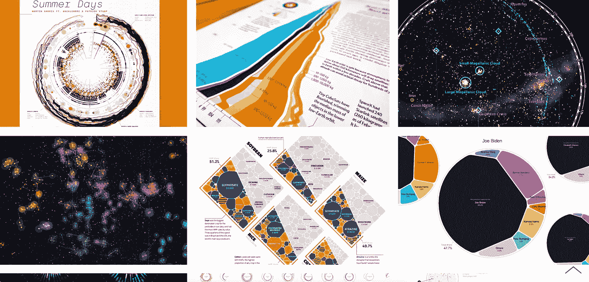

图片来自[视觉肉桂。](https://www.visualcinnamon.com/portfolio/)

一年前，我有机会在大学里阅读人机交互(HCI)。在那里，我开始了解这个领域中的各种人类心理原则。从数据可视化的角度探索多个这样的原则让我非常兴奋。数据可视化是计算机系统上的数据和人类大脑之间的高带宽连接，通过理解不同的心理学原理如何影响人类行为，由视觉通信来促进；我们可以设计我们的产品(即，图形，用户界面/UX，等等)。)从我们的用户那里引出具体的反应和行动。我们可以通过更具同理心和以用户为中心来产生重大影响。

在这里，我将分享五种不同的人机交互原则如何帮助我们创建有影响力的可视化。

*   米勒定律 -别说了
*   **雅各布定律**——用户喜欢知名的东西
*   **冯·雷斯托夫效应**——还记得那个独特的
*   **F 模式** -设计用于扫描，而非读取
*   **希克斯定律** -更多信息；要花更长时间才能抓到一个

## 米勒定律

> 如果你想理解某事，你首先要想象你所听到或读到的是真的，并从那里开始。—乔治·米勒

乔治·米勒提出的米勒定律告诉我们，我们只能在工作记忆中保留大约七项内容。除此之外的任何事情都很难回忆起来。多于七个元素会使用户产生困惑和注意力分散，用户不再记得他/她现在正在寻找的信息。

创建一个包含超过七个不同的客观元素的仪表板是不好的。相反，如果我们有十个图表要合并到一个仪表板中，我们可以将它们分块并制作两个仪表板。简单来说，我们可以说米勒定律试图说明我们应该减少信息过载(认知负荷)和可视化的复杂性。

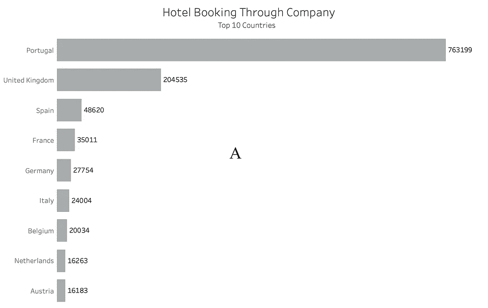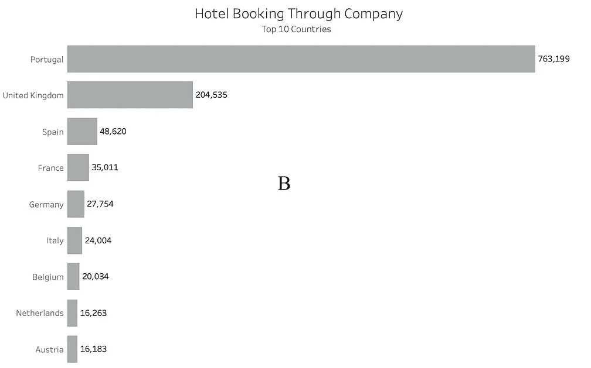

图片由作者提供。J [的数据存在于 Kaggle](https://www.kaggle.com/jessemostipak/hotel-booking-demand) 的 Mostipak。

你觉得哪一个容易读和记，A 还是 B？

我确定葡萄牙 763，199 比葡萄牙 763199 更容易记住，所以在 B 中，我们用了米勒定律。实现米勒定律的一个直接方法是分块，因为分块形式似乎更容易扫描，完成起来也不那么令人生畏。

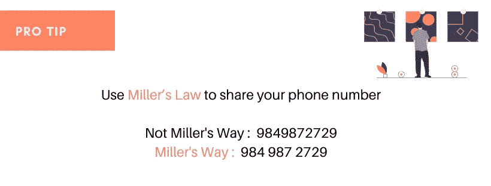

由作者设计。来自[未画](https://undraw.co/)的插图。

## 雅各布定律

> 为用户习惯的模式设计。——雅各布·尼尔森

世界上最有影响力的设计师之一雅各布·尼尔森(Jakob Nielsen)提出了雅各布定律。它指出用户喜欢熟悉的体验。他们倾向于喜欢与他们已经探索过的相似的可视化/图表。他们已经知道这些图表代表什么/如何，因为他们不需要太多的努力就能理解。所以我们可以说熟悉是安全的，用户喜欢知名的东西。

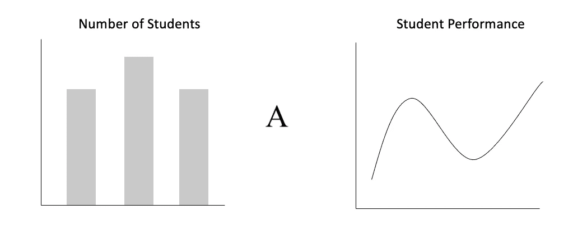

图片由作者提供。

请记住这张图表和它想要表达的意思。

这是否意味着我们应该复制一个流行的可视化？不完全是。相反，我们应该通过进行深度分析，并关注专家如何为类似的需求进行设计，来研究我们为之设计的社区中如此伟大的设计。

我们的目标是在我们设计的行业中找出著名的风格。以已知的方式倾斜将帮助我们建立正确的用户期望，创造熟悉的体验。

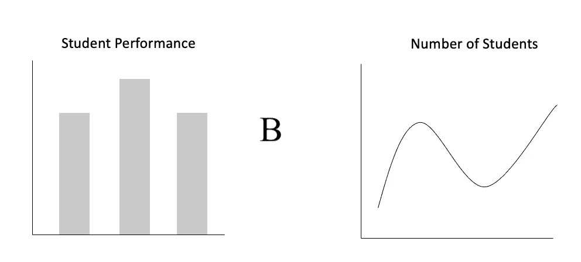

图片由作者提供。

我希望你还记得我向你要的图表。现在，你发现图表和它的目标有什么不同吗？

我敢打赌，你有。是的，因为我们已经看到了*学生人数*的条形图，我们的大脑已经捕捉到了它，每当我们看到标题*学生人数*时，我们立即用它倾斜条形图，但在这里我把条形图放在*学生表现*上，这样就给用户创造了很少的时间来考虑用新信息进行调整。利用这个规律，我们可以追求用户在享受可视化的同时不要多想。

## 冯·雷斯托夫效应

> 如果你想让人们记住某件事，那就让它突出来。——海德薇·冯·雷斯托夫

八七年前，德国精神病学家海德薇格·冯·雷斯托夫进行了一项记忆实验。她给了人们一份相似但不同的物品清单。清单上的一个项目是一种不同于其他事物的独特颜色。当海德薇格要求她的研究参与者记住这个清单时，她发现颜色独特的物品的回忆率明显高于其他物品。因此，Von Restorff 效应或隔离效应或特定编码表明，当我们看到一组相似的物体时，我们通常会记住与其他物体最不同的那个。

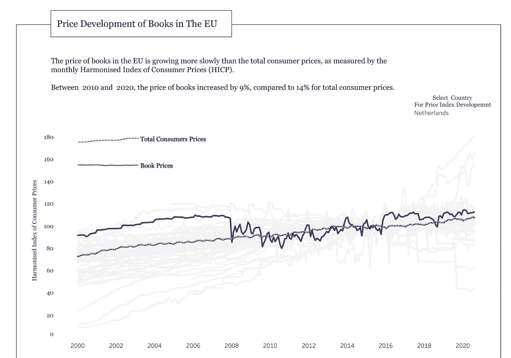

图片由作者提供。欧盟统计局的数据。

在这里，我们强调了相关的(基本方面)国家，荷兰，只有这样才能吸引用户的注意力。当我们试图帮助用户记忆时，这个原则非常重要。大多数情况下，尺寸、颜色和形状都是用来应用这一原则的。

## f 型

> 在注意力经济中，任何试图与观众建立联系的人都必须将用户的时间视为终极资源。——雅各布·尼尔森

Jakob Nielsen ( *想起了这个名字！？*)，全球最具影响力的设计师之一，发现了 F-Pattern，这是设计界被引用最多、最有用的眼球追踪资源。F 模式代表观察者通常关注的地点/可视化，跟随字母 F(“F”表示快)。这份[报告](https://www.nngroup.com/articles/f-shaped-pattern-reading-web-content/)表明:

*   F 上的两个横条是最重要的信息。
*   竖线表示读者倾向于阅读页面的左侧，并且只阅读前几个单词。
*   人们不在网上阅读。他们扫描。

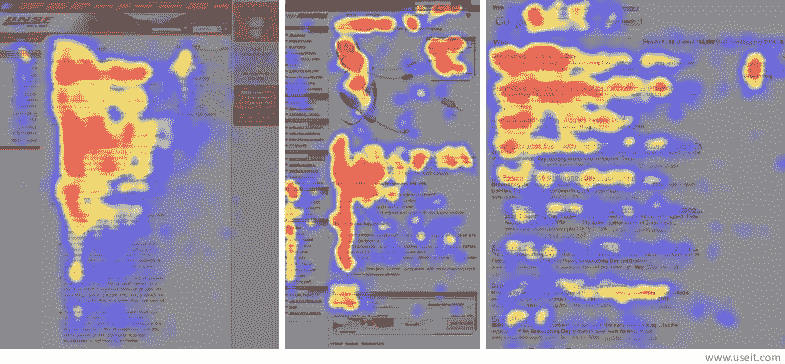

NNGroup 展示了眼球追踪研究如何揭示用户(在从左向右阅读的文化中)通常以看起来像字母 f 的模式扫描大量内容。用户看得最多的区域是红色的；黄色区域表示视图较少，其次是蓝色区域。

我们的可视化应该为扫描而设计，而不是阅读，所以最好的内容应该锚定在左上角优先。这个位置肯定会引起注意，因为使用它会使阅读体验更有吸引力。然而，我们也应该以这样一种方式思考，如果有人在浏览我们的 viz 时发现它有吸引力，他们会阅读，这样我们也可以将信息放在 F 之外的地方。

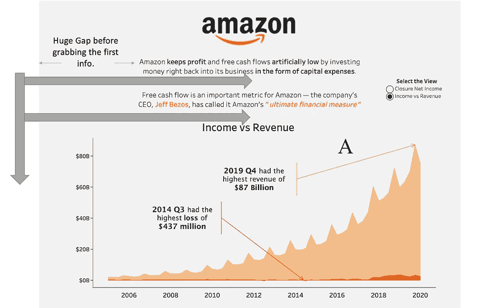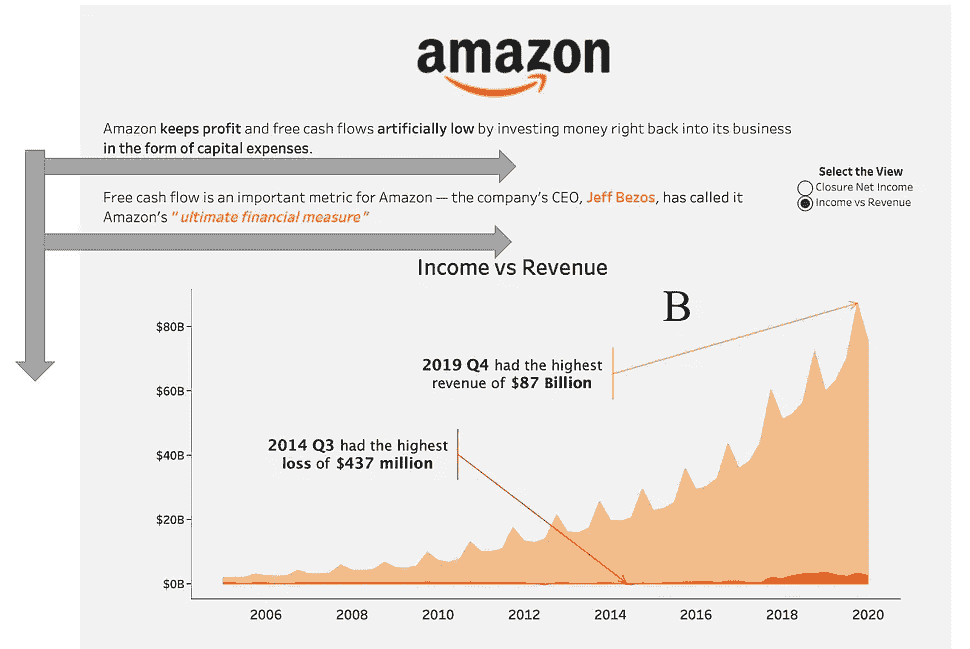

在可视化中创建 F 模式。图片由作者提供。数据由[宏观趋势](https://www.macrotrends.net/)提供。

这里我们看到在 A 上，居中的内容在设计中产生了一点空隙；因此，它消耗了用户的探索时间；然而，在 B 上，我们将文本放在左边，这样用户就可以立即开始吸收内容(我们中的一些人可能不同意这一点，但我这样做只是为了便于理解。)这样就有了 f 的模式。

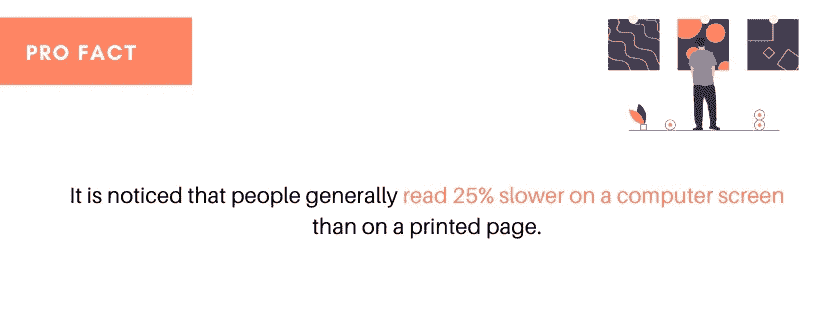

由作者设计。来自[展开图](https://undraw.co/)的插图。事实来源于 [NNgroup](https://www.nngroup.com/) 。

确保坚持 F 模式将确保我们的可视化给我们的观众留下有意义的印象。如果你想更多地了解这种模式，这里有一些值得一查的:古腾堡图、分层饼模式、斑点模式和承诺模式等。,

## 希克定律

> 减少刺激次数，获得更快的决策过程。—威廉·埃德蒙·希克

由英国和美国心理学家威廉·埃德蒙·希克和雷·海曼团队提出的希克定律或希克-海曼定律或信息增益率告诉我们，一个人做出决定所需的时间是他或她可能做出的选择的结果:增加选项的数量将对数地增加决策时间。

通俗地说:可供选择的东西越多，我们选择的时间就越长。你觉得这类似于 K.I.S.S(保持简洁)的设计方法吗？

是的，K.I.S.S .呼应了乡巴佬定律。K.I.S.S .(保持简单愚蠢或保持简短简单)源自希克定律，导致其设计和开发简单。希克斯定律的目标是试图简化决策过程，而不是消除这一过程。我们可以说，这完全是关于我们如何安排我们的信息体系结构。

所以在可视化中，提供大量的信息会产生更多的选择(信息)，用户会花更长的时间来选择一个。(请记住，我们不会以隔离的方式使用希克斯定律。我们总是把它和其他 HCI 的原则结合起来。)

我们视觉中的信息过载直接影响了希克定律的原理，因为我们“可能”从试图决定下一步要抓什么开始。不过，很快我们就要，呃…

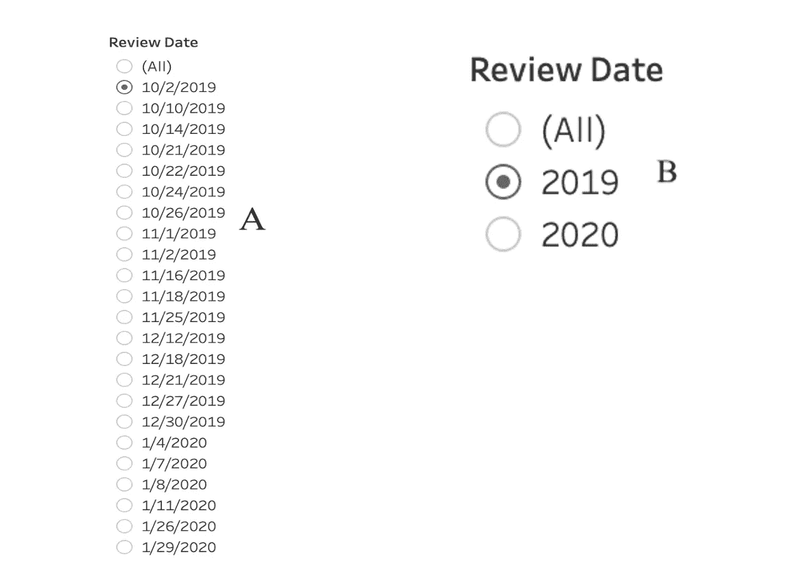

图片由作者提供。

在 A 上，我们有许多选项可供选择，我们的用户将花一些时间来决定选择哪一个。关于 B，我们有三个选择，所以没有那么多需要决策时间。因此，在 B 中，我们使用了希克定律。缩短长长的列表，减少可能的选项数量，是实现希克定律的一种简单方法。在长列表不可避免的情况下，我们应该限制用户一次可以查看的选项数量，以使浏览更加舒适和快速。

因此，如果你做到了这一步，我们可以看到，以一种有效的方式正确使用上述原则将使我们的可视化达到一个新的水平。利用这些原则，我们将以尽可能好的方式呈现数据，以满足受众的需求。下一次当你开始设计的时候，想想在哪里以及如何应用这些原则。

最后引用梅顿·戈拉瑟的话:

> 对一件设计有三种反应——是，不是，哇！哇是一个目标。

> *如果你对这篇文章有任何疑问，或者想在你的下一个数据可视化项目中合作，请在* [*LinkedIn*](https://www.linkedin.com/in/maladeep/) *上 ping 我。*

*本文由 vizartpandey.com****自愿投稿至博客。***

# 推荐读物

*   [人机交互—简介](https://www.interaction-design.org/literature/book/the-encyclopedia-of-human-computer-interaction-2nd-ed/human-computer-interaction-brief-intro)
*   [3 种设计布局:古腾堡图、Z 型和 F 型](https://vanseodesign.com/web-design/3-design-layouts/)
*   [互联网用户体验的雅各布定律](https://www.nngroup.com/videos/jakobs-law-internet-ux/)
*   [日常用品的设计(书籍摘要)](https://optimwise.com/review-design-everyday-things/)
*   [设计心理学:你应该知道和使用的原则](https://designstrategy.guide/ux/design-psychology-principles-you-should-know-and-use/)