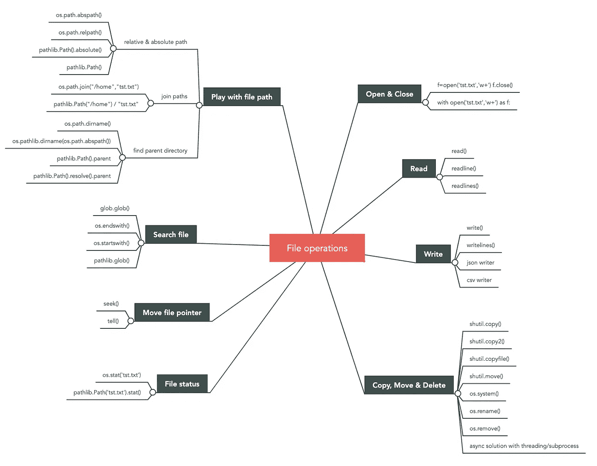

# 知道了这些，你就可以覆盖 Python 中 99%的文件操作

> 原文：<https://towardsdatascience.com/knowing-these-you-can-cover-99-of-file-operations-in-python-84725d82c2df?source=collection_archive---------9----------------------->

## 提高您处理文件的效率


Maksym Kaharlytskyi 在 [Unsplash](https://unsplash.com/) 上拍摄的照片

处理文件是我们每天最常见的任务之一。Python 有几个内置模块，用于执行文件操作，比如读取文件、移动文件、获取文件属性等。本文总结了许多您需要了解的函数，以涵盖 Python 中最常见的文件操作和良好实践。

这是您将在本文中看到的模块/函数的图表。要了解每个操作的更多信息，请继续阅读。



作者:高

## 打开和关闭文件

当你想读或写一个文件时，首先要做的是打开文件。Python 有一个内置函数`open`，它打开文件并返回一个 file 对象。文件对象的类型取决于打开文件的**模式**。它可以是文本文件对象、原始二进制文件和缓冲二进制文件。每个文件对象都有像`read()`和`write()`这样的方法。

*这个代码块有问题，能认出来吗？我们以后再讨论。*

```
file = open("test_file.txt","w+")
file.read()
file.write("a new line")
```

Python [文档](https://docs.python.org/3/library/functions.html#open)列出了所有可能的文件模式。下表列出了最常见的模式。**一个重要的规则是，任何** `**w**` **相关的模式都会先截断文件(如果存在的话)，然后创建一个新文件。如果你不想覆盖文件，小心使用这种模式，如果可能的话，使用`a`追加模式。**

前面代码块中的问题是我们只打开了文件，而没有关闭它。处理文件时，务必关闭文件。拥有一个打开的文件对象会导致不可预知的行为，比如资源泄漏。有两种方法可以确保文件被正确关闭。

1.  **使用**

第一种方式是显式使用`close()`。一个好的做法是将它放在`finally`中，这样我们可以确保文件在任何情况下都会被关闭。它使代码更加清晰，但另一方面，开发人员应该负起责任，不要忘记关闭它。

```
try:
    file = open("test_file.txt","w+")
    file.write("a new line")
exception Exception as e:
    logging.exception(e)
finally:
    file.close()
```

**2。使用上下文管理器** `**with open(...) as f**`

第二种方法是使用上下文管理器。如果你不熟悉上下文管理器，那么看看 Dan Bader 的[上下文管理器和 Python](https://dbader.org/blog/python-context-managers-and-with-statement) 中的“with”语句。`with open() as f`语句实现了`__enter__`和`__exit__`方法来打开和关闭文件。此外，它在上下文管理器中封装了 try/finally 语句，这意味着我们永远不会忘记关闭文件。

```
with open("test_file","w+") as file:
    file.write("a new line")
```

这个上下文管理器解决方案总是比`close()`好吗？看你用在什么地方了。以下示例实现了将 50，000 条记录写入文件的 3 种不同方式。正如您从输出中看到的，`use_context_manager_2()`函数与其他函数相比性能极低。这是因为`with`语句是在一个单独的函数中，它基本上为每条记录打开和关闭文件。如此昂贵的 I/O 操作会极大地影响性能。

比较`with`语句和 close()方法

## 读取和写入文件

打开文件后，您必须想读取或写入该文件。file 对象提供了 [3 个方法](https://docs.python.org/3/tutorial/inputoutput.html#methods-of-file-objects)来读取一个文件，分别是`read()`、`readline()`和`readlines()`。

默认情况下，`read(size=-1)`返回文件的全部内容。如果文件大于内存，可选参数`size`可以帮助您限制返回字符(文本模式)或字节(二进制模式)的大小。

`readline(size=-1)`返回一整行，末尾包含字符`\n`。如果`size`大于 0，将返回该行的最大`size`字符数。

`readlines(hint=-1)`返回列表中文件的所有行。可选参数`hint`表示如果返回的字符数超过`hint`，将不再返回更多的行。

在这 3 种方法中，`read()`和`readlines()`的内存效率较低，因为默认情况下，它们以字符串或列表的形式返回完整的文件。一种更节省内存的方法是使用`readline()`，让它停止读取，直到返回一个空字符串。空字符串`""`意味着指针到达了文件的末尾。

以节省内存的方式读取文件

就写作而言，有两种方法`write()`和`writelines()`。顾名思义，`write()`是写字符串，`writelines()`是写字符串列表。**开发人员负责在末尾加上** `**\n**` **。**

将行写入文件

如果您将文本写入特殊的文件类型，如 JSON 或 csv，那么您应该在 file 对象之上使用 Python 内置模块`json`或`csv`。

## 在文件内移动指针

当我们打开一个文件时，我们得到一个指向某个位置的文件处理程序。在`r`和`w`模式下，处理程序指向文件的开头。在`a`模式下，处理程序指向文件的结尾。

`***tell()***`*`***seek()***`*

*当我们从文件中读取时，指针移动到下一次读取将开始的地方，除非我们告诉指针四处移动。您可以使用两种方法完成此操作:`tell()`和`seek()`。*

*`tell()`从文件开始以字节/字符数的形式返回指针的当前位置。`seek(offset,whence=0)`将处理器移动到距离`whence`有`offset`个字符的位置。`whence`可以是:*

*   *0:从文件的开头开始*
*   *1:从当前位置*
*   *2:从文件末尾开始*

*在文本模式下，`whence`只能为 0，`offset`应≥0。*

*讲述()和寻找()*

## *了解文件状态*

*操作系统上的文件系统可以告诉你许多关于文件的实用信息。例如，文件的大小、创建和修改时间。要在 Python 中获得这些信息，可以使用`os`或`pathlib`模块。其实`os`和`pathlib.`之间有很多共同点`pathlib`是一个比`os`更面向对象的模块。*

****os****

*获得完整状态的一种方法是使用`os.stat("test.txt")`。它返回一个结果对象，带有许多统计信息，如`st_size`(文件的大小，以字节为单位)`st_atime`(最近一次访问的时间戳)`st_mtime`(最近一次修改的时间戳)等。*

```
*print(os.stat("text.txt"))>>> os.stat_result(st_mode=33188, st_ino=8618932538, st_dev=16777220, st_nlink=1, st_uid=501, st_gid=20, st_size=16, st_atime=1597527409, st_mtime=1597527409, st_ctime=1597527409)*
```

*您也可以使用`os.path`单独获取统计数据。*

```
*os.path.getatime()
os.path.getctime()
os.path.getmtime()
os.path.getsize()*
```

****Pathlib****

*获得完整状态的另一种方法是使用`pathlib.Path("text.txt").stat()`。它返回与`os.stat()`相同的对象。*

```
*print(pathlib.Path("text.txt").stat())>>> os.stat_result(st_mode=33188, st_ino=8618932538, st_dev=16777220, st_nlink=1, st_uid=501, st_gid=20, st_size=16, st_atime=1597528703, st_mtime=1597528703, st_ctime=1597528703)*
```

*我们将在以下章节中比较`os`和`pathlib`的更多方面。*

## *复制、移动和删除文件*

*Python 有许多处理文件移动的内置模块。在你相信 Google 返回的第一个答案之前，你要意识到模块的不同选择会导致不同的表现。有些模块会阻塞线程，直到文件移动完成，而其他模块可能会异步执行。*

**`shutil`是最著名的移动、复制和删除文件和文件夹的模块。它提供了 4 种方法来复制一个文件。`copy()`、`copy2()`和`copyfile()`。**

**`**copy()**` **v.s.** `**copy2()**` : `copy2()`和`copy()`很像。不同的是，`copy2()`还会复制文件的元数据，比如最近的访问时间、最近的修改时间。但是根据[的 Python 文档](https://docs.python.org/3/library/shutil.html)，由于操作系统的限制，即使`copy2()`也无法复制所有的元数据。**

**副本()与副本 2()**

**`**copy()**` **v.s.** `**copyfile()**` : `copy()`设置新文件的权限与原文件相同，但`copyfile()`不复制其权限模式。其次，`copy()`的目的地可以是一个目录。如果存在同名文件，它将被覆盖，否则，将创建一个新文件。但是，`copyfile()`的目的地必须是目标文件名。**

**copy() v.s. copyfile()**

*****os*****

**`os`模块有一个功能`system()`，允许你在子外壳中执行命令。您需要将命令作为参数传递给`system()`。这与在操作系统上执行的命令具有相同的效果。对于移动和删除文件，您也可以使用`os`模块中的专用功能。**

**操作系统移动 _ 复制**

*****异步复制/移动文件*****

**到目前为止，解决方案总是同步的，这意味着如果文件很大并且需要更多时间移动，程序可能会被阻塞。如果想让程序异步，可以使用`threading`、`multiprocessing`或者`subprocess`模块，让文件操作在单独的线程或者单独的进程中运行。**

**异步方式的文件操作**

## **搜索文件**

**复制和移动文件后，您可能希望搜索与特定模式匹配的文件名。Python 提供了许多内置函数供您选择。**

*****全球*****

> **`[glob](https://docs.python.org/3.8/library/glob.html#module-glob)`模块根据 Unix shell 使用的规则找到所有匹配指定模式的路径名。它支持通配符，如*？[].**

**`glob.glob("*.csv")`在当前目录中搜索所有扩展名为`csv`的文件。`glob`模块也可以搜索子目录中的文件。**

**搜索文件名—全局**

*****os*****

**`os`模块功能强大，基本上可以做一切与文件有关的操作。我们可以简单地使用`os.listdir()`列出目录中的所有文件，并使用`file.endswith()`和`file.startswith()`来检测模式。如果你想遍历目录，那么使用`os.walk()`。**

**搜索文件名—操作系统**

*****pathlib*****

**`pathlib`具有与`glob`模块相似的功能。也可以递归搜索文件名。与之前基于`os`的解决方案相比，`pathlib`拥有更少的代码，提供了更面向对象的解决方案。**

**搜索文件名—路径库**

## **摆弄文件路径**

**使用文件路径是我们做的另一项常见任务。它可以得到一个文件的相对路径和绝对路径。它也可以是连接多个路径和寻找父目录等。**

*****相对和绝对路径*****

**`os`和`pathlib`都提供了获取文件或目录的相对路径和绝对路径的函数。**

**文件的相对和绝对路径**

*****加入路径*****

**这就是我们如何独立于环境连接`os`和`pathlib`中的路径。`pathlib`使用斜杠创建子路径。**

**连接文件路径**

*****获取父目录*****

**`dirname()`是在`os`中获取父目录的功能，而在`pathlib`中，你只需使用`Path().parent`就可以获取父文件夹。**

**获取父文件夹**

## **os 对 s. pathlib**

**最后，我想简单说一下`os`和`pathlib`。正如 [Python 文档](https://docs.python.org/3/library/pathlib.html)所说，`pathlib`比`os`更面向对象。它将每个文件路径表示为适当的对象，而不是字符串。这给开发者带来了很多好处，比如更容易连接多个路径，在不同的操作系统上更加一致，方法可以直接从对象中访问。**

**我希望这篇文章能提高你处理文件的效率。**

## **参考:**

**[](https://realpython.com/read-write-files-python/#buffered-binary-file-types) [## 用 Python 读写文件(指南)-真正的 Python

### 在本教程中，您将学习如何在 Python 中读写文件。您将涵盖从文件是什么…

realpython.com](https://realpython.com/read-write-files-python/#buffered-binary-file-types) [](https://treyhunner.com/2018/12/why-you-should-be-using-pathlib/#:~:text=The%20os%20module%20is%20a,nested%20string%2Diful%20function%20calls.) [## 为什么应该使用 pathlib

### 几年前当我发现 Python 的新 pathlib 模块时，我最初认为它是一个稍微更…

treyhunner.com](https://treyhunner.com/2018/12/why-you-should-be-using-pathlib/#:~:text=The%20os%20module%20is%20a,nested%20string%2Diful%20function%20calls.)**