# 知道什么和为什么？—解释图像分类器预测

> 原文：<https://towardsdatascience.com/knowing-what-and-why-explaining-image-classifier-predictions-680a15043bad?source=collection_archive---------11----------------------->

## 数据科学工具包

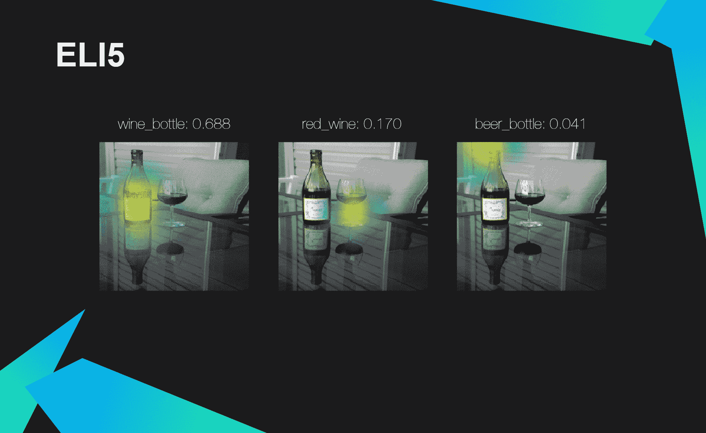

测试库提供的解释的比较

# 介绍

事实上，每年机器学习(ML)都在成为我们生活中越来越重要的一部分。ML 帮助我们完成简单的日常任务，比如找到回家的最佳路线，用手机准确扫描文件或将文本翻译成不同的语言。然而，它也被用作许多高度负责的系统中的一个关键要素，在这些系统中，人的生命和福祉受到威胁。

*   人工智能(AI)被用于司法系统，以评估被定罪的人再次违法的可能性有多大。
*   一些公司正在研发能够帮助甚至完全免除医生在医学图像上定位肿瘤的系统

随着我们实施类似于上面提到的那些系统，越来越清楚的是**我们不仅要提供预测，还要提供解释**什么影响了我们的决策。在这篇文章中，我将比较和测试最常用的库，用于解释**图像分类** — **Eli5、LIME 和 SHAP** 领域的模型预测。我们将调查他们利用的算法，以及比较所提供的解释的效率和质量。

注意:因为我不想让你厌烦滚动巨大的代码片段，所以我只在文章中放了一小部分。然而，如果你想创建类似的可视化，或者学习如何解释你的分类器的预测，我鼓励你访问我的 [GitHub](https://github.com/SkalskiP/ILearnDeepLearning.py/tree/master/02_data_science_toolkit/03_explaining_image_classifier_predictions) 。

# 权衡取舍

在我们开始之前，让我们先回答一个最基本但同时也是最重要的问题。为什么我们甚至需要解释？难道我们不能解释模型的预测来了解是什么影响了它们吗？不幸的是，在很多情况下，答案是否定的

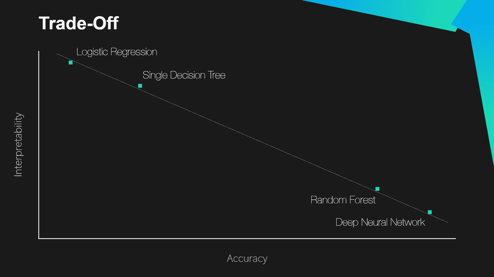

模型的潜在准确性和可解释性之间的权衡

我们可以说在模型的复杂性和它的可解释性之间有一个权衡。由于一些问题——尤其是在计算机视觉领域——非常复杂，我们必须使用强大而复杂的模型来解决它们。这些类型的模型通常被称为黑盒，因为我们不知道或不理解它们内部发生了什么。因此，我们经常为了模型的准确性而牺牲可解释性。

# 图像分类

正如我在第一段提到的，在这个项目中，我们将处理图像分类模型。这是最古老和最受认可的计算机视觉(CV)任务之一，它涉及到给照片分配一个带有对象类别名称的标签。尽管看起来很简单，但这是一项多年来给研究人员带来巨大问题的任务。突破性的想法是 [AlexNet](https://papers.nips.cc/paper/4824-imagenet-classification-with-deep-convolutional-neural-networks.pdf) —卷积神经网络(CNN)，在 2012 年的 ImageNet 比赛中首次使用。AlexNet 以大约低 10 个百分点的误差击败了其他参与者。这个解决方案彻底改变了计算机视觉。从那时起，CNN 就成了这个研究分支中所有任务的默认答案。不幸的是，CNN 是黑盒的一个例子——尽管我们知道黑盒内部发生的变化，但即使对于该领域的专家来说，对它们的全面解释也是一个问题。

**注:**如果你想更深入地探索 CNN，我强烈建议你阅读我的另一篇文章——[深入了解卷积神经网络背后的数学](/gentle-dive-into-math-behind-convolutional-neural-networks-79a07dd44cf9)。

# ELI5

我们将研究的第一个库是[Eli 5](https://github.com/TeamHG-Memex/eli5)——这是一个简单但可靠的工具，旨在可视化、检查和调试 ML 模型。该库允许解释用 Keras 编写的图像分类器的预测。为此，Eli5 利用了梯度加权类激活映射(Grad-CAM)算法。值得注意的是，这不是一个通用的方法，它仅适用于 CNN 解决方案。

## Grad-CAM

[Grad-CAM](https://arxiv.org/abs/1610.02391) 是 [CAM](https://arxiv.org/abs/1512.04150) 的下一个迭代，这是将 CNN 的预测可视化的最初想法之一。它使用激活图的值以及反向传播来理解预测的来源。

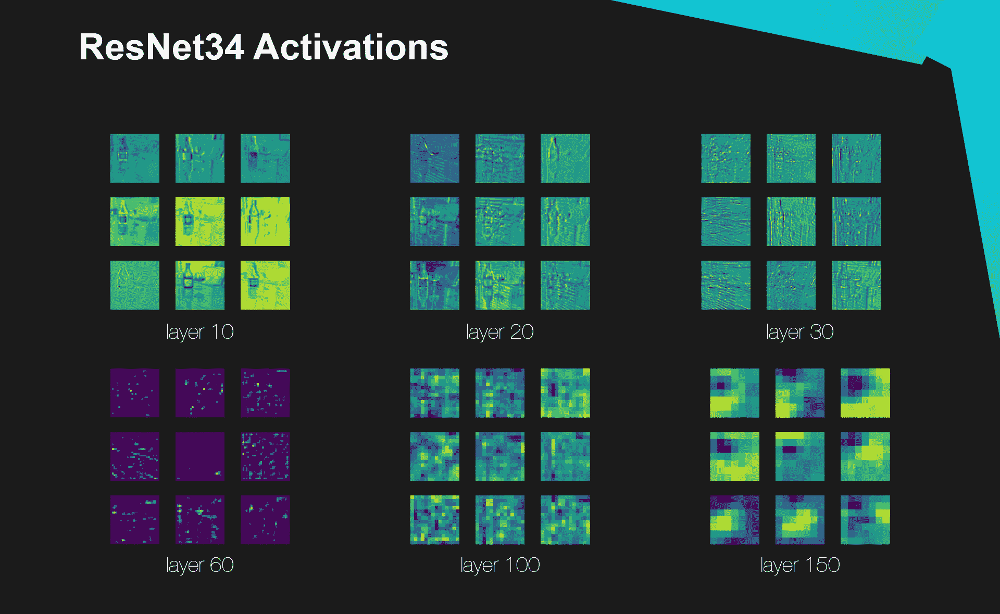

ResNet34 激活在六个不同网络深度的可视化。随着层深度的增加，激活分辨率降低。

过滤图(或激活图)是将一个卷积核应用于层输入的结果。根据过滤器中的值，它们对不同的模式做出反应。重要的是，位于 CNN 不同深度的卷积层对它们所观察的物体的不同细节水平做出反应。浅层次对简单的形状有反应——不同角度的线条，相同亮度的表面。另一方面，深层的 CNN 会随着特定的复杂模式的出现而发光。此外，在大多数情况下，深层 CNN 层中的激活图的分辨率比图形开始处的低。

Grad-CAM 解释是通过执行前向激活图的线性加权组合，然后执行 ReLU 来获得的。相对于特征图激活，通过对给定类别(在 Softmax 之前)获得的分数梯度进行平均来计算线性方程的系数。

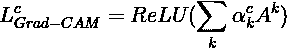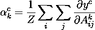

## 例子

允许使用 Eli5 解释任何基于 Keras 的 CNN 预测的代码片段— [完整示例](https://github.com/SkalskiP/ILearnDeepLearning.py/blob/master/02_data_science_toolkit/03_explaining_image_classifier_predictions/01_coco_res_net/coco-resnet-keras-resnet-34-eli5.ipynb)

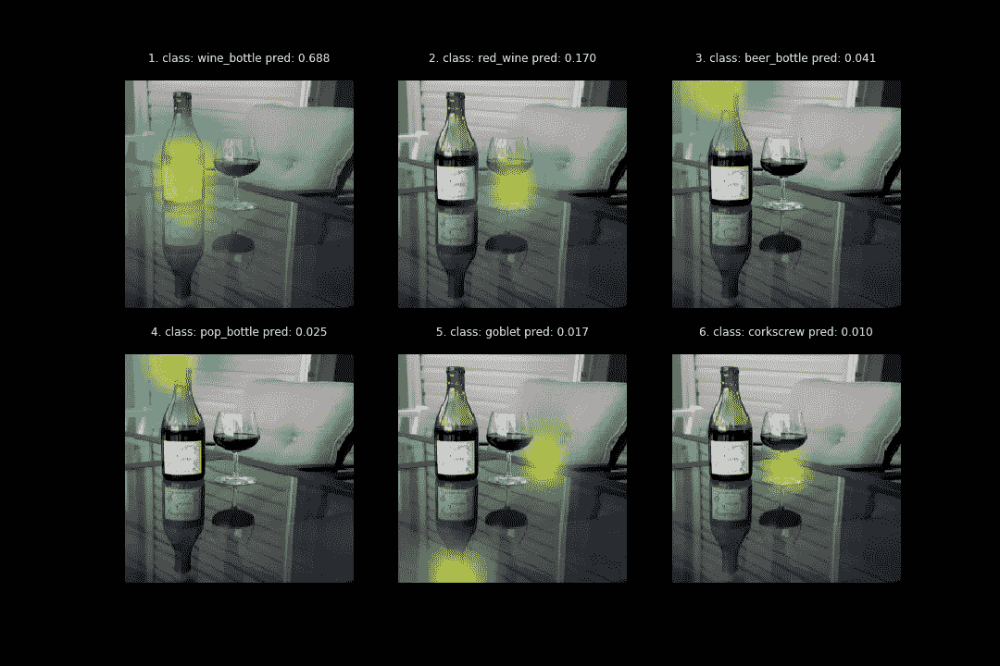

使用 Eli5 为 ResNet34 型号获得的解释

## 摘要

*   **[+]**Eli 5 背后的思想很简单，计算量也很小，因此，该算法既容易理解，又能很快执行**。**
*   ****[―]** 该方法仅用于**解释 CNN 预测**。**
*   ****[―]** 目前库**只支持基于 Keras 的模型。****
*   ****[―]** 该方法的精度有限——取决于**激活图分辨率**。**

**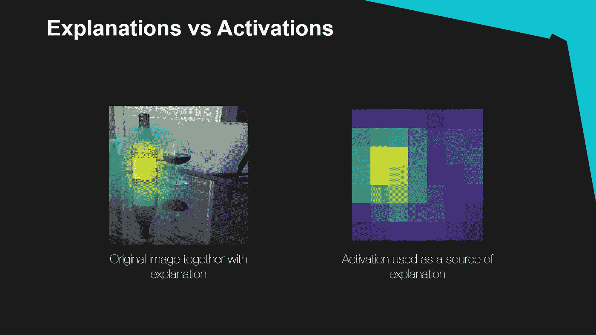**

**显示 CNN 激活的分辨率如何影响解释的精确度的可视化**

# **石灰**

**我为什么要相信你？:解释任何分类器的预测是一篇文章，是旨在解释 ML 模型的整个研究分支的基础。本文中包含的思想成为了最流行的解释库——本地可解释模型不可知解释(LIME)的基础。这种算法与 Grad-CAM 完全不同，它试图通过扰动输入数据来理解模型，并理解这些变化如何影响预测。**

## **代理模型**

**这一次，我们的目标是用简单、可理解的线性模型取代复杂的黑盒模型。当然，新模型只是原模型的近似，但经过选择，它忠实地代表了当地的情况。这个方向的第一步是将图像分成超像素——颜色和亮度相似的相邻像素组。这种方法是有意义的，因为照片的分类可能是由许多像素决定的，所以单个像素的扰动对预测的影响很小。然后，我们创建一个人工照片集合，通过用灰色替换原始照片的随机超像素来创建。**

**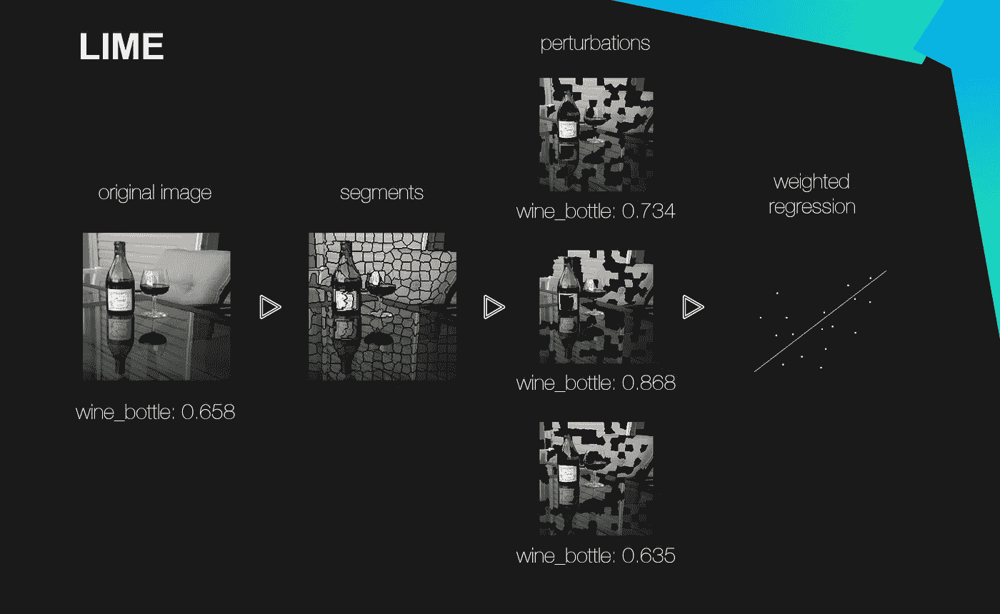**

**石灰算法**

**我们还定义了一个函数*，它将允许我们确定原始图像和样本之间的相似程度，其中 ***D*** 是图像之间的余弦距离，而***【σ***是图像的宽度。为了计算这个度量，我们将数码照片展平，并将其视为一个矢量。然后，我们计算代表被比较的两幅图像的向量之间的角度的余弦。***

***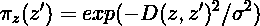***

***现在你需要做的就是找到原始模型对输入图像 ***f(x)*** 的预测，以及线性模型对扰动图像***g(z’)***的预测，并求解由 ***L*** 定义的加权回归。***

***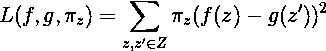***

## ***稳健性***

***我们当然期望从梦的解释库中得到的一个关键特征是健壮性。我们想要两张几乎相同的图像来给出非常接近的解释。然而，事实证明**石灰在这方面高度不稳定**。***

***为了验证这一点，我进行了一个实验——我解释了图像分类器对两幅几乎相同的图像的预测。第二张图片是通过在原始图片中添加少量高斯噪声创建的——如此之小，以至于从模型中获得的概率几乎不会改变，图像对于肉眼来说是无法区分的。然而，解释上的差异却是显著的。***

## ***例子***

***允许使用 LIME 解释任何图像分类器预测的代码片段— [完整示例](https://github.com/SkalskiP/ILearnDeepLearning.py/blob/master/02_data_science_toolkit/03_explaining_image_classifier_predictions/01_coco_res_net/coco-resnet-keras-resnet-34-lime.ipynb)***

***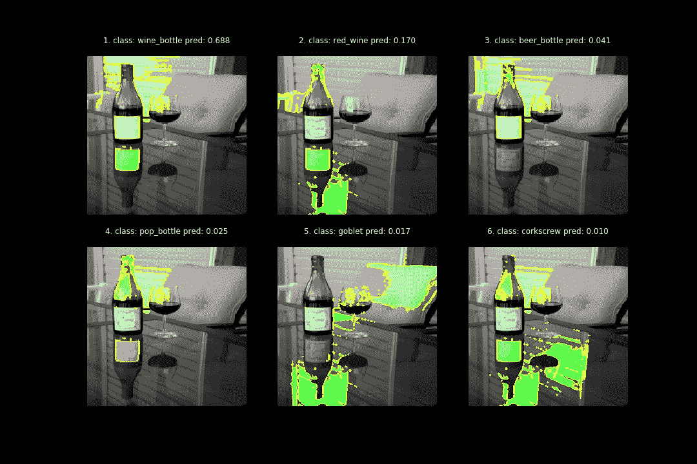***

***使用 ResNet34 型号的石灰获得的解释***

## ***摘要***

*   *****[+]模型不可知方法** —完全独立于 ML 模型的类或架构。***
*   *****[+]** 库有现成的实现，可以让你解释任何图像分类器的预测。***
*   *****[―]耗时的**计算，取决于所选的超参数，对于单个图像可能会持续几分钟。***
*   *****[―]稳定性问题**——即使是图像的微小变化，也会导致截然不同的解释***

# ***SHAP***

***Hapley 加法解释(SHAP)和 LIME 非常相似——两者都是解释个体预测的加法和模型不可知的方法。然而，SHAP 的目的是通过计算每个特征对预测的贡献来解释给定输入的模型预测。为了实现这个目标，SHAP 使用了沙普利值，它最初来自博弈论。***

## ***沙普利值***

***首先，为了更好地理解所分析的算法，我们来解释一下什么是 Shapley 值。这是 Shapley (1953)描述的一种方法，根据游戏玩家对总收益的贡献来分配奖励。这个想法已经被转移到 SHAP，作为评估哪个特征对模型的最终预测贡献最大的一种方式。它被描述为一个特征值在所有可能的联合中的平均边际贡献。联盟向量***z’***为每个特征分配值 0 或 1，定义它是否出现在联盟中。使用函数 ***h*** 将这些向量映射到特征空间——对于图像，该函数填充灰色超像素，对应的向量值为 0。***

***KernelSHAP 这是一个想法的组合，从 LIME 开始就知道了，但是使用了 Shapley 值。类似地，与石灰一样，我们使用超像素来限制特征的数量，将相似颜色和亮度的像素组合起来。我们还使用加权回归来建立线性模型，其中每个超像素代表我们模型的单个特征。***

***关键区别在于回归模型权重的选择。对于 LIME，它是原始图像和扰动图像之间的余弦度量，而对于 KernelSHAP，使用以下公式来确定权重，其中 ***M*** 是最大联合，***| z’|***是所考虑的联合中的特征数量。***

***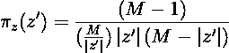***

## ***例子***

***允许使用 SHAP 解释任何图像分类器预测的代码片段— [完整示例](https://github.com/SkalskiP/ILearnDeepLearning.py/blob/master/02_data_science_toolkit/03_explaining_image_classifier_predictions/01_coco_res_net/coco-resnet-keras-resnet-34-shap.ipynb)***

***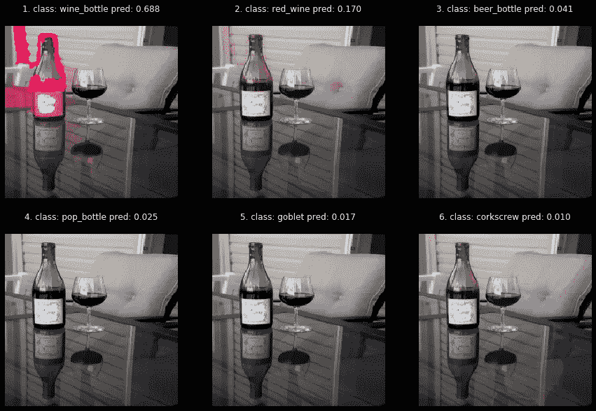***

***从 ResNet34 型号的 SHAP 获得的解释***

## ***摘要***

*   *****[+]源于博弈论的坚实数学基础**，使其具有很强的可解释性。***
*   *****[+]模型不可知方法*****
*   *****[―]极其缓慢**，因为它需要计算许多沙普利值***
*   *****[―]** KernelSHAP 是一个通用算法，如果我们想用它来解释 CV 模型的预测，我们需要定义我们的函数 ***h*** 将联盟映射到图像特征。***

# ***基准***

***我们将使用执行模型解释所必需的墙时间，作为我们库性能的度量。为了避免与预测解释无关的因素的影响，我们将依赖于 100 个单独案例的平均时间。获得的值如下所示。测试是在没有 GPU 的计算机上进行的，该计算机配备了英特尔酷睿 i7–7700 HQ CPU 处理器(2.80GHz)***

***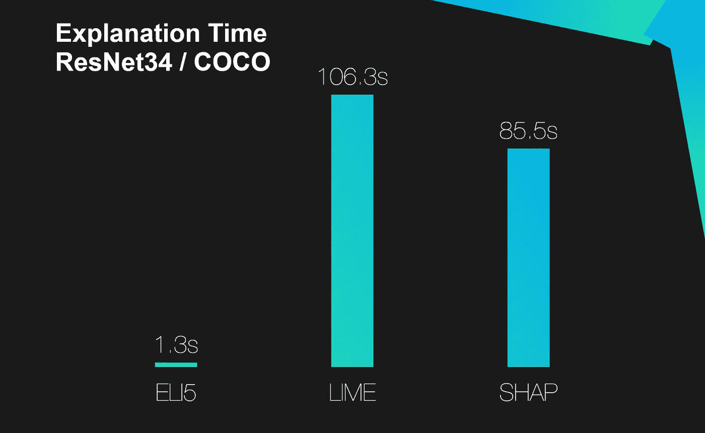***

***测试图书馆的平均讲解时间***

# ***结论***

***如果你设法来到这里，祝贺你。非常感谢你花时间阅读这篇文章。如果你喜欢这篇文章，考虑把它分享给你的朋友，或者两个或五个朋友。我希望这篇文章是有帮助的，现在你知道如何解释你的图像分类器的预测。***

***本文是“数据科学工具包”系列的另一部分，如果您还没有机会，请阅读[其他文章](/simple-method-of-creating-animated-graphs-127c11f58cc5)。此外，如果你喜欢我目前的工作，请在 [Twitter](https://twitter.com/PiotrSkalski92) 和 [Medium](https://medium.com/@piotr.skalski92) 上关注我，并在 [GitHub](https://github.com/SkalskiP) 和 [Kaggle](https://www.kaggle.com/skalskip) 上查看我正在进行的其他项目。保持好奇！***

******************