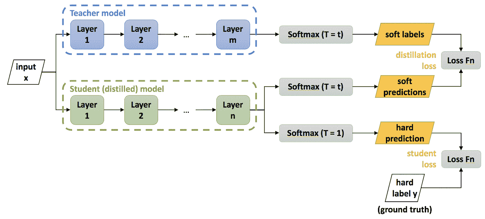
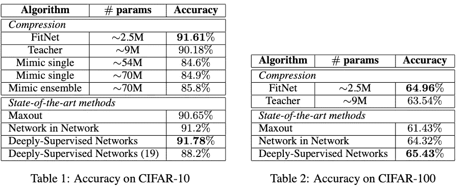
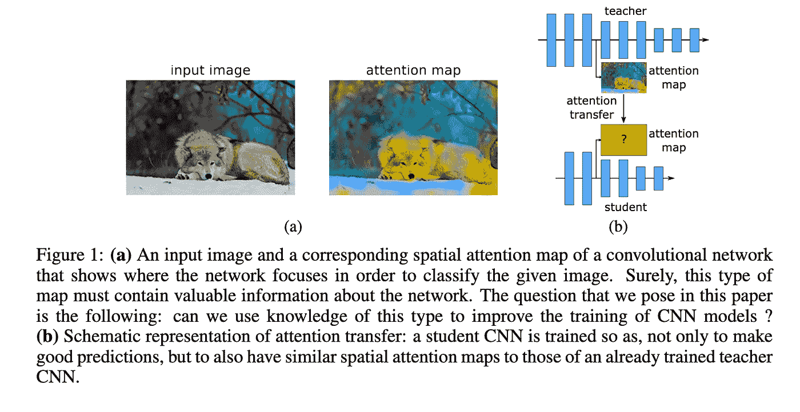
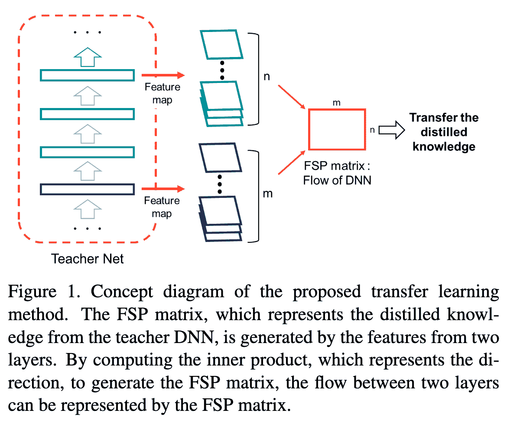
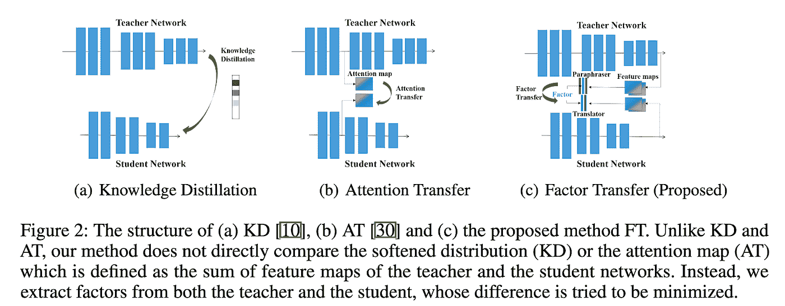
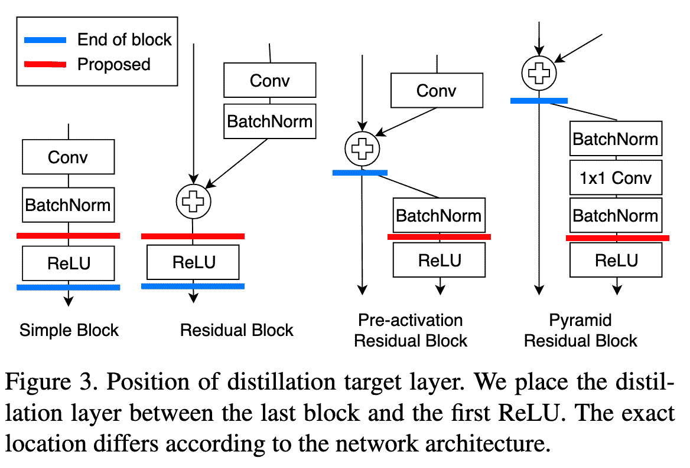

# 知识蒸馏——穿越时间的调查

> 原文：<https://towardsdatascience.com/knowledge-distillation-a-survey-through-time-187de05a278a?source=collection_archive---------34----------------------->

## 通过这个博客，你将回顾知识蒸馏(KD)和六篇后续论文。

# **历史**

2012 年，AlexNet 在 ImageNet 数据上的表现超过了现有的所有模型。神经网络即将被广泛采用。到 2015 年，许多先进技术被打破。趋势是在你能找到的任何用例上使用神经网络。VGG 网的成功进一步肯定了使用更深层次的模型或模型集合来获得性能提升。

(模特合奏只是一个花哨的名词。这意味着对多个模型的输出进行平均。例如，如果有三个模型，其中两个模型预测“A”，而一个模型预测“B”，那么将最后的预测作为“A”(两票对一票)

但是这些更深层次的模型和这些模型的集合在推理过程中运行的成本太高。(3 个模型的集合使用 3 倍于单个模型的计算量)。

# **意念**

Geoffrey Hinton、Oriol Vinyals 和 Jeff Dean 提出了一种在这些预先训练的集合的指导下训练浅层模型的策略。他们称之为[知识提取](https://arxiv.org/abs/1503.02531)，因为你从一个预先训练好的模型中提取知识到一个新的模型中。因为这看起来像是一个老师在指导一个学生，所以这也被称为师生学习。[https://arxiv.org/abs/1503.02531](https://arxiv.org/abs/1503.02531)

(图片来自[https://nerv anasystems . github . io/distiller/knowledge _ distillation . html)](https://nervanasystems.github.io/distiller/knowledge_distillation.html))

在知识蒸馏，他们使用预训练模型的输出概率作为新浅层模型的标签。通过这个博客，你可以了解这项技术的改进。

# Fitnets

2015 年出现了 [FitNets:薄而深的网的提示](https://arxiv.org/abs/1412.6550)(发表于 ICLR 2015 年)

FitNets 在 KD 损失之外又增加了一项。它们从两个网络的中点获取制图表达，并在这些点的要素制图表达之间添加均方损失。

经过训练的网络正在提供新网络正在模仿的经过学习的中间表征。这些表征帮助学生有效地学习，被称为暗示。

FitNet 能够压缩模型，同时保持几乎相同的性能

回过头来看，这种使用单点给出提示的选择是次优的。许多后续论文试图改进这些提示。

# 更加关注注意力

[更加关注注意力:通过注意力转移提高卷积神经网络的性能](https://arxiv.org/abs/1612.03928)在 2017 年 ICLR 上发表

图片来自报纸

他们与 FitNets 有相似的动机，但是他们使用注意力地图作为提示，而不是从网络中的一个点来表示。(MSE 超过学生和教师的注意力地图)。他们还使用网络中的多个点来给出提示，而不是 FitNets 中的一点提示

# 来自知识蒸馏的礼物

同年，[在 CVPR 2017 上发表了《知识蒸馏的礼物:快速优化、网络最小化和迁移学习](https://openaccess.thecvf.com/content_cvpr_2017/papers/Yim_A_Gift_From_CVPR_2017_paper.pdf)。

这也类似于 FitNets 和注意力转移纸。但是他们用 Gram 矩阵给出了提示，而不是表示和注意力地图。

他们在论文中对此进行了类比:

> “在人的情况下，老师解释问题的解决过程，学生学习解决过程的流程。当输入特定问题时，学生 DNN 不必学习中间输出，但是当遇到特定类型的问题时，可以学习解决方法。通过这种方式，我们相信演示问题的解决过程比教授中间结果提供了更好的概括。”

图片来自报纸

为了测量这个“解决方案流程”，他们在两层的特征图之间使用了一个 gram 矩阵。因此，代替 FitNets 中作为提示的中间特征表示，这使用特征表示之间的 Gram 矩阵作为提示。

# 解释复杂网络

随后在 2018 年，[发表在 NeurIPS 2018 上，解释复杂网络:通过因子转移的网络压缩](https://papers.nips.cc/paper/7541-paraphrasing-complex-network-network-compression-via-factor-transfer)

图片来自报纸

他们在模型中增加了另一个模块，他们称之为释义器。它基本上是一个自动编码器，不会减少尺寸。从最后一层，他们分叉出另一层训练重建损失。

该学生还有另一个名为 translator 的模块。它将学生最后一层的输出嵌入到教师解释的维度中。他们利用老师潜在的转述表述作为暗示。

TL；学生应该能够从教师网络构建一个输入的自动编码表示。

# 一次全面检修的特色蒸馏

2019 年，[全面检修的特色蒸馏](https://arxiv.org/abs/1904.01866)在 ICCV 2019 发布。

图片来自报纸

他们声称我们接受暗示的位置不是最佳的。输出通过 ReLU 细化，在转换过程中会丢失一些信息。他们提出了 marginReLU 激活(移位 ReLU)。“在我们的利润率 ReLU 中，正面(有利)信息未经任何转换就被使用，而负面(不利)信息被抑制。因此，所提出的方法可以在不丢失有益信息的情况下进行蒸馏”

他们使用了部分 L2 距离函数，该函数被设计为跳过关于负区域的信息的提取。(如果来自该位置的学生和教师的特征向量都是负的，则没有损失)

[对比表征蒸馏](https://arxiv.org/abs/1910.10699)在 ICLR 2020 出版。在这里，学生也从老师的中间陈述中学习，但是他们使用对比损失来代替 MSE 损失。

总之，这些不同的模型采用了不同的方法来

1.  增加蒸馏过程中传递的信息量。
    (特征表征，Gram 矩阵，注意力图，转述表征，预 ReLU 特征)
2.  通过调整损失函数
    (对比，部分 L2 距离)来提高蒸馏过程的效率

看待这些想法的另一个有趣的方式是，新想法是旧想法的矢量和。

1.  KD 的 Gram 矩阵=神经类型转移+ KD
2.  注意力地图=你所需要的就是注意力+ KD
3.  KD =自动编码器+ KD 的解释表示
4.  对比表征提炼= InfoNCE + KD

其他向量和是什么？

1.  KD 的 GAN(也就是用特征表示之间的 GAN 损失来改变对比损失)，
2.  弱监督 KD ( [对吵闹学生的自我训练提高了 ImageNet 分类](https://arxiv.org/abs/1911.04252)

这篇博客的灵感来自于 https://twitter.com/nishantiam/status/1295076936469762048 在知识蒸馏的推特风暴