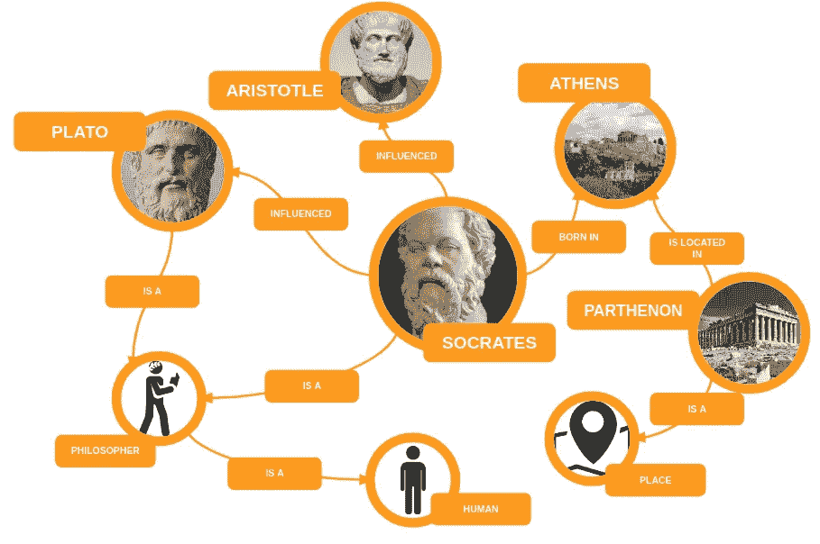

# 知识图表一览

> 原文：<https://towardsdatascience.com/knowledge-graphs-at-a-glance-c9119130a9f0?source=collection_archive---------18----------------------->

## [KGs 洞察](https://towardsdatascience.com/tagged/kgs-insights)

## 利用语义图视角，将人类知识融入智能系统

知识图(KGs)已经成为将人类知识整合到智能系统中的核心抽象。这种知识被编码在基于图的结构中，该结构的节点表示真实世界的实体，而边定义这些实体之间的多种关系。KGs 正受到工业界和学术界的关注，因为它们提供了一种灵活的方式来捕获、组织和查询大量的多关系数据。

这篇文章的目标是介绍 KG 特有的双重视角:

1.  *基于图形的视角*，它允许我们在 kg 上执行图形算法和归纳推理技术；
2.  *基于语义的视角*，它为数据的语义解释提供了一个正式的框架，这对于执行演绎推理是必不可少的。

然后，这篇文章将重点关注与语义视角相关的技术和语言，这些技术和语言支持演绎学习。支持归纳技术的图形视角将在致力于图形表示学习的系列文章中讨论:[https://towardsdatascience.com/tagged/grl-series](https://towardsdatascience.com/tagged/grl-series)。



哲学领域中 KG 的例子

## KGs 的正式定义

F 通常，一公斤可以定义为***G****= {****E****，* ***R*** *，****T****}*，其中 ***G*** 为 a

每个三元组形式化为 *(* ***u*** *，* ***e*** *，****v****)*∊****t***，其中***u***∊***e*在语义体系中，三元组被形式化为一个事实，其中*(***，* ***e*** *，****v****)*对应于 *(* ***其中 ***s*** 和 ***o*** 是两个实体，分别是事实的*主体*和*客体*，而 ***r*** 是连接**s*****和 ***o* 的关系******

*为了阐明这一方面，请考虑下面的例子陈述:“苏格拉底影响了柏拉图。”从图的角度来看，三元组包括“苏格拉底”和“柏拉图”作为图的两个节点，而“受影响”是这两个节点之间的一条边。从语义上看，简单的说法包括“苏格拉底”和“柏拉图”两个实体，而“受影响”是这两个实体之间的关系。实体和关系也可以定义为语句的*术语*。*

## *KG 数据模型*

*资源描述框架(RDF)是语义网(SW)的核心技术，用于实现知识的双重表示。SW 的目的是实现机器可读和可理解的网络级数据基础设施。为了实现这一仅部分实现的愿景，采用了统一资源标识符(URIs)和超文本传输协议(HTTP)等 Web 技术。*

*RDF 反映了一个简单的基于图的数据模型，利用了 Web 技术，并提供了一个正式的意义概念(*语义*)，为有根据的演绎建立了基础。RDF 图可以用不同的格式序列化，包括 N-Triples、N3、Turtle、JSON 和 XML。例子“苏格拉底影响了柏拉图”可以翻译成 RDF，并按 N-Triples 连载如下:*

```
*<[http://dbpedia.org/resource/Socrates](http://dbpedia.org/resource/Socrates)>
<[http://dbpedia.org/ontology/influenced](http://dbpedia.org/ontology/influenced)>
<[http://dbpedia.org/resource/Plato](http://dbpedia.org/resource/Plato)> .*
```

*其他类型的序列化，比如 Turtle，支持使用所谓的前缀对 RDF 事实进行更紧凑的声明。该示例可以重写如下:*

```
*[@prefix](http://twitter.com/prefix) dbo: <[http://dbpedia.org/ontology/](http://dbpedia.org/ontology/)> .
[@prefix](http://twitter.com/prefix) dbr: <[http://dbpedia.org/resource/](http://dbpedia.org/resource/)> .
dbr:Socrates dbo:influenced dbr:Plato .*
```

*从软件的角度来看，术语 ***dbr:Socrates*** ，***dbo:infected****，*和 ***dbr:Plato*** 也被称为*资源*，两个不同资源之间的关系——在本例中为***dbo:infected***——也被称为*谓词*或*这个例子直接来自一个名为 DBpedia 的现有开放 KG，它的目标是以 RDF 三元组集合的形式提供包含在维基百科信息框中的信息。这个集合也可以表示为 *RDF 图*。**

*运行实例表明，URIs 可以作为实体 ***s*** 和 ***o*** 以及关系 ***r*** 的唯一标识。RDF 允许我们表示实体之间的关系，也可以表示与单个实体相关的特定信息。在 RDF 语句中*

```
*dbr:Socrates dbo:birthDate -469-0-0^^xsd:date .*
```

*该对象不是一个实体，而是一个文字值，具有使用 XML 模式数据类型(XSD)定义的特定数据类型。从图的角度来看，一个文字值被认为是 KG 的一个叶节点。从 RDF 表示开始，增加了量化的语句来表示实体和关系的语义。*

## *语义模式和本体*

*DF 模式(RDFS)和 OWL(网络本体语言)是两种不同的语言模型，能够以 RDF 图的形式构建量化的语句。RDFS 是定义 RDF 图语义模式的最重要的标准之一。OWL 是在实际案例中使用的最流行的本体语言，合并和扩展了 RDFs。RDFS 和 OWL 指定了大量的词汇表来表示使用 RDF 节点和边的特殊条件，引入了一致性和特定的数据类型来支持逻辑推理。此外，它们表明术语是如何相互关联的，并强加了一个结构来定义语义解释的约束。*

*DFS 提供了为聚集具有相似特征的实体定义类的机制。为了定义阶级，RDFS 提供了两个不同的术语:*

*   ****rdf:type*** 属性定义了一个主题节点的“类型”；此属性的对象必须是类。在 RDF 中， ***rdf:type*** 也可以替换为***a***；*
*   ****rdfs:Class*** 用于聚合相似的实体。*

*在运行的示例中，可以定义以下语句来扩展与 Socrates 相关的信息:*

```
*ex:Human rdf:type rdfs:Class .
dbr:Socrates rdf:type ex:Human .*
```

*RDFS 还允许用***rdfs:subclass of***属性定义类层次结构。因此，事实的收集可以扩展如下:*

```
*ex:Human rdf:type rdfs:Class .
dbr:Socrates rdf:type ex:Human .
ex:Mortal rdf:type rdfs:Class .
ex:Human rdfs:subClassOf ex:Mortal .*
```

*RDFS 还定义了特定的术语来扩展属性的语义。这些术语包括:*

*   ****rdf:Property→***它是将 ***rdf:type*** 中的任何一个术语用作谓词；*
*   ****rdfs:domain*** 和***rdfs:range***→它们定义属性的域和范围。域和范围被分类为***rdfs:Class***；*
*   ****rdfs:sub property of→***它指定了属性的层次结构。*

*因此，与***dbo:affected***属性相关的信息可以表示如下:*

```
*dbo:influenced rdf:type rdf:Property ;
    rdfs:range ex:Human ;
    rdfs:domain ex:Human .*
```

*WL 是一种描述本体的语言模型。OWL 文档，被称为本体，包含了 RDFS 定义的术语，并添加了进一步的结构来解决其局限性。例如，OWL 明确了不同实体之间的相同或不同的关系。它支持更具表达性的类定义，包括并集、补集、不合集，指定基数限制。此外，它还包括更具表达性的属性定义，支持区分对象和数据类型属性。OWL 还允许我们定义传递的、函数的、对称的和反向的属性，表示值的限制。描述类和属性之间关系的陈述也被称为*公理*。这些陈述在参考领域被归类为*真*，并且是实现演绎推理的基础。*

*运行示例可以用 OWL 扩展如下:*

```
*[@prefix](http://twitter.com/prefix) rdf: <[http://www.w3.org/1999/02/22-rdf-syntax-ns#](http://www.w3.org/1999/02/22-rdf-syntax-ns#)> .
[@prefix](http://twitter.com/prefix) rdfs: <[http://www.w3.org/2000/01/rdf-schema#](http://www.w3.org/2000/01/rdf-schema#)> .
[@prefix](http://twitter.com/prefix) owl: <[http://www.w3.org/2002/07/owl#](http://www.w3.org/2002/07/owl#)> .
[@prefix](http://twitter.com/prefix) ex: <[http://example.com/](http://example.com/)> .
[@prefix](http://twitter.com/prefix) dbr: <[http://dbpedia.org/resource/](http://dbpedia.org/resource/)> .
[@prefix](http://twitter.com/prefix) dbo: <[http://dbpedia.org/ontology/](http://dbpedia.org/ontology/)> .
[@prefic](http://twitter.com/prefic) wkd: <[https://www.wikidata.org/wiki/](https://www.wikidata.org/wiki/)> .# RDF
dbr:Socrates dbo:influenced dbr:Plato ;
    dbo:birthDate -469-0-0^^xsd:date .# RDFS
dbr:Socrates rdf:type ex:Human . 
ex:Human rdf:type rdfs:Class ;
    rdfs:subClassOf ex:Mortal .dbo:influenced rdf:type rdf:Property ;
    rdfs:range ex:Human ;
    rdfs:domain ex:Human .# OWL 
dbr:Socrates owl:sameAs wkd:Q913 .
dbo:influenced rdf:type owl:ObjectProperty .
dbo:birthDate rdf:type owl:DatatypeProperty .
rdfs:subClassOf rdf:type owl:TransitiveProperty .*
```

*这个例子建立了量化的陈述，例如“所有人都会死”从而也让我们通过演绎推理推断出一个新的事实:“苏格拉底是凡人”来源于 ***ex:人类*** 是 ***ex:凡人*** 的子类。在同一个例子中，OWL 语句允许我们声明***dbo:infected***和***dbo:birth date***是两种不同类型的属性，分别是对象属性和数据属性。此外，使用 OWL 可以定义这样一个公理，根据这个公理，***rdfs:subclass of***是一个传递属性。*

## *查询千克*

*一种被称为 SPARQL (SPARQL 协议和 RDF 查询语言)的实用语言已经在软件环境中开发出来，用于在 kg 上执行查询。这种结构化查询语言的核心是基于图形模式的，它遵循相同的 RDF 图形模型。此外，SPARQL 引入了变量作为有效术语。所以图模式分为常量，用 ***dbr:Socrates*** 等资源表示，用 ***等变量表示？哲学家*** ，用问号标识。在查询过程中，根据 RDF 图评估图模式。这个过程在图模式的变量和 RDF 图中的资源之间生成一个映射。然后，这些变量被满足查询中包含的图形模式的 RDF 资源替换。下面是 SPARQL 查询的一个例子:*

```
*[@prefix](http://twitter.com/prefix) dbr: <[http://dbpedia.org/resource/](http://dbpedia.org/resource/)> .
[@prefix](http://twitter.com/prefix) dbo: <[http://dbpedia.org/ontology/](http://dbpedia.org/ontology/)> .SELECT ?philosopher
WHERE {
    dbr:Socrates dbo:influenced ?philosopher .*
```

*考虑到我们运行的例子， ***？哲学家*** 变量替换为资源 ***dbr:柏拉图*** 。*

## *下一步是什么*

*在下一篇文章中，我描述了从结构化的数据源构建知识库的概念性方法，将这些数据源的本地模式映射到由领域本体定义的全局模式。*

*[](/building-knowledge-graphs-from-structured-sources-346c56c9d40e) [## 从结构化来源构建知识图

### 关于集成异构数据所采用的映射方法的说明

towardsdatascience.com](/building-knowledge-graphs-from-structured-sources-346c56c9d40e) 

*如果你喜欢我的文章，你可以支持我使用这个链接*[*https://medium.com/@giuseppefutia/membership*](https://medium.com/@giuseppefutia/membership)*成为中等会员。**