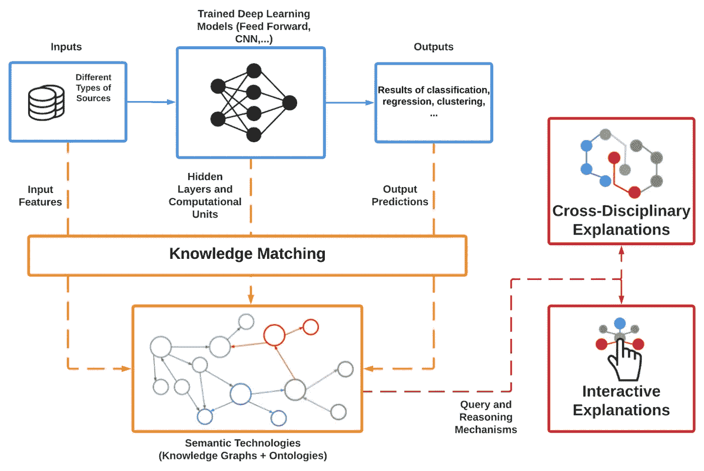

# 可解释人工智能的知识图

> 原文：<https://towardsdatascience.com/knowledge-graphs-for-explainable-ai-dcd73c5c016?source=collection_archive---------21----------------------->

## [KGs 洞察](https://towardsdatascience.com/tagged/kgs-insights)

## 将语义技术和符号系统整合到深度学习模型中，以实现更易于理解的人工智能

一个可解释的人工智能系统的示意图，该系统将语义技术集成到深度学习模型中。人工智能系统的传统管道用蓝色表示。深度学习组件与知识图(kg)和本体的知识匹配过程用橙色描绘。由查询和推理机制实现的跨学科和交互式解释用红色表示。

D eep 学习模型有助于在人工智能(AI)系统的预测和分类任务中取得前所未有的成果。然而，在取得这一显著进步的同时，它们并没有提供人类可以理解的关于具体结果是如何实现的见解。在人工智能对人类生活的影响相关的背景下(例如，招聘工具、医疗诊断等。)，可解释性不仅是一个可取的属性，而且是——或者，在某些情况下，很快将是——一个法律要求。

大多数实现**可解释人工智能(XAI)** 的可用方法都专注于只有能够操纵深度学习算法中数学函数的专家才能使用的技术解决方案。一种互补的方法由**符号人工智能**代表，其中符号是人类和深度学习之间通用语言的元素。在这种背景下，**知识图(KGs)** 及其底层语义技术是符号人工智能的现代实现——虽然与深度学习模型相比，KGs 不太灵活，对噪声也不太鲁棒，但 KGs 天生就被开发为可解释的。

## 当前 XAI 的局限与 KGs 的机遇

XAI 是数学家、计算机科学家和软件工程师设计、开发和测试技术的研究领域，旨在使人工智能系统更加透明，更容易被利益相关者理解。在该领域开发的大多数方法**需要非常具体的技术专业知识来操纵算法**，这些算法在深度学习的基础上实现数学功能。此外，理解这种数学支架不足以洞察内部工作模型。事实上，为了更容易理解，基于深度学习的系统应该能够**发出和操纵符号**，使用户能够解释如何实现特定的结果。

在符号系统的背景下，KGs 及其底层语义技术是解决可理解性问题的一个有希望的解决方案。事实上，这些语义实体和关系的大型网络为几个推理机制提供了有用的主干，从**一致性检查**到**因果推理**。这些推理过程由**本体**实现，它提供了与特定知识领域相关的语义实体和关系的正式表示。

## KGs 在建设美好 XAI 中的作用

基于语义技术的符号系统的实现适合于改进对非内部人员的解释。深度学习模型的输入特征、隐含层和计算单元、预测输出可以映射成 KGs 的实体或本体的概念和关系( ***知识匹配*** )。传统上，这些本体工件是来自不同学科的专家采用的概念化和实践的结果，例如生物学、金融和法律。因此，即使他们没有人工智能技术方面的技能，他们也非常容易被具有特定领域专业知识的人理解( ***跨学科解释*** )。此外，在语义技术的上下文中，知识和本体是为查询而生的，因此它们能够为用户请求提供答案( ***交互式解释*** )并提供符号级别来解释深度学习模型的行为和结果。

从这些点出发，XAI 的未来工作有具体的轨迹，包括利用符号技术来设计新颖的深层神经架构，以本地编码解释；**多模态解释模型**的开发，该模型能够从不同的角度提供洞察力，结合视觉和文本人工制品；定义一个**通用解释框架**，用于深度学习模型比较，基于知识和本体，以实现适当的验证策略。

# 参考

关于这个主题的更多信息可以在我们的[期刊文章](https://www.mdpi.com/2078-2489/11/2/122/htm)中找到，标题为“**关于将知识图整合到深度学习模型中以获得更容易理解的人工智能——未来研究的三个挑战**”。

*如果你喜欢我的文章，你可以支持我使用这个链接***成为中等会员。**