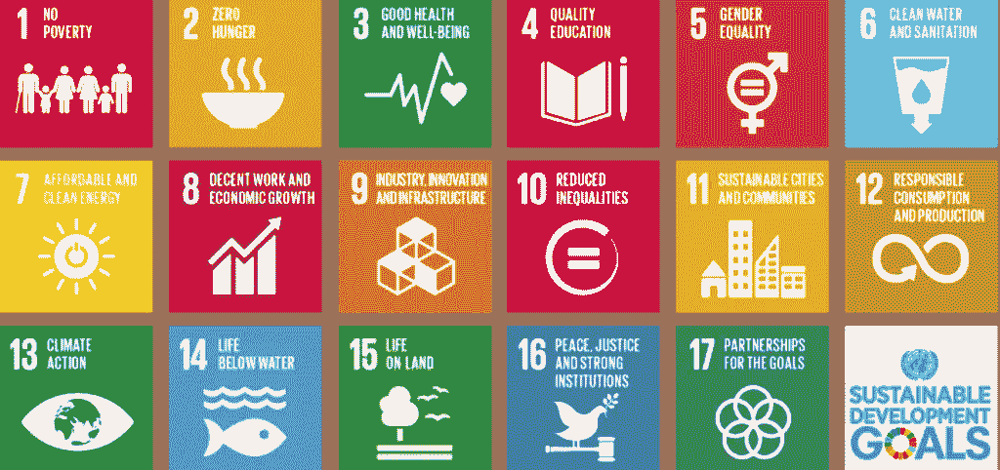

# 社会公益知识图表讲习班:帮助联合国实现可持续发展目标

> 原文：<https://towardsdatascience.com/knowledge-graphs-for-social-good-workshop-helping-the-united-nations-achieve-sustainable-a18fa338731?source=collection_archive---------24----------------------->

2015 年制定的联合国可持续发展目标(SDGs)是 17 个全球共同目标的集合，旨在到 2030 年改善全球人民的健康和福祉。17 个目标有 169 个具体目标。每个目标有 1 至 3 个指标，用于衡量实现目标的进展情况。联合国与来自 70 个国家的代表进行了一系列“全球对话”，以决定 SDG。

埃森哲实验室与联合国合作，正在组织社会公益知识图表研讨会，以帮助联合国利用知识图表创建和探索技术，深入了解可持续发展目标。我们正在以合作构思练习的形式汇集参与者的专业知识，为联合国提出建议，并确定未来可能的研究方向。

# 当前为实现可持续发展目标所做的努力

联合国内部有许多与可持续发展目标相关的令人兴奋的工作。为此，联合国成立的组织全球脉动实验室(Global Pulse Lab)目前正在研究实时分析大数据的手段和方法。这意味着联合国可以利用人工智能和人工智能来发现数据中的模式，推断数据内容，并迅速获得洞察力，毫不延迟地采取行动。示例项目包括(但不限于):

通勤统计—针对 SDG 11，可持续发展城市和社区，该项目使用地理定位和社交媒体标签来了解市民的通勤模式。这一分析得出的见解正被用来填补官方通勤统计数据的空白。

气候异常——针对 SDG 13“气候行动”,该项目使用卫星图像跟踪气候异常，为决策者提供早期气候预警。

Pulse Labs 的其他细节和项目包括 SDG 2——零饥饿、SDG 4——质量行动和 SDG 5——性别平等。

联合国正在开展的工作得到了其他机构的补充，这些机构正在采取措施确定可能与多个可持续发展目标相关的共同主题。比如，2016 EAT Stockholm 食品论坛的主题演讲认为，所有的可持续发展目标都可以直接或间接地与食品联系起来。还说明了如何将可持续发展目标分成更广泛的类别，例如:生物圈、社会和经济。

当今世界比以往任何时候都更加相互关联，实现目标指标所定义的可持续发展目标的进展反映了这种相互关联。如果表示和连接 SDG 的解决方案的开发取得进展，更大的洞察力就在掌握之中。这项工作将为我们提供探索联系和数据背景以及衡量一个 SDG 对另一个 SDG 的影响的能力。

# 为什么是知识图表？

图表用关系映射数据，而 SDG 则有个人在健康、贫困、社会和经济等方面的数据。因此，当他们测量相同的人群时，从一个 SDG 到另一个 SDG 开始提供数据上下文和数据的语义理解是一个自然的过渡。知识图可以提供带有语义上下文的数据覆盖，同时表示来自非结构化和结构化来源的概念。随着数据量的增长，对领域的语义理解会加深和拓宽。

NLP 的最新进展是从非结构化数据中提取知识，在语义上连接它们，并预测缺失的链接，这有助于构建全面的知识图。将知识图与这些先进的 NLP 技术结合使用，为研究 SDG 提供了一个令人兴奋的机会。此外，这一方法允许研究人员和决策者衡量干预和全球事件在可持续发展目标内部和之间的影响。知识图表将让我们深入了解:

*   来自一个或多个可用数据集的每个 SDG 的语义表示
*   在 SDG 内部和之间包含新的或现有关系的广泛表示
*   通过识别或预测领域空间内或跨领域空间的干预效果，实现可持续发展目标内部和之间的数据连接

知识图将各个数据仓库之间的点连接起来，可以在语义上表示非结构化和结构化数据。它是一种粘合剂，可以将数据、概念、关系和属性结合在一起。

本次研讨会将展示使用知识图对可持续发展目标的影响，也将有助于为各种其他领域设定类似的方向。

# 更多关于社会公益知识图表研讨会的详细信息

本次研讨会将探讨如何利用知识图表来实现联合国的 [17 项可持续发展目标(SDGs)，](https://www.un.org/sustainabledevelopment/sustainable-development-goals/)涵盖的主题包括贫困、医疗保健、教育、可持续发展等。在知识图创建、数据填充和应用的新的可扩展技术的背景下。

它将汇聚一群实践者和决策者，讨论可以解决可持续发展目标的正在进行的行业工作和学术研究成果。

此外，它将基于已提交的论文(请参见“[征集论文”](https://knowledgegraphsocialgood.pubpub.org/callforpapers)了解更多详细信息)，并建立一个社区和论坛来公开讨论解决方案。

我们将提供杰出演讲者、联合国数据和专家的访问权限。会议将在协作构思练习中达到高潮，旨在促进关于可持续发展目标的现场小组集思广益会议，并讨论有助于联合国利用知识图表解决方案实现这些目标的潜在解决方案。

# 参考

[https://www . the guardian . com/global-development/2015/Jan/19/sustainable-development-goals-United nations](https://www.theguardian.com/global-development/2015/jan/19/sustainable-development-goals-united-nations)

[https://www . Stockholm resilie . org/research/research-news/2016-06-14-how-food-connects-all-the-sdgs . html](https://www.stockholmresilience.org/research/research-news/2016-06-14-how-food-connects-all-the-sdgs.html)

[https://medium . com/age-of-awareness/implementing-the-sdgs-Gaia-education-UNESCO-collabove-in-training-multipliers-821 e63 D5 f 473](https://medium.com/age-of-awareness/implementing-the-sdgs-gaia-education-unesco-collaborate-in-training-multipliers-821e63d5f473)

[https://medium . com/pulse-lab-Jakarta/tracking-the-sdgs-using-big-data-dad 0ad 351 f2e](https://medium.com/pulse-lab-jakarta/tracking-the-sdgs-using-big-data-dad0ad351f2e)

[http://www . human sphere . org/world-politics/2015/05/gates-foundation-says-it-does-support-the-un-development-agenda/](http://www.humanosphere.org/world-politics/2015/05/gates-foundation-says-it-does-support-the-un-development-agenda/)

[https://medium . com/@ OECD/where-to-start-the-the-sdgs-FD 825 f 256 CCE](https://medium.com/@OECD/where-to-start-with-the-sdgs-fd825f256cce)

[https://medium . com/@ OneYoungWorld _/what-the-business-case for-the-sdgs-4a 8402 f 9 ffd 7](https://medium.com/@OneYoungWorld_/what-is-the-business-case-for-the-sdgs-4a8402f9ffd7)

[https://medium . com/@ UNDP/stopping-the-leak-boosting-sdgs-40c 96026 aa 89](https://medium.com/@UNDP/stopping-the-leak-boosting-the-sdgs-40c96026aa89)