# 自我监督学习中的知识转移

> 原文：<https://towardsdatascience.com/knowledge-transfer-in-self-supervised-learning-680208f2092f?source=collection_archive---------40----------------------->

自我监督学习是一个有趣的研究领域，其目标是在没有任何人工注释的情况下从无标签数据中学习丰富的表示。

这可以通过创造性地公式化一个问题来实现，比如你使用数据本身的一部分作为标签，并试图预测它。这样的公式被称为借口任务。

例如，您可以设置一个托词任务，在给定灰度版本的情况下预测图像的彩色版本。同样，您可以移除图像的一部分，并训练一个模型从周围环境中预测该部分。还有很多这样的[借口任务](https://amitness.com/2020/02/illustrated-self-supervised-learning/)。

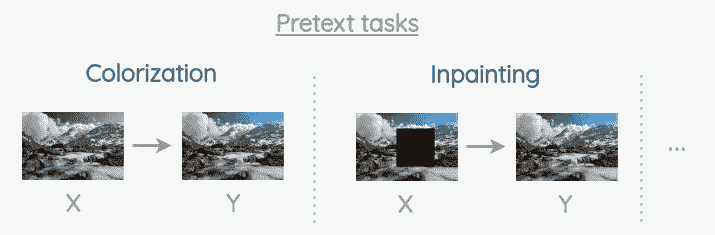

*作者图片*

通过在借口任务上的预训练，希望模型将学习有用的表示。然后，我们可以对模型进行微调，以完成下游任务，如图像分类、对象检测和语义分割，只需一小组已标记的训练数据。

# 评估表示的挑战

所以借口任务可以帮助我们学习表征。但是，这提出了一个问题:

> *如何确定一个有学问的表征有多好？*

目前，衡量表示的标准方法是在一组标准任务和基准数据集上进行评估。

*   **线性分类**:使用冻结特征的图像网络分类
*   **低数据状态**:仅使用 1%到 10%数据的 ImageNet 分类
*   **迁移学习**:PASCAL VOC 上的对象分类、对象检测和语义分割

我们可以看到，上述评估方法要求我们对借口任务和目标任务使用相同的模型架构。

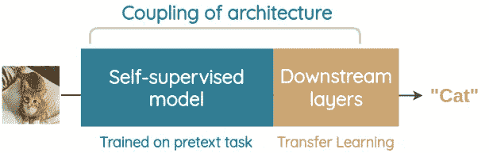

*作者图片*

这带来了一些有趣的挑战:

1.  对于借口任务，我们的目标是在大规模的未标记数据集上学习，因此更深的模型(例如 ResNet)将帮助我们学习更好的表示。
2.  但是，对于下游任务，我们更喜欢实际应用的浅层模型(例如 AlexNet)。因此，我们目前在设计借口任务时必须考虑这一限制。
3.  如果一些方法使用更简单的架构，而另一些方法使用更深入的架构，那么就很难公平地比较哪种前文本任务更好。
4.  我们无法将从托词任务中学到的表征与手工制作的特征(如 HOG)进行比较。
5.  我们可能希望在借口任务中利用几个数据域，如声音、文本和视频，但目标任务可能会限制我们的设计选择。
6.  在托词任务上训练模型可能学到对一般视觉识别没有用的额外知识。目前，最终的特定于任务的层被忽略，并且仅取特定卷积层的权重或特征。

# 知识转移

Noroozi 等人在 2018 年的论文[“通过知识转移促进自我监督学习”](https://arxiv.org/abs/1805.00385)中提出了一个简单的想法来解决这些问题。

# 直觉

作者观察到，在一个好的表示空间中，语义相似的数据点应该靠得很近。

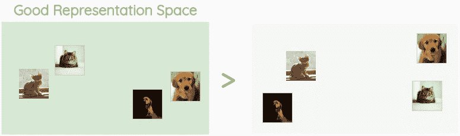

*作者图片*

在常规的监督分类中，图像语义相似的信息通过由人标注的标签来编码。在这种标签上训练的模型将具有对语义相似的图像进行分组的表示空间。

因此，对于自我监督学习中的文本前任务，目标是隐含地学习使相同类别图像相似而不同类别图像不相似的度量。因此，如果我们能够以某种方式将语义相关的图像编码到相同的标签，我们可以提供对所学习的表示的鲁棒估计。

# 总体框架

作者提出了一个新的框架，将知识从深度自我监督模型转移到一个独立的浅层下游模型。您可以为借口任务和下游任务使用不同的模型架构。

**关键创意:**

> *对来自托词任务的特征进行聚类，并分配聚类中心作为未标记图像的伪标记。然后，在伪标签上重新训练具有目标任务架构的小网络，以预测伪标签并学习新颖的表示。*

端到端流程描述如下:

## 1.借口任务

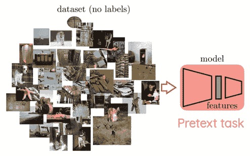

照片来自[诺鲁齐等人](https://arxiv.org/abs/1805.00385)

在这里，我们选择一些深度网络架构，并在一些数据集上根据我们选择的一些借口任务来训练它。在模型被训练之后，我们可以从一些中间层提取特征。

## 2.k 均值聚类

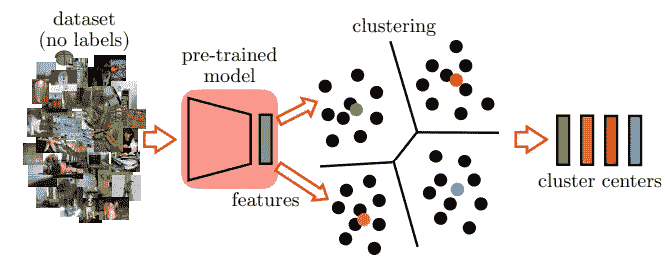

照片来自[诺鲁齐等人](https://arxiv.org/abs/1805.00385)

对于数据集中所有未标记的图像，我们从借口任务模型计算特征向量。然后，我们运行 K-means 聚类来分组语义相似的图像。其想法是，聚类中心将与 ImageNet 中的类别保持一致。

在论文中，作者在一个 Titan X GPU 上运行 K-means 4 小时，将 130 万张图像聚类成 2000 个类别。

## 3.伪标记

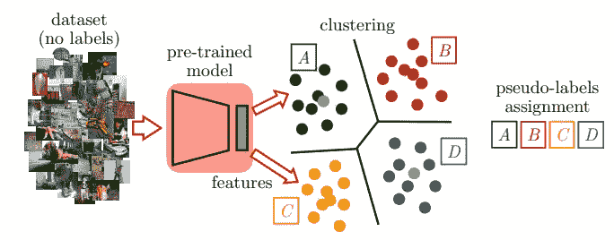

照片来自[诺鲁齐等人](https://arxiv.org/abs/1805.00385)

聚类中心被视为伪标签。我们可以使用与上述步骤相同的数据集，也可以使用不同的数据集本身。然后，我们计算这些图像的特征向量，并为每个图像找到最近的聚类中心。该聚类中心被用作伪标签。

## 4.伪标签训练

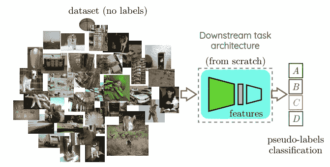

照片来自[诺鲁齐等人](https://arxiv.org/abs/1805.00385)

我们采用将用于下游任务的模型架构，并训练它将未标记的图像分类到伪标记中。因此，目标架构将学习新的表示，使得它将在预训练的特征空间中最初接近的图像映射到接近点。

# 知识转移的优势

我们看到了如何通过对特征进行聚类，然后使用伪标签，我们可以将来自任何借口任务表示的知识带入像 AlexNet 这样的公共参考模型。

因此，我们现在可以轻松地比较不同的托辞任务，即使它们使用不同的体系结构和不同的数据域进行培训。这也允许我们通过使用深度模型和挑战借口任务来改进自我监督的方法。

# 这个框架的效果如何？

为了定量评估这一想法，作者进行了如下实验:

# a.增加借口任务的复杂性(Jigsaw++)

为了评估他们的方法，作者进行了一项名为“拼图”的古老的类似拼图的借口任务，其中我们需要预测用于随机洗牌 3*3 正方形图像网格的排列。

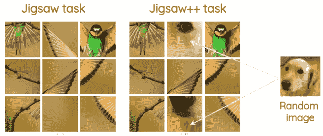

照片来自[诺鲁齐等人](https://arxiv.org/abs/1805.00385)

他们通过在一些随机位置用另一张随机图像的瓷砖随机替换 0 到 2 个瓷砖来扩展这项任务。这增加了难度，因为现在我们需要仅使用剩余的补丁来解决问题。新的托辞任务被称为“Jigsaw++”。

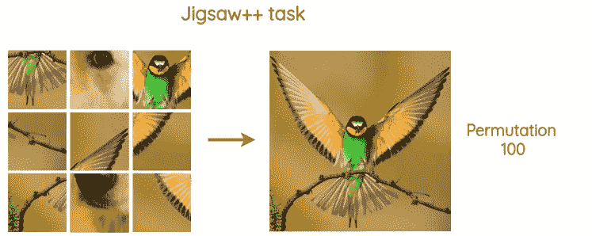

照片来自[诺鲁齐等人](https://arxiv.org/abs/1805.00385)

在论文中，他们使用了 701 个最小汉明距离为 3 的排列。它们在每个图像块上独立地应用平均值和标准偏差归一化。他们还使图像在 70%的时间内灰度化，以防止网络用低级统计数据作弊。

# b.使用更深层次的网络来解决借口任务

作者使用 VGG-16 解决借口任务和学习表征。随着 VGG-16 的容量增加，它可以更好地处理“拼图++”任务的复杂性增加，从而提取更好的表示。

# c.将知识传回 AlexNet

来自 VGG-16 的代表被聚类，聚类中心被转换成伪标签。然后，训练 AlexNet 对伪标签进行分类。

# d.在评估数据集上微调 AlexNet

对于下游任务，用来自伪标签分类的权重初始化 AlexNet 模型的卷积层，并且随机初始化完全连接的层。然后，预训练的 AlexNet 在各种基准数据集上进行微调。

# e.结果

使用像 VGG-16 这样的更深层次的网络会导致更好的表示和伪标签，也会在基准测试任务中产生更好的结果。它在 2018 年的几个基准测试中获得了最先进的结果，并进一步缩小了监督和自我监督方法之间的差距。

## 1.PASCAL VOC 的迁移学习

作者在 PASCAL VOC 2007 数据集上测试了他们的方法，并在 PASCAL VOC 2012 数据集上测试了他们的方法。

## 洞察力

*   用 VGG16 训练 Jigsaw++并使用 AlexNet 预测聚类给出了最好的性能。
*   切换到具有挑战性的托词任务“Jigsaw++”比“Jigsaw”提高了性能。
*   在 Jigsaw++和下游任务中使用相同架构 AlexNet 时，知识转移不会产生显著影响。

## 2.ImageNet 上的线性分类

在这种情况下，线性分类器在不同的卷积层上根据从 AlexNet 提取的特征进行训练。对于 ImageNet，使用 VGG-16 并使用聚类将知识转移到 AlexNet 会带来 2%的大幅提升。

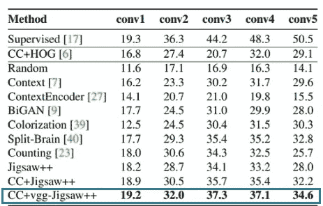

照片来自[诺鲁齐等人](https://arxiv.org/abs/1805.00385)

## 3.ImageNet 上的非线性分类

对于非线性分类器，使用 VGG-16 并使用聚类将知识转移到 AlexNet 会在 ImageNet 上给出最佳性能。

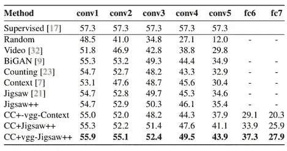

照片来自[诺鲁齐等人](https://arxiv.org/abs/1805.00385)

# 论文中的其他见解

## 1.集群数量如何影响性能？

网络不会受到集群数量的显著影响。作者测试了 AlexNet 在对象检测任务中对来自不同数量集群的伪标签进行的训练。

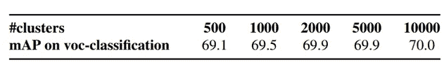

照片来自[诺鲁齐等人](https://arxiv.org/abs/1805.00385)

## 2.这和知识蒸馏有什么不同？

知识转移与知识升华有着本质的不同。这里，目标是只保留来自表示的图像的聚类关联，并将其转移到目标模型。不像蒸馏，我们不对老师的确切输出做任何回归。

## 3.你能在聚类和预测伪标签中使用不同的数据集吗？

是的，这种方法很灵活，你可以在一个数据集上进行预训练，在另一个数据集上进行聚类，并为第三个数据集获取伪标签。

作者做了一个实验，他们在 ImageNet 的表示上训练聚类，然后在“位置”数据集上计算聚类中心，以获得伪标签。对象分类的性能仅略有下降(-1.5%)。

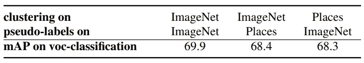

照片来自[诺鲁齐等人](https://arxiv.org/abs/1805.00385)

# 结论

因此，知识转移是一种简单而有效的方式来将表示从深层模型映射到浅层模型。

# 参考

*   Mehdi Noroozi 等人，[“通过知识转移促进自我监督学习”](https://arxiv.org/abs/1805.00385)
*   Mehdi Noroozi 等人，[“通过解决拼图游戏对视觉表征的无监督学习”](https://arxiv.org/abs/1603.09246)
*   景岛乐·冈野原等，[“一个带有伪否定样本的判别性语言模型”](https://www.aclweb.org/anthology/P07-1010/)

*原载于 2020 年 10 月 4 日 https://amitness.com**[*。*](https://amitness.com/knowledge-transfer/)*