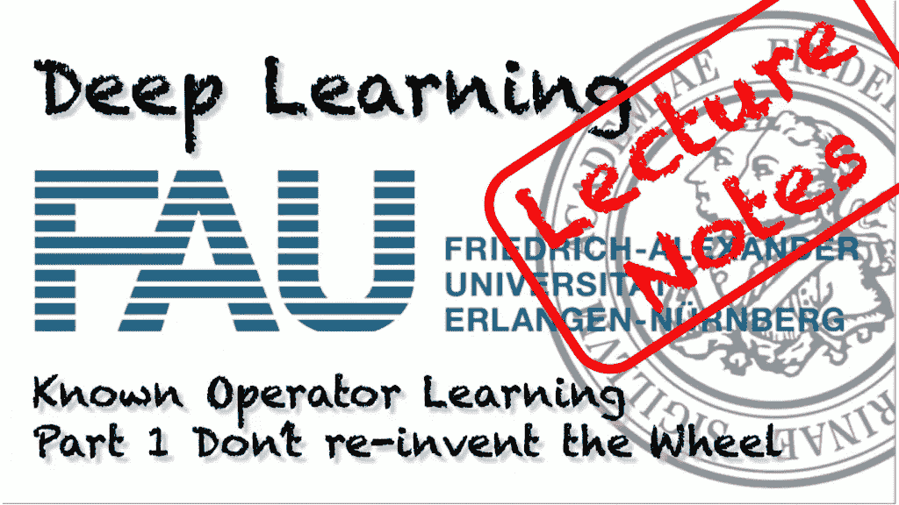
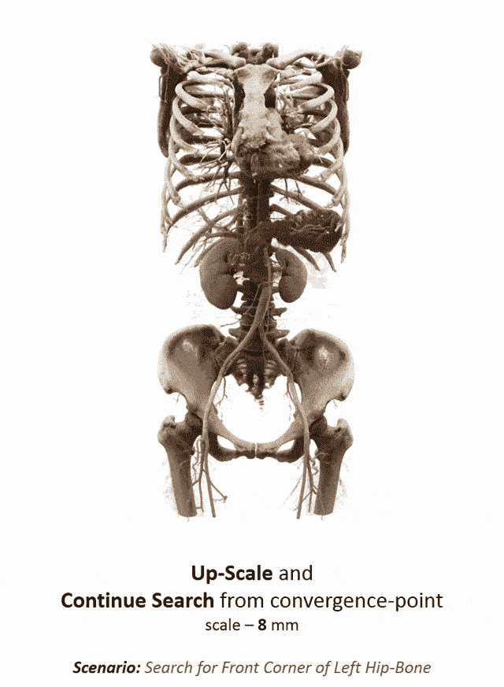
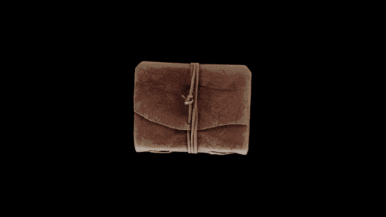
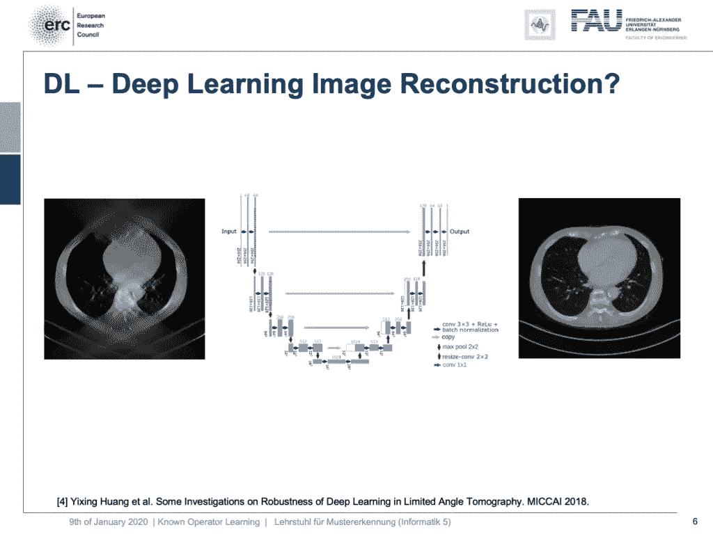
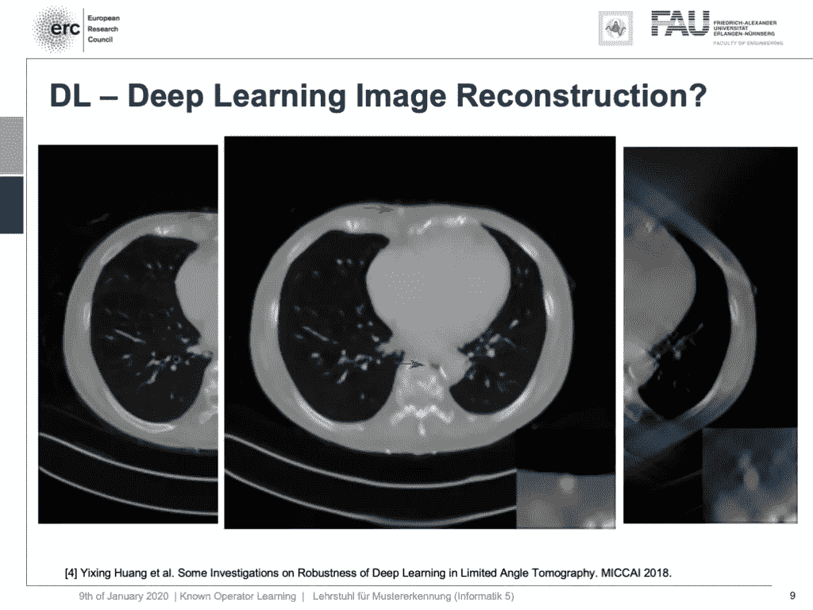
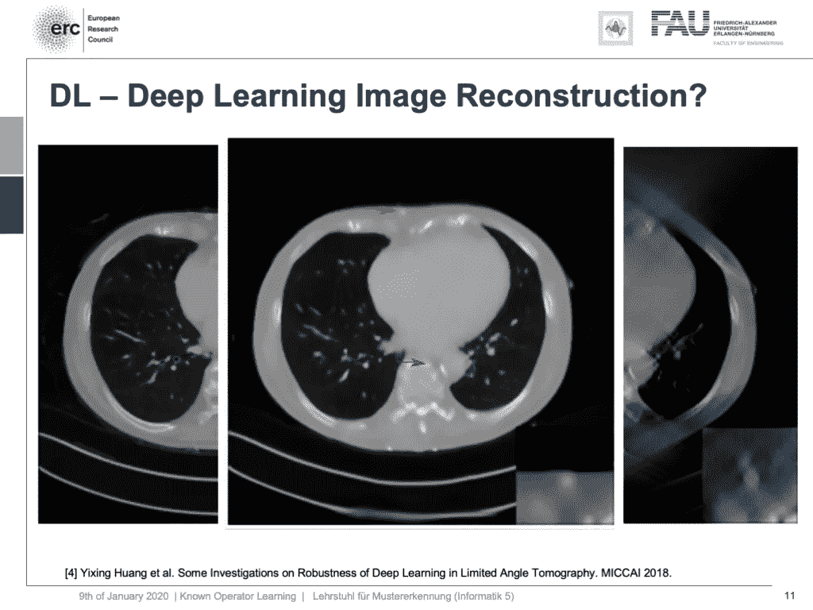
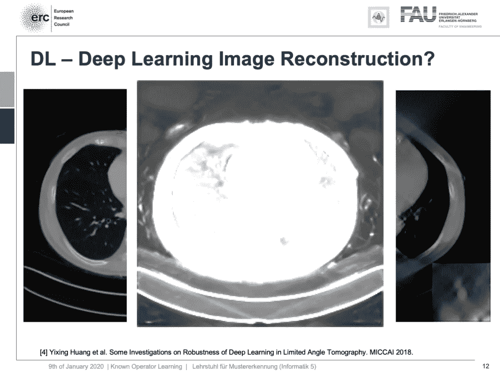

# 已知操作员学习—第 1 部分

> 原文：<https://towardsdatascience.com/known-operator-learning-part-1-32fc2ea49a9?source=collection_archive---------53----------------------->

## [FAU 讲座笔记](https://towardsdatascience.com/tagged/fau-lecture-notes)关于深度学习

## 不要重新发明轮子

FAU 大学的深度学习。下图 [CC BY 4.0](https://creativecommons.org/licenses/by/4.0/) 来自[深度学习讲座](https://www.youtube.com/watch?v=p-_Stl0t3kU&list=PLpOGQvPCDQzvgpD3S0vTy7bJe2pf_yJFj&index=1)

**这些是 FAU 的 YouTube 讲座** [**深度学习**](https://www.youtube.com/watch?v=p-_Stl0t3kU&list=PLpOGQvPCDQzvgpD3S0vTy7bJe2pf_yJFj&index=1) **的讲义。这是与幻灯片匹配的讲座视频&的完整抄本。我们希望，你喜欢这个视频一样多。当然，这份抄本是用深度学习技术在很大程度上自动创建的，只进行了少量的手动修改。** [**自己试试吧！如果您发现错误，请告诉我们！**](http://autoblog.tf.fau.de/)

# 航行

[**上一讲**](/graph-deep-learning-part-2-c6110d49e63c) **/** [**观看本视频**](https://youtu.be/nauVuIMyb1M) **/** [**顶级**](/all-you-want-to-know-about-deep-learning-8d68dcffc258) **/** [**下一讲**](/known-operator-learning-part-2-8c725b5764ec)

欢迎回到深度学习，所以今天，我想和你们谈谈关于我们如何重用先前的知识并将其整合到深度网络中的想法。这实际上是我们在一个由欧洲研究委员会资助的大型研究项目中一直在做的事情，我想这些想法也会让你感兴趣。

什么是已知算子学习？来源；[推特](https://twitter.com/maier_ak/status/1188007249798717440?s=20)。图像在[下 CC 乘 4.0](https://creativecommons.org/licenses/by/4.0/)

所以，我决定把他们包括在讲座中。这就把我们带到了已知算子学习的话题。已知算子学习是一种非常不同的方法，因为我们试图重用我们已经拥有的关于问题的知识。因此，我们必须学习更少的参数。这与我们从传统深度学习中了解的情况形成了鲜明对比。如果你说这么传统的深度学习，那么我们往往试图从数据中学习一切。现在，我们想从数据中了解一切的原因当然是因为我们对网络实际上应该是什么样子知之甚少。因此，我们试图从数据中学习一切，以消除偏见。特别是对于感知任务来说，我们对人类如何解决问题知之甚少。对我们来说，人脑在很大程度上是一个黑盒，我们试图找到一个匹配的黑盒来解决问题。

强化学习允许类似放射科医生的标志检测。图片由 Florin Ghesu 提供。

我从 Florin Ghesu 那里拿来了这个例子，你记得，我已经在[简介](https://youtu.be/zRPNPC3mJ9w)中展示过了。这里，我们有这种强化学习类型的方法，然后我们通过强化学习来激励我们对身体器官的搜索。我们查看图像中的小块，然后决定下一步移动到哪里，以接近特定的地标。因此，我们可以在这里介绍我们如何解读图像，或者放射科医师如何解读图像，以及他将如何走向某个标志。当然，我们有这种多尺度的方法。当然，我们这样做的主要原因是，因为我们不知道大脑实际上是如何工作的，也不知道放射科医生实际上在想什么。但是我们至少可以模仿他的工作方式来处理这个问题。嗯，但是一般来说并不是所有的问题都是这样。深度学习如此受欢迎，以至于它被应用于许多许多不同的问题，而不是感知任务。

在图像重建中，我们有很多关于这个问题的先验知识。来自[深度学习讲座](https://www.youtube.com/watch?v=p-_Stl0t3kU&list=PLpOGQvPCDQzvgpD3S0vTy7bJe2pf_yJFj&index=1)的 [CC BY 4.0](https://creativecommons.org/licenses/by/4.0/) 下的图片。

例如，人们一直用它来模拟 CT 重建。因此，这里的问题是，你有一组投影数据显示在左边，你想重建切片数据显示在右手边。

CT 还能让书不打开就可读。使用 [gifify](https://github.com/vvo/gifify) 创建的图像。来源: [YouTube](https://youtu.be/q67HOVpLub0) 。

这个问题已经研究得很透彻了。自 1917 年以来，我们已经知道这个问题的解决方案，但是，当然，还有伪像和图像质量等问题，动力学使这个问题变得困难。因此，我们希望找到改进的重建方法。

U-net 也会解决图像重建吗？来自[深度学习讲座](https://www.youtube.com/watch?v=p-_Stl0t3kU&list=PLpOGQvPCDQzvgpD3S0vTy7bJe2pf_yJFj&index=1)的 [CC BY 4.0](https://creativecommons.org/licenses/by/4.0/) 下的图片。

例如，有一个问题叫做有限角度问题。如果我们只旋转比如说 120 度，而不是完全旋转，你会得到像左边这样的切片图像。它们充满了伪像，你几乎看不到图像上显示的内容。我们在右边有匹配的切片图像。如果你看右边的图片，你可以看到这是一个贯穿躯干的切口。它展示了肺，展示了心脏，展示了脊柱，以及前面的肋骨。我们在左边的图像中几乎看不到肋骨和脊柱，但是我们有方法可以完成图像到图像的转换。我们已经看到，我们甚至可以用它来修补图像中缺失的信息。那么为什么不直接用它来完成重建呢？这实际上已经做到了。

初步结果令人印象深刻。 [CC 下的图片来自](https://creativecommons.org/licenses/by/4.0/)[深度学习讲座](https://www.youtube.com/watch?v=p-_Stl0t3kU&list=PLpOGQvPCDQzvgpD3S0vTy7bJe2pf_yJFj&index=1)的 4.0 。

我可以给你看一个结果。所以，这确实有效。这是为一个看不见的人做的。所以，这是用另外 10 个人的切片训练的，在第 11 个人的切片上进行评估。所以，这个人从来没有被见过，你可以看到它很好地重建了肋骨，躯干，胸壁在输入图像中几乎看不到。我们在这里也可以看到一个非常好看的外观。所以，这很酷。但是说实话:这是医学图像。人们在这上面做诊断。

让我们尝试在数据中隐藏一个模拟病变(红色箭头)。左图显示全扫描，右图显示网络输入。 [CC 下的图片来自](https://creativecommons.org/licenses/by/4.0/)[深度学习讲座](https://www.youtube.com/watch?v=p-_Stl0t3kU&list=PLpOGQvPCDQzvgpD3S0vTy7bJe2pf_yJFj&index=1)的 4.0 。

所以，让我们来测试一下，隐藏一个损伤。所以，我们把它放在胸壁这里，这有点意思，因为这正是我们图像质量最差的地方。我还在右下角展示了一个放大的视图，所以你可以看到病变就在那里，它的对比度比周围的组织要高得多。现在，如果我给你看这个，你可以看到我们将在右边显示给 U-net 的输入。所以，你可以看到病变在放大的视图中几乎看不见。你可以看到它，但是它有很多人造物品。现在，问题是它会被保留还是会从图像中删除？

病变被正确重建(红色箭头)，但也在心脏中引入了一个奇怪的孔(蓝色箭头)。来自[深度学习讲座](https://www.youtube.com/watch?v=p-_Stl0t3kU&list=PLpOGQvPCDQzvgpD3S0vTy7bJe2pf_yJFj&index=1)的 [CC BY 4.0](https://creativecommons.org/licenses/by/4.0/) 下的图片。

嗯，就在那里！你可以看到病变在这里。这很酷，但是你也可以看到蓝色的箭头。以前没有一个洞。所以不知何故，这也有点令人不安。因此，正如你在[4]中看到的，我们实际上研究了更多的细节和鲁棒性。

噪音使整个系统失去平衡，并使胸壁移动约 1 厘米。 [CC 下的图片来自](https://creativecommons.org/licenses/by/4.0/)[深度学习讲座](https://www.youtube.com/watch?v=p-_Stl0t3kU&list=PLpOGQvPCDQzvgpD3S0vTy7bJe2pf_yJFj&index=1)的 4.0 。

我们对这类网络进行了对抗性攻击。最令人惊讶的对抗性攻击实际上是如果你提供泊松噪声，这种噪声实际上会出现在投影数据中。然后，你得到这个。如果我现在前后移动一点，你可以看到胸壁移动了大约 1 厘米。这仍然是一个吸引人的图像，但病变完全消失了，我们所做的唯一的事情是我们在输入数据中添加了一点噪声。当然，它之所以中断这么多，是因为我们从未用噪声进行过训练，网络也从未见过这些噪声模式。这就是它坏掉的原因。

噪音增强有帮助。 [CC 下的图片来自](https://creativecommons.org/licenses/by/4.0/)[深度学习讲座](https://www.youtube.com/watch?v=p-_Stl0t3kU&list=PLpOGQvPCDQzvgpD3S0vTy7bJe2pf_yJFj&index=1)的 4.0 。

因此，如果我们将泊松噪声添加到输入数据中，您也可以看到我们得到了更好的结果。胸壁在它应该在的地方，但是我们的损伤不像以前那么清楚了。老实说，如果你在这上面做医学诊断，那会非常困难，因为你根本不知道文物在哪里，因为文物看起来不再是人造的了。所以你不能很好的认出他们。

局部最小值可以在适当的重建算法中产生。来自[深度学习讲座](https://www.youtube.com/watch?v=p-_Stl0t3kU&list=PLpOGQvPCDQzvgpD3S0vTy7bJe2pf_yJFj&index=1)的 [CC BY 4.0](https://creativecommons.org/licenses/by/4.0/) 下的图片。

顺便说一下，你记得我们在优化过程中必须处理局部极小值。在一次训练中，我们得到了一个可以产生像这样的图像的网络。所以，我们现在调整到病人的背景。你可以看到这种网络开始在病人旁边的空气中画出像肝脏和肾脏这样的器官形状。所以，你可能要考虑一下，在图像重建上进行完全黑盒学习是否是一个好主意。

在这个深度学习讲座中，更多令人兴奋的事情即将到来。 [CC 下的图片来自](https://creativecommons.org/licenses/by/4.0/)[深度学习讲座](https://www.youtube.com/watch?v=p-_Stl0t3kU&list=PLpOGQvPCDQzvgpD3S0vTy7bJe2pf_yJFj&index=1)的 4.0 。

这就是为什么我们下次会谈到一些想法，将先前的知识整合到我们的深层网络中。所以，我希望你喜欢这个视频，我希望能在下一个视频中见到你。拜拜。

如果你喜欢这篇文章，你可以在这里找到更多的文章，或者看看我们的讲座。如果你想在未来了解更多的文章、视频和研究，我也会很感激关注 [YouTube](https://www.youtube.com/c/AndreasMaierTV) 、 [Twitter](https://twitter.com/maier_ak) 、[脸书](https://www.facebook.com/andreas.maier.31337)或 [LinkedIn](https://www.linkedin.com/in/andreas-maier-a6870b1a6/) 。本文以 [Creative Commons 4.0 归属许可](https://creativecommons.org/licenses/by/4.0/deed.de)发布，如果引用，可以转载和修改。如果你有兴趣从视频讲座中获得文字记录，试试[自动博客](http://autoblog.tf.fau.de/)。

# 谢谢

非常感谢 Fu、Florin Ghesu、Yixing Huang Christopher Syben、Marc Aubreville 和 Tobias Würfl 对制作这些幻灯片的支持。

# 参考

[1] Florin Ghesu 等人,《不完整 3D-CT 数据中的鲁棒多尺度解剖标志检测》。医学图像计算和计算机辅助干预 MICCAI 2017 (MICCAI)，加拿大魁北克省，2017 年第 194–202 页— MICCAI 青年研究员奖
[2] Florin Ghesu 等人，用于 CT 扫描中实时 3D-Landmark 检测的多尺度深度强化学习。IEEE 模式分析与机器智能汇刊。印刷前的 ePub。2018
[3] Bastian Bier 等，用于骨盆创伤手术的 X 射线变换不变解剖标志检测。MICCAI 2018 — MICCAI 青年研究员奖
[4]黄宜兴等.深度学习在有限角度层析成像中鲁棒性的一些研究。MICCAI 2018。
[5] Andreas Maier 等《精确学习:神经网络中已知算子的使用》。ICPR 2018。
[6]托比亚斯·维尔福尔、弗罗林·盖苏、文森特·克里斯特莱因、安德烈亚斯·迈尔。深度学习计算机断层扫描。MICCAI 2016。
[7] Hammernik，Kerstin 等，“一种用于有限角度计算机断层成像重建的深度学习架构。”2017 年医学杂志。施普林格观景台，柏林，海德堡，2017。92–97.
[8] Aubreville，Marc 等，“助听器应用的深度去噪”2018 第 16 届声信号增强国际研讨会(IWAENC)。IEEE，2018。
【9】克里斯托弗·赛本、伯恩哈德·史汀普、乔纳森·洛门、托比亚斯·维尔福、阿恩德·德夫勒、安德烈亚斯·迈尔。使用精确学习导出神经网络结构:平行到扇形波束转换。GCPR 2018。
【10】傅、等.《弗兰基网》2018 年医学杂志。施普林格观景台，柏林，海德堡，2018。341–346.
[11]傅、、伦纳特·胡斯沃格特和斯特凡·普洛纳·詹姆斯·g·迈尔。"经验教训:深度网络的模块化允许跨模态重用."arXiv 预印本 arXiv:1911.02080 (2019)。