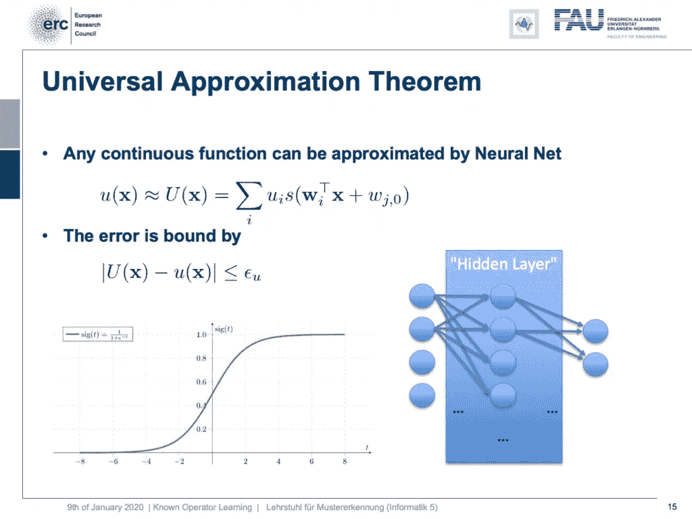
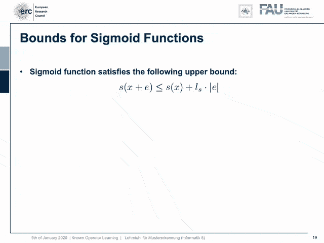
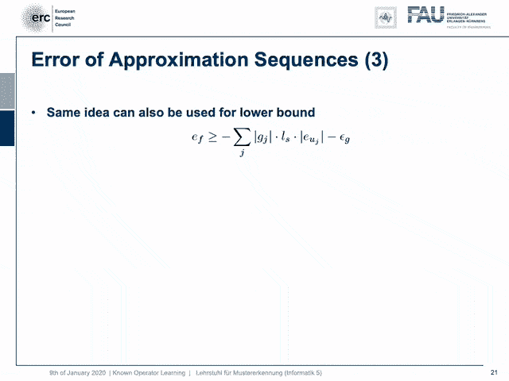

# 已知操作员学习—第 2 部分

> 原文：<https://towardsdatascience.com/known-operator-learning-part-2-8c725b5764ec?source=collection_archive---------64----------------------->

## [FAU 讲座笔记](https://towardsdatascience.com/tagged/fau-lecture-notes)关于深度学习

## 学习的界限

FAU 大学的深度学习。下图 [CC BY 4.0](https://creativecommons.org/licenses/by/4.0/) 来自[深度学习讲座](https://www.youtube.com/watch?v=p-_Stl0t3kU&list=PLpOGQvPCDQzvgpD3S0vTy7bJe2pf_yJFj&index=1)

**这些是 FAU 的 YouTube 讲座** [**深度学习**](https://www.youtube.com/watch?v=p-_Stl0t3kU&list=PLpOGQvPCDQzvgpD3S0vTy7bJe2pf_yJFj&index=1) **的讲义。这是与幻灯片匹配的讲座视频&的完整抄本。我们希望，你喜欢这个视频一样多。当然，这份抄本是用深度学习技术在很大程度上自动创建的，只进行了少量的手动修改。** [**自己试试吧！如果您发现错误，请告诉我们！**](http://autoblog.tf.fau.de/)

# 航行

[**上一讲**](/known-operator-learning-part-1-32fc2ea49a9) **/** [**观看本视频**](https://youtu.be/zf_Lp1hxeDA) **/** [**顶级**](/all-you-want-to-know-about-deep-learning-8d68dcffc258)/[**下一讲**](/known-operator-learning-part-3-984f136e88a6)

欢迎回到深度学习！所以，今天我想继续和大家聊聊已知的运营商。特别是，我想向你们展示如何将这些已知的运算嵌入到网络中，以及由此产生了什么样的理论含义。因此，关键词将是“让我们不要重新发明轮子。”

我们已经在这节课的开始讨论了普适近似。 [CC 下的图片来自](https://creativecommons.org/licenses/by/4.0/)[深度学习讲座](https://www.youtube.com/watch?v=p-_Stl0t3kU&list=PLpOGQvPCDQzvgpD3S0vTy7bJe2pf_yJFj&index=1)的 4.0 。

我们一直追溯到我们的[通用近似定理](https://youtu.be/nFiQF_xF9EU)。通用逼近定理告诉我们，我们可以找到一个隐藏层表示，它用逼近 U( **x** )来逼近任何连续函数 u( **x** )，并且它应该是非常接近的。它被计算为 sigmoid 函数的叠加线性组合。我们知道有一个界限ε下标 u，ε下标 u 告诉我们原始函数和近似函数之间的最大差值，这正好是网络中的一个隐藏层。

能否将普适近似与已知运算结合起来？来自[深度学习讲座](https://www.youtube.com/watch?v=p-_Stl0t3kU&list=PLpOGQvPCDQzvgpD3S0vTy7bJe2pf_yJFj&index=1)的 4.0CC 下的图片。

这很好，但是我们对一个隐藏层的神经网络并不感兴趣，对吗？我们会对我们创造的精确学习方法感兴趣。因此，这里的想法是，我们希望将近似器与已知操作混合，并将它们嵌入到网络中。具体来说，我这里的配置对于理论分析来说有点大。所以，我们来看一个稍微简单一点的问题。在这里，我们只是说，好吧，我们有一个两层网络，其中我们有一个从 **x** 使用 **u** ( **x** )的转换。这是一个矢量到矢量的变换。这就是为什么它是黑体的原因。然后，我们有一些变换 g( **x** )。它接受 **u** ( **x** )的输出，并产生一个标量值。这实质上就是 f 的定义( **x** )。所以在这里，我们知道 f( **x** )由两个不同的函数组成。所以，这已经是我们研究已知算符学习所需要的第一个假设。

让我们看看这个更简单的例子。 [CC 下的图片来自](https://creativecommons.org/licenses/by/4.0/)[深度学习讲座](https://www.youtube.com/watch?v=p-_Stl0t3kU&list=PLpOGQvPCDQzvgpD3S0vTy7bJe2pf_yJFj&index=1)的 4.0 。

我们现在想近似复合函数。如果我看 f，我们可以看到，有三种方法可以近似它。我们能近似的只有 **U** ( **x** )。那么，这会给我们 F 下标 u，我们只能近似 G( **x** )。这将导致 F 下标 g，或者我们可以近似两者。那就是 G( **U** ( **x** ))使用我们的两种近似。现在，对于任何一个近似，我都会引入一个误差。误差可以描述为 e 下标 U，如果我逼近 **U** ( **x** )和 e 下标 G，如果我逼近 G( **x** )，和 e 下标 f，如果我逼近两者。

非线性使我们无法将误差从各自的层中分离出来。来自[深度学习讲座](https://www.youtube.com/watch?v=p-_Stl0t3kU&list=PLpOGQvPCDQzvgpD3S0vTy7bJe2pf_yJFj&index=1)的 4.0CC 下的图片。

所以，让我们看看数学，看看我们可以用这些定义做什么。当然，我们可以从 f( **x** )开始。我们用 f 的定义( **x** )。然后，定义给我们 g( **u** ( **x** ))。我们可以开始逼近 G( **x** )。现在，如果你在逼近它，我们会引入一些误差，例如，这个误差必须被加回去。这将在下一行显示。我们可以看到，我们也可以使用 G( **x** )的定义，它是 sigmoid 函数的线性组合。这里，我们使用原始函数 u 下标 j，因为它是一个矢量函数。当然，我们有不同的权重 g 下标 j，偏差 g 下标 0，以及通过逼近 g( **x** )引入的误差。因此，我们现在也可以按组件来近似 **u** ( **x** )。然后，我们引入一个近似，这个近似当然也引入了一个误差。这很好，但我们在这里有点卡住了，因为对 **u** ( **x** )的近似误差在 sigmoid 函数内部。其他错误都在外面。那么，我们能做些什么呢？好吧，至少我们可以看看误差范围。

不过，我们可以研究误差范围。 [CC 下的图片来自](https://creativecommons.org/licenses/by/4.0/)[深度学习讲座](https://www.youtube.com/watch?v=p-_Stl0t3kU&list=PLpOGQvPCDQzvgpD3S0vTy7bJe2pf_yJFj&index=1)的 4.0 。

那么，让我们来看看我们的界限。这里的关键思想是，我们使用 sigmoid 函数的性质，它有一个 Lipschitz 界限。这个函数有一个最大斜率，用 l 下标 s 表示，意思是，如果我在位置 x，向 e 方向移动，那么我总能找到一个上界，用 e 的大小乘以函数中的最大斜率，再加上原始函数值。所以，这是一个线性外推，你可以在这个动画中看到。我们实际上有两个白色的圆锥体，它们总是在函数的上方或下方。显然，我们也可以用 Lipschitz 性质构造一个下界。好吧，现在我们能做些什么呢？我们现在可以继续使用它来达到我们的目的，但是我们会遇到下一个问题。我们的 Lipschitz 界限不适用于线性组合。所以，你看到我们实际上感兴趣的是，用这个乘以某个权重，g 下标 j，一旦我取了一个负的 g 下标 j，那么这就意味着我们的不等式翻转了。所以，这并不酷，但我们可以找到一个替代的公式，就像下面这个。因此，当我们乘以 Lipschitz 常数时，我们只需使用绝对值，以便始终保持在函数之上。在这里浏览证明有点乏味。这就是为什么我给你们带来了这两张图片。因此，我们重新表述了这一点，我们把右边的所有项减去，然后把它们移到左边，这意味着所有这些项的组合必须小于零。如果你对正的和负的 g 下标 j 这样做，你可以在两个图中看到，独立于 e 和 x 的选择，I 总是小于零。如果你对这个[5]的正式证明感兴趣，你也可以查阅原始参考文献。

新的界限允许我们将错误提取到同一层。来自[深度学习讲座](https://www.youtube.com/watch?v=p-_Stl0t3kU&list=PLpOGQvPCDQzvgpD3S0vTy7bJe2pf_yJFj&index=1)的 [CC BY 4.0](https://creativecommons.org/licenses/by/4.0/) 下的图片。

现在，让我们利用这个不等式。我们现在可以看到，我们终于可以把 e 下标 uj 从括号中取出来，从 sigmoid 函数中取出来。我们通过使用这种近似得到一个上界。然后，我们可以看到，如果我们正确排列项，前几项只是 F( **x** )的定义。所以，这是用 G( **x** )和 **U** ( **x** )的近似值。这可以简化为只写下 F( **x** )。再加上 G( **x** )的分量之和乘以 Lipschitz 乘以误差的绝对值再加上 G 引入的误差。现在，我们基本上可以减去 F( **x** )，如果这样做，我们可以看到 f( **x** ) — F( **x** )只不过是进行近似时引入的误差。这就是 e 下标 f，我们有 e 下标 f 的误差上界，它是由右边的和组成的。我们仍然可以用ε下标 g 代替 e 下标 g，ε下标 g 是 e 下标 g 的上界，它仍然是 e 下标 f 的上界，现在，这些都是上界。

这个新的误差界限提供了层相关的因素。 [CC 下的图片来自](https://creativecommons.org/licenses/by/4.0/)[深度学习讲座](https://www.youtube.com/watch?v=p-_Stl0t3kU&list=PLpOGQvPCDQzvgpD3S0vTy7bJe2pf_yJFj&index=1)的 4.0 。

同样的想法也可以用来得到一个下界。你会看到，然后我们有这个负和。这永远是一个下限。现在，如果我们有了上限和下限， 然后我们可以看到 e 下标 f 的幅度由分量 G 下标 j 乘以 Lipschitz 常数乘以误差加上ε下标 G 之和决定。这很有趣，因为在这里我们看到这本质上是用 G( **x** )的结构放大的 **U** ( **x** )的误差加上 G 引入的误差。因此， 如果我们知道 **u** ( **x** )误差 u 抵消，如果我们知道 g( **x** )误差 g 抵消，当然，如果我们知道两者，就没有误差，因为我们没有什么要学的。

我们新的误差界符合经典理论。 [CC 下的图片来自](https://creativecommons.org/licenses/by/4.0/)[深度学习讲座](https://www.youtube.com/watch?v=p-_Stl0t3kU&list=PLpOGQvPCDQzvgpD3S0vTy7bJe2pf_yJFj&index=1)的 4.0 。

所以，我们可以看到这个界有这些非常好的性质。如果我们现在将这与经典模式识别联系起来，那么我们可以将 **u** ( **x** )解释为特征提取器，将 g( **x** )解释为分类器。因此，你可以看到，如果我们在 **u** ( **x** )中出错，它们可能会被 g( **x** )放大。这也给了我们一些提示，为什么在经典的模式识别中，人们非常关注特征提取。任何你没有正确提取的特征，都是缺失的。这也是我们深度学习方法的一大优势。我们还可以针对分类优化特征提取。注意，当推导所有这些时，我们需要 Lipschitz 连续性。

也可以找到 deep networks 的版本。来自[深度学习讲座](https://www.youtube.com/watch?v=p-_Stl0t3kU&list=PLpOGQvPCDQzvgpD3S0vTy7bJe2pf_yJFj&index=1)的 4.0CC 下的图片。

好吧。现在，你可能会说“这只是两层！”。我们还将此扩展到深层网络。所以，你可以这样做。一旦你有了两层星座，你可以通过递归找到一个证明，也有一个深度网络的界限。然后，你基本上得到了各层的总和，找到了这个上限。它仍然认为是由相应层引入的误差以附加的方式对总误差界限做出了贡献。同样，如果我知道了一层，那部分误差就消失了，总的上界也减小了。我们设法在《自然机器智能》上发表了这篇文章。因此，对于其他研究人员来说，这似乎也是一个有趣的结果。好吧。现在，我们讨论了为什么将已知操作包含到深度网络中是有意义的理论。所以，我们想要重用这些先验知识，这不仅仅是常识，我们实际上可以正式表明，我们正在减少误差范围。

在这个深度学习讲座中，更多令人兴奋的事情即将到来。来自[深度学习讲座](https://www.youtube.com/watch?v=p-_Stl0t3kU&list=PLpOGQvPCDQzvgpD3S0vTy7bJe2pf_yJFj&index=1)的 4.0CC 下的图片。

所以在下节课中，我们想看几个例子。然后，您还会看到有多少不同的应用程序实际上使用了它。非常感谢大家的收听，下期视频再见。拜拜。

如果你喜欢这篇文章，你可以在这里找到更多的文章，或者看看我们的讲座。如果你想在未来了解更多的文章、视频和研究，我也会很感激关注 [YouTube](https://www.youtube.com/c/AndreasMaierTV) 、 [Twitter](https://twitter.com/maier_ak) 、[脸书](https://www.facebook.com/andreas.maier.31337)或 [LinkedIn](https://www.linkedin.com/in/andreas-maier-a6870b1a6/) 。本文以 [Creative Commons 4.0 归属许可](https://creativecommons.org/licenses/by/4.0/deed.de)发布，如果引用，可以转载和修改。如果你有兴趣从视频讲座中获得文字记录，试试[自动博客](http://autoblog.tf.fau.de/)。

# 谢谢

非常感谢 Fu、Florin Ghesu、Yixing Huang Christopher Syben、Marc Aubreville 和 Tobias Würfl 对制作这些幻灯片的支持。

# 参考

[1] Florin Ghesu 等人,《不完整 3D-CT 数据中的鲁棒多尺度解剖标志检测》。医学图像计算和计算机辅助干预 MICCAI 2017 (MICCAI)，加拿大魁北克省，2017 年第 194–202 页— MICCAI 青年研究员奖
[2] Florin Ghesu 等人，用于 CT 扫描中实时 3D-Landmark 检测的多尺度深度强化学习。IEEE 模式分析与机器智能汇刊。印刷前的 ePub。2018
[3] Bastian Bier 等，用于骨盆创伤手术的 X 射线变换不变解剖标志检测。MICCAI 2018 — MICCAI 青年研究员奖
[4]黄宜兴等.深度学习在有限角度层析成像中鲁棒性的一些研究。MICCAI 2018。
[5] Andreas Maier 等《精确学习:神经网络中已知算子的使用》。ICPR 2018。
[6]托比亚斯·维尔福尔、弗罗林·盖苏、文森特·克里斯特莱因、安德烈亚斯·迈尔。深度学习计算机断层扫描。MICCAI 2016。
[7] Hammernik，Kerstin 等，“一种用于有限角度计算机断层成像重建的深度学习架构。”2017 年医学杂志。施普林格观景台，柏林，海德堡，2017。92–97.
[8] Aubreville，Marc 等，“助听器应用的深度去噪”2018 第 16 届声信号增强国际研讨会(IWAENC)。IEEE，2018。
【9】克里斯托弗·赛本、伯恩哈德·史汀普、乔纳森·洛门、托比亚斯·维尔福、阿恩德·德夫勒、安德烈亚斯·迈尔。使用精确学习导出神经网络结构:平行到扇形波束转换。GCPR 2018。
【10】傅、等.《弗兰基网》2018 年医学杂志。施普林格观景台，柏林，海德堡，2018。341–346.
[11]傅、、伦纳特·胡斯沃格特和斯特凡·普洛纳·詹姆斯·g·迈尔。"经验教训:深度网络的模块化允许跨模态重用."arXiv 预印本 arXiv:1911.02080 (2019)。