# 已知操作员学习—第 3 部分

> 原文：<https://towardsdatascience.com/known-operator-learning-part-3-984f136e88a6?source=collection_archive---------64----------------------->

## [FAU 讲座笔记](https://towardsdatascience.com/tagged/fau-lecture-notes)关于深度学习

## CT 重建再探

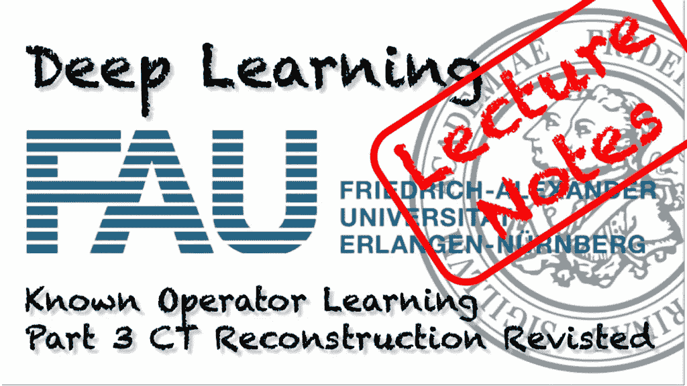

FAU 大学的深度学习。下图 [CC BY 4.0](https://creativecommons.org/licenses/by/4.0/) 来自[深度学习讲座](https://www.youtube.com/watch?v=p-_Stl0t3kU&list=PLpOGQvPCDQzvgpD3S0vTy7bJe2pf_yJFj&index=1)

**这些是 FAU 的 YouTube 讲座** [**深度学习**](https://www.youtube.com/watch?v=p-_Stl0t3kU&list=PLpOGQvPCDQzvgpD3S0vTy7bJe2pf_yJFj&index=1) **的讲义。这是与幻灯片匹配的讲座视频&的完整抄本。我们希望，你喜欢这个视频一样多。当然，这份抄本是用深度学习技术在很大程度上自动创建的，只进行了少量的手动修改。** [**自己试试吧！如果您发现错误，请告诉我们！**](http://autoblog.tf.fau.de/)

# 航行

[**上一讲**](/known-operator-learning-part-2-8c725b5764ec) **/** [**观看本视频**](https://youtu.be/7amnWQJygPU) **/** [**顶级**](/all-you-want-to-know-about-deep-learning-8d68dcffc258)/[**下一讲**](/known-operator-learning-part-4-823e7a96cf5b)

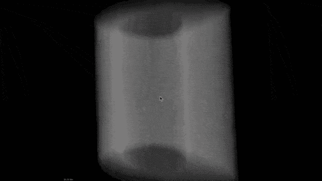

我们还能重建四维血流吗？使用 [gifify](https://github.com/vvo/gifify) 创建的图像。来源: [YouTube](https://www.youtube.com/watch?v=T2OHJ5m15kw) 。

欢迎回到深度学习！所以今天，我们想看看已知算子学习的应用，我今天想展示的一个特别的应用是 CT 重建。

CT 重建就是用非常大的稀疏矩阵进行矩阵乘法。 [CC 下的图片来自](https://creativecommons.org/licenses/by/4.0/)[深度学习讲座](https://www.youtube.com/watch?v=p-_Stl0t3kU&list=PLpOGQvPCDQzvgpD3S0vTy7bJe2pf_yJFj&index=1)的 4.0 。

这里，你可以看到 CT 重建问题的正式解决方案。这就是所谓的滤波反投影或 Radon 逆投影。这正是我之前提到的，在 1917 年已经解决的方程。但你可能知道，CT 扫描仪是在 1971 年才实现的。所以实际上，发现这个非常好的解决方案的 Radon 从未见过它付诸实践。那么，他是如何解决 CT 重建问题的呢？CT 重建是一个投影过程。它本质上是一个可以求解的线性方程组。这个解本质上是用卷积和求和来描述的。因此，它是沿检测器方向 s 的卷积，然后是旋转角度θ的反投影。在整个过程中，我们抑制负面价值。因此，我们还会在系统中引入非线性。这些都可以用矩阵符号来表示。因此，我们知道投影操作可以简单地描述为一个矩阵**一个**，它描述了光线如何与体积相交。有了这个矩阵，你可以简单地将体积乘以 A，这就给出了你在扫描仪中观察到的投影 p。现在，得到重建是你得到投影 p，你需要 A 的某种逆或伪逆来计算它。我们可以看到，有一个解与我们在上面的连续方程中看到的非常相似。所以，我们这里有一个本质上的伪逆，那就是 **A** 转置次数**A**A 转置反转次数 **p** 。现在，你可能会说，你在 a 中看到的反转实际上是滤波器。所以，对于这个特殊的问题，我们知道 **A 的逆**转置会形成卷积。

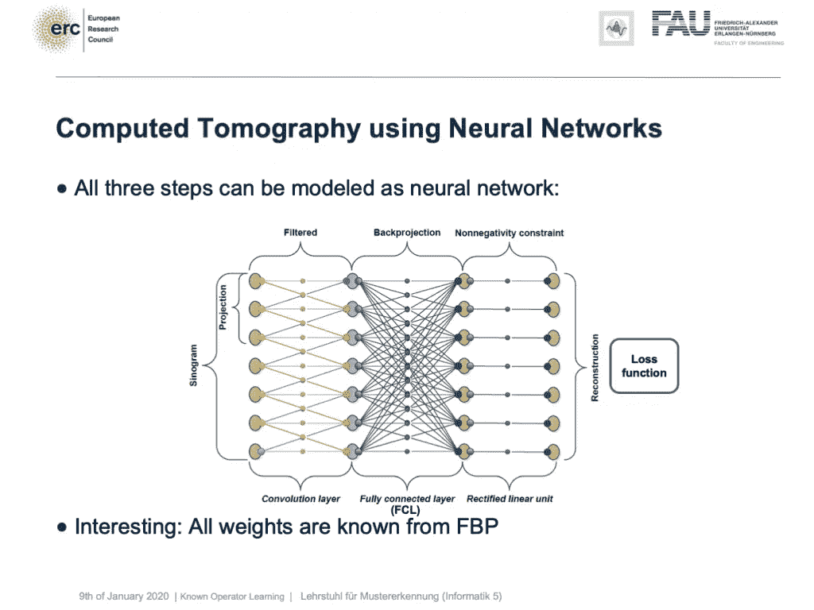

为什么不把它映射到神经网络上呢？ [CC 下的图片来自](https://creativecommons.org/licenses/by/4.0/)[深度学习讲座](https://www.youtube.com/watch?v=p-_Stl0t3kU&list=PLpOGQvPCDQzvgpD3S0vTy7bJe2pf_yJFj&index=1)的 4.0 。

这很好，因为我们知道如何在深度网络中实现卷积，对吗？矩阵乘法！这就是我们所做的。我们可以将一切映射到神经网络中。我们从左手边开始。我们放入正弦图，也就是所有的投影。我们有一个卷积层来计算过滤后的投影。然后，我们有一个反投影，这是一个完全连接的层，本质上是这个大矩阵 **A** 。最后，我们有非负约束。所以本质上，我们可以定义一个神经网络，它可以进行精确的滤波反投影。现在，这实际上并不那么超级有趣，因为没什么可学的。我们知道所有这些重量，顺便说一下，矩阵 **A** 真的很大。对于三维问题，它可以接近高达 65，000 万亿字节的浮点精度内存。所以，你不想实例化这个矩阵。你不想做那件事的原因是它太稀疏了。所以，在 **A** 中，只有很小一部分元素是真正的连接。这对于 CT 重建来说非常好，因为这样你通常不会实例化 **A** ，而是简单地使用光线跟踪器计算 **A** 和 **A** 转置。这通常在图形板上完成。现在，我们为什么要谈论这些？我们已经看到了 CT 重建不充分的情况，我们基本上可以进行可训练的 CT 重建。

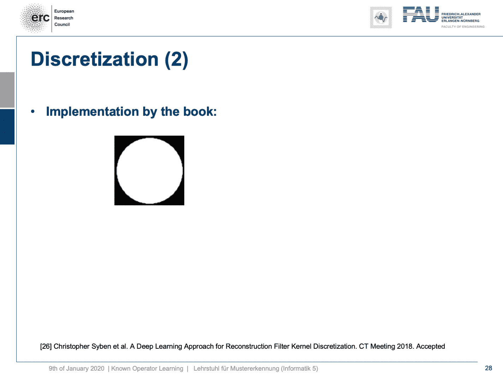

许多关于 CT 的教科书忽略了滤波器离散化和正确填充的主题。来自[深度学习讲座](https://www.youtube.com/watch?v=p-_Stl0t3kU&list=PLpOGQvPCDQzvgpD3S0vTy7bJe2pf_yJFj&index=1)的 4.0CC 下的图片。

如果你看一本 CT 书，你已经遇到了第一个问题。如果你按常规实现它，你只是想重建一个圆柱体，仅仅显示这个圆形区域内 1 的值，那么你会想要一个像这样的图像，其中圆柱体内的一切都是 1，圆柱体外的一切都是 0。所以，我们沿着原始切片图像中的蓝线显示这个线图。现在，如果你实现滤波反投影，就像你在教科书上找到的，你会得到一个像这样的重建。典型的错误是你把傅立叶变换的长度选得太短，另一个错误是你没有恰当地考虑离散化。现在，您可以使用它并修复离散化中的问题。所以你现在能做的就是用学习技巧训练正确的过滤器。因此，在经典 CT 课程中，你要做的是运行从连续积分到离散形式的所有数学运算，以计算出正确的滤波器系数。

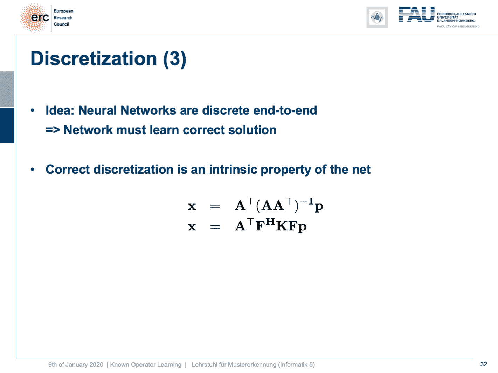

我们能使用学习技术找到正确的离散化吗？来自[深度学习讲座](https://www.youtube.com/watch?v=p-_Stl0t3kU&list=PLpOGQvPCDQzvgpD3S0vTy7bJe2pf_yJFj&index=1)的 [CC BY 4.0](https://creativecommons.org/licenses/by/4.0/) 下的图片。

相反，我们在这里表明，通过知道它采取卷积的形式，我们可以简单地将我们的逆表示为 **p** 乘以傅里叶变换，这也是一个矩阵乘法 **F** 。然后， **K** 是保存频谱权重的对角矩阵，之后是傅里叶逆变换，这里表示为 **F** 埃尔米特变换。最后，你反向投影。我们可以简单地把它写成一组矩阵，顺便说一下，这也定义了网络架构。现在，我们实际上可以优化正确的滤波器权重。我们要做的是解决相关的优化问题。这只是让右手边等于左手边，我们选择一个 L2 损失。

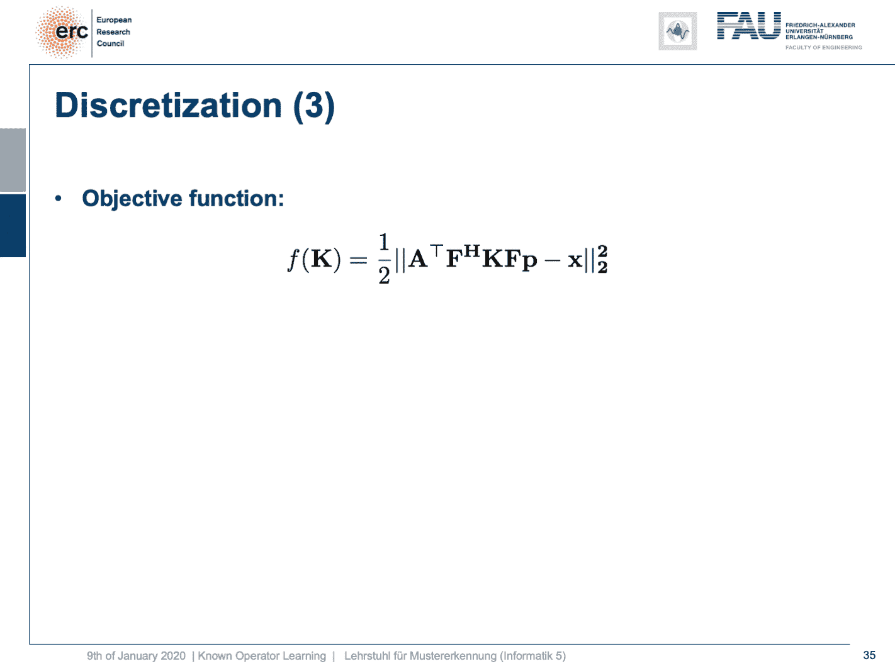

反向传播可以自动计算这个梯度。来自[深度学习讲座](https://www.youtube.com/watch?v=p-_Stl0t3kU&list=PLpOGQvPCDQzvgpD3S0vTy7bJe2pf_yJFj&index=1)的 4.0CC 下的图片。

你们已经在这门课的很多场合见过了。现在，如果我们这样做，我们也可以手动计算。如果你使用[矩阵食谱](https://www.math.uwaterloo.ca/~hwolkowi/matrixcookbook.pdf)，然后，你得到以下关于层 **K** 的梯度。这将是 **F** 乘以 **A** 乘以然后在括号中 **A** 转置 **F** 埃尔米特我们的对角滤波器矩阵 **K** 乘以傅立叶变换乘以 **p** 减去 **x** 然后乘以 **F** 乘以 **p** 转置。所以如果你看看这个，你可以看到这实际上是重建。这是我们网络的前进通道。这是引入的误差。所以，这是我们的灵敏度，如果我们应用我们的损失，我们在网络的末端得到。我们计算灵敏度，然后反向传播到我们实际需要它的层。这是层 **K** 。然后，我们乘以这个特定层中的激活。如果你还记得[我们关于前馈网络的讲座](https://www.youtube.com/watch?v=fgOVelc8SYM)，这就是各自的层梯度。我们仍然可以重复使用很早以前在这节课中学到的数学知识。所以实际上，我们不必经历计算这个梯度的痛苦。我们的深度学习框架将为我们做到这一点。因此，使用反向传播算法可以节省大量时间。

学习的滤波器与正确离散的权重相同。 [CC 下的图片来自](https://creativecommons.org/licenses/by/4.0/)[深度学习讲座](https://www.youtube.com/watch?v=p-_Stl0t3kU&list=PLpOGQvPCDQzvgpD3S0vTy7bJe2pf_yJFj&index=1)的 4.0 。

如果你这么做了会发生什么？当然，在得知神器不见了之后。所以，你可以拿走这件艺术品。这是一个学术上的例子。我们还有一些。

更复杂的 CT 几何形状也可以映射到神经网络。 [CC 下的图片来自](https://creativecommons.org/licenses/by/4.0/)[深度学习讲座](https://www.youtube.com/watch?v=p-_Stl0t3kU&list=PLpOGQvPCDQzvgpD3S0vTy7bJe2pf_yJFj&index=1)的 4.0 。

你可以看到，你也可以用类似的矩阵方程来近似扇束重建。我们现在有了一个额外的矩阵。因此， **W** 是乘以输入图像中每个像素的逐点权重。 **C** 现在直接就是我们的卷积矩阵。因此，我们可以用这个方程简单地描述一个扇形束重建公式，当然，我们可以由此产生一个结果网络。

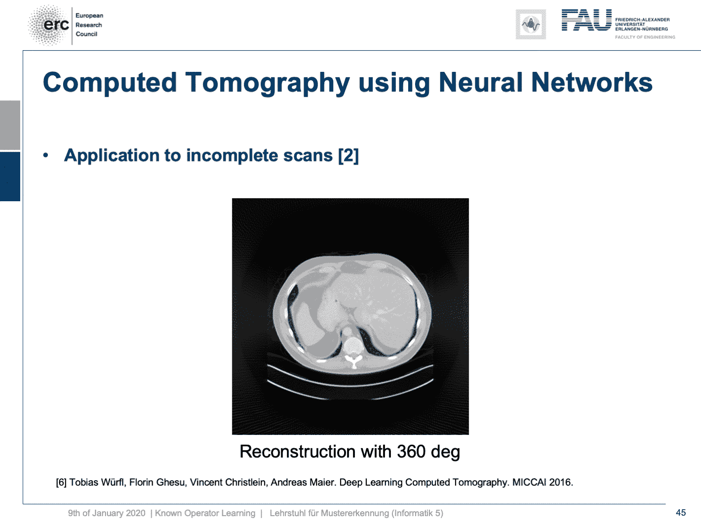

学习 CT 有助于有限的角度伪影。来自[深度学习讲座](https://www.youtube.com/watch?v=p-_Stl0t3kU&list=PLpOGQvPCDQzvgpD3S0vTy7bJe2pf_yJFj&index=1)的 4.0CC 下的图片。

现在让我们看看如果我们回到这个[有限角度层析成像问题](https://youtu.be/nauVuIMyb1M)会发生什么。所以，如果你有一个完整的扫描，它看起来像这样。让我们进行一次只有 180 度旋转的扫描。这里，扫描的最小设置实际上是 200 度。所以，我们少了 20 度的旋转。没有我在已知算子学习的介绍中展示的有限角度问题那么强，但这里仍然出现了显著的伪像。现在，让我们将传统的滤波反投影算法作为预训练，并调整权重和卷积。如果你这样做，你会得到这个重建。因此，您可以看到图像质量得到了显著提高。很多藏物都不见了。右手边仍有一些伪像，但图像质量明显更好。现在，你可能会说“好吧，你又在使用黑盒了！”。

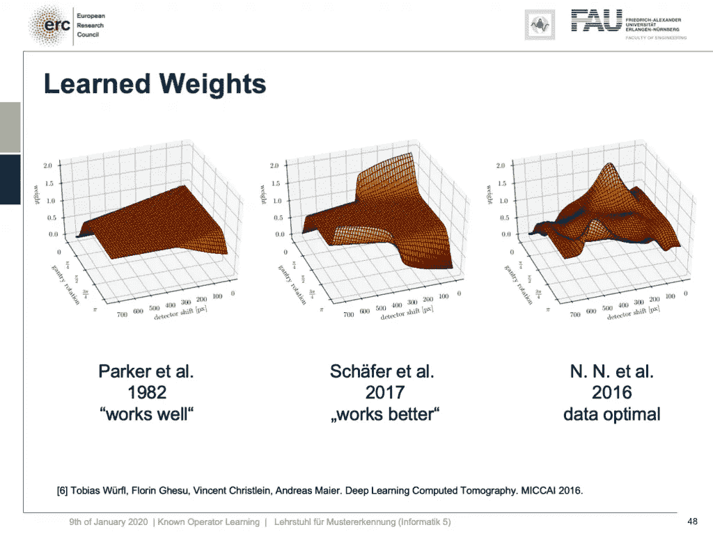

学习到的权重可以映射回它们的原始解释，并与其他解决方案进行比较。来自[深度学习讲座](https://www.youtube.com/watch?v=p-_Stl0t3kU&list=PLpOGQvPCDQzvgpD3S0vTy7bJe2pf_yJFj&index=1)的 4.0CC 下的图片。

但这实际上并不正确，因为我们的权重可以被映射回原来的解释。我们还有一个滤波反投影算法。这意味着我们可以从我们的网络中读出训练过的权重，并将它们与最先进的进行比较。如果你看这里，我们用所谓的 Parker 权重进行初始化，这是短扫描的解决方案。这里的想法是，相对的射线被分配一个权重，使得测量完全相同的线积分的射线基本上总和为 1。这显示在左手边。在右手边，你找到了我们的神经网络在 2016 年找到的解决方案。所以这是数据最优解。你可以看到它对我们的 Parker weights 产生了重大影响。现在，2017 年 Schä fer 等人发表了一篇如何修复这些有限角度伪影的启发式文章。他们建议增加穿过我们没有观测到的区域的射线的重量。他们只是增加重量，以固定确定性的质量损失。他们的发现看起来更好，但只是一个启发。我们可以看到，我们的神经网络找到了一个非常相似的解决方案，我们可以证明这是数据最优的。所以，你可以在最左边和最右边看到明显的不同。如果你看这里，如果你看这里，你可以看到这些重量，一直到这里和这里。这实际上是探测器的终点。所以，这里和这里是探测器的边界，也是这里和这里。这意味着这里和这里的这些区域没有任何变化。其原因是我们在训练数据中从来没有一个对象可以填满整个检测器。因此，我们也不能在这里反向传播梯度。这就是为什么我们基本上仍然在这些位置进行初始初始化。那很酷。这才是真正的诠释网络。这是真正了解培训过程中发生的事情，对吗？

此外，迭代压缩感知解决方案可以使用深度学习技术来解决。 [CC 下的图片来自](https://creativecommons.org/licenses/by/4.0/)[深度学习讲座](https://www.youtube.com/watch?v=p-_Stl0t3kU&list=PLpOGQvPCDQzvgpD3S0vTy7bJe2pf_yJFj&index=1)的 4.0 。

那么，我们能做得更多吗？是的，甚至还有其他东西，比如所谓的变分网络。这是 Kobler，Pock 和 Hammernik 的工作，他们基本上表明任何类型的能量最小化都可以映射成一种展开的前馈问题。因此，本质上能量最小化可以通过梯度下降来解决。所以，你最终会得到一个你想要最小化的最优化问题。如果你想有效地做到这一点，你可以把它表述为一个递归神经网络。我们是如何处理递归神经网络的？我们打开它们。因此，如果固定迭代次数，任何类型的能量最小化都可以映射到一个前馈神经网络中。这样，你就可以像这里的迭代重建公式或这里的迭代去噪公式一样，进行能量最小化，并计算其梯度。如果你这样做，你将基本上与先前的图像配置减去负梯度方向结束。你这样做，一步一步地重复。

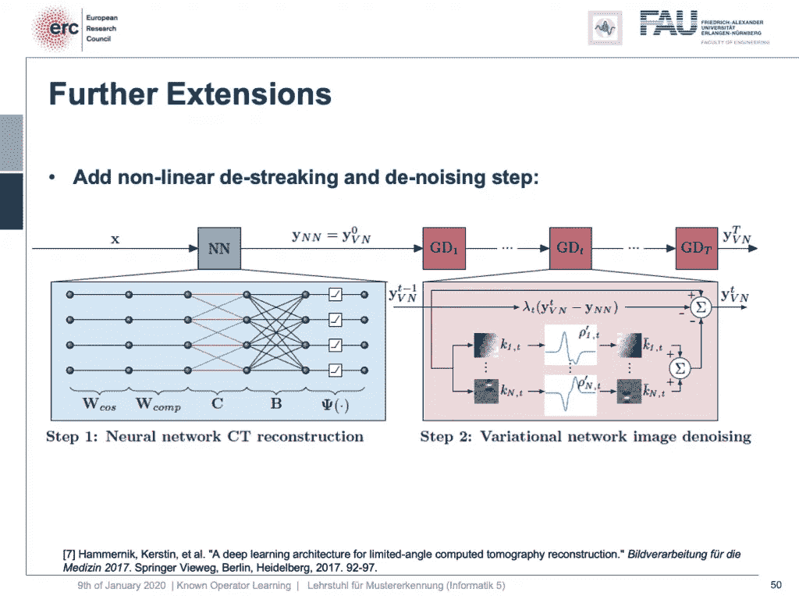

迭代和解析解也可以根据神经网络结合起来。 [CC 下的图片来自](https://creativecommons.org/licenses/by/4.0/)[深度学习讲座](https://www.youtube.com/watch?v=p-_Stl0t3kU&list=PLpOGQvPCDQzvgpD3S0vTy7bJe2pf_yJFj&index=1)的 4.0 。

这里，我们有一个特殊的解决方案，因为我们将它与我们的神经网络重建相结合。我们只是想学习一个图像增强步骤。所以我们所做的是，我们进行神经网络重建，然后连接到前面的层。有 T 条纹或降噪步骤是可训练的。他们使用压缩传感理论。所以，如果你想在这里看到更多的细节，我推荐你参加[的一个图像重建课程](https://lme.tf.fau.de/teaching/curriculum-courses/lv_id/40663774/)。如果你仔细观察，你会发现这是一个在稀疏域中压缩图像的想法。这里，我们表明，我们实际上可以学习在稀疏域中表达图像内容的变换，这意味着我们也可以获得这种新的稀疏变换，并在传统的信号处理意义上解释它。

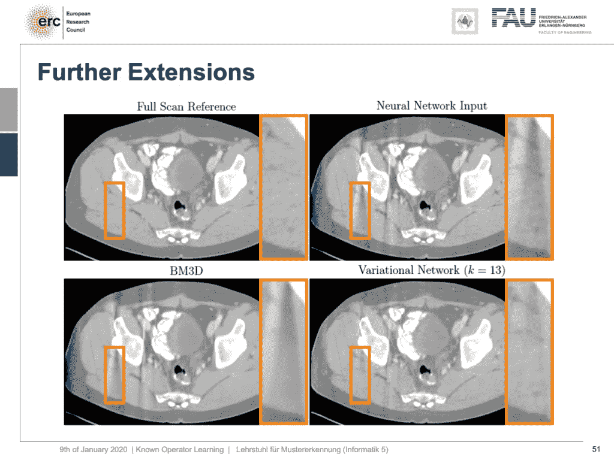

额外的迭代处理在图像质量方面产生了进一步的好处。来自[深度学习讲座](https://www.youtube.com/watch?v=p-_Stl0t3kU&list=PLpOGQvPCDQzvgpD3S0vTy7bJe2pf_yJFj&index=1)的 4.0CC 下的图片。

我们来看一些结果。在这里，你可以看到，如果我们采取全扫描参考，我们得到一个真正的无伪影图像。我们的神经网络输出有了我之前展示的这个重建网络的改进，但是它仍然有这些条纹伪影，你可以在右上角看到。在左下方，您可以看到去噪算法的输出，它是三维的。因此，它可以去噪，但仍有条纹问题。你可以看到，在右下角的变分网络中，条纹被抑制了很多。因此，我们实际上学习了一种基于压缩感知思想的变换，以消除这些条纹。一个非常好的神经网络，在数学上精确地模拟了压缩感知重建方法。这太令人兴奋了！

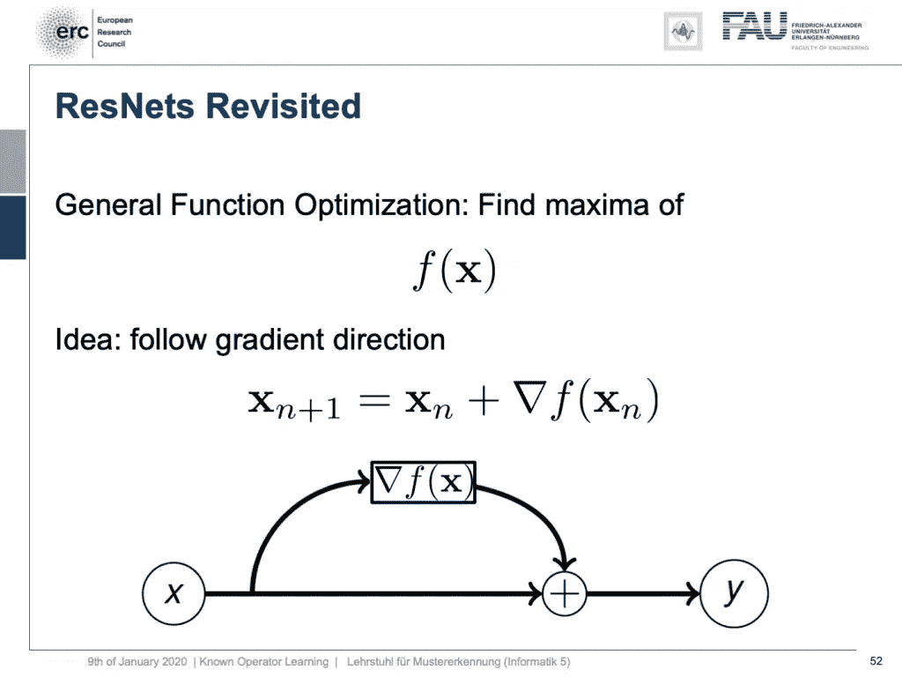

实际上，所有的能量最小化方法都可以映射到神经网络。它们总是产生 ResNet 类型的架构。那么，ResNets 在学习优化未知的能量函数吗？ [CC 下的图片来自](https://creativecommons.org/licenses/by/4.0/)[深度学习讲座](https://www.youtube.com/watch?v=p-_Stl0t3kU&list=PLpOGQvPCDQzvgpD3S0vTy7bJe2pf_yJFj&index=1)的 4.0 。

顺便说一下，如果你想到这种能量最小化的想法，那么你也会发现下面的解释:能量最小化和这种展开总是导致一个 ResNet，因为你采取以前的配置减去负梯度方向，这意味着它是以前的层输出加上新层的配置。所以，这实质上意味着 ResNets 也可以用这种方式来表达。它们总是任何能量最小化问题的结果。也可能是最大化。在任何情况下，我们甚至不必知道它是最大化还是最小化，但一般来说，如果你有一个函数优化，那么你总是可以通过一个 ResNet 找到这个优化过程的解。因此，你可以说 ResNets 也适合于为一个完全未知的误差函数寻找优化策略。

在这个深度学习讲座中，更多令人兴奋的事情即将到来。来自[深度学习讲座](https://www.youtube.com/watch?v=p-_Stl0t3kU&list=PLpOGQvPCDQzvgpD3S0vTy7bJe2pf_yJFj&index=1)的 [CC BY 4.0](https://creativecommons.org/licenses/by/4.0/) 下的图片。

很有趣，不是吗？关于已知算子学习的这些想法，我还想告诉你一些事情。此外，我们希望看到更多我们可以应用它的应用，也许还希望看到一些关于深度学习和机器学习领域在未来几个月和几年内将如何发展的想法。非常感谢大家的收听，我们在下一段也是最后一段视频中再见。拜拜。

如果你喜欢这篇文章，你可以在这里找到更多的文章，或者看看我们的讲座。如果你想在未来了解更多的文章、视频和研究，我也会很感激关注 [YouTube](https://www.youtube.com/c/AndreasMaierTV) 、 [Twitter](https://twitter.com/maier_ak) 、[脸书](https://www.facebook.com/andreas.maier.31337)或 [LinkedIn](https://www.linkedin.com/in/andreas-maier-a6870b1a6/) 。本文以 [Creative Commons 4.0 归属许可](https://creativecommons.org/licenses/by/4.0/deed.de)发布，如果引用，可以转载和修改。如果你有兴趣从视频讲座中获得文字记录，试试[自动博客](http://autoblog.tf.fau.de/)。

# 谢谢

非常感谢 Fu、Florin Ghesu、Yixing Huang Christopher Syben、Marc Aubreville 和 Tobias Würfl 对制作这些幻灯片的支持。

# 参考

[1] Florin Ghesu 等人,《不完整 3D-CT 数据中的鲁棒多尺度解剖标志检测》。医学图像计算和计算机辅助干预 MICCAI 2017 (MICCAI)，加拿大魁北克省，2017 年第 194–202 页— MICCAI 青年研究员奖
[2] Florin Ghesu 等人，用于 CT 扫描中实时 3D-Landmark 检测的多尺度深度强化学习。IEEE 模式分析与机器智能汇刊。印刷前的 ePub。2018
[3] Bastian Bier 等，用于骨盆创伤手术的 X 射线变换不变解剖标志检测。MICCAI 2018 — MICCAI 青年研究员奖
[4]黄宜兴等.深度学习在有限角度层析成像中鲁棒性的一些研究。MICCAI 2018。
[5] Andreas Maier 等《精确学习:神经网络中已知算子的使用》。ICPR 2018。
[6]托比亚斯·维尔福尔、弗罗林·盖苏、文森特·克里斯特莱因、安德烈亚斯·迈尔。深度学习计算机断层扫描。MICCAI 2016。
[7] Hammernik，Kerstin 等，“一种用于有限角度计算机断层成像重建的深度学习架构。”2017 年医学杂志。施普林格观景台，柏林，海德堡，2017。92–97.
[8] Aubreville，Marc 等，“助听器应用的深度去噪”2018 第 16 届声信号增强国际研讨会(IWAENC)。IEEE，2018。
【9】克里斯托弗·赛本、伯恩哈德·史汀普、乔纳森·洛门、托比亚斯·维尔福、阿恩德·德夫勒、安德烈亚斯·迈尔。使用精确学习导出神经网络结构:平行到扇形波束转换。GCPR 2018。
【10】傅、等.《弗兰基网》2018 年医学杂志。施普林格观景台，柏林，海德堡，2018。341–346.
[11]傅、、伦纳特·胡斯沃格特和斯特凡·普洛纳·詹姆斯·g·迈尔。"经验教训:深度网络的模块化允许跨模态重用."arXiv 预印本 arXiv:1911.02080 (2019)。