# 已知操作员学习—第 4 部分

> 原文：<https://towardsdatascience.com/known-operator-learning-part-4-823e7a96cf5b?source=collection_archive---------66----------------------->

## [FAU 讲座笔记](https://towardsdatascience.com/tagged/fau-lecture-notes)关于深度学习

## 深层设计模式

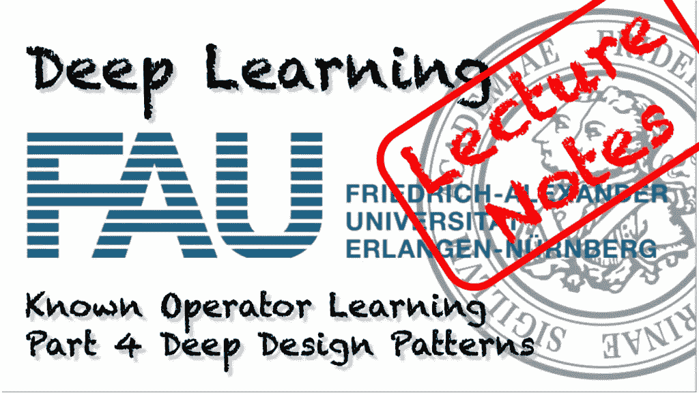

FAU 大学的深度学习。下图 [CC BY 4.0](https://creativecommons.org/licenses/by/4.0/) 来自[深度学习讲座](https://www.youtube.com/watch?v=p-_Stl0t3kU&list=PLpOGQvPCDQzvgpD3S0vTy7bJe2pf_yJFj&index=1)

**这些是 FAU 的 YouTube 讲座** [**深度学习**](https://www.youtube.com/watch?v=p-_Stl0t3kU&list=PLpOGQvPCDQzvgpD3S0vTy7bJe2pf_yJFj&index=1) **的讲义。这是与幻灯片匹配的讲座视频&的完整抄本。我们希望，你喜欢这个视频一样多。当然，这份抄本是用深度学习技术在很大程度上自动创建的，只进行了少量的手动修改。** [**自己试试吧！如果您发现错误，请告诉我们！**](http://autoblog.tf.fau.de/)

# 航行

[**往期讲座**](/known-operator-learning-part-3-984f136e88a6) **/** [**观看本视频**](https://youtu.be/AO8jSW_xSZ0) **/** [**顶级**](/all-you-want-to-know-about-deep-learning-8d68dcffc258)

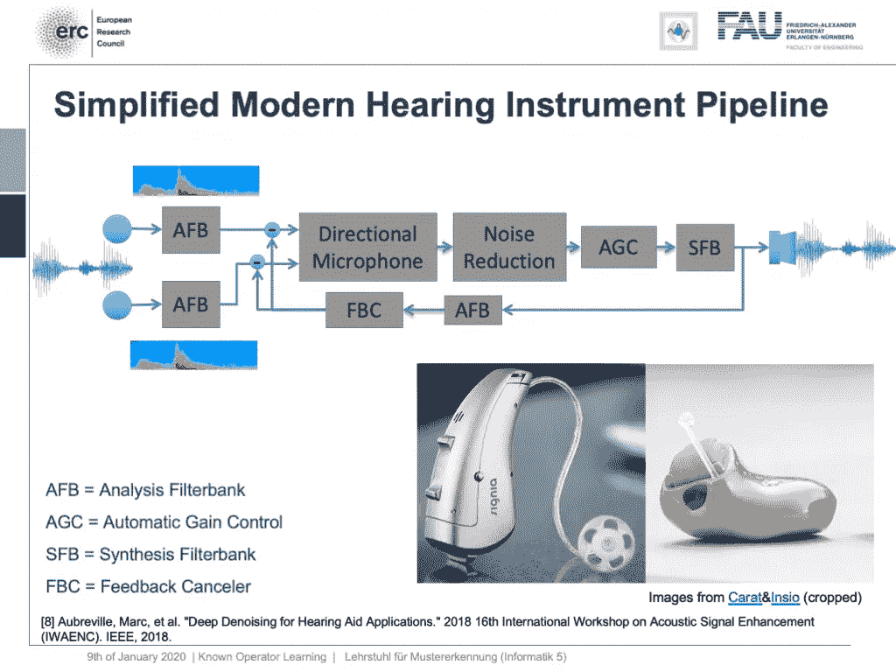

现代听力仪器信号处理管道的简化版本。 [CC 下的图片来自](https://creativecommons.org/licenses/by/4.0/)[深度学习讲座](https://www.youtube.com/watch?v=p-_Stl0t3kU&list=PLpOGQvPCDQzvgpD3S0vTy7bJe2pf_yJFj&index=1)的 4.0 。

欢迎回到深度学习！这就是了。这是最后一堂课。所以今天，我想向你们展示这种已知算子范式的几个更多的应用，以及我认为未来的研究实际上可以去的一些想法。让我们看看我为你准备了什么。我想展示的一件事是简化的现代助听器管道。这是与一家生产助听器的公司的合作，他们通常有一个信号处理管道，其中有两个麦克风。他们收集一些语音信号。然后，通过分析滤波器组运行。这本质上是一个短期傅里叶变换。然后通过定向麦克风来聚焦你面前的事物。然后，您使用降噪来为佩戴助听器的人获得更好的清晰度。随后是自动增益控制，使用增益控制，您可以将频率分析合成为语音信号，然后在助听器内的扬声器上播放。所以，还有一个循环连接，因为你想抑制反馈循环。这种管道，你可以在各种制造商的现代助听器中找到。这里，您可以看到一些例子，所有这些处理的关键问题是降噪。这是困难的部分。所有其他的事情，我们都知道如何用传统的信号处理来解决。但是减少噪音是一个巨大的问题。

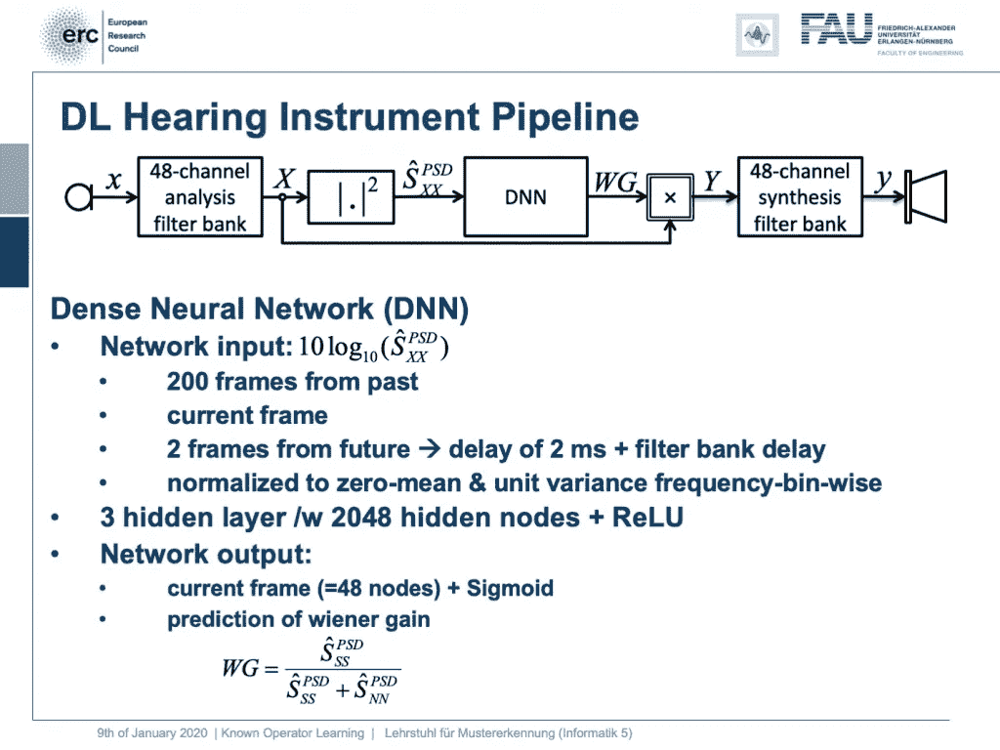

整个流水线可以用已知的操作符来表示。这样，我们可以嵌入一个 DNN 来减少噪音。 [CC 下的图片来自](https://creativecommons.org/licenses/by/4.0/)[深度学习讲座](https://www.youtube.com/watch?v=p-_Stl0t3kU&list=PLpOGQvPCDQzvgpD3S0vTy7bJe2pf_yJFj&index=1)的 4.0 。

那么，我们能做什么呢？我们可以将整个助听器管道映射到一个深层网络上。所有这些步骤都可以用微分运算来表示。

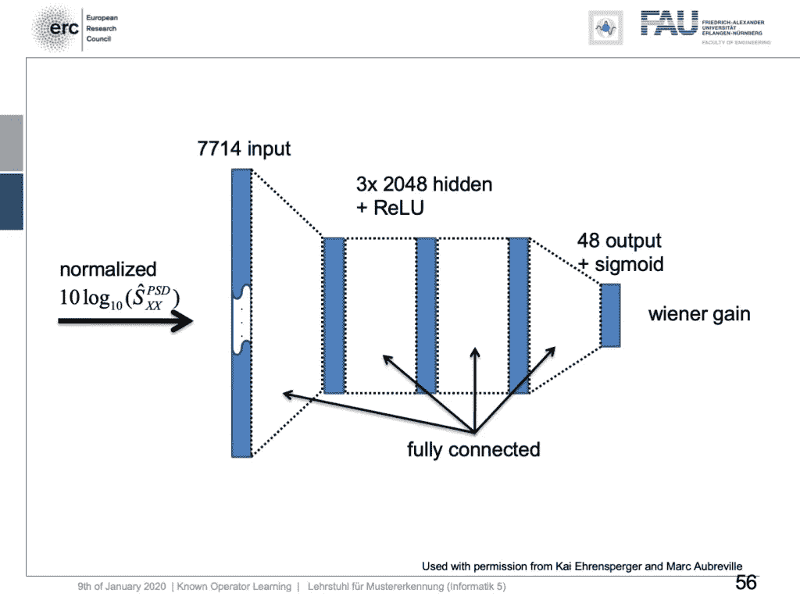

实际去噪 DNN 的设置。来自[深度学习讲座](https://www.youtube.com/watch?v=p-_Stl0t3kU&list=PLpOGQvPCDQzvgpD3S0vTy7bJe2pf_yJFj&index=1)的 [CC BY 4.0](https://creativecommons.org/licenses/by/4.0/) 下的图片。

如果我们这样做，我们建立以下大纲。实际上，我们这里的网络并不深，因为我们只有三个隐藏层，但是有 2024 个隐藏节点和 ReLUs。然后，这被用于预测维纳滤波器增益的系数，以便抑制具有特定噪声的信道。这就是设计。我们有来自归一化光谱的 7714 个节点的输入。然后，这是通过三个隐藏层运行。它们与 ReLUs 完全连接，最后，我们有一些 48 通道输出，由产生维纳增益的 sigmoid 产生。

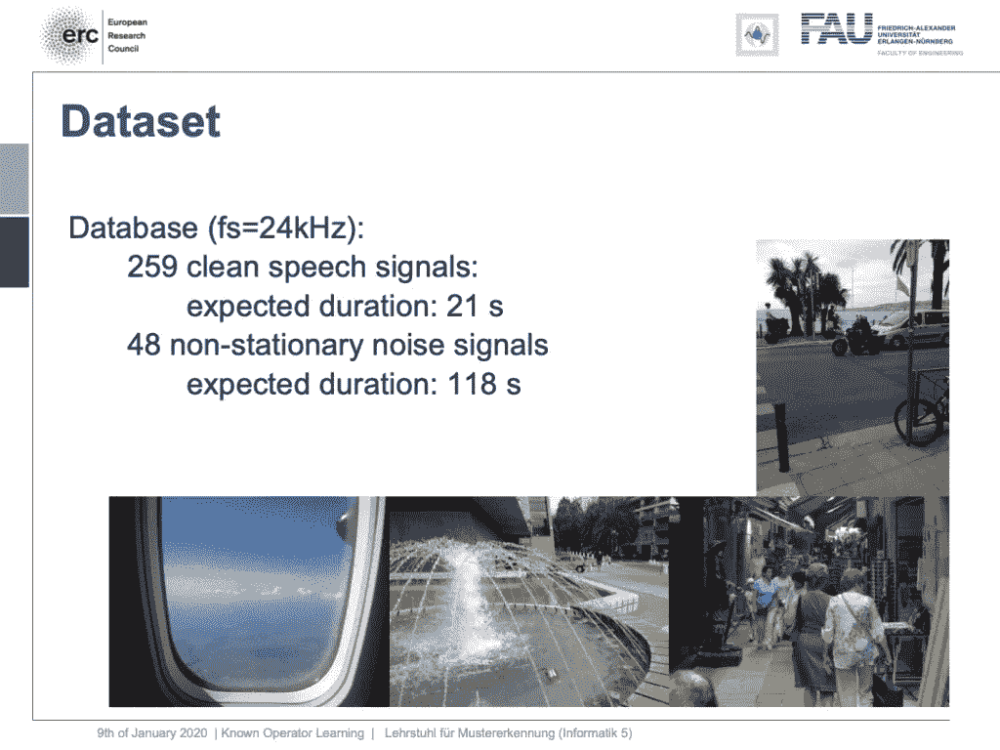

训练数据库概要。 [CC 下的图片来自](https://creativecommons.org/licenses/by/4.0/)[深度学习讲座](https://www.youtube.com/watch?v=p-_Stl0t3kU&list=PLpOGQvPCDQzvgpD3S0vTy7bJe2pf_yJFj&index=1)的 4.0 。

我们在一些数据集上进行了评估，这里我们有 259 个干净的语音信号。然后我们基本上有 48 个非平稳噪声信号，我们混合它们。所以，你可以说我们在这里训练的是一种循环自动编码器。实际上，这是一个去噪自动编码器，因为我们将干净的语音信号加上噪声作为输入，在输出端，我们希望产生干净的语音信号。这是一个例子。

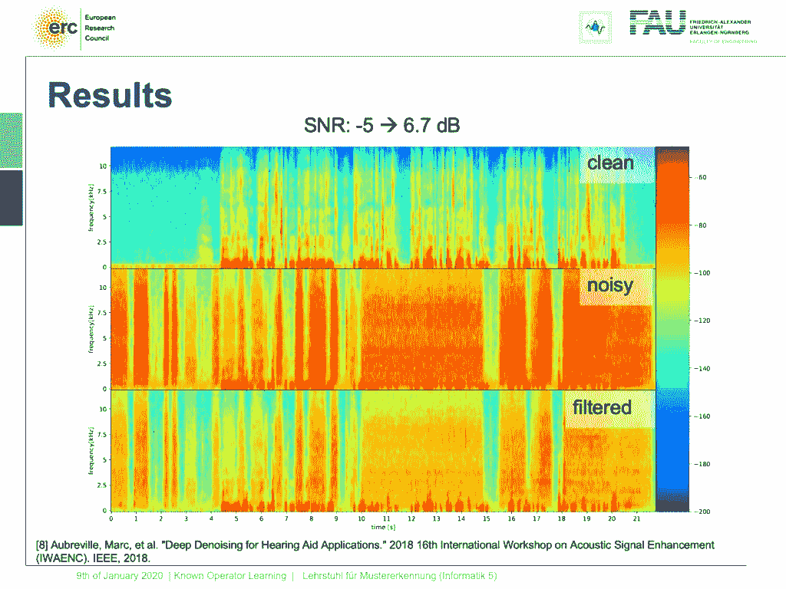

助听器输出的一个例子。音频示例也可以在这里听[。来自](https://www.youtube.com/watch?v=wGbDX_VjKjc)[深度学习讲座](https://www.youtube.com/watch?v=p-_Stl0t3kU&list=PLpOGQvPCDQzvgpD3S0vTy7bJe2pf_yJFj&index=1)的 4.0CC 下的图片。

让我们尝试一个非平稳的噪声模式，这是一个电子钻。另外，请注意，网络之前从未听说过电子演习。这通常会损坏您的助听器，让我们来听听输出。因此，您可以听到非平稳噪声也得到很好的抑制。哇哦。这很酷，当然还有更多应用。

已知的算子也可以用于 X 射线材料分解。使用 [gifify](https://github.com/vvo/gifify) 创建的图像。来源: [YouTube](https://www.youtube.com/watch?v=XGXpIX8gPWc) 。

让我们再考虑一个想法。我们能衍生出网络吗？这里，假设您有一个场景，您以不喜欢的格式收集数据，但您知道数据和投影之间的正式等式。

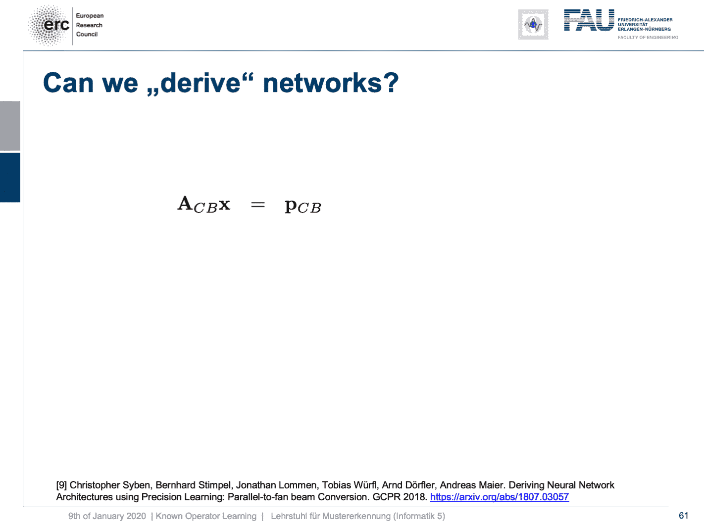

衍生深度神经网络架构的示例。 [CC 下的图片来自](https://creativecommons.org/licenses/by/4.0/)[深度学习讲座](https://www.youtube.com/watch?v=p-_Stl0t3kU&list=PLpOGQvPCDQzvgpD3S0vTy7bJe2pf_yJFj&index=1)的 4.0 。

我在这里展示的例子是锥束采集。这简直就是典型的 x 射线几何。所以，你拿一个 X 射线，这是典型的锥束几何图形。现在，对于锥束几何，我们可以完全使用这个线性算子来描述它，正如我们在前面的视频中已经看到的。所以，我们可以表达物体 **x** 我们的几何图形 **A** 下标 CB 和我们的投影 **p** 下标 CB 之间的关系。现在，锥束采集不是很好，因为你有放大倍数。所以如果你有一个靠近光源的东西，它会比靠近探测器的物体放大更多。所以，这对于诊断来说不是很好。在 othopedics 中，他们更喜欢平行投影，因为如果你有东西，它会被正交投影，不会被放大。这对诊断非常有用。你会有公制投影，你可以简单地测量投影，它会有和体内一样的大小。因此，这对于诊断来说非常好，但通常我们无法用现有的系统来测量。因此，为了创建这个，你必须创建一个物体的完整重建，从各个角度进行完整的 ct 扫描，然后重建物体并再次投影。通常在整形外科，人们不喜欢切片卷，因为它们太复杂了，难以阅读。但是投影图像看起来更好。我们能做什么？我们知道这里连接两个方程的因子是 **x** 。所以我们可以简单地求解这个方程，得到关于 **x** 的解。曾经，我们有 **x** 和这里的矩阵逆 **A** 下标 CB 乘以 **p** 下标 CB。然后，我们只需将其乘以我们的生产映像。但是我们对重建不感兴趣。我们对这张投影图感兴趣。那么，让我们把它代入我们的方程，然后我们可以看到，通过应用这一系列矩阵，我们可以把锥束投影转换成平行束投影。不需要真正的重建。只需要一种中间重建。当然，在这里你不仅仅获得一个单一的投影。你可能想获得一些这样的投影。让我们说三个或四个投影，而不是像 CT 扫描那样的几千个。现在，如果你看这组方程，我们知道所有的运算。所以，这很酷。但是我们这里有这个逆，注意，这又是一种重构问题，一个大矩阵的逆，在很大程度上是稀疏的。所以，我们对这个人的评估还是有问题。这是非常昂贵的，但我们在深度学习的世界里，我们可以假设一些事情。所以，让我们假设这个逆只是一个卷积。所以，我们可以用傅立叶变换，对角矩阵 K 和傅立叶逆变换来代替它。突然，我只估计一个对角矩阵的参数，这使得问题变得简单了一些。我们可以在这个域中解决它，我们可以再次使用我们的技巧，我们已经在这里定义了一个已知的运营商网络拓扑。我们可以简单地用我们的神经网络方法来使用它。我们使用反向传播算法来优化这个家伙。我们只是用其他层作为固定层。顺便说一下，这也可以在非线性公式中实现。记住，一旦我们能够计算出次梯度，我们就可以把它插入我们的网络。所以你也可以做一些非常复杂的事情，比如中值滤波。

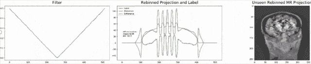

迭代的训练过程。 [CC 下的图片来自](https://creativecommons.org/licenses/by/4.0/)[深度学习讲座](https://www.youtube.com/watch?v=p-_Stl0t3kU&list=PLpOGQvPCDQzvgpD3S0vTy7bJe2pf_yJFj&index=1)的 4.0 。

我们来看一个例子。在这种情况下，我们对 MR 投影进行重新归类。我们将在 k 空间中进行采集，这些通常只是平行投影。现在，我们感兴趣的是生成 X 射线和 X 射线的叠加，我们需要来波束几何。所以，我们取几个投影，然后重新组合它们，使之与入射光束的几何形状完全匹配。这里很酷的一点是，我们可以将 MR 和 X 射线的对比结合在一幅图像中。这并不简单。如果您只使用 Ram-Lak 过滤器进行初始化，您将得到以下结果。所以在这个图中，你可以看到绿色的预测和基础事实之间的差异，基础事实或标签显示为蓝色，我们的预测显示为橙色。我们在这里只训练几何图元。所以，我们用圆柱体和一些高斯噪声的叠加来训练，等等。在训练数据集中从来没有任何东西看起来甚至有点像人类，但我们把它应用到拟人化的幻影上。这是为了向您展示该方法的通用性。我们在这里估计很少的系数。这使我们能够非常非常好地概括在训练数据集中从未见过的东西。那么，让我们看看迭代过程中会发生什么。你可以看到过滤器变形，我们正在接近，当然，正确的标签图像在这里。你可以看到的另一件事是，右边的这张图片明显变好了。如果我再进行几次迭代，你可以看到我们真的可以得到清晰锐利的图像。显然，我们也可以不只是查看单个过滤器，而是查看不同平行投影的各个过滤器。

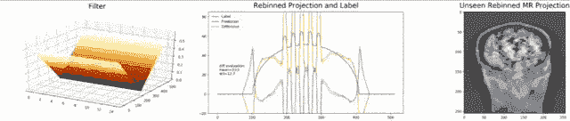

迭代中的多过滤器版本。来自[深度学习讲座](https://www.youtube.com/watch?v=p-_Stl0t3kU&list=PLpOGQvPCDQzvgpD3S0vTy7bJe2pf_yJFj&index=1)的 [CC BY 4.0](https://creativecommons.org/licenses/by/4.0/) 下的图片。

我们现在还可以训练视图相关的过滤器。这就是你在这里看到的。现在，我们为获得的每个不同视图设置了一个过滤器。我们仍然可以显示预测图像和标签图像之间的差异，并再次直接应用于我们的拟人化模型。你也可以看到，在这种情况下，我们得到了很好的收敛。我们训练过滤器，这些过滤器可以联合起来，以产生非常好的影像。

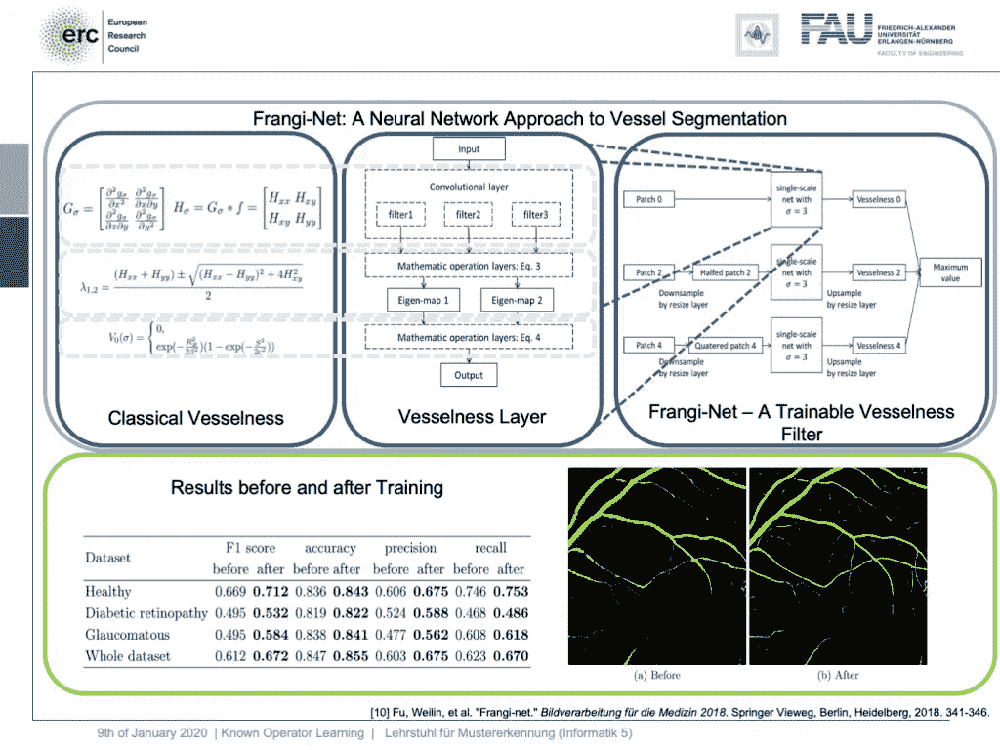

诸如 Frangi 滤波器之类的经典方法也适用于已知的算子学习。 [CC 下的图片来自](https://creativecommons.org/licenses/by/4.0/)[深度学习讲座](https://www.youtube.com/watch?v=p-_Stl0t3kU&list=PLpOGQvPCDQzvgpD3S0vTy7bJe2pf_yJFj&index=1)的 4.0 。

很好，还有其他的东西，我们可以用来作为一种先验知识。在这项工作中，我们基本上采用了一种启发式方法，即 Frangi 提出的所谓的血管性过滤器。你可以看到它所做的处理本质上是卷积。有一个特征值计算。但是如果你看看特征值计算，你可以看到这个中心方程。它也可以表示为一个层，这样我们可以将 Frangi 过滤器的整个计算映射到一个专门的层中。然后，这可以在多尺度方法中训练，并给你一个可训练版本的 Frangi 滤波器。现在，如果你这样做，你可以产生血管分割，它们基本上是受 Frangi 滤波器的启发，但因为它们是可训练的，所以它们产生更好的结果。

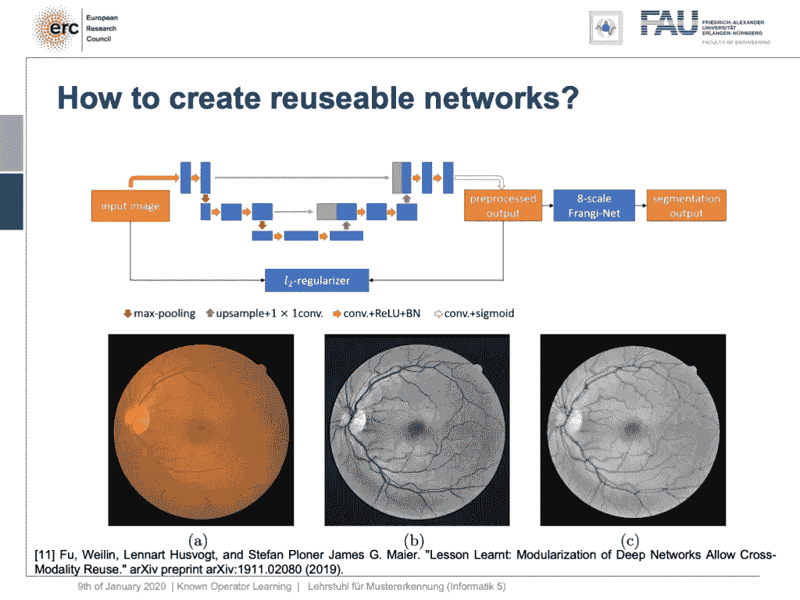

通过适当的损耗，我们可以使网络块服务于特定的属性。来自[深度学习讲座](https://www.youtube.com/watch?v=p-_Stl0t3kU&list=PLpOGQvPCDQzvgpD3S0vTy7bJe2pf_yJFj&index=1)的 [CC BY 4.0](https://creativecommons.org/licenses/by/4.0/) 下的图片。

这有点有趣，但你很快就会意识到弗兰基滤波器失败的一个原因是预处理不充分。因此，我们也可以将它与一种预处理网络结合起来。这里的想法是，假设你采用一个 U 型网络或导向过滤网络。同样，引导滤波器或联合双边滤波器可以映射到神经网络层。你可以在这里包括他们，你设计一个特殊的损失。这种特殊的损失不仅仅是优化分段输出，而是将它与某种自动编码器损失结合在一起。因此，在这一层中，您希望预处理后的图像仍然与输入图像相似，但其属性使得使用 8 尺度 Frankie 滤波器的血管分割效果更好。所以，我们可以把它放入我们的网络并训练它。结果，我们得到了血管检测，并且这种血管检测与 U 网相当。现在，U-Net 本质上是一个黑盒方法，但在这里我们可以说“好的，我们有一种预处理网。”顺便说一下，使用导向过滤器，它真的很好。所以，不一定是 U 网。这是一种神经网络调试方法。你可以证明我们现在可以一个模块接一个模块地替换我们的 U-net。在上一个版本中，我们根本没有 U 网，但我们有一个导向滤波器网络和 Frangi 滤波器。这与 U-net 的性能基本相同。所以，这样我们就能模块化我们的网络。为什么要创建模块？原因是模块是可重用的。这里，您可以看到眼科数据的眼部成像数据输出。这是典型的眼底图像。所以这是眼睛背景的 RGB 图像。它显示了血管都穿透视网膜的盲点。视网膜中央凹是视网膜上分辨率最高的地方。现在，通常如果你想分析这些图像，你只需要绿色通道，因为它是对比度最高的通道。我们的预处理网络的结果可以在这里显示。因此，我们获得了显著的噪音降低，但同时，我们也获得了对船只的重视。所以，这在某种程度上改善了血管的显示方式，也保存了精细的血管。

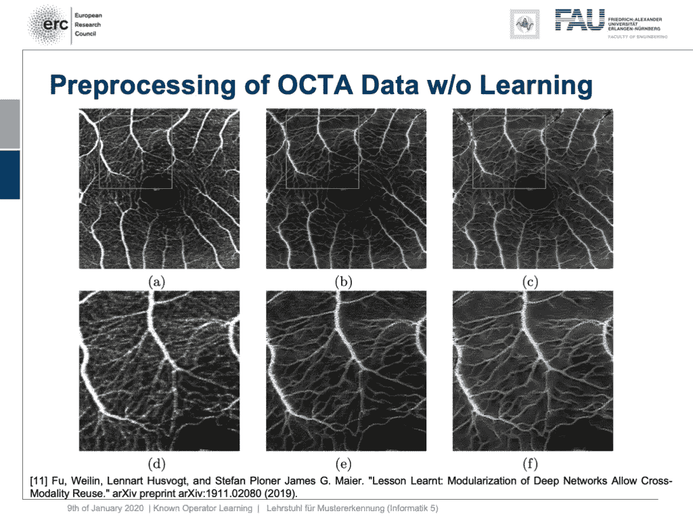

学习的预处理滤波器可以与其他模态一起使用，而不需要微调。 [CC 下的图片来自](https://creativecommons.org/licenses/by/4.0/)[深度学习讲座](https://www.youtube.com/watch?v=p-_Stl0t3kU&list=PLpOGQvPCDQzvgpD3S0vTy7bJe2pf_yJFj&index=1)的 4.0 。

好吧，这很好，但它只对眼底数据有效，对吧？不，我们的模块化表明，如果我们采用这种建模方式，我们能够将滤波器转换为完全不同的模态。这就是现在的光学相干断层血管造影术(OCTA)，一种提取眼睛背景的无对比度血管图像的专业模式。您现在可以证明，我们的预处理过滤器可以应用于这些数据，而不需要任何额外的微调、学习或诸如此类的东西。你把这个过滤器应用到人脸图像上，当然，这些图像显示了相似的解剖结构。但是你根本不需要任何关于 OCTA 数据的培训。这是左边的 OCTA 输入图像。中间是我们滤波器的输出，右边是两者的 50%混合。这里是放大的区域，大家可以清楚地看到，看起来像噪声的东西实际上在滤波器的输出中变成了血管。这些是定性的结果。顺便说一下，到目前为止，我们终于也有了定量结果，我们实际上很高兴我们的预处理网络真的能够在正确的位置生产容器。所以，这是一个非常有趣的结果，这向我们展示了我们可以将网络模块化，使它们可以重复使用，而不必训练它们。因此，我们现在可能可以生成无需额外调整和微调即可重组到新网络中的数据块。这真的很酷。

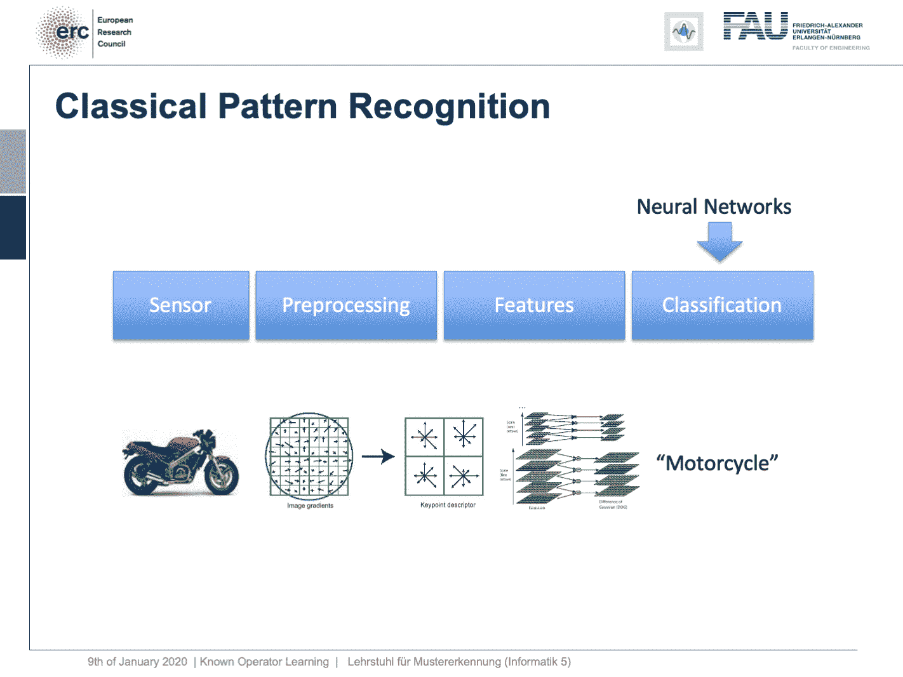

经典的模式识别管道演变成了深度学习。我们能从经典理论中得到启发，并以这种方式创建可重用的模块吗？ [CC 下的图片来自](https://creativecommons.org/licenses/by/4.0/)[深度学习讲座](https://www.youtube.com/watch?v=p-_Stl0t3kU&list=PLpOGQvPCDQzvgpD3S0vTy7bJe2pf_yJFj&index=1)的 4.0 。

好吧，这基本上把我们带回了经典的模式识别管道。你记得，我们在最开始的中看到了那个[。我们有传感器、预处理、特征和分类。神经网络的经典角色只是分类，在这条路径上有所有这些特征工程。我们说，进行深度学习会好得多，因为这样我们就可以端到端地做所有事情，并且我们可以在途中优化所有事情。现在，如果我们看这个图表，我们也可以思考我们是否真的需要类似神经网络设计模式的东西。一种设计模式当然是端到端学习，但您可能也想包括这些自动编码器预处理损失，以便最大限度地利用您的信号。一方面，你要确保你有一个可解释的模块，它仍然在图像域中。另一方面，你想要有好的功能，我们在这堂课上学到的另一件事是多任务学习。因此，多任务学习将相同的潜在空间与不同的问题关联起来，得到不同的分类结果。这样，通过实现多任务丢失，我们可以确保获得非常通用的特性，以及适用于各种不同任务的特性。因此，本质上我们可以看到，通过适当构造我们的损失函数，我们实际上回到了经典的模式识别管道。这与传统意义上的模式识别管道不同，因为一切都是端到端的和可区分的。因此，你可能会说我们现在要做的是 CNN、ResNets、全局池、差异化渲染，甚至是嵌入到这些网络中的已知操作。然后，我们基本上得到了可以重组的模块，我们可能最终得到可微分的算法。这就是我们要走的路:可区分的、可调整的算法，只需要一点点数据就可以微调。](https://www.youtube.com/watch?v=nFiQF_xF9EU&feature=youtu.be)

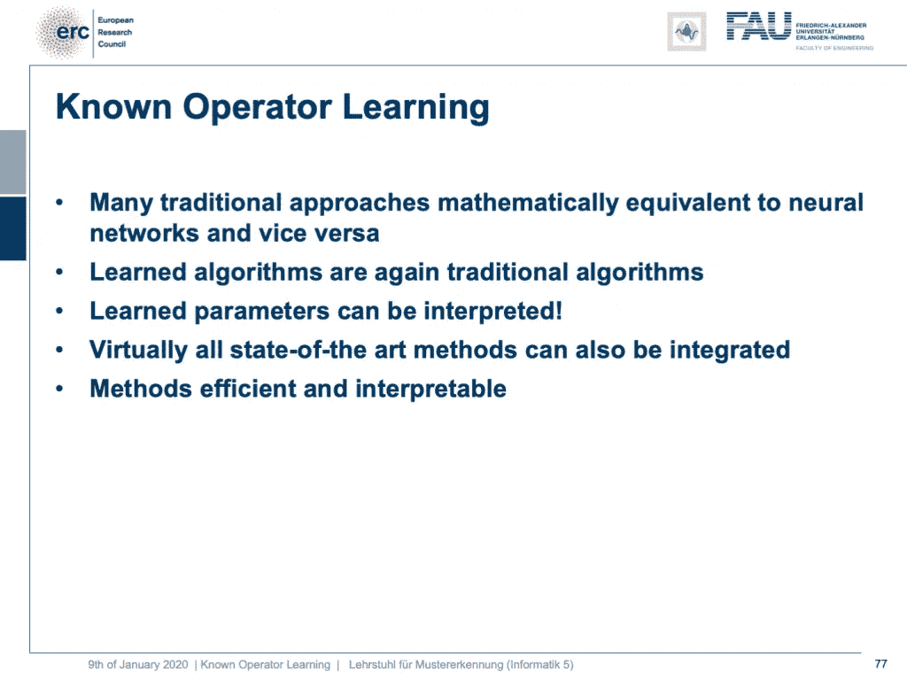

已知操作员学习的总结。来自[深度学习讲座](https://www.youtube.com/watch?v=p-_Stl0t3kU&list=PLpOGQvPCDQzvgpD3S0vTy7bJe2pf_yJFj&index=1)的 [CC BY 4.0](https://creativecommons.org/licenses/by/4.0/) 下的图片。

我想向你们展示这个概念，因为我认为已知算子学习非常酷。这也意味着你不必扔掉所有你已经学过的经典理论:傅立叶变换和所有处理信号的巧妙方法。他们仍然是非常有用的，他们可以嵌入到你的网络中，而不仅仅是使用正则化和损失。我们已经看到，当我们谈到这个偏差-方差权衡时，这基本上是一种你可以同时减少方差和偏差的方法:你结合了关于这个问题的先验知识。所以，这很酷。然后，你可以创建算法，学习权重，减少参数的数量。现在，我们有了一个很好的理论，它也向我们展示了我们在这里所做的事情是合理的，并且几乎所有最先进的方法都可以被整合。很少有运算找不到次梯度近似。如果你找不到次梯度近似，可能还有其他方法，这样你仍然可以使用它。这使得方法非常有效，可解释，并且您还可以使用模块。所以，那很酷，不是吗？

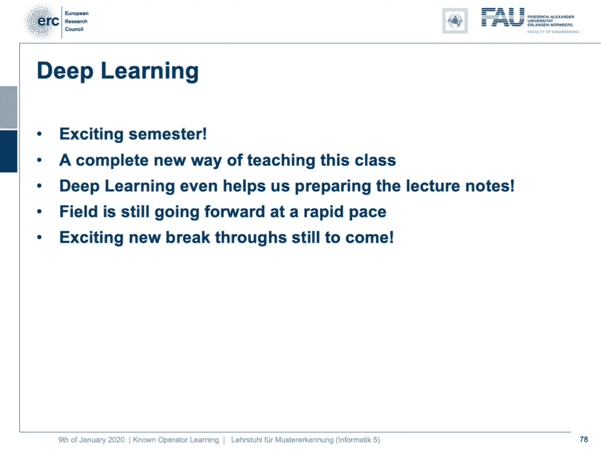

多棒的一个学期啊！ [CC 下的图片来自](https://creativecommons.org/licenses/by/4.0/)[深度学习讲座](https://www.youtube.com/watch?v=p-_Stl0t3kU&list=PLpOGQvPCDQzvgpD3S0vTy7bJe2pf_yJFj&index=1)的 4.0 。

这是我们最后一个视频。所以，我也要感谢你这个令人兴奋的学期。这是我第一次完全以视频的形式来教授这门课。到目前为止，据我所知，反馈普遍非常积极。因此，非常感谢您在途中提供反馈。这也是非常重要的，你可以看到我们在各种场合对讲座进行了改进，包括硬件和内容等等。为此非常感谢你。我从中获得了很多乐趣，我想我将来还会继续做很多事情。所以，我认为这些视频讲座是一种非常酷的方式，特别是，如果你在教一个大班的话。在非电晕的情况下，这门课会有 300 名观众，我认为，如果我们使用像这些录音这样的东西，我们也可以获得一种非常个性化的交流方式。我也可以利用我不在演讲厅的时间安排一些事情，比如问答环节。所以，这很酷。另一件很酷的事情是我们甚至可以做课堂笔记。你们中的许多人一直在抱怨，这门课没有课堂笔记，我说“看，我们让这门课跟上时代。我们包括最新和最酷的话题。制作课堂笔记非常困难。”但实际上，深度学习帮助我们制作课堂笔记，因为有视频记录。我们可以在音轨上使用语音识别，并生成课堂笔记。所以你可以看到我已经开始这样做了，如果你回到旧的录音，你可以看到我已经把链接放到了完整的文字记录中。它们以博客文章的形式发布，你也可以访问它们。顺便说一下，像视频一样，博客帖子和你在这里看到的一切都是使用 4.0 版的知识共享许可的，这意味着你可以自由地重用其中的任何部分，并重新分发和共享它。所以总的来说，我认为这个机器学习领域，特别是深度学习方法，我们现在正在快速发展。我们仍在前进。因此，我认为这些事情和发展不会很快停止，这个领域仍然非常令人兴奋。我也很兴奋，我可以在像这样的讲座中向你们展示最新的东西。因此，我认为仍有令人兴奋的新突破即将到来，这意味着我们将在未来调整讲座，制作新的讲座视频，以便能够融入最新和最伟大的方法。

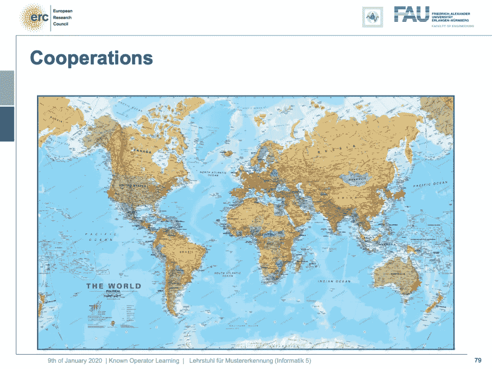

当然，在研究中你永远不会独行。当今的研究是全球性的！ [CC 下的图片来自](https://creativecommons.org/licenses/by/4.0/)[深度学习讲座](https://www.youtube.com/watch?v=p-_Stl0t3kU&list=PLpOGQvPCDQzvgpD3S0vTy7bJe2pf_yJFj&index=1)的 4.0 。

顺便说一下，我在这堂课上给你们展示的东西当然不仅仅是我们小组的。我们吸收了世界各地其他小组的许多不同成果，当然也包括我们在埃尔兰根取得的成果，我们并不孤单，但我们正在一个庞大的国际合作伙伴网络中工作。我认为这是科学需要进行的方式，现在和将来都是如此。我有一些额外的参考。好吧。这学期就这样了。非常感谢您收听所有这些视频。我希望你和他们玩得很开心。嗯，让我想想，我很确定下学期我还会教一个班。所以，如果你喜欢这门课，将来你可能会想加入我们的其他班级。非常感谢，再见！

如果你喜欢这篇文章，你可以在这里找到更多的文章，或者看看我们的讲座。如果你想在未来了解更多的文章、视频和研究，我也会很感激关注 [YouTube](https://www.youtube.com/c/AndreasMaierTV) 、 [Twitter](https://twitter.com/maier_ak) 、[脸书](https://www.facebook.com/andreas.maier.31337)或 [LinkedIn](https://www.linkedin.com/in/andreas-maier-a6870b1a6/) 。本文以 [Creative Commons 4.0 归属许可](https://creativecommons.org/licenses/by/4.0/deed.de)发布，如果引用，可以转载和修改。如果你有兴趣从视频讲座中获得文字记录，试试[自动博客](http://autoblog.tf.fau.de/)。

# 谢谢

非常感谢 Fu、Florin Ghesu、Yixing Huang Christopher Syben、Marc Aubreville 和 Tobias Würfl 对制作这些幻灯片的支持。

# 参考

[1] Florin Ghesu 等人,《不完整 3D-CT 数据中的鲁棒多尺度解剖标志检测》。医学图像计算和计算机辅助干预 MICCAI 2017 (MICCAI)，加拿大魁北克省，2017 年第 194–202 页— MICCAI 青年研究员奖
[2] Florin Ghesu 等人，用于 CT 扫描中实时 3D-Landmark 检测的多尺度深度强化学习。IEEE 模式分析与机器智能汇刊。印刷前的 ePub。2018
[3] Bastian Bier 等，用于骨盆创伤手术的 X 射线变换不变解剖标志检测。MICCAI 2018 — MICCAI 青年研究员奖
[4]黄宜兴等.深度学习在有限角度层析成像中鲁棒性的一些研究。MICCAI 2018。
[5] Andreas Maier 等《精确学习:神经网络中已知算子的使用》。ICPR 2018。
[6]托比亚斯·维尔福尔、弗罗林·盖苏、文森特·克里斯特莱因、安德烈亚斯·迈尔。深度学习计算机断层扫描。MICCAI 2016。
[7] Hammernik，Kerstin 等，“一种用于有限角度计算机断层成像重建的深度学习架构。”2017 年医学杂志。施普林格观景台，柏林，海德堡，2017。92–97.
[8] Aubreville，Marc 等，“助听器应用的深度去噪”2018 第 16 届声信号增强国际研讨会(IWAENC)。IEEE，2018。
【9】克里斯托弗·赛本、伯恩哈德·史汀普、乔纳森·洛门、托比亚斯·维尔福、阿恩德·德夫勒、安德烈亚斯·迈尔。使用精确学习导出神经网络结构:平行到扇形波束转换。GCPR 2018。
【10】傅、等.《弗兰基网》2018 年医学杂志。施普林格观景台，柏林，海德堡，2018。341–346.
[11]傅、、伦纳特·胡斯沃格特和斯特凡·普洛纳·詹姆斯·g·迈尔。"经验教训:深度网络的模块化允许跨模态重用."arXiv 预印本 arXiv:1911.02080 (2019)。