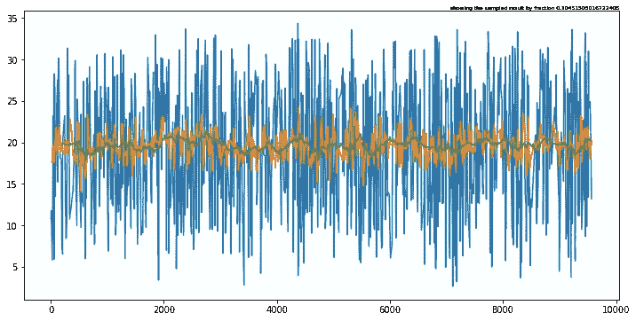
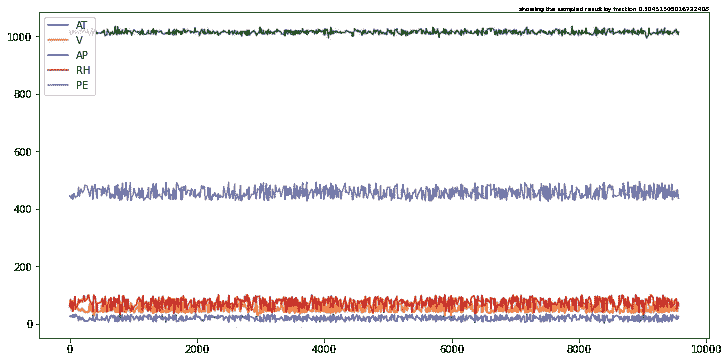
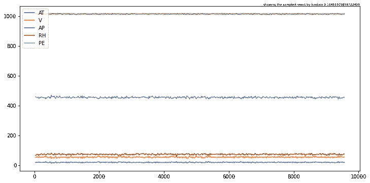
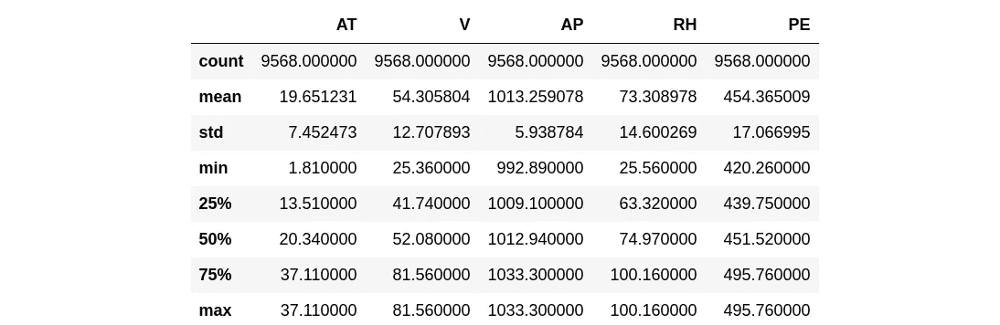
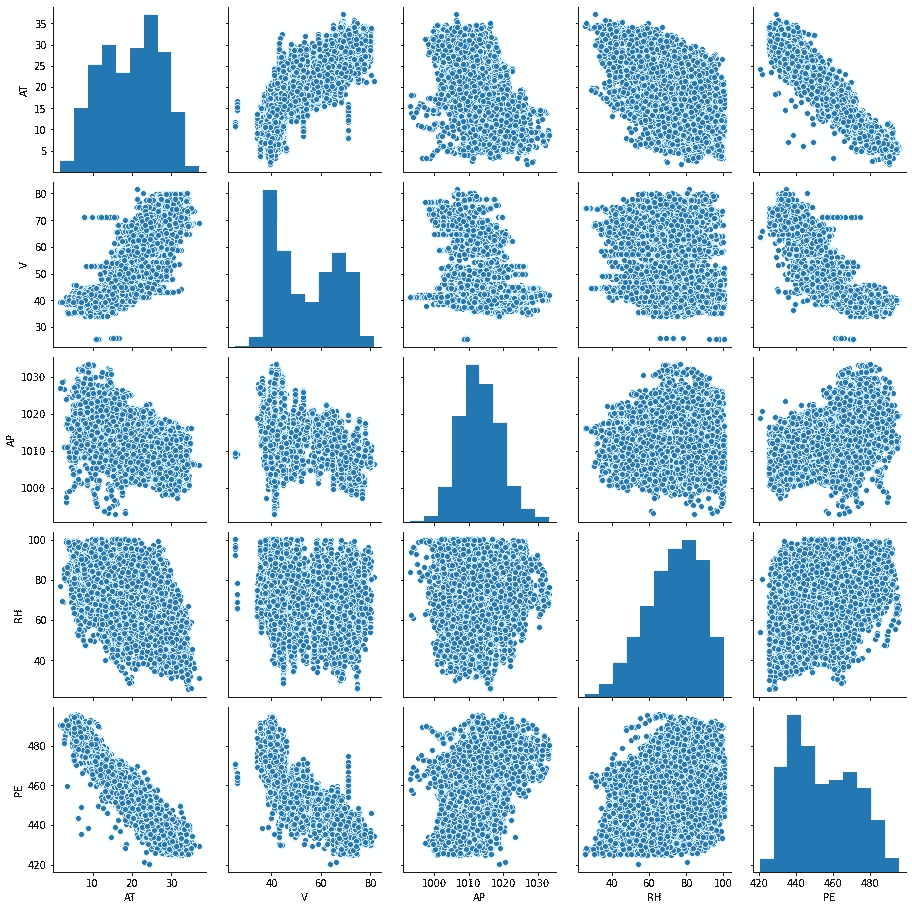
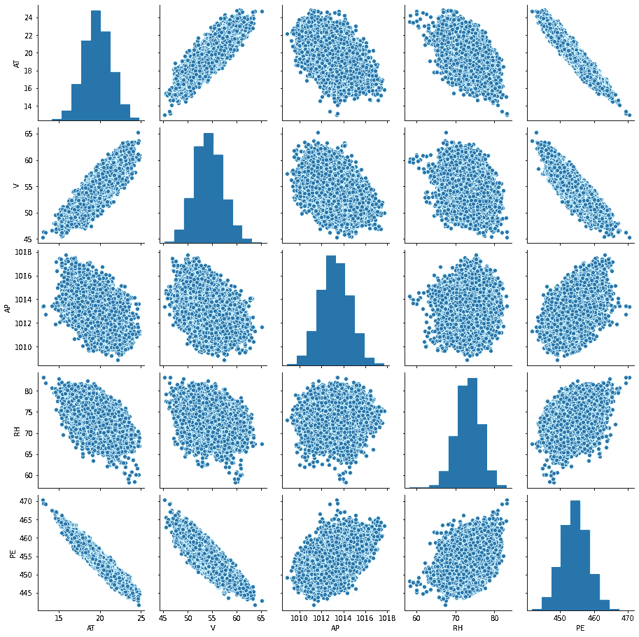
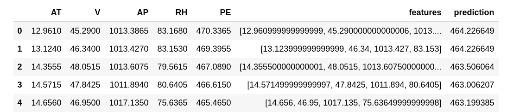
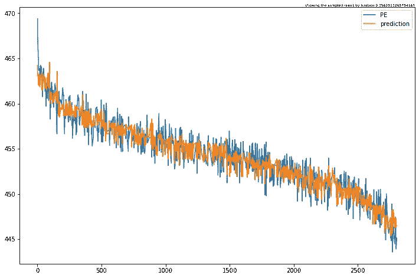

# 用考拉和火花进行机器学习

> 原文：<https://towardsdatascience.com/koalas-ml-4807f2c56e98?source=collection_archive---------20----------------------->

## 实用指南

## 有火花后端的熊猫

andas 被认为是用 python 编写的事实上的数据分析库。大多数数据科学家或机器学习工程师在转到其他库之前都是从 Pandas 和 Numpy 开始的。没有一次可以围绕使用 Pandas 作为标准数据处理库展开辩论。使用 Pandas 有很多好处，但是 Pandas API 适应分布式处理的一个关键瓶颈是。像摩丁和达斯克这样的解决方案在一定程度上解决了这个问题。


作者使用 Canva.com 的图片

说到使用分布式处理框架，Spark 是专业人员和大型数据处理中心事实上的选择。最近，Databricks 的团队开源了一个名为[考拉](https://koalas.readthedocs.io/en/latest/?badge=latest)的库，用 spark 后端实现了熊猫 API。这个库正在积极开发中，覆盖了超过 60%的熊猫 API。要阅读更多关于使用考拉的内容，请参考我之前的文章[激发熊猫的火花:数据布里克的考拉与谷歌实验室](https://medium.com/analytics-vidhya/spark-ifying-pandas-databricks-koalas-with-google-colab-93028890db5)。

在本教程中，我将带领您使用 Koalas 和 PySpark 执行探索性数据分析，并使用 Spark 分布式框架构建回归模型。在处理大型数据集时，使用考拉而不是熊猫 API 有很多好处。一些关键点是

1.  大数据处理变得简单
2.  从熊猫到考拉的快速转变
3.  与 PySpark 无缝集成

本教程的目标是利用 Spark 后端，使用考拉完成一个完整的机器学习开发周期。工作中的谷歌合作实验室将被嵌入。

# 在 Google 联合实验室中设置 Spark 3.0.1

作为第一步，我用 spark 安装配置 google colab 运行时。详细内容，读者可以在 Google Colab om medium 阅读我的文章[入门 Spark 3.0.0。](https://medium.com/analytics-vidhya/getting-started-spark3-0-0-with-google-colab-9796d350d78)

我们将安装以下程序

*   Java 8
*   火花-3.0.1
*   Hadoop3.2
*   [Findspark](https://github.com/minrk/findspark)

您可以使用下面的命令集安装最新版本的 Spark。

```
# Run below commands
!apt-get install openjdk-8-jdk-headless -qq > /dev/null
!wget -q http://apache.osuosl.org/spark/spark-3.0.1/spark-3.0.1-bin-hadoop3.2.tgz
!tar xf spark-3.0.1-bin-hadoop3.2.tgz
!pip install -q findspark
```

## 环境变量

安装完 spark 和 Java 之后，设置安装 Spark 和 Java 的环境变量。

```
import os
os.environ["JAVA_HOME"] = "/usr/lib/jvm/java-8-openjdk-amd64"
os.environ["SPARK_HOME"] = "/content/spark-3.0.1-bin-hadoop3.2"
```

## 火花安装试验

让我们在 google colab 环境中测试 spark 的安装。

```
import findspark
findspark.init()

from pyspark.sql import SparkSession

spark = SparkSession.builder.master("local[*]").getOrCreate()
# Test the spark 
df = spark.createDataFrame([{"hello": "world"} for x in range(1000)])

df.show(3, False)/content/spark-3.0.1-bin-hadoop3.2/python/pyspark/sql/session.py:381: UserWarning: inferring schema from dict is deprecated,please use pyspark.sql.Row instead
  warnings.warn("inferring schema from dict is deprecated,"

+-----+
|hello|
+-----+
|world|
|world|
|world|
+-----+
only showing top 3 rows
```

## 安装考拉

在安装 spark 并确保它正常工作后，我们现在可以使用 pip 安装 databrick 的考拉了。

```
! pip install koalasRequirement already satisfied: koalas in /usr/local/lib/python3.6/dist-packages (1.2.0)
Requirement already satisfied: numpy<1.19.0,>=1.14 in /usr/local/lib/python3.6/dist-packages (from koalas) (1.18.5)
Requirement already satisfied: matplotlib<3.3.0,>=3.0.0 in /usr/local/lib/python3.6/dist-packages (from koalas) (3.2.2)
Requirement already satisfied: pyarrow>=0.10 in /usr/local/lib/python3.6/dist-packages (from koalas) (0.14.1)
Requirement already satisfied: pandas<1.1.0,>=0.23.2 in /usr/local/lib/python3.6/dist-packages (from koalas) (1.0.5)
Requirement already satisfied: pyparsing!=2.0.4,!=2.1.2,!=2.1.6,>=2.0.1 in /usr/local/lib/python3.6/dist-packages (from matplotlib<3.3.0,>=3.0.0->koalas) (2.4.7)
Requirement already satisfied: cycler>=0.10 in /usr/local/lib/python3.6/dist-packages (from matplotlib<3.3.0,>=3.0.0->koalas) (0.10.0)
Requirement already satisfied: kiwisolver>=1.0.1 in /usr/local/lib/python3.6/dist-packages (from matplotlib<3.3.0,>=3.0.0->koalas) (1.2.0)
Requirement already satisfied: python-dateutil>=2.1 in /usr/local/lib/python3.6/dist-packages (from matplotlib<3.3.0,>=3.0.0->koalas) (2.8.1)
Requirement already satisfied: six>=1.0.0 in /usr/local/lib/python3.6/dist-packages (from pyarrow>=0.10->koalas) (1.15.0)
Requirement already satisfied: pytz>=2017.2 in /usr/local/lib/python3.6/dist-packages (from pandas<1.1.0,>=0.23.2->koalas) (2018.9)
Requirement already satisfied: pyarrow in /usr/local/lib/python3.6/dist-packages (0.14.1)
Requirement already satisfied: numpy>=1.14 in /usr/local/lib/python3.6/dist-packages (from pyarrow) (1.18.5)
Requirement already satisfied: six>=1.0.0 in /usr/local/lib/python3.6/dist-packages (from pyarrow) (1.15.0)# Install compatible version of pyarrow
! pip install pyarrowimport seaborn as sns/usr/local/lib/python3.6/dist-packages/statsmodels/tools/_testing.py:19: FutureWarning: pandas.util.testing is deprecated. Use the functions in the public API at pandas.testing instead.
  import pandas.util.testing as tmimport databricks.koalas as ks
```

# 机器学习开发周期

开发机器学习模型的标准做法是执行探索性数据分析，执行特征工程，并建立模型。我将试着用考拉来接触上述观点的基础。我相信大多数 ML 工程师/科学家都使用 Pandas API 来执行 EDA 和特征工程。我演示了如何使用考拉来完成这项工作，并使用 PySpark 来构建模型。

我将使用[联合循环发电厂](https://archive.ics.uci.edu/ml/datasets/combined+cycle+power+plant)数据集来预测每小时净电力输出(EP)。我已经把数据上传到我的 GitHub 上，这样用户就可以重现结果了。

## 使用考拉进行探索性数据分析

作为第一步，我想使用考拉 API 探索给定的数据、它的分布和依赖性。我将包括一个简单的例子来演示这个想法，用户可以针对手头的问题扩展它。

下载数据并保存在本地

```
# Downloading the clustering dataset
!wget -q 'https://raw.githubusercontent.com/amjadraza/blogs-data/master/spark_ml/ccpp.csv'
```

使用考拉`read_csv`方法读取数据。要阅读更多关于 API 的内容，请关注[考拉官方文档](https://koalas.readthedocs.io/en/latest/?badge=latest)

```
# Read the iris data
kdf_ccpp = ks.read_csv("ccpp.csv")kdf_ccpp.columnsIndex(['AT', 'V', 'AP', 'RH', 'PE'], dtype='object')kdf_ccpp.head()
```


就像熊猫一样，考拉也有绘制数据以理解变量的功能。在下面的例子中，我绘制了原始数据和它的平滑版本。这个例子演示了`plot`和`rolling`窗口方法的使用

```
kdf_ccpp['AT'].plot(figsize=(12,6))
kdf_ccpp['AT'].rolling(window=20).mean().plot()
kdf_ccpp['AT'].rolling(window=200).mean().plot()<matplotlib.axes._subplots.AxesSubplot at 0x7f9992f63320>
```



作者图片:更平滑版本的 AT 特性图

就像上面的绘图一样，用户可以绘制所有的列。参见下面的命令

```
kdf_ccpp.plot(figsize=(12,6))<matplotlib.axes._subplots.AxesSubplot at 0x7f9993b7e668>
```



作者图像:原始数据图

使用 20 个数据点的移动平均值绘制所有列。

```
kdf_ccpp.rolling(window=20).mean().plot(figsize=(12,6))<matplotlib.axes._subplots.AxesSubplot at 0x7f99939bd358>
```



作者图片:平滑数据图

下面的命令演示了`describe`的使用，这是一种类似于 Pandas API 中的方法。

```
kdf_ccpp.describe()
```



作者图片

## 特征工程

特征工程步骤通常与 EDA 结合在一起。用户准备特性的目的是获得最具预测性和分布良好的特性集。在本文中，我将演示如何使用考拉来执行特征工程。

为了理解不同变量之间的关系，`paiprplot`函数`seaborn`被广泛使用。使用 below 命令绘制数据集中变量的 pairplot。由于 Seaborn 不支持考拉数据帧，用户必须在调用 pairplot 之前将其转换为熊猫数据帧。

```
sns.pairplot(kdf_ccpp.to_pandas())<seaborn.axisgrid.PairGrid at 0x7f99989459e8>
```



作者提供的图片:原始要素和目标的配对图

通过查看上图，我们可以看到很多离群值，对于一些变量与目标的关系并不清楚。为了去除异常值，最简单的解决方案是计算移动平均值，我用考拉来演示。

```
sns.pairplot(kdf_ccpp.rolling(window=20).mean().to_pandas())<seaborn.axisgrid.PairGrid at 0x7f9993a5ada0>
```



作者提供的图像:平滑特征和目标的配对图

看起来 20 天移动平均线与目标变量有更好的关系，因此使用 20 天平均线更有意义。

## 使用 PySpark 建模

一旦 EDA 和特性工程完成，就该建立预测模型了。使用考拉数据框架的好处之一是用户可以无缝地创建 Spark 数据框架。在下一节中，我将演示如何使用 PySpark API 来构建和训练梯度推进机器(GBM)。

```
# Create the moving average features
kdf = kdf_ccpp.rolling(window=20, min_periods=1).mean()# Convert the Koalas DataFrame into Spark DataFrame
sdf = kdf.to_spark()sdf.show(5,False)+------------------+------+------------------+-----------------+-----------------+
|AT                |V     |AP                |RH               |PE               |
+------------------+------+------------------+-----------------+-----------------+
|14.96             |41.76 |1024.07           |73.17            |463.26           |
|20.07             |52.36 |1022.055          |66.125           |453.815          |
|15.083333333333334|48.04 |1018.7566666666667|74.79666666666667|465.3966666666667|
|16.5275           |50.36 |1016.6275         |75.2575          |460.6675         |
|15.386000000000001|47.788|1015.1479999999999|79.53            |463.314          |
+------------------+------+------------------+-----------------+-----------------+
only showing top 5 rows
```

现在，使用 PySpark API 构建模型。关于使用 PySpark 构建模型的更多细节，请参考我的文章[使用 Spark 进行机器学习](/machine-learning-with-spark-f1dbc1363986)。

```
from pyspark.ml.regression import LinearRegression
from pyspark.ml.feature import VectorAssembler
from pyspark.ml.evaluation import RegressionEvaluator
from pyspark.ml.regression import GBTRegressor
```

准备与 PySpark 型号兼容的功能

```
# Create the feature column using VectorAssembler class
vectorAssembler = VectorAssembler(inputCols =["AT", "V", "AP", "RH"], outputCol = "features")
vpp_sdf = vectorAssembler.transform(sdf)vpp_sdf.show(2, False)+-----+-----+--------+------+-------+-----------------------------+
|AT   |V    |AP      |RH    |PE     |features                     |
+-----+-----+--------+------+-------+-----------------------------+
|14.96|41.76|1024.07 |73.17 |463.26 |[14.96,41.76,1024.07,73.17]  |
|20.07|52.36|1022.055|66.125|453.815|[20.07,52.36,1022.055,66.125]|
+-----+-----+--------+------+-------+-----------------------------+
only showing top 2 rows
```

创建 tarin 并测试拆分

```
# Define train and test data split
splits = vpp_sdf.randomSplit([0.7,0.3])
train_df = splits[0]
test_df = splits[1]
```

建立和训练模型

```
# Define the GBT Model
gbt = GBTRegressor(featuresCol="features", labelCol="PE")
gbt_model = gbt.fit(train_df)
gbt_predictions = gbt_model.transform(test_df)
```

评估模型准确性

```
# Evaluate the GBT Model
gbt_evaluator = RegressionEvaluator(labelCol="PE", predictionCol="prediction", metricName="rmse")
gbt_rmse = gbt_evaluator.evaluate(gbt_predictions)
print("The RMSE of GBT Tree regression Model is {}".format(gbt_rmse))The RMSE of GBT Tree regression Model is 1.077464978110743
```

将预测转换回考拉数据框架

```
kdf_predictions = ks.DataFrame(gbt_predictions)kdf_predictions.head()
```



让我们从模型中画出实际值和预测值。

```
kdf_predictions[['PE', 'prediction']].plot(figsize=(12,8))<matplotlib.axes._subplots.AxesSubplot at 0x7f9992ba4828> 
```



作者图片:实际 PE 与预测 PE 图

# 一个有效的 Google Colab

下面是工作谷歌 colab 笔记本重新创建教程。试试看，在可能的情况下，在目前用考拉代替熊猫的基础上开发机器学习算法。

# 结论

在本教程中，我演示了使用考拉来执行探索性数据分析和特征工程。对于熊猫用户来说，使用 Spark 后端进行分布式计算的好处是，切换到考拉是直接的。在讨论的要点下面

*   考拉过去常常表演 EDA
*   使用考拉的特征工程
*   PySpark 与考拉的整合

# 参考资料/阅读/链接

1.  【https://spark.apache.org/docs/latest/ml-features.html 号
2.  【https://koalas.readthedocs.io/en/latest/?badge=latest 
3.  [https://towards data science . com/machine-learning-with-spark-f1dbc 1363986](/machine-learning-with-spark-f1dbc1363986)
4.  [https://medium . com/analytics-vid hya/getting-started-spark 3-0-0-with-Google-colab-9796d 350d 78](https://medium.com/analytics-vidhya/getting-started-spark3-0-0-with-google-colab-9796d350d78)
5.  [https://medium . com/analytics-vid hya/spark-ifying-pandas-data bricks-koala-with-Google-colab-93028890 db5](https://medium.com/analytics-vidhya/spark-ifying-pandas-databricks-koalas-with-google-colab-93028890db5)