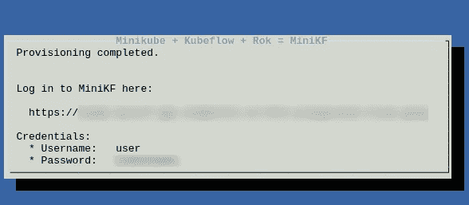
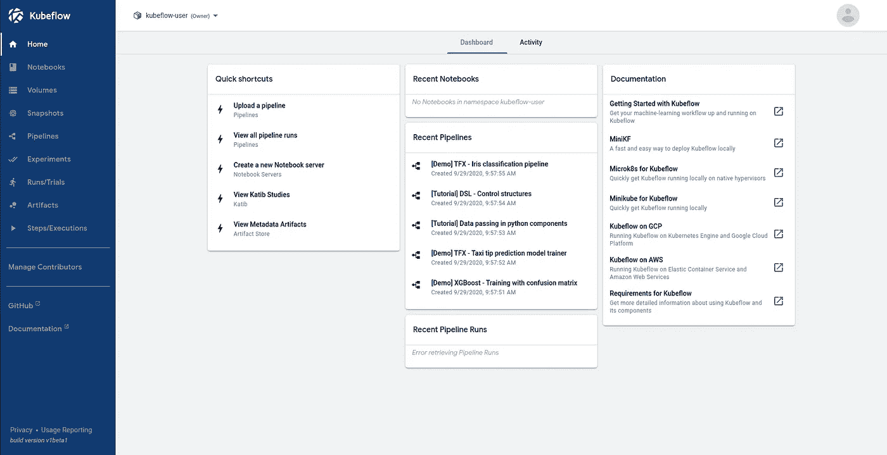
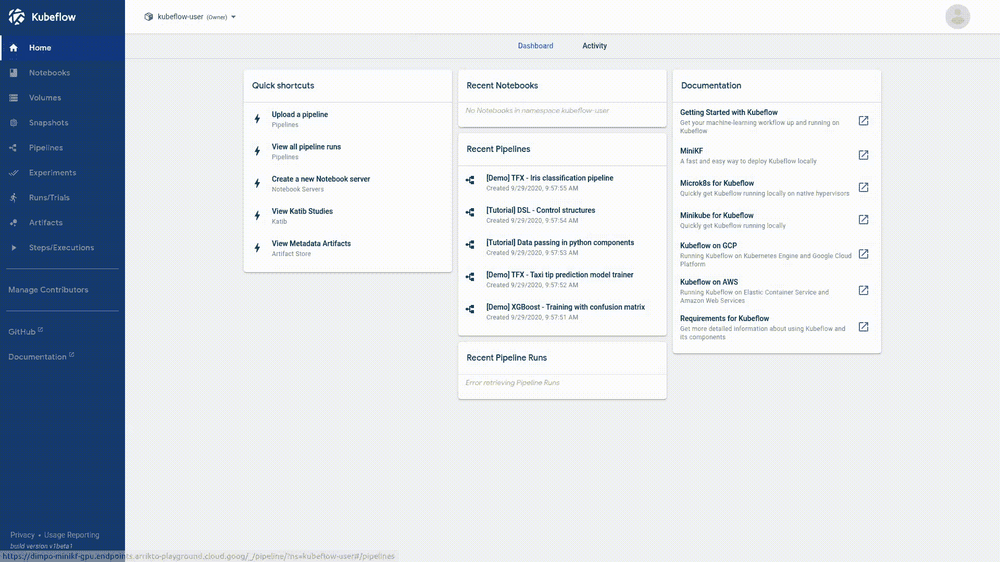

# Kubeflow 比以往任何时候都更容易接近

> 原文：<https://towardsdatascience.com/kubeflow-is-more-accessible-than-ever-with-minikf-33484d9cb26b?source=collection_archive---------33----------------------->

## 10 分钟内开始使用 Kubernetes 的最佳机器学习平台

由 [Unsplash](https://unsplash.com/s/photos/data?utm_source=unsplash&utm_medium=referral&utm_content=creditCopyText) 上的 [Pietro Jeng](https://unsplash.com/@pietrozj?utm_source=unsplash&utm_medium=referral&utm_content=creditCopyText) 拍摄

机器学习项目通常由多个相互关联的步骤组成:数据采集、数据处理、数据建模、微调、测试等。这些步骤中的每一步都可以是一个独立的过程，以自己的节奏运行，具有明确定义的输入和输出。因此，数据科学家和 ML 工程师倾向于认为这些项目像管道。

[库巴流管道](https://www.kubeflow.org/docs/pipelines/overview/pipelines-overview/)，库巴流的一个组件，就是为了解决这个设计模式。此外，Kubeflow 将在您的 ML 项目的整个生命周期中为您提供帮助:**实验和元数据跟踪、与框架无关的培训、Jupyter 服务器、模型服务等等。**

但是我们如何部署一个 Kubeflow 实例来开始使用它呢？我们应该创建和维护一个 Kubernetes 集群吗？

嗯，有更好的入门方式: [MiniKF](https://www.kubeflow.org/docs/started/workstation/getting-started-minikf/) 。就像 [minikube](https://github.com/kubernetes/minikube) *，* MiniKF 提供了一个单节点 [Kubernetes](https://kubernetes.io/) 集群，上面部署了 Kubeflow。所以，我们来看看怎么设置吧！

> [学习率](https://mailchi.mp/d2d2d4a109b5/learning-rate-newsletter)是为那些对 AI 和 MLOps 的世界感到好奇的人准备的时事通讯。你会在每周五收到我关于最新人工智能新闻和文章的更新和想法。在这里订阅[！](https://mailchi.mp/d2d2d4a109b5/learning-rate-newsletter)

# KubeFlow 简介

Kubeflow 是一个开源项目，致力于使 ML 项目的部署更加简单、可移植和可伸缩。来自[文档](https://www.kubeflow.org/):

> *kube flow 项目致力于使在 Kubernetes 上部署机器学习(ML)工作流变得简单、可移植和可扩展。我们的目标不是重新创建其他服务，而是提供一种简单的方法来将 ML 的最佳开源系统部署到不同的基础设施上。无论你在哪里运行 Kubernetes，你都应该能够运行 Kubeflow。*

但是我们如何开始呢？我们需要 Kubernetes 集群吗？我们应该自己部署整个系统吗？我的意思是，你有没有看过 Kubeflow 的[清单回购](https://github.com/kubeflow/manifests)？

不要慌；最终，在 Kubeflow 上运行笔记本所需要的只是一个谷歌云平台(GCP)账户和你的旧笔记本文件！

# MiniKF

我将保持简单，不使它变得愚蠢。事实是，只需几分钟就可以轻松运行 Kubeflow 的单节点实例。我们需要的只是一个 GCP 帐户和从市场部署应用程序的能力。我们要用 MiniKF！

MiniKF 部署—作者图片

1.  去你的 GCP *控制台*
2.  搜索市场然后找到 *MiniKF*
3.  点击它并选择*启动*
4.  设置 VM 配置，(由于我的配额，我通常将数据磁盘更改为标准持久磁盘)并单击 deploy。

就是这样！部署最多需要十分钟，您可以按照屏幕上的说明观看进度；ssh 进入机器，在终端上运行`minikf`,等待直到您的端点和凭证准备好。

MiniKF 的提供已完成—图片由作者提供

现在，我们准备访问 Kubeflow 仪表板。点击网址，输入你的凭证，你就可以开始了！

Kubeflow 仪表板—按作者分类的图像

# 运行 Jupyter 服务器

为了运行我们的实验，我们需要一个 Jupyter 笔记本实例。在 Kubeflow 中创建一个 Jupyter 笔记本相对容易。我们首先需要创建一个 Jupyter 服务器并连接到它。让我们这样做:

1.  从左侧面板中选择笔记本
2.  选择`New Server`按钮
3.  填写服务器的名称，并请求您需要的 CPU 和 RAM 数量
4.  保持 Jupyter 笔记本图像不变(`jupyter-kale:v0.5.0-47-g2427cc9` —注意图像标签可能不同)

创建 Jupyter 服务器—作者图片

完成这四个步骤后，等待笔记本服务器准备好并连接。你将被转移到你熟悉的 JupyterLab 工作区。如果您想要一个关于如何在不编写任何代码的情况下将您的笔记本转变为 Kubeflow 管道的端到端教程，请参见此处:

 [## Jupyter 准备生产；原样

### 无需编写一行代码，即可将您的笔记本草稿转化为生产就绪的 Kubeflow 管道。

towardsdatascience.com](/jupyter-is-ready-for-production-as-is-b36f1d1ca8f8) 

# 结论

在这个故事中，我们看到了如何在 10 分钟内启动并运行 Kubeflow 实例。开始使用这个强大的工具很容易；运行您的笔记本电脑，使用 Katib 启动超参数调整实验，并使用 KFServing 为您的模型提供服务。

我们已经看到了如何在不编写任何代码的情况下将您的 Jupyter 笔记本转换成 Kubeflow 管道。在未来的帖子中加入我们，了解更多:超参数调优、版本控制、调试等等！

# 关于作者

我叫[迪米特里斯·波罗普洛斯](https://www.linkedin.com/in/dpoulopoulos/)，我是一名为[阿里克托](https://www.arrikto.com/)工作的机器学习工程师。我曾为欧洲委员会、欧盟统计局、国际货币基金组织、欧洲中央银行、经合组织和宜家等主要客户设计和实施人工智能和软件解决方案。

如果你有兴趣阅读更多关于机器学习、深度学习、数据科学和数据运算的帖子，请在 twitter 上关注我的[媒体](https://medium.com/@dpoulopoulos)、 [LinkedIn](https://www.linkedin.com/in/dpoulopoulos/) 或 [@james2pl](https://twitter.com/james2pl) 。

所表达的观点仅代表我个人，并不代表我的雇主的观点或意见。