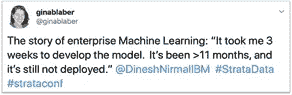
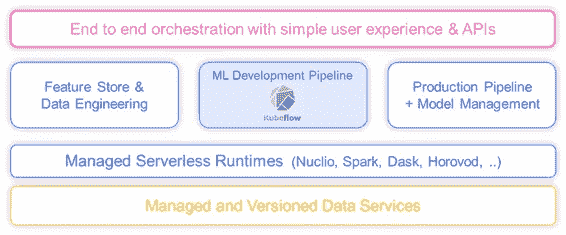
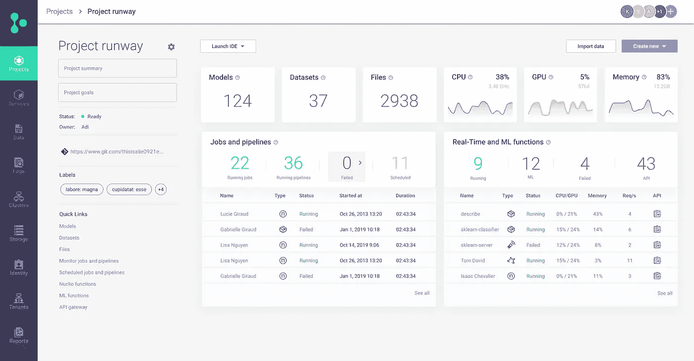
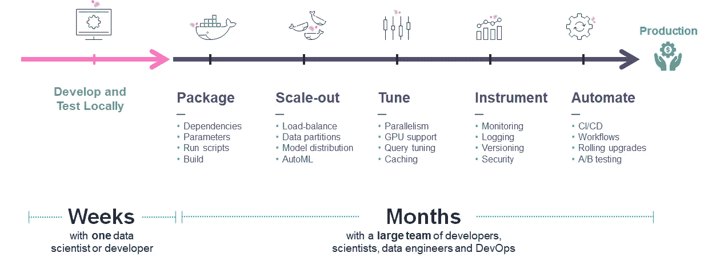

# Kubeflow:简化、扩展和可操作化

> 原文：<https://towardsdatascience.com/kubeflow-simplified-extended-and-operationalized-fcbcc34f79e5?source=collection_archive---------15----------------------->

来源:shutterstock

公司的成功和发展与他们在技术堆栈中使用的技术紧密相关。这一点在开发 ML 管道时表现得最为明显。

将健壮的 ML 模型和数据管道交付给生产是一件复杂的事情。无论给定项目的范围如何，每个数据科学团队都面临相同的限制和约束:

*   大规模的特征分析和准备是困难的
*   运行许多 ML 训练任务，每个任务具有不同的参数或算法，花费太多时间并且需要昂贵的资源
*   跟踪和复制实验，以及代码、数据和结果的正确版本是复杂的
*   将数据科学笔记本代码转移到生产管道需要付出大量努力
*   生产管道需要处理许多可伸缩性、可用性、自动化模型漂移检测、与实时数据集成、安全性等操作任务。

建立模型远不是旅程的终点。为了将支持人工智能的应用部署到生产中，你需要一群开发人员、数据工程师、DevOps 实践者和数据科学家，他们最好在一个平台上协作和工作。

在这个新兴领域中，没有多少解决方案能够覆盖这个特殊的领域，而 Kubeflow 在过去几年中作为开源领导者的势头越来越大。 [Kubeflow](https://www.kubeflow.org/) 是在 [Kubernetes](https://kubernetes.io/) 上编排复杂工作流的绝佳工具，但它也带来了挑战，尤其是对于不习惯使用这类解决方案的数据科学家来说。许多 ML 从业者发现它使用起来很复杂，遇到各种各样的可用性问题，并对功能差距感到沮丧。

幸运的是，可以扩展 Kubeflow 的功能，并将其转变为一个全面、易于使用的 [MLOps](https://www.iguazio.com/mlops/) 平台。在 [Iguazio](https://www.iguazio.com/) ，我们已经做到了。我们已经接受了库伯流。我们的方法是将它添加到我们的托管服务目录中，弥补现有的功能差距，用我们开发的新开源框架包装和扩展它的功能。

# 为什么我们需要 MLOps 解决方案？

## 数据科学家的生活:工具辩论者

数据科学家在开发模型时通常会经历以下过程:

1.  从 CSV 或密集格式(如[拼花地板](https://parquet.apache.org/))收集数据，需要从外部来源手动提取。使用的工具:ETL 和数据导出工具。
2.  数据标记，探索和丰富，以确定潜在的模式和特征。使用的工具:用于数据标记、探索和模型开发的交互式工具；用于大规模聚合、连接和透视数据的分析工具/数据库。
3.  模型训练和验证。使用的工具:并行模型培训框架。
4.  使用自动化和/或可视化工具进行模型评估。使用的工具:CI/CD 框架，可视化库。
5.  回到第 1 步并重复，直到达到预期的结果。

这导致大量耗时且复杂的跑腿工作。如果数据科学团队想要让一个模型走出实验室，那么他们必须引入一些方法。

# 这只是开始

但是这个漫长的过程只是第一步！您仍然需要操作模型，将它与应用程序联系起来，并自动化您的功能工程过程。这可能需要*一年或更长的时间*，并且需要一大批 ML 从业者用蛮力来解决这个问题。

来源:推特

一旦我们有了一个模型，我们需要检查所有的许多步骤，以便将基于 AI/ML 的应用程序交付到生产中。这包括:封装、扩展、性能调整、仪器和自动化。

# Kubeflow 是 Kubernetes 的 ML 工具包

[Kubeflow](https://github.com/kubeflow/kubeflow) 是由 Google 发起的一个开源项目，它将领先的 ML 框架集合在 [Kubernetes](https://kubernetes.io/) 之上。它提供了通用的安装工具和交叉验证，但是它的工具也可以独立部署。它充当模型开发的砖块和灰泥，专注于 Kubernetes 上 ML 模型开发管道的自动化、缩放和跟踪。

# 值得注意的 Kubeflow 组件:

## 集装箱式 Jupyter 笔记本

Kubeflow 在 Kubernetes 上提供了一个 [Jupyter](https://jupyter.org/) 笔记本服务，因此用户可以创建一个具有给定资源需求的 Jupyter 服务器，并获得预配的容器。

## 库伯弗洛管道公司(KFP)

什么是 [Kubeflow 管道](https://github.com/kubeflow/pipelines)？简单地说，它是一个 ML 工作流及其所有组件的描述。一个组件可以负责 ML 过程中的不同步骤，如数据处理、转换、模型训练、验证等。

KFP 使您能够通过 Python SDK 描述具有单个步骤的工作流(其中每个步骤都是容器微服务或无服务器功能)，在集群上执行该工作流，并跟踪进度和实验结果。

KFP 使用户能够自动化 ML 管道，而不是手动运行单个作业。

## 可扩展培训操作员

Kubernetes 中的应用生命周期和伸缩可以通过一个[操作符](https://kubernetes.io/docs/concepts/extend-kubernetes/operator/)来管理。Kubeflow 项目托管各种运营商，使用不同的 ML 框架( [TensorFlow](https://www.tensorflow.org/) 、 [PyTourch](https://pytorch.org/) 、 [Horovod](https://eng.uber.com/horovod/) 、 [MXNet](https://mxnet.apache.org/) 、 [Chainer](https://chainer.org/) )运行可扩展的 ML 训练任务。

## 模型服务解决方案

Kubeflow 项目托管一个基本的模型服务框架(KFServing)并支持外部服务框架(Seldon、Triton 和 [Nuclio-serving](https://github.com/mlrun/mlrun/tree/development/mlrun/serving) )。Iguazio 领先的开源项目 [Nuclio](https://github.com/nuclio/nuclio) 是一个用于实时 API、ML 和数据工程任务的无服务器引擎，它有一个[模型，提供](https://github.com/mlrun/mlrun/tree/development/mlrun/serving)风格的快速性能和大量功能(自动模型部署、金丝雀、模型监控、漂移和异常值检测、集成和实时管道等)。) .

# 实施 Kubeflow:主要挑战

Kubeflow 本身就是一个更广泛的 ML 操作系统的组成部分。Kubeflow 包含一些强大的组件，使其成为该领域的领跑者——它是 Kubernetes 原生的、高度可定制的、开源的和松散耦合的。但是它有一些关键的限制，需要由 ML 团队来解决。

# 挑战 1:复杂性

Kubeflow 是一个工具生态系统，而不是一个整体或集成的解决方案，它依赖于许多底层平台服务和工具(Kubernetes、用户管理、数据服务、数据版本、监控、日志、API 网关等。).如果没有托管解决方案，公司需要一个由开发人员、开发人员和 ML 工程师组成的团队，他们将致力于将各种 Kubeflow 和附加组件集成到一个具有统一门户和安全性的完整服务中，管理部署，支持内部用户，升级每个子服务，构建用于故障排除的工具和专业知识，并持续跟踪社区工作。如果您已经有一个大型的 DevOps 组织和廉价的资源，这可能是有意义的，但对于许多想要专注于他们的业务应用程序的精简组织来说就没有意义了。

让我们假设您想要使用 Katib 之类的工具运行超参数作业，使用 Kubeflow Pipelines、MPIJob 之类的分布式 ML 操作符，并跟踪或比较结果。您需要手动将所有这些工具缝合在一起，即使它们都是 Kubeflow 下的子项目。

正确安装 Kubeflow 意味着运行和管理十几个单独的服务，其中一些不是生产级的。喜欢 Kubernetes 上的单一 AI/ML 框架概念的 ML 从业者发现他们正在努力部署、管理和保护它。一旦他们这样做了，他们注意到他们的内部用户由于可用性和集成问题而不愿意使用它。

# 挑战 2: Kubeflow 说的是工程师的语言，而不是科学家的语言

Kubeflow 的核心焦点是使用 Kubernetes 的高级 ML 工程。它最初是由 Kubernetes 社区成员为 DevOps 和 MLOps 工程师设计的，而不是为数据科学家设计的。

像 Kubernetes 的其他功能一样，这一切都始于 Docker 容器、YAML 文件和脚本。数据科学家是数据科学平台的主要消费者。他们不想管理 YAML 文件——他们宁愿使用简单的用户界面和数据工程，或者 Python 中的 ML 逻辑，让一些东西在集群上为他们运行，然后收集结果，希望以可扩展和可管理的方式。

虽然在分布式管道中运行 ML 任务非常强大，但数据科学家通常从使用本地 IDE 开始，如 Jupyter、PyCharm 或 VSCode。他们希望在本地开发、调试、运行和跟踪工作，而不创建 Kubernetes 资源或复杂的管道，并且只有在他们成功完成单独运行后，他们(或团队中的 ML 工程师)才希望过渡到在可扩展的集群上运行或使用多级管道。不幸的是，这在 Kubeflow 中是不可能的，因为每个被跟踪的执行都需要构建完整的管道和 Kubernetes 资源。

数据科学团队希望基于逻辑 ML 项目来组织和管理他们的工作，具有清晰的项目级别成员关系、项目特定的资源和计费、隔离项目之间的资源和安全凭证的能力等。在 Kubeflow 中，用户可以使用提升的权限创建作业，在用户或项目级别没有隔离、监控或跟踪。

同样，许多任务是复杂的手动任务。例如，如果您想要查看管道运行的结果，您必须编写代码来存储和可视化运行工件，大多数商业工具或托管工具可以为您做到这一点。

数据科学团队应该能够使用熟悉的工具和简单的 UI 门户，并在幕后为他们调配和监控资源。

# 挑战 3: Kubeflow 是部分 MLOps 解决方案

Kubeflow 工具包主要应用于模型开发阶段，这意味着团队需要其他几个强制服务，这进一步增加了开销。为了快速(或完全)实现商业价值，团队需要将 Kubeflow 功能扩展到数据科学管道的其余部分，并手动与外部数据和身份管理系统集成。

MLOps 堆栈和 Kubeflow(图片由作者提供)

Kubeflow 专注于运行和跟踪 ML 实验的模型开发管道，然而大多数用户需要如上图所述的附加服务，可扩展数据和特征工程、模型管理、生产/实时管道、版本化和管理的数据仓库、管理的运行时、认证/安全等服务。

Iguazio 开发了开源框架(如 [Nuclio](https://github.com/nuclio/nuclio) 、 [MLRun](https://github.com/mlrun/mlrun) )和额外的数据服务和管理层，将 Kubeflow 补充和扩展为一个功能齐全的托管数据科学平台。这将在下一节中进一步描述。

# 交付端到端数据科学平台 Kubeflow Inside

将基于数据科学的产品交付到生产环境的大部分复杂性在于不同组织和技术孤岛之间的集成，采用单个“同类最佳”组件并手动集成它们需要大量资源，维护组织孤岛，并导致巨大的技术债务，因为您需要维护所有集成和粘合层。

我们认为，组织应该部署一个涵盖数据工程、数据科学、ML 工程和 DevOps 领域的数据科学解决方案。我们需要抽象掉大部分复杂性，同时实现一个高性能、可扩展且安全的平台，该平台可以部署在任何云中或内部。

以下是 Iguazio 平台上的附加功能列表(大部分是开源的):

## 具有用户友好的门户、API 和自动化的集成解决方案

可用性是 Kubeflow 的主要挑战之一，加上 Kubeflow 只解决了解决方案的一部分(没有离线开发、数据工程或生产部署)。用户发现自己在与多个门户和用户界面对抗，并添加了大量粘合代码。

假设所有数据科学元素和元数据由一个服务管理，您可以使用要素存储创建一个要素集对象，将其作为对象传递给培训、验证或模型服务逻辑，使用它来验证您的模型行为和概念漂移，并直接从生产管道更新它和相应的标记数据。使用粘合逻辑和脚本来实现这一点几乎是不可能的，并且会导致大量额外的开发和 ML 工程工作。

名为 [MLRun](https://github.com/mlrun/mlrun) 的开源框架控制着从数据摄取到生产管道的整个功能，它提供了全面的 Web UI、CLI、API/SDK，并且与 underline Kubeflow 组件(操作符、管道等)紧密集成。)

通过 [MLRun](https://github.com/mlrun/mlrun) ，用户可以在任何地方使用他们的原生 IDE (Jupyter、PyCharm、VSCode 等)通过 SDK 和 IDE 插件工作。)，不需要在 Kubernetes 集群上运行，只需要几个简单的命令就可以运行单个任务或者完成批处理和实时管道。

执行、实验、数据、模型跟踪和自动化部署通过 [MLRun](https://github.com/mlrun/mlrun) 无服务器运行时引擎自动完成。MLRun 通过严格的成员关系和跨团队协作来维护项目层次结构(而不是像 Kubeflow 那样使用平面名称空间)。

示例:MLRun 项目仪表板屏幕(图片由作者提供)

您可以按照 [MLRun 文档](https://mlrun.readthedocs.io/en/latest/)中所述部署各种组件，或者您也可以使用 Iguazio 的托管产品，该产品在 MLRun 和 Kubeflow 以及其他数据和管理服务的基础上增加了端到端安全性和完全托管的服务体验。

## 功能商店

特征工程可能是构建 ML 管道中最耗时的任务之一。如果没有所有特性的共享目录，团队就有浪费时间进行重新开发以及跨团队和项目重复工作的风险。需要使用数据工程框架(如 Spark、Presto、Dask 等)定期计算这些特征。)和流处理引擎(Flink、Nuclio 等。)并使用用于训练的离线/批处理 API 和用于服务的实时 API 和数据库来交付。特征存储的一个主要优点是为训练和服务层提供了一致的特征集，确保训练好的模型在生产中保持其性能。

此外，要素存储是存储版本化要素元数据和统计数据的关键元素，这对于进行模型监控、验证、概念漂移检测和持续再训练至关重要。

建立自己的功能商店是一种奢侈，通常只保留给一线网络公司，因为它需要复杂的堆栈。没有特性存储的选择意味着团队将投入大量的手工数据工程工作来构建和维护特性。

## 实时管道、模型管理和监控

一旦模型准备就绪，它们需要转变为运行的微服务，这些微服务通过 API 或数据流接受特征向量，并产生预测结果，这些结果需要在生产业务应用中使用。实际上，生产流水线比简单的服务端点复杂得多，它们可能包括特征检索、转换、验证、异常值检测、集合或更复杂图形下的多个模型服务、警报等步骤。

[Nuclio](https://github.com/nuclio/nuclio) 和 [MLRun-serving](https://github.com/mlrun/mlrun/tree/development/mlrun/serving) 开源框架使团队能够在几分钟内根据训练结果和实时特征存储中的数据构建复杂的实时数据处理和模型服务管道，并通过单个 API/UI 命令部署或升级到生产。

将模型投入生产只是其生命周期的开始。必须记录模型的预测和行为，必须监控它们的概念漂移，有时在变化的环境下根据新数据进行重新训练。数据需要治理和审计。如果没有一个集中的系统，模型维护会很快变得难以管理并且过于昂贵。

## 托管服务和无服务器运行时

大量工作投入到创建和管理各种软件包，并将它们转化为具有自动扩展、配置管理、升级和安全性的生产服务。典型的数据科学堆栈可以由数十种服务组成，如数据分析工具、ML/AI 框架、开发工具、仪表盘、安全和授权服务以及日志记录。您可以雇佣一个大型团队来手动构建一个堆栈，或者您可以使用一个带有托管服务的平台，允许用户选择服务、指定参数并单击部署。

此外，将代码转化为产品服务是一个耗时的项目，涉及许多团队成员(见下图)。您需要将代码打包到容器中，针对弹性、可伸缩性、性能、强化安全性、添加工具等对其进行重新设计。许多数据科学家不精通软件开发和 DevOps，因此这些任务对他们来说更具挑战性。无服务器技术的使用使团队能够自动完成所有这些任务。

MLRun runtimes 和 Nuclio 可以获取一段代码，并自动将它转换为一个灵活的、完全托管的服务，这可以通过 UI 或在您的开发环境(如 Jupyter)中使用一行代码来完成。

无服务器功能可以独立运行，也可以作为步骤插入到更大的 Kubeflow 管道中，无需任何额外的开发。MLRun 项目支持自动化 CI/CD 管道。每次代码、数据或配置更改时，都可以通过 Git 挂钩触发工作流，项目成员可以查看结果并批准自动部署到测试或生产系统中。

从开发迁移到生产的努力(图片由作者提供)

**功能市场和汽车**

您可以开发自己的功能，或者使用市场上的一组预烘焙功能，然后将它们插入到您的管道中，无需任何开发工作。[ML run 函数市场](https://github.com/mlrun/functions)提供了一套用于特征分析、检测和自动化 ML 训练的 AutoML 函数。这些功能是为规模、性能而设计的，并可通过仪器和可视化报告进行生产。

团队可以实现本地功能市场/存储库，最大化协作和重用。一个成员可以构建一个可以在另一个项目中使用的功能，或者由另一个团队成员改进并返回到市场(使用不同的版本标签)。

# 生产就绪的托管数据服务

每一个数据科学解决方案都处理数据，数据可以以多种形式出现(文件、表格、流、时间序列等。)，这需要与几个底层数据服务集成。应控制数据访问，将每个作业或用户限制在特定的数据集内，并具有特定的访问权限，此外，必须对数据进行版本控制以实现可再现性。

您可以从不同的云提供商那里获得并集成托管数据服务。Iguazio 拥有业界领先的高性能多模式数据库和低延迟分布式文件系统，采用独特的技术，使用闪存/SSD 存储，但性能类似于内存中的数据库，成本仅为其一小部分，而且规模更大。这些因素有助于加快部署、提高性能、扩大规模和降低成本。

# 端到端安全性

数据科学平台可能包含从多个用户聚合的非常敏感的数据。必须实施多层安全方法，包括:

1.  身份验证和身份管理:使用行业标准协议，如 LDAP、OAuth2 和 OIDC，确定哪个用户或服务正在访问一段数据或另一项服务。
2.  基于角色的访问控制(RBAC):强制每个用户、任务或角色的访问权限，他们可以访问哪些资源，他们可以执行哪些操作。
3.  数据安全:控制数据资产的访问和隐私。
4.  机密管理:保护机密和访问凭证，避免将这些机密存储在代码或数据资产中，而是在执行时将它们提供给特定的用户和作业。

MLRun 支持与安全服务的集成。您可以自己部署和集成它们，也可以使用 Iguazio 托管平台，为您提供所有固化和全面的管理。

# 摘要

在 [Iguazio](https://www.iguazio.com/) ，我们坚信 Kubeflow 的潜力，这就是我们选择将其包装并扩展为完整的端到端 MLOps 解决方案的原因。我们还相信打破数据工程、数据科学和 DevOps 从业者之间的孤岛，这样就可以抽象出复杂性，组织就不会背负沉重的技术债务。通过一些额外的服务和功能，Kubeflow 可以成为应对操作化机器学习挑战的正确解决方案，为数据科学家提供高性能、可扩展和安全的技术，可以部署在任何云、本地或混合环境中。