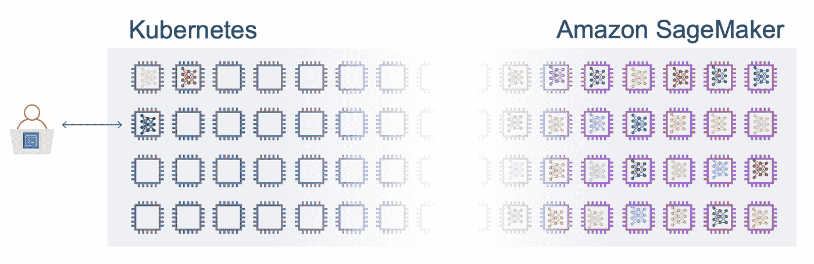
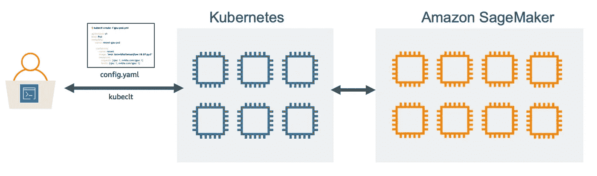
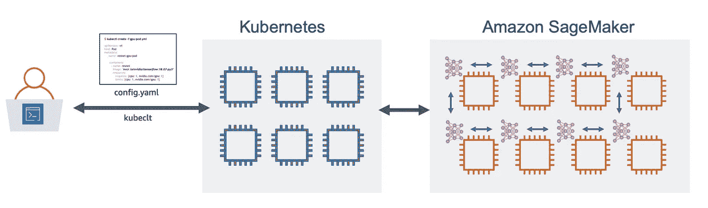
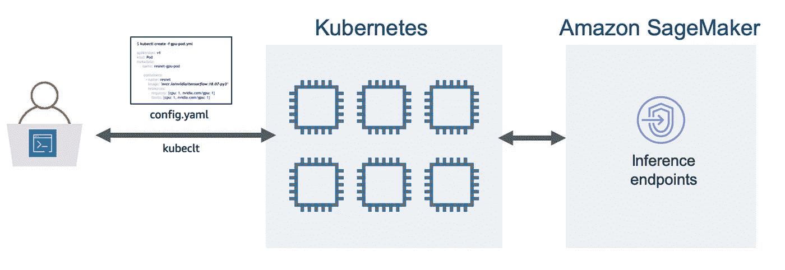
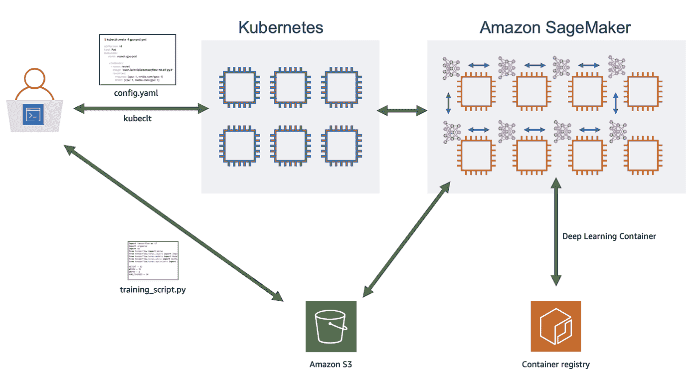
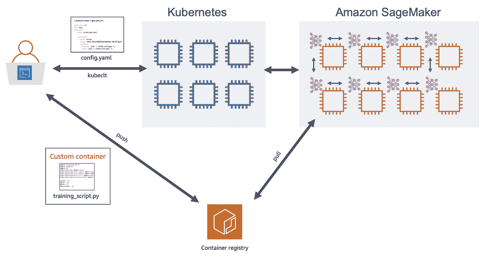
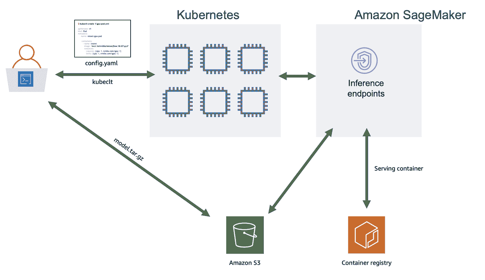

# Kubernetes 和亚马逊 SageMaker 的机器学习——两全其美

> 原文：<https://towardsdatascience.com/kubernetes-and-amazon-sagemaker-for-machine-learning-best-of-both-worlds-part-1-37580689a92f?source=collection_archive---------11----------------------->

## 使用 Amazon SageMaker 为机器学习工作负载扩展 Kubernetes 集群的容量和功能



Kubernetes 和亚马逊 SageMaker——两全其美

如果你是一个经常训练和部署机器学习模型的团队的一员，你可能有一个集群设置来帮助协调和管理你的机器学习工作负载。你使用 Kubernetes(和 KubeFlow)或亚马逊 SageMaker 的机会。

到目前为止，你必须选择你的编排系统，并坚持下去。您要么(1)根据数据科学团队的预期工作负载调配 Kubernetes 集群，要么(2)完全由 Amazon SageMaker 管理，根据需要自动调配和拆除资源。

如果能两全其美岂不是很好？

*   使用 Kubernetes 管理您的工作流，并使用 Amazon SageMaker 获得大规模分布式培训的爆发容量？
*   用 Kubeflow Jupyter 笔记本开发算法和模型，用亚马逊 SageMaker 大规模运行超参数实验？
*   使用 Kubeflow 训练模型，并托管一个推理端点 Amazon SageMaker，可以弹性扩展到数百万用户？

有了针对 Kubernetes 的亚马逊 SageMaker 运营商，你就可以做到这一点！您可以使用它来训练机器学习模型，优化超参数，运行批量转换作业，并使用 Amazon SageMaker 设置推理端点，而无需离开您的 Kubernetes 集群。



使用 Amazon SageMaker Operators for Kubernetes 来运行培训作业、模型调优作业、批量转换作业，并使用 Kubernetes 配置文件和 kubectl 在 Amazon sage maker 上设置推理端点

用于 Kubernetes 的 Amazon SageMaker Operators 是 Kubernetes 中的一个[定制资源](https://kubernetes.io/docs/concepts/extend-kubernetes/api-extension/custom-resources/)，它支持使用 Kubernetes CLI 和配置文件调用 Amazon SageMaker 功能。事实上，Kubernetes 的许多核心功能都是作为定制资源构建的，这种模块化使得 Kubernetes 非常具有可扩展性。对于 Kubernetes 用户来说，Amazon SageMaker Operators 使您能够以一种一致的方式与 Kubernetes 和 Amazon SageMaker 进行交互。

在这篇博文中，我将概述 Amazon sage maker Operators for Kubernetes，为什么它很重要，以及常见的使用模式，以便您可以决定这是否适合您。这篇博文中引用的所有代码、配置文件和演示 Jupyter 笔记本都可以在 GitHub 上获得:

> [https://github . com/shashankprasanna/kubernetes-sage maker-demos . git](https://github.com/shashankprasanna/kubernetes-sagemaker-demos.git)

要深入了解如何使用 Amazon SageMaker Operators for Kubernetes 实现分布式培训、模型调优和模型托管示例，请查看随附的帖子:

> [用于 Kubernetes 的 Amazon SageMaker 运营商——分布式培训、超参数调整和模型托管的示例](https://medium.com/p/kubernetes-and-amazon-sagemaker-for-machine-learning-distributed-training-hyperparameter-tuning-187c821e25b4?source=email-e0c596ca35b5--writer.postDistributed&sk=482ac690fe10d9273a2b2d1219cc47d3)

# 云中的一对

Kubernetes 和 Kubeflow 项目享有强大的用户社区，是机器学习领域发展最快的开源项目之一。只要您拥有设置、管理和排除 Kubernetes 集群故障的内部专业知识，您就可以获得作为数据科学家或机器学习研究人员所需的一切——Jupyter 笔记本和对 KubeFlow 分布式培训的支持，KubeFlow 和 Katib 的超参数调整，以及 KFServing 的轻松推理部署。作为 Kubernetes 用户，您可以完全灵活地选择在哪里运行它(本地或云)，以及在什么系统上运行它。这也意味着您要负责保持群集的高利用率，以降低运营成本，鉴于突发性或峰值机器学习工作负载的性质，这可能是一项挑战。

亚马逊 SageMaker 采取了不同的方法。首先，它为机器学习工作流程的几乎每个部分提供了一套完全托管的服务，从数据标记、托管 Jupyter 笔记本开发环境、使用后自动供应和拆除的托管培训集群、超参数优化、托管模型托管服务等等。作为 Amazon SageMaker 用户，您不必关注基础设施管理和集群利用率之类的事情。

作为一名机器学习实践者，你应该能够利用两者的优势。例如，您应该能够将持续运行的(或多或少)固定容量自我管理的 Kubernetes 基础架构与按需、完全管理的弹性 Amazon SageMaker 基础架构配对，后者仅在您需要时供应。这是一个强大的想法——数据科学家团队可以让他们的想法自由驰骋，随心所欲地进行实验，而不受现有 Kubernetes 设置的限制。

您现在已经可以做到这一点，但是必须在这两个系统之间来回切换。有了 Amazon sage maker Operators for Kubernetes，您现在无需离开您可能已经熟悉的 Kubernetes 环境就可以做到这一点。

# 场景和用例

借助 Amazon SageMaker Operators for Kubernetes，您可以将单节点培训、分布式或多节点培训、大规模超参数调整和托管推理部署等工作负载卸载到 Amazon sage maker 的完全托管基础设施中。因此，问题就变成了，什么时候把工作负载转移到 Amazon SageMaker 上比在 Kubernetes 集群上运行更有意义？

让我们通过几个假设的场景来探讨这个问题。

## 场景#1 —大规模培训能力过剩



使用 Amazon sage maker Operators for Kubernetes 通过 kubectl 提交培训工作。Amazon SageMaker 提供所需的容量并运行培训作业。

假设您目前正在本地数据中心或使用亚马逊 EKS 的 AWS 上运行 Kubernetes 集群。在设置时，您根据当时的工作负载对数据中心的 CPU、GPU 和存储数量进行了预算和选择。现在，您的团队已经壮大，或者您拥有更多数据，需要更多计算能力。如果您有 128 个 GPU，您可以在一天内完成一个机器学习训练实验的快速截止日期，但在您的 Kubernetes 集群上，他们都在忙于其他项目。你只需要短时间的额外突发容量。

你的选择是

1.  扩展您现有的 Kubernetes 集群并添加所需的资源
2.  使用所需的资源启动另一个 Kubernetes 集群
3.  使用 Amazon SageMaker 进行按需供应

(1)和(2)是您没有参与的额外基础设施工作。(3)是一个很好的选择，但是要求您离开您熟悉的 Kubernetes 环境，并且它没有集成到您已经设置的任何 CI/CD 自动化中。

还有第四种选择。使用 Amazon SageMaker Operators for Kubernetes 通过`kubectl`提交 Amazon sage maker 作业，就像提交其他 Kubernetes 作业一样。在后台，将自动为您提供一个 Amazon SageMaker 托管集群，其中包含指定数量的实例。然后，培训作业将在 Amazon SageMaker 管理的集群上执行，一旦培训完成，该集群将自动关闭，您将看到培训的确切持续时间，这是您将支付的费用。

## 场景#2 —托管可伸缩的推理端点



使用 Amazon sage maker Operators for Kubernetes 通过 kubectl 托管推理端点。Amazon SageMaker 提供所需的实例并运行模型服务器。

让我们考虑另一种情况。您拥有针对 Kubernetes 的培训、验证和部署的 CI/CD 自动化设置。您使用 Kubernetes 托管的模型由您的客户通过终端、移动应用程序或网站使用。该模型托管在 GPU 实例上，因为延迟和性能对于您的客户体验至关重要。您希望释放 GPU 资源用于培训，并且需要能够自动扩展和执行实时模型监控。Amazon SageMaker 主机服务已经提供了这些功能，但是您希望在不中断现有 CI/CD 工作流的情况下利用这些功能。使用 Amazon SageMaker Operators for Kubernetes，您可以直接从 Kubernetes 部署一个经过训练的模型，以同样的声明方式使用 YAML 的配置文件，它可以轻松集成到您现有的设置中，并且仍然允许您获得 Amazon sage maker 托管的好处。

现在让我们来看看 Kubernetes 和 Amazon SageMaker 一起使用的一些常见使用模式。

## 使用案例#1 —利用 TensorFlow、PyTorch、MXNet 和其他框架进行分布式培训



工作流程:用户上传培训代码到亚马逊 S3。Amazon SageMaker 下载训练代码，拉出指定的框架容器，并在其中运行训练脚本。用户不必处理构建和推动容器。

借助分布式多节点训练，您可以通过在多个 GPU 之间分配工作负载来大幅减少训练模型的时间。当 Kubernetes 集群中的 GPU 容量不足时，可以配置一个分布式培训作业，在 Amazon SageMaker 管理的集群上运行。除了快速访问 AWS 上的多余容量之外，您还可以获得 Amazon SageMaker 的其他好处，如利用 Spot Instance 大幅降低培训成本的能力，在 AWS 控制台上或使用 AWS CLI 监控和跟踪培训工作的能力，以及通过几次点击托管培训模型的能力。

如果您正在使用广泛使用的框架，如 TensorFlow、PyTorch、MXNet、XGboost 等，您所要做的就是将您的培训脚本作为 tar.gz 文件上传到亚马逊 S3，并通过在 YAML 编写的 Kubernetes 配置文件向亚马逊 SageMaker 提交培训作业。看看 GitHub 存储库中的示例代码和配置文件。以下是您需要做出的更改，以便通过 Kubernetes 的 kubectl 提交您的 Amazon SageMaker 培训工作

下面是这篇博文的 [GitHub 资源库中的](https://github.com/shashankprasanna/kubernetes-sagemaker-demos)`[k8s-sm-dist-training-script.y](https://github.com/shashankprasanna/kubernetes-sagemaker-demos/blob/master/1-tf-dist-training-training-script/k8s-sm-dist-training-script.yaml)aml`文件摘录。

```
apiVersion: sagemaker.aws.amazon.com/v1
kind: TrainingJob
metadata:
  name: k8s-sm-dist-training-script 
spec:
    hyperParameters:
        - name: learning-rate
          value: "0.001"
        - name: batch-size
          value: "256"
…
        - name: sagemaker_program
          value: 'cifar10-multi-gpu-horovod-sagemaker.py'
        - name: sagemaker_submit_directory
          value: 's3://sagemaker-jobs/training-scripts/sourcedir.tar.gz'
...
    algorithmSpecification:
        trainingImage: 763104351884.dkr.ecr.us-west-2.amazonaws.com/tensorflow-training:1.15.2-gpu-py27-cu100-ubuntu18.04
        trainingInputMode: File
...
    resourceConfig:
        instanceCount: 128
        instanceType: "ml.p3.2xlarge"
        volumeSizeInGB: 50
...
```

这读起来像任何其他 Kubernetes 配置写在 YAML。对于培训工作，你会注意到顶部的`kind: TrainingJob`

以下是几个关键部分，您可以在其中指定培训工作的各个方面:

*   `**hyperParameters**` —这些在 YAML 规范中指定，因此您可以通过更改和提交培训作业来自动运行不同的实验
*   `**sagemaker_submit_directory**` —您上传培训脚本的 S3 地点。与使用 Kubernetes 提交培训相比，这是独一无二的，因为您不必构建自定义容器！Amazon SageMaker 会自动将您的培训脚本下载到现有的 TensorFlow 容器中，然后为您运行培训。没有乱搞 Docker 文件和自定义容器。
*   `**resourceConfig**` —您需要多少个什么类型的实例。该配置将要求 128 个 V100 GPUs 来运行分布式培训。
*   `**trainingImage**` — [从预先构建的容器中挑选](https://docs.aws.amazon.com/deep-learning-containers/latest/devguide/deep-learning-containers-images.html)用于 TensorFlow、PyTorch、MXNet，用于训练或推理，用于 Python2 或 Python 3，用于 CPU 或 GPU。

像提交任何其他 Kubernetes 配置文件一样提交作业。

```
kubectl apply -f k8s-sm-dist-training-script.yaml
```

## 用例 2 —使用定制容器的分布式培训



工作流:用户在本地构建一个自定义容器，并将其推送到 Amazon ECR。Amazon SageMaker 提取定制容器，并在完全管理的训练集群上运行它。

如果您正在使用定制的专有算法并构建自己的 Docker 容器，那么您更愿意指定容器映像，而不是 TensorFlow、PyTorch、MXNet 等框架培训脚本。与用例 1 不同，您必须经历额外的步骤，首先在本地构建一个自定义 docker 容器，并将其推送到 Amazon Elastic Container Registry(ECR ),并在 trainingImage 下指定其 URI。如果您没有需要构建定制容器的定制算法，我推荐使用用例 1 中的方法。

```
apiVersion: sagemaker.aws.amazon.com/v1
kind: TrainingJob
metadata:
  name: k8s-sm-dist-custom-container 
spec:
    hyperParameters:
        - name: learning-rate
          value: "0.001"
        - name: weight-decay
          value: "0.0002"
...
    algorithmSpecification:
        trainingImage: <ACCOUNT_ID>.dkr.ecr.us-west-2.amazonaws.com/<IMAGE>:latest
        trainingInputMode: File
        metricDefinitions: 
         - name: val_acc
         - regex: 'val_acc: ([0-9\\.]+)'
```

GitHub 存储库中的代码也包括重复这些步骤的 Jupyter 笔记本。

提交作业:

```
kubectl apply -f k8s-sm-dist-custom-container.yaml
```

## 用例 3——大规模超参数优化

机器学习模型的超参数是在训练阶段没有优化或学习的选项。Amazon SageMaker 提供超参数优化功能，并实现贝叶斯和随机搜索。这与 KubeFlow 的 Katib 项目所提供的功能没有什么不同。要在 Amazon SageMaker 上运行大规模的超参数调优作业，需要创建一个 Kubernetes 配置文件。这里您将指定超参数范围，而不是固定的超参数。这指示亚马逊 SageMaker 尝试不同的选项，以达到最佳模式。maxNumberOfTrainingJobs 指定您希望使用不同超参数组合运行的作业总数，maxParallelTrainingJobs 指定您希望在任何给定时间对多少个实例运行此操作。

```
apiVersion: sagemaker.aws.amazon.com/v1
kind: HyperparameterTuningJob
metadata:
    name: k8s-sm-hyperopt-training-script 
spec:
    hyperParameterTuningJobConfig:
        resourceLimits:
            maxNumberOfTrainingJobs: 32
            maxParallelTrainingJobs: 8
        strategy: "Bayesian"
        trainingJobEarlyStoppingType: Auto
        hyperParameterTuningJobObjective:
            type: Maximize
            metricName: 'val_acc'
        parameterRanges:
            continuousParameterRanges:
            - name: learning-rate
              minValue: '0.0001'
              maxValue: '0.1'
              scalingType: Logarithmic
...
            categoricalParameterRanges:
            - name: optimizer
              values:
              - 'sgd'
              - 'adam'
...
```

提交作业:

```
kubectl apply -f k8s-sm-dist-custom-container.yaml
```

## 用例 4——用 BYO 模型托管一个推理端点



工作流程:用户上传一个训练有素的模型作为 tar.gz 文件到亚马逊 S3。如果模型是使用亚马逊 SageMaker 训练的，那么 model.tar.gz 将已经在亚马逊 S3 上可用。Amazon SageMaker 下载模型文件，提取服务容器，并在完全托管的实例上托管端点。

一旦模型经过训练，您就可以使用 Amazon SageMaker 托管来托管它，而不是在您的 Kubernetes 集群上托管它。使用 Amazon SageMaker，您可以利用额外的功能和节省成本的特性进行推理部署。要进行部署，您需要创建一个配置文件:HostingDeployment。在这里，您将指定实例的类型，如果您托管多个模型，则提供 A/B 测试的权重，以及经过训练的模型在亚马逊 S3 上的位置，如下所示。

```
apiVersion: sagemaker.aws.amazon.com/v1
kind: HostingDeployment
metadata:
  name: k8s-sm-inference-host-endpoint 
spec:
    region: us-west-2
    productionVariants:
        - variantName: AllTraffic
          modelName: tf-cifar10-resnet-model
          initialInstanceCount: 1
          instanceType: ml.c5.large
          initialVariantWeight: 1
    models:
        - name: tf-cifar10-resnet-model
          executionRoleArn: arn:aws:iam::<ACCOUNT_ID>:role/service-role/AmazonSageMaker-ExecutionRole-20190820T113591 
          containers:
              - containerHostname: tensorflow
                modelDataUrl: s3://sagemaker-jobs/trained-tf-model/model.tar.gz
                image: 763104351884.dkr.ecr.us-west-2.amazonaws.com/tensorflow-inference:1.15.2-cpu-py36-ubuntu18.04
```

# 准备实施！

在这篇文章中，我简要介绍了 Amazon sage maker Operator for Kubernetes，以及如何在现有的 Kubernetes 集群中使用它。我展示了 2 个场景和 4 个不同的用例来利用 Amazon SageMaker 的优势，而无需离开您的 Kubernetes 环境。

关于如何实现这篇博文中给出的例子的分步说明，请查看这篇附带的文章:

> [*用于 Kubernetes 的 Amazon SageMaker 运营商——分布式培训、超参数调整和模型托管的示例*](https://medium.com/p/kubernetes-and-amazon-sagemaker-for-machine-learning-distributed-training-hyperparameter-tuning-187c821e25b4?source=email-e0c596ca35b5--writer.postDistributed&sk=482ac690fe10d9273a2b2d1219cc47d3)

要运行这些示例，请前往 GitHub:
[https://GitHub . com/shashankprasanna/kubernetes-sage maker-demos . git](https://github.com/shashankprasanna/kubernetes-sagemaker-demos.git)

如果你有问题，请在 twitter (@shshnkp)、LinkedIn 联系我或者在下面留言。