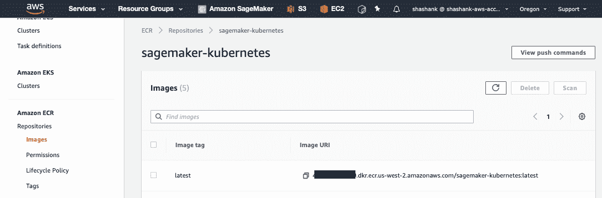

# 用于 Kubernetes 的 Amazon SageMaker 操作员—分布式培训、超参数调整和模型托管的示例

> 原文：<https://towardsdatascience.com/kubernetes-and-amazon-sagemaker-for-machine-learning-distributed-training-hyperparameter-tuning-187c821e25b4?source=collection_archive---------37----------------------->

## 了解如何编写自己的 YAML 配置文件来使用 Amazon SageMaker 操作符


使用 Amazon SageMaker Operators for Kubernetes 来运行培训作业、模型调优作业、批量转换作业，并使用 Kubernetes 配置文件和 kubectl 在 Amazon sage maker 上设置推理端点

在 re:invent 2019 上，AWS 宣布了用于 Kubernetes **、**的 [**亚马逊 SageMaker 操作符，使 Kubernetes 用户能够训练机器学习模型，优化超参数，运行批量转换作业，并使用亚马逊 SageMaker 设置推理端点——而无需离开您的 Kubernetes 集群。您可以通过在 YAML 编写熟悉的 Kubernetes 配置文件并使用`kubectl` CLI 工具将它们应用到您的 Kubernetes 集群来调用 Amazon SageMaker 功能。**](https://github.com/aws/amazon-sagemaker-operator-for-k8s)

这使您可以通过将训练和推理工作负载卸载到 Amazon SageMaker 来扩展 Kubernetes 集群的容量和机器学习能力。关于亚马逊 sage maker Operators for Kubernetes 的更多介绍，请阅读以下博客文章:

> [Kubernetes 和亚马逊 SageMaker 的机器学习——两全其美](https://medium.com/p/kubernetes-and-amazon-sagemaker-for-machine-learning-best-of-both-worlds-part-1-37580689a92f?source=email-e0c596ca35b5--writer.postDistributed&sk=d00ea50a38338520fa8c1eee7ee3f732)

在这篇博文中，我将一步一步地介绍如何创建 Kubernetes 配置文件来运行分布式训练作业、超参数调优作业以及使用 Amazon SageMaker 托管可伸缩模型推理端点。

本指南的目标读者是对 Kubernetes 有基本了解的开发人员、研究人员或 DevOps 专业人员。即使您不熟悉 Kubernetes 和 Amazon SageMaker，我也会介绍提交培训作业和托管推理端点所需的所有必要步骤。

> 所有代码、配置文件和演示 Jupyter 笔记本都可以在 GitHub 上获得:[https://GitHub . com/shashankprasanna/kubernetes-sage maker-demos . git](https://github.com/shashankprasanna/kubernetes-sagemaker-demos.git)

# 用于 Kubernetes 的 Amazon SageMaker 操作符及其使用方法

Amazon SageMaker Operators for Kubernetes 是作为 Kubernetes 中的一个[定制资源](https://kubernetes.io/docs/concepts/extend-kubernetes/api-extension/custom-resources/)实现的，它使 Kubernetes 能够调用 Amazon sage maker 功能。下面，我将提供实现每个用例的逐步说明:

*   **用例 1:** 利用 TensorFlow、PyTorch、MXNet 等框架进行分布式训练
*   **用例 2:** 使用定制容器的分布式培训
*   **用例 3:** 使用 TensorFlow 进行大规模超参数优化
*   **用例 4:** 用 BYO 模型托管一个推理端点

接下来，我假设您有一个 [AWS 帐户](https://aws.amazon.com/free/)，并且在您的主机上安装了 [AWS CLI 工具](https://aws.amazon.com/cli/)。

所有代码、配置文件和演示 Jupyter 笔记本都可以在 GitHub 上获得:[https://GitHub . com/shashankprasanna/kubernetes-sage maker-demos . git](https://github.com/shashankprasanna/kubernetes-sagemaker-demos.git)

# 设置

让我们从构建一个 Kubernetes 集群开始。使用 [eksctl](https://github.com/weaveworks/eksctl) CLI 工具，只需一个简单的命令和 15 分钟的时间，就可以构建一个包含几个节点的非常简单的集群。

按照 [AWS 文档中的说明安装 eksctl CLI 工具](https://docs.aws.amazon.com/eks/latest/userguide/getting-started-eksctl.html)。然后运行下面的命令，去喝杯咖啡。这个命令启动一个单节点 Amazon Elastic Kubernetes 服务(EKS)集群，这对于本文中的例子来说已经足够了。请注意，您仍然可以使用 Amazon SageMaker Operators for Kubernetes 在 Amazon sage maker 上的数百个节点上运行大规模分布式培训和超参数调优作业。

## 创建一个 Kubernetes 集群

```
eksctl create cluster \
    --name sm-operator-demo \
    --version 1.14 \
    --region us-west-2 \
    --nodegroup-name test-nodes \
    --node-type c5.xlarge \
    --nodes 1 \
    --node-volume-size 50 \
    --node-zones us-west-2a \
    --timeout=40m \
    --auto-kubeconfig
```

## 为 Kubernetes 安装 Amazon SageMaker 操作员

一旦集群启动并运行，按照用户指南中的[说明为 Kubernetes 安装 Amazon SageMaker 操作器。你也可以参考这篇有帮助的博客文章来指导你的安装过程:](https://sagemaker.readthedocs.io/en/stable/amazon_sagemaker_operators_for_kubernetes.html)[为 Kubernetes](https://aws.amazon.com/blogs/machine-learning/introducing-amazon-sagemaker-operators-for-kubernetes/) 介绍 Amazon SageMaker 操作员

验证安装运行

```
kubectl get crd | grep sagemaker
```

您应该得到如下所示的输出:

```
batchtransformjobs.sagemaker.aws.amazon.com                 2020-02-29T21:21:24Z
endpointconfigs.sagemaker.aws.amazon.com                    2020-02-29T21:21:24Z
hostingdeployments.sagemaker.aws.amazon.com                 2020-02-29T21:21:24Z
hyperparametertuningjobs.sagemaker.aws.amazon.com         2020-02-29T21:21:24Z
models.sagemaker.aws.amazon.com                                2020-02-29T21:21:24Z
trainingjobs.sagemaker.aws.amazon.com                           2020-02-29T21:21:24Z
```

这些都是您可以使用 Amazon SageMaker Operators for Kubernetes 在 Amazon SageMaker 上执行的任务，我们将进一步了解(1)培训作业(2)超参数调优作业(3)托管部署。

## 从 GitHub 下载示例

将培训脚本、配置文件和 Jupyter 笔记本下载到您的主机上。

```
git clone [https://github.com/shashankprasanna/kubernetes-sagemaker-demos.git](https://github.com/shashankprasanna/kubernetes-sagemaker-demos.git)
```

## 下载训练数据集并上传至亚马逊 S3

```
cd kubernetes-sagemaker-demos/0-upload-dataset-s3
```

**注意:** TensorFlow 必须安装在主机上才能下载数据集并转换为 TFRecord 格式

浏览`[upload_dataset_s3.ipynb](https://github.com/shashankprasanna/kubernetes-sagemaker-demos/blob/master/0-upload-dataset-s3/upload_dataset_s3.ipynb)`将你的训练数据集上传到亚马逊


# 用例 1:使用 TensorFlow、PyTorch、MXNet 等框架的分布式培训

如果您是 Amazon SageMaker 的新手，那么在使用 TensorFlow、PyTorch、MXNet、XGBoost 等流行框架时，它的一个很好的特性是，您不必担心构建包含代码的自定义容器并将其推送到容器注册中心。Amazon SageMaker 可以自动将任何培训脚本和依赖项下载到一个框架容器中，并为您大规模运行它。所以你只需要版本化和管理你的训练脚本，根本不用处理容器。有了 Amazon sage maker Operators for Kubernetes，你仍然可以获得同样的体验。

导航到包含第一个示例的目录:

```
cd kubernetes-sagemaker-demos/1-tf-dist-training-training-script/
ls -1
```

输出:

```
cifar10-multi-gpu-horovod-sagemaker.py
k8s-sm-dist-training-script.yaml
model_def.py
upload_source_to_s3.ipynb
```

这个目录下的两个 python 文件`cifar10-multi-gpu-horovod-sagemaker.py`和`model_def.py`是 TensorFlow 训练脚本，实现了分布式训练的 Horovod API。

运行`[upload_source_to_s3.ipynb](https://github.com/shashankprasanna/kubernetes-sagemaker-demos/blob/master/1-tf-dist-training-training-script/upload_source_to_s3.ipynb)`,用训练脚本创建一个 tar 文件，并上传到指定的亚马逊 S3 桶。


`[k8s-sm-dist-training-script.yaml](https://github.com/shashankprasanna/kubernetes-sagemaker-demos/blob/master/1-tf-dist-training-training-script/k8s-sm-dist-training-script.yaml)`一个配置文件，当使用分布式培训任务的`kubectl` kicks 应用时。在您最喜欢的文本编辑器中打开它，仔细查看。


首先你会注意到`kind: TrainingJob`。这表明你将提交一份亚马逊 SageMaker 培训工作。


在超参数下，指定`cifar10-multi-gpu-horovod-sagemaker.py`可以接受作为输入的超参数。

为分布式培训指定附加参数:

*   `sagemaker_program`—cifar 10-multi-GPU-horo VOD-sage maker . py tensor flow 培训脚本，实现用于分布式培训的 Horovod API
*   `sagemaker_submit_directory` —亚马逊 S3 上培训脚本所在的位置
*   `sagemaker_mpi_enabled`和`sagemaker_mpi_custom_mpi_options` —为分布式培训启用 MPI 通信
*   `sagemaker_mpi_num_of_processes_per_host` —设置为请求实例上的 GPU 数量。对于有 8 个 GPU 的`p3dn.24xlarge`实例，将该值设置为 8。


通过从这里选择适当的容器来指定深度学习框架容器:

[https://docs . AWS . Amazon . com/dlami/latest/dev guide/deep-learning-containers-images . html](https://docs.aws.amazon.com/dlami/latest/devguide/deep-learning-containers-images.html)

Amazon SageMaker 会自动将`sagemaker_submit_directory`下指定的训练脚本下载到从 trainingImage 实例化的容器中。

要跟踪性能，您还可以指定一个指标定义。


在“资源配置”下，指定要在多少个实例或节点上运行此多节点培训。上面的配置文件指定它将在 32 个 GPU 上运行分布式训练。


最后，指定亚马逊 S3 上的数据集位置。这应该与您在运行[upload _ source _ to _ S3 . ipynb](https://github.com/shashankprasanna/kubernetes-sagemaker-demos/blob/master/1-tf-dist-training-training-script/upload_source_to_s3.ipynb)Jupyter notebook 以上传训练数据集时选择的存储桶名称相同。

要开始分布式培训，请运行:

```
kubectl apply -f k8s-sm-dist-training-script.yaml
```

输出:

```
trainingjob.sagemaker.aws.amazon.com/k8s-sm-dist-training-script created
```

要运行培训职务信息，请执行以下操作:

```
kubectl get trainingjob
```

输出:

```
NAME                          STATUS       SECONDARY-STATUS   CREATION-TIME          SAGEMAKER-JOB-NAME
k8s-sm-dist-training-script   InProgress   Starting           2020-03-03T08:25:40Z   k8s-sm-dist-training-script-91027b685d2811ea97a20e30c8d9dadc
```

现在导航到`AWS Console > Amazon SageMaker > Training jobs`

您将看到一个与`kubectl get trainingjob`的输出同名的新培训作业


要查看培训日志，请单击控制台中的培训作业，然后单击监视器部分下的“查看日志”。这将带您到 CloudWatch，您可以在那里查看培训日志。

或者，如果您[安装了 smlogs](https://sagemaker.readthedocs.io/en/stable/amazon_sagemaker_operators_for_kubernetes.html#install-the-amazon-sagemaker-logs-kubectl-plugin) 插件，那么您可以使用`kubectl`运行以下命令来查看日志:

```
kubectl smlogs trainingjob k8s-sm-dist-training-script
```

# 用例 2:使用定制容器的分布式培训

如果你正在使用定制的专有算法，那么你必须构建自己的 Docker 容器。要提交一个带有自定义容器的训练作业，首先要在本地构建容器映像，并将其推送到 Amazon Elastic Container Registry(ECR)。将映像推送到 ECR 后，您将使用 ECR 路径更新 Kubernetes 作业配置文件，而不是我们在前面的示例中提供的 TensorFlow 容器路径。

导航到第二个示例的目录:

```
cd kubernetes-sagemaker-demos/2-tf-dist-training-custom-container/docker
ls -1
```

输出:

```
build_docker_push_to_ecr.ipynb
cifar10-multi-gpu-horovod-sagemaker.py
Dockerfile
model_def.py
```

运行`[build_docker_push_to_ecr.ipynb](https://github.com/shashankprasanna/kubernetes-sagemaker-demos/blob/master/2-tf-dist-training-custom-container/docker/build_docker_push_to_ecr.ipynb)`来构建 docker 文件，并将其推送到 ECR 注册表。


导航至`AWS Console > Amazon ECR`。您应该会在这里看到新推出的 Docker 容器:



导航到

```
cd kubernetes-sagemaker-demos/2-tf-dist-training-custom-container/
```

在你最喜欢的文本编辑器中打开`[k8s-sm-dist-custom-container.yaml](https://github.com/shashankprasanna/kubernetes-sagemaker-demos/blob/master/2-tf-dist-training-custom-container/k8s-sm-dist-custom-container.yaml)`配置文件仔细看看。

您需要做的惟一更改是 trainingImage 部分，在这里您需要提供 ECR 注册中心中您将自定义容器推送到的位置。


要使用自定义容器启动分布式培训，请运行:

```
kubectl apply -f k8s-sm-dist-custom-container.yaml
```

输出:

```
trainingjob.sagemaker.aws.amazon.com/k8s-sm-dist-custom-container created
```

# 用例 3:利用 TensorFlow 进行大规模超参数优化

机器学习模型的超参数是在训练阶段没有优化或学习的选项，但是影响模型的性能。要提交 Amazon SageMaker 超参数调优作业，您需要创建一个 Kubernetes 配置文件`kind: hyperparameterTuningJob`，而不是前面两个例子中的`trainingJob`。

另一个区别是，这里您将指定超参数的范围，而不是固定的超参数，这样 Amazon SageMaker 可以尝试不同的选项来获得最佳模型。

导航到第三个示例的目录:

```
cd kubernetes-sagemaker-demos/3-tf-hyperopt-training-script
ls -1
```

输出

```
cifar10-training-script-sagemaker.py
inference.py
k8s-sm-hyperopt-training-script.yaml
requirements.txt
upload_source_to_s3.ipynb
```

运行`[upload_source_to_s3.ipynb](https://github.com/shashankprasanna/kubernetes-sagemaker-demos/blob/master/3-tf-hyperopt-training-script/upload_source_to_s3.ipynb)`将培训脚本上传至亚马逊 S3。


在您最喜欢的文本编辑器中打开`[k8s-sm-hyperopt-training-script.yaml](https://github.com/shashankprasanna/kubernetes-sagemaker-demos/blob/master/3-tf-hyperopt-training-script/k8s-sm-hyperopt-training-script.yaml)`配置文件仔细查看。


`kind: HyperParameterTuningJob`表明这是一项 Amazon SageMaker 模型调优工作。

在 resourceLimits 下，指定希望 hyperparameter tuner 运行多少训练作业，以便探索和找到最佳的 hyperparameter 集。maxNumberOfTrainingJobs 指定您希望使用不同超参数组合运行的作业总数，maxParallelTrainingJobs 指定您希望在任何给定时间对多少个实例运行此操作。策略可以是贝叶斯或随机的。


超参数可以是 integerParameterRanges、continuousParameterRanges 或 categoricalParameterRanges。在上面的例子中，优化器和批量大小是分类的，这意味着 Amazon SageMaker 将随机选择一个指定的值。对于学习速率和动量，Amazon SageMaker 会在指定范围内随机选取一个连续值。

要启动超参数优化作业，请运行:

```
kubectl apply -f k8s-sm-hyperopt-training-script.yaml
```

输出:

```
hyperparametertuningjob.sagemaker.aws.amazon.com/k8s-sm-hyperopt-training-script created
```

要获得有关超参数优化作业的更多详细信息，请运行:

```
kubectl get hyperparametertuningjob
```

输出

```
NAME                              STATUS       CREATION-TIME          COMPLETED   INPROGRESS   ERRORS   STOPPED   BEST-TRAINING-JOB   SAGEMAKER-JOB-NAME
k8s-sm-hyperopt-training-script   InProgress   2020-03-03T09:13:58Z   0           2            0        0                             50d11d175d2f11ea89ac02f05b3bb36a
```

超参数调优作业产生了多个训练作业，您可以通过请求 kubectl 获得训练作业的列表来查看这些作业

```
kubectl get trainingjob
```

输出

```
NAME                                            STATUS       SECONDARY-STATUS   CREATION-TIME          SAGEMAKER-JOB-NAME
50d11d175d2f11ea89ac02f05b3bb36a-001-673da61b   InProgress   Starting           2020-03-03T09:14:11Z   50d11d175d2f11ea89ac02f05b3bb36a-001-673da61b
50d11d175d2f11ea89ac02f05b3bb36a-002-7952d388   InProgress   Downloading        2020-03-03T09:14:11Z   50d11d175d2f11ea89ac02f05b3bb36a-002-7952d388
```

导航至`AWS Console > Amazon SageMaker > Hyperparameter tuning jobs`

您应该看到超参数调优工作正在进行中


# 用例 4:用 BYO 模型托管一个推理端点

要在 Amazon SageMaker 托管服务中部署模型，您只需将自己的模型放在压缩的 tar 文件中。如果您想要托管在 Amazon SageMaker 上训练的模型，那么输出将已经是所需的格式。

如果您运行上面的例子，只需导航到保存培训工作结果的亚马逊 S3 存储区`AmazonS3 > YOUR_BUCKET > JOB_NAME > output`。在这里，您应该可以找到一个名为`model.tar.gz`的文件，其中包含了培训模型。

导航到第四个示例的目录:

```
cd kubernetes-sagemaker-demos/3-tf-hyperopt-training-script
ls -1
```

输出

```
k8s-sm-inference-host-endpoint.yaml
```

在您喜欢的文本编辑器中打开`[k8s-sm-inference-host-endpoint.yaml](https://github.com/shashankprasanna/kubernetes-sagemaker-demos/blob/master/4-tf-inference-host-endpoint/k8s-sm-inference-host-endpoint.yaml)`配置文件，仔细查看。


在`instanceType`下指定托管的实例类型，如果您托管多个模型，请提供 A/B 测试的权重。在`modelDataUrl`下，指定受训模特在亚马逊 S3 上的位置。

要部署模型，请运行:

```
kubectl apply -f k8s-sm-inference-host-endpoint.yaml
```

输出:

```
hostingdeployment.sagemaker.aws.amazon.com/k8s-sm-inference-host-endpoint created
```

要查看有关托管部署的详细信息，请运行:

```
kubectl get hostingdeployments
```

输出:

```
NAME STATUS SAGEMAKER-ENDPOINT-NAME
k8s-sm-inference-host-endpoint Creating k8s-sm-inference-host-endpoint-cdbb6db95d3111ea97a20e30c8d9dadc
```

导航至`AWS Console > Amazon SageMaker > Endpoints`

您应该能够看到服务中的 Amazon SageMaker 端点，并准备好接受请求。


# 结论

在这篇博文中，我介绍了如何将 Kubernetes 和 Amazon SageMaker 结合起来，在运行机器学习工作负载时发挥两者的优势。

我简要介绍了用于 Kubernetes 的 Amazon SageMaker 操作符，以及如何使用它来利用 Amazon SageMaker 的功能，如分布式培训、超参数优化和托管可弹性伸缩的推理端点。之后，我向您展示了使用 Kubernetes CLI `kubect`提交培训和部署请求的一步一步的过程。

我在 GitHub 上提供了所有的配置文件，所以你可以随意使用它，修改它，让它成为你自己的。感谢阅读，所有代码和示例在 GitHub 上都有:
[https://GitHub . com/shashankprasanna/kubernetes-sage maker-demos . git](https://github.com/shashankprasanna/kubernetes-sagemaker-demos.git)

如果你有问题，请在推特( [@shshnkp](https://twitter.com/shshnkp) )， [LinkedIn](https://www.linkedin.com/in/shashankprasanna/) 联系我或者在下面留言。尽情享受吧！