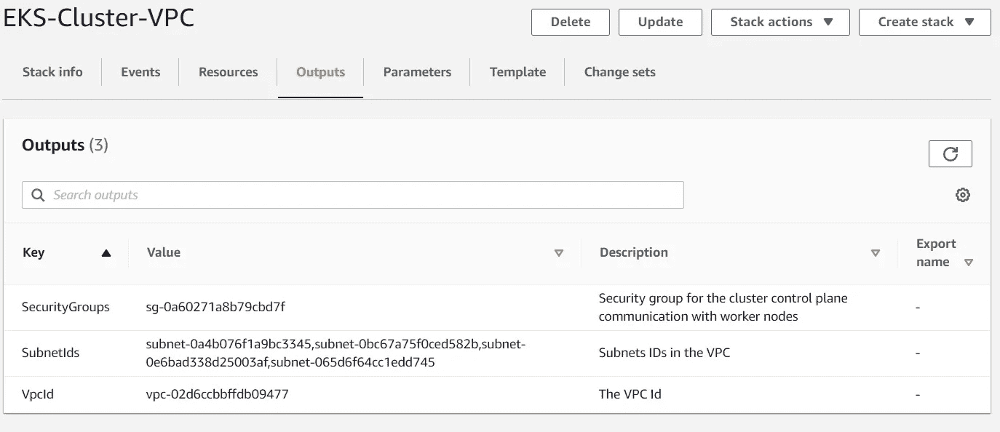

# 使用 AWS EKS 和 ECR 部署 Kubernetes 应用程序

> 原文：<https://towardsdatascience.com/kubernetes-application-deployment-with-aws-eks-and-ecr-4600e11b2d3c?source=collection_archive---------1----------------------->

## 使用 AWS EKS 和 AWS ECR 映像将应用程序部署到 Kubernetes。


照片由[克莱门特·H](https://unsplash.com/@clemhlrdt?utm_source=unsplash&utm_medium=referral&utm_content=creditCopyText)在 [Unsplash](/s/photos/computer?utm_source=unsplash&utm_medium=referral&utm_content=creditCopyText) 上拍摄

## 库伯内特斯

Kubernetes 是 Google 在 2014 年创建的一个容器编排平台。它是一个开源平台，目前许多组织广泛用于容器部署和管理。尽管社区中有其他容器编排工具可用，如 Docker Swarm，但 Kubernetes 仍因其特性和灵活的可用性而保持容器编排的领先地位。

## AWS EKS

亚马逊弹性 Kubernetes 服务是在 AWS 基础设施上为 Kubernetes 提供的服务。像 AWS 提供的任何其他服务一样，Kubernetes 资源将完全由 AWS 自己管理，这减少了开发人员维护它们的负担。AWS 还确保这些资源每次都高度可用和可靠。

## AWS ECR

Amazon Elastic Container Registry 是 AWS 提供的一个完全托管的 Docker 注册表。就像流行的 docker 注册表 Dockerhub 一样，ECR 也支持非常安全的私有和公共存储库。我们可以使用 AWS CLI 将图像推送或拉入 ECR。


在本文中，我们将探讨如何使用 AWS EKS 和 ECR 服务部署 Kubernetes 应用程序。在深入了解我们将如何实施我们的 Kubernetes 解决方案的复杂细节之前，下面是我们将执行的任务的摘要。

*   使用 Node.js 创建一个简单的 web 应用程序
*   创建 web 应用程序的 docker 映像
*   将我们的 docker 图像推送到 AWS ECR
*   为我们的 EKS 集群创建一个包含公共和私有子网的 VPC
*   创建一个 Kubernetes 集群
*   创建 Kubernetes 工人(公共和私人工人)
*   在 Kubernetes 上部署我们的 web 应用程序

现在我希望你至少对我们将在这篇文章中涉及的内容有一点点概念。在我们开始实现之前，我们需要在我们的开发机器中具备以下先决条件。

## 先决条件

*   **Kubectl** —我们将用来在我们的 Kubernetes 集群和我们的机器之间进行通信的通信工具。安装说明可从[https://kubernetes.io/docs/tasks/tools/install-kubectl/](https://kubernetes.io/docs/tasks/tools/install-kubectl/)获得
*   **AWS CLI** — AWS 工具，我们将使用它发布与 AWS 配置相关的命令。要安装，请遵循[https://docs . AWS . Amazon . com/CLI/latest/user guide/CLI-chap-configure . html](https://docs.aws.amazon.com/cli/latest/userguide/cli-chap-configure.html)
*   **Aws iam 认证者** —授予 iam 角色访问我们的 Kubernetes 集群的权限。用于安装[https://docs . AWS . Amazon . com/eks/latest/user guide/install-AWS-iam-authenticator . html](https://docs.aws.amazon.com/eks/latest/userguide/install-aws-iam-authenticator.html)
*   eks CTL—AWS EKS 官方 CLI 工具。对于安装 h[ttps://github . com/weave works/eks CTL](https://github.com/weaveworks/eksctl)

在满足我们的先决条件后，第一个任务将是创建一个简单的服务器。我使用 Node.js 和 express 来创建一个非常简单的 web 应用程序，它将在端口 3000 上进行侦听。

接下来，让我们对我们的 web 应用程序进行 dockerize。创建 docker 文件并发出 docker 构建命令。

```
docker build -t webapp .
```

现在，如果您发布 docker 图像，我们将看到我们的 webapp 图像。下一个任务是将我们的图像推送到 AWS ECR。

## 创建 ECR 存储库

在推送映像之前，我们需要在 ECR 上创建一个存储库。为此，转到 ECR 仪表板并点击**创建存储库。**


现在，我们有了一个存储库来推送我们的图像。但在此之前，我们需要验证我们的 AWS CLI，以便将图像推送到我们的存储库。对于下面的问题命令。

```
(Get-ECRLoginCommand).Password | docker login --username AWS --password-stdin 628640267234.dkr.ecr.ap-southeast-1.amazonaws.com
```

之后，用我们的库名标记图像。在这里作为版本，你可以给任何版本，但在这种情况下，我将使版本作为最新的。

```
docker tag webapp:latest 628640267234.dkr.ecr.ap-southeast-1.amazonaws.com/eks-demo:latest
```

现在是最后一步，将我们的映像推送到 ECR 存储库。

```
docker push 628640267234.dkr.ecr.ap-southeast-1.amazonaws.com/eks-demo:latest
```


如果您遇到任何权限问题，请确保您的 AWS CLI 角色拥有权限[amazonec 2 containerregistryfull access](https://console.aws.amazon.com/iam/home?region=ap-southeast-1#/policies/arn%3Aaws%3Aiam%3A%3Aaws%3Apolicy%2FAmazonEC2ContainerRegistryFullAccess)。


现在转到我们的存储库，我们推送的图像应该在那里可用。

## 正在创建 AWS EKS 集群

下一步是创建我们的 EKS 集群。创建集群时，我们需要指定集群要使用的 VPC 子网。亚马逊 EKS 需要至少两个可用区域中的子网。创建 VPC 时，我们有两个选择。

*   创建公共和私有子网
*   仅创建公共子网

在本文中，我们将创建公共子网和私有子网的组合。在这种情况下，可以使用公共子网从外部访问我们的 web 应用程序，此外，如果我们需要部署数据库之类的东西，我们可以将它们设为私有，只有我们的 web 应用程序和 VPC 内的任何其他应用程序可以访问它们。

## 创造 VPC

如果需要，可以手动为我们的集群创建 VPC。但是让我们使用 AWS Cloudformation 创建我们的 VPC，因为 AWS 已经有了一个创建公共和私有子网 VPC 的模板。

*   转到 CloudFormation dashboard 并选择创建堆栈
*   在这里选择模板源作为亚马逊 S3 网址，并提供以下模板已经由 AWS 创建。

```
[https://amazon-eks.s3.us-west-2.amazonaws.com/cloudformation/2020-06-10/amazon-eks-vpc-private-subnets.yaml](https://amazon-eks.s3.us-west-2.amazonaws.com/cloudformation/2020-06-10/amazon-eks-vpc-private-subnets.yaml)
```


*   VPC 的 CIDR 地址将是 192.168.0.0/16
*   使用 CIDR 地址块 192.168.0.0/18 和 192.168.64.0/18 创建两个公共子网
*   使用 CIDR 地址块 192.168.128.0/18 和 192.168.192.0/18 创建两个私有子网


最后，选择 Create 并等待直到栈被创建。在堆栈创建的最后，它将给出 3 个输出。



*   SecurityGroups —这是为我们的 VPC 创建的安全组。
*   SubnetIds —我们创建的 4 个子网的 id。A
*   VpcId —创建的 VPC 的 Id。

## 用工人创建 EKS 集群

我们可以通过给出 **eksctl create** cluster 命令来轻松创建集群。但是让我们用下面的附加配置创建一个 YAML 文件。

在上面的 cluster.yaml 文件中，我们为集群定义了以下配置。

*   集群名称将为 **EKS 演示集群**
*   在 vpc 部分，我们提供了之前已经创建的 VPC
*   在节点组中，我们使用 t2.meduim 实例创建 3 个 workers。三个工人中有两个将被创建为公共工人，而一个将被创建为私有工人。

现在发出下面的命令，在 EKS 上创建我们的集群。

```
eksctl create cluster -f cluster.yaml **--kubeconfig**=C:\Users\{user}\.kube\config
```


之后，eksctl 将根据我们的 YAML 文件开始创建我们的集群。创建群集和节点将需要几分钟时间。在 get issue 下面的命令检查我们的集群是否已经部署。

```
kubectl get svc
```


当您发出 kubectl 命令时，有时可能会得到以下错误。这可能意味着在我们的 kubectl 配置文件中，没有定义访问集群所需的凭证和用户。

```
error: no configuration has been provided, try setting KUBERNETES_MASTER environment variable
```

要将这些配置详细信息写入配置文件，请发出以下命令。

```
aws eks --region {region} update-kubeconfig --name EKS-Demo-Cluster
```

## 创建部署清单

现在让我们开始在创建的 Kubernetes 集群上部署我们的应用程序。首先，要在 pods 上部署我们的应用程序，我们需要创建一个部署。下面是将用于部署的部署清单。

*   我们的应用标签将是 **app:web**
*   在规格:模板:规格:容器中为我们推送的 AWS ECR 图像设置图像
*   应用程序的副本数量为 2

发出以下命令来创建我们的部署。

```
kubectl apply -f deployment.yaml
```

要检查我们的部署是否已创建，请发出以下命令。

```
kubectl get deployments
```


现在，我们可以看到我们的部署已经创建并运行在两个 pod 上。

## 创建服务清单

现在要访问我们的应用程序，我们需要创建一个服务。我们的服务类型将是**节点端口**，因为我们需要我们的应用程序从外部访问。

*   服务类型为**节点端口**
*   targetPort 是 **3000** ，因为这是我们的集装箱暴露端口
*   选择器将是 **app:web** ，因为这是我们在部署中定义的标签

根据命令创建我们的服务问题

```
kubectl apply -f service.yaml
```

要检查我们的服务是否已创建，请发出以下命令。

```
kubectl get services
```


现在让我们尝试从外部访问我们的 web 应用程序。从服务中，我们知道我们的应用程序正在侦听端口 31479。接下来，我们需要获取应用程序节点的公共 IP 地址。让我们首先尝试确定我们的应用程序在哪里运行。

```
kubectl get pods -o wide
```

由此，我们可以识别我们的应用程序正在运行的 pod 的节点。要获取这些节点的外部 IP 地址，请发出 get nodes 命令。


```
kubectl get nodes -o wide
```


在上面的节点列表中，我们可以看到两个节点有外部 IP，而一个没有，因为我们将其配置为私有工作节点。现在我们有了我们的 IP 地址以及它正在监听的端口。下一个任务是将此端口添加到节点的安全组中，以允许流量进入。并添加入站规则以允许端口 31479 中流量。


之后，我们可以获得一个公共节点 IP 地址，并使用端口 31479 调用它。


我们也可以对其他 IP 地址做同样的事情，结果应该是一样的。

下一个任务是将数据库部署到我们的 Kubernetes 集群中。但是我会把这个任务留给你去尝试。之后，确保通过发出以下命令删除集群，以避免对我们创建的 EC2 实例收费。

```
eksctl delete cluster --region=ap-southeast-1 --name=EKS-Demo-Cluster
```


这就是如何使用 AWS EKS 和 ECR 创建和部署应用程序到 Kubernetes。在 Kubernetes 和 EKS 上还有很多其他的概念值得我们学习。因此，一定要不断学习，直到你有信心部署和管理应用程序。谢谢你。