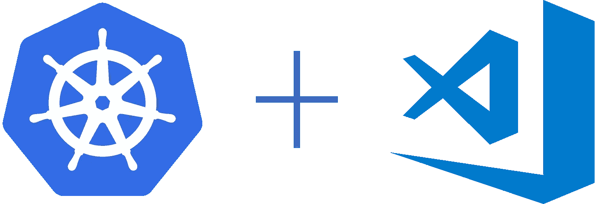
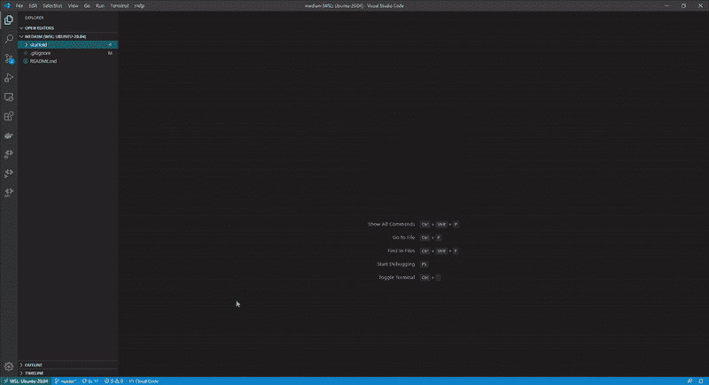
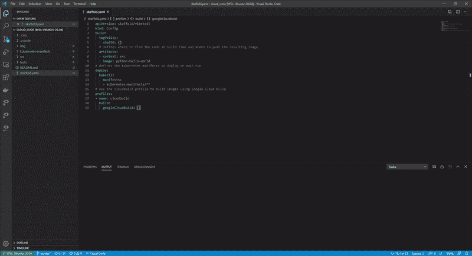
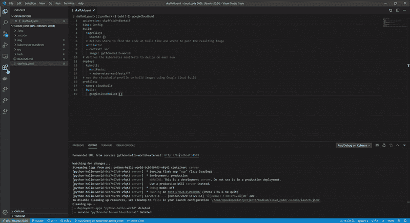

# Kubernetes 开发:超越配置文件

> 原文：<https://towardsdatascience.com/kubernetes-development-beyond-configuration-files-f78d7ab9a43?source=collection_archive---------52----------------------->

## 关注你的代码，而不是基础设施！

图片来自[皮克斯拜](https://pixabay.com/?utm_source=link-attribution&utm_medium=referral&utm_campaign=image&utm_content=1611490)

许多故事称赞 [Kubernetes](https://kubernetes.io/) 是自动化部署、扩展和管理容器化应用程序的优秀工具。我支持这一点；Kubernetes 正在努力减轻微服务架构的痛苦并应对其挑战。

然而，Kubernetes 上的当地发展可能是一个痛点。典型的工作流程由几个步骤组成；在本地测试您的应用程序，构建并标记 docker 映像，创建部署配置，最后在 Kubernetes 上运行您的应用程序。如果有一个 bug 或者一个新的特性需要集成，开发者需要从头开始遵循同样的过程。在他们的 Next’19 演示中，谷歌工程师称之为**痛苦和折磨的无限循环。**

在之前的故事中，我们介绍了 Skaffold，这是 Google 的一个轻量级开源项目，它促进了本地 Kubernetes 的开发。你可以在这里了解更多信息:

 [## Kubernetes 地方发展:正确的道路

### 在 Kubernetes 上开发时，痛苦和苦难的无限循环已经成为过去。

towardsdatascience.com](/kubernetes-local-development-the-correct-way-1bc4b11570d8) 

**但是，有没有更自然的方法来解决当地 Kubernetes 发展的挑战呢？我们能不能只关注我们的代码，而把基础设施排除在我们的逻辑之外？**嗯，输入[云码](https://cloud.google.com/code)！

云代码(Cloud Code)是 Google 云平台的一套开发工具，包括 [Visual Studio 代码](https://code.visualstudio.com/)和几个 [JetBrains](https://www.jetbrains.com/) 产品的 IDE 扩展。它促进了本地或远程 Kubernetes 集群上的开发、部署和调试。它使用 Skaffold，所以让我们更深入地了解为什么以及如何使用它！

> [学习率](https://www.dimpo.me/newsletter?utm_source=article&utm_medium=medium&utm_campaign=kubernetes_vs_code&utm_term=kubernetes_vs_code)是为那些对 AI 和 MLOps 的世界感到好奇的人准备的时事通讯。你会在每周五收到我关于最新人工智能新闻和文章的更新和想法。在这里订阅！

# 你可能需要的一切

云代码是一个 IDE 扩展，它支持迭代开发，并使本地和远程集群上的调试变得轻而易举。该工具提供了几个功能，让您专注于工作中有趣的部分。

*   **帮助处理 Kubernetes 配置文件；**云代码提供了完成建议、林挺、内联文档和代码片段。编写 Kubernetes 配置文件从来没有那么容易。
*   **自动化部署流程；**云代码自动化了我们在序言中看到的工作流程步骤。只需一个命令，我们就可以构建、推送和部署我们的应用程序，并在发生任何变化时自动重新部署它。此外，在远程集群上调试就像在笔记本电脑上调试代码一样。
*   **提供一个公用事业的世界；**云代码为调试配置端口转发和入口点，并提供图形用户界面与部署进行交互。

# 装置

要安装云代码，只需将其作为扩展添加到您最喜欢的 IDE 中。例如，我更喜欢使用 Visual Studio 代码。因此，要将它添加到 VS 代码中，请在扩展面板中搜索它，然后单击 install。它会在你的工具条上添加一个或多个新图标。

# 简单的例子

在本节中，我们将使用一个简单的 Flask 应用程序，它将" *Hello World"* 打印到屏幕上。我们将使用通过云代码提供的模板。选择的 IDE 是 VS 代码，因此，从屏幕底部选择`Cloud Code`，然后选择`New Application`。然后，选择`Kubernetes Application`、`Python (Flask): Hello World`模板和路径来初始化你的项目。

使用云代码创建新的应用程序

该模板已经有一个包含我们的应用程序逻辑的`src`文件夹，一个包含部署和服务 YAML 配置文件的`kubernetes-manifests`文件夹，以及一个设置 Skaffold 配置的`skaffold.yaml`文件。

接下来，我们可以从底部的菜单中选择`Cloud Code`菜单项，选择`Run on Kubernetes`。接下来，您应该选择要部署到的集群和要推送容器映像的注册表。我正在本地 docker 集群上部署应用程序；因此，不需要选择注册表。云代码将构建您的图像，标记它并将其推送到注册表。然后，它会将它部署在您选择的集群上。如果这是您第一次执行循环，可能需要一段时间！

使用云代码运行您的应用

只要该过程成功完成，就会为您提供一个链接来查看结果。然后，如果您更改了某些内容，只要您保存了文件，就可以观看它的实时更新！

最后，您可以轻松地调试代码。从 VS 代码的调试视图中选择`Debug on Kubernetes`,然后按按钮！接下来，设置一个断点，从浏览器刷新应用程序，观察调试器的神奇之处。

使用云代码调试应用程序

要更深入地研究云代码，请查看它的[文档](https://cloud.google.com/code/docs)，尤其是您选择的 IDE 的快速入门指南。例如，[这里的](https://cloud.google.com/code/docs/vscode/quickstart)是 VS 代码的向导。

# 结论

在这个故事中，我们看到了如何打破每个试图在 Kubernetes 上进行本地开发的开发人员所面临的痛苦和折磨的无限循环。我们引入了云代码，这是一个强大的 IDE 扩展，可用于 Visual Studio 代码和几个 JetBrains 产品。

云代码通过提供一组丰富的特性来优化开发工作流，这些特性可以自动化映像构建、标记和部署的过程。此外，它支持在本地和远程 Kubernetes 集群上进行调试，并完全支持编写 Kubernetes 配置文件。

> [学习率](https://www.dimpo.me/newsletter?utm_source=article&utm_medium=medium&utm_campaign=kubernetes_vs_code&utm_term=kubernetes_vs_code)是为那些对 AI 和 MLOps 的世界感到好奇的人准备的时事通讯。你会在每周五收到我关于最新人工智能新闻和文章的更新和想法。在这里订阅！

# 关于作者

我叫[迪米特里斯·波罗普洛斯](https://www.dimpo.me/?utm_source=article&utm_medium=medium&utm_campaign=kubernetes_vs_code&utm_term=kubernetes_vs_code)，我是一名为[阿里克托](https://www.arrikto.com/)工作的机器学习工程师。我曾为欧洲委员会、欧盟统计局、国际货币基金组织、欧洲央行、经合组织和宜家等主要客户设计和实施过人工智能和软件解决方案。

如果你有兴趣阅读更多关于机器学习、深度学习、数据科学和数据运算的帖子，请关注我的 [Medium](https://towardsdatascience.com/medium.com/@dpoulopoulos/follow) 、 [LinkedIn](https://www.linkedin.com/in/dpoulopoulos/) 或 Twitter 上的 [@james2pl](https://twitter.com/james2pl) 。此外，请访问我的网站上的[资源](https://www.dimpo.me/resources/?utm_source=article&utm_medium=medium&utm_campaign=kubernetes_vs_code&utm_term=kubernetes_vs_code)页面，这里有很多好书和顶级课程，开始构建您自己的数据科学课程吧！