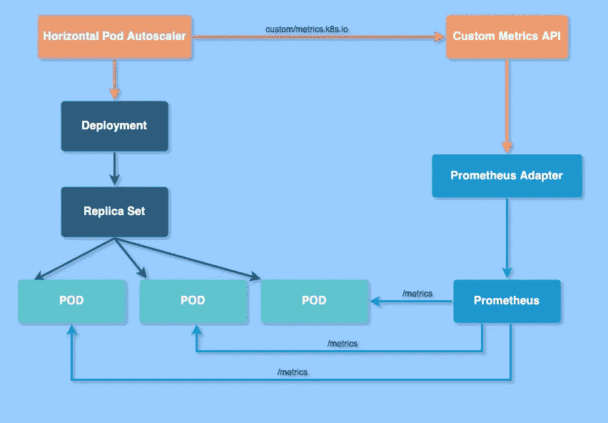

# Kubernetes HPA 采用来自 Prometheus 的定制指标

> 原文：<https://towardsdatascience.com/kubernetes-hpa-with-custom-metrics-from-prometheus-9ffc201991e?source=collection_archive---------1----------------------->

## 当需要基于自定义指标的 K8s pod 自动扩展时，可以使用一个有用的示例和分步指南。

我决定编写这些步骤，因为我最近参与了将一个复杂的应用程序从 AWS 迁移到 GCP 的工作，与其他此类系统一样，我们不能仅仅依靠 CPU 或内存使用指标来满足它们的 SLA。

自动扩展是一种根据资源使用情况自动扩大或缩小工作负载的方法。K8s **水平 Pod 自动缩放器**:

*   被实现为一个控制循环，它通过 metrics.k8s.io API 定期查询资源指标 API 以获取**核心指标、**，如 CPU/内存和自定义指标 API 以获取**应用特定指标** (external.metrics.k8s.io 或 custom.metrics.k8s.io API)。它们由 metrics 解决方案供应商提供的“适配器”API 服务器提供。有一些已知的解决方案，但是这些实现都不是 Kubernetes 的正式部分
*   根据观察到的指标，自动调整部署或副本集中的单元数量。

在下文中，我们将重点关注自定义指标，因为自定义指标 API 使得像 [Prometheus](https://prometheus.io/) 这样的监控系统能够向 HPA 控制器公开特定于应用的指标。

为了基于自定义指标进行扩展，我们需要两个组件:

*   一个从我们的应用程序中收集指标，并将它们存储到 Prometheus 时间序列数据库中。
*   第二个扩展了 Kubernetes 定制度量 API，使用收集器提供的度量，即 [k8s-prometheus-adapter](https://github.com/DirectXMan12/k8s-prometheus-adapter) 。这是一个自定义指标 API 的实现，它试图支持任意指标。



# **配置 HPA 的分步指南**

1.  让我们假设我们有以下两个应用程序(名为 **myapplication** )特定的指标发布给 Prometheus，它正在我们的集群中监听 http://Prometheus-server . Prometheus:

```
**myapplication_api_response_time_count**{endpoint="api/users",environment="test",environment_type="development",instance="10.4.66.85:9102",job="myapplication-pods",namespace="myapplication",pod="myapplication-85cfb49cf6-kvl2v",status_code="2xx",verb="GET"}
```

和

```
**myapplication_api_response_time_sum**{endpoint="api/users",environment="test",environment_type="development",instance="10.4.66.85:9102",job="myapplication-pods",namespace="myapplication",pod="myapplication-85cfb49cf6-kvl2v",status_code="2xx",verb="GET"}
```

我们希望根据端点延迟来扩展我们的应用单元。

2.既然我们已经有了 Prometheus metrics，使用 Prometheus 适配器从 Prometheus 提供 metrics 是有意义的。Kubeapps Hub 上列出了一个舵图，名为[stable/Prometheus-adapter](https://github.com/helm/charts/blob/master/stable/prometheus-adapter/README.md)，可用于安装适配器:

```
helm install --name my-release-name stable/prometheus-adapter
```

3.使用**my application _ API _ response _ time _ avg**自定义指标配置适配器:

```
prometheus-adapter:
  prometheus:
    url: http://prometheus-server.prometheus
    port: 80

  rules:
    custom:
    - seriesQuery: '{__name__=~"myapplication_api_response_time_.*",namespace!="",pod!=""}'
      resources:
        overrides:
          namespace:
            resource: namespace
          pod:
            resource: pod
      name:
        matches: ^(.*)
        as: "myapplication_api_response_time_avg"
      metricsQuery: 1000 * (sum(rate(myapplication_api_response_time_sum[5m]) > 0) by (<<.GroupBy>>) / sum(rate(myapplication_api_response_time_count[5m]) > 0) by (<<.GroupBy>>))
```

我们公开了**my application _ API _ response _ time _ avg**，这将被 HPA 查询。每个规则必须指定一些资源覆盖，并且 ***metricsQuery*** 告诉适配器在检索数据时应该执行哪个 Prometheus 查询。

4.使用以下命令检查指标的值，该命令向 Kubernetes API 服务器发送一个原始的 GET 请求:

```
kubectl get --raw "/apis/custom.metrics.k8s.io/v1beta1/namespaces/myapplication/pods/*/myapplication_api_response_time_avg" | jq .
```

*响应:*

```
{
   "kind":"MetricValueList",
   "apiVersion":"custom.metrics.k8s.io/v1beta1",
   "metadata":{
      "selfLink":"/apis/custom.metrics.k8s.io/v1beta1/namespaces/myapplication/pods/*/myapplication_api_response_time_avg"
   },
   "items":[
      {
         "describedObject":{
            "kind":"Pod",
            "namespace":"myapplication",
            "name":"myapplication-85cfb49cf6-54hhf",
            "apiVersion":"/v1"
         },
         "metricName":"myapplication_api_response_time_avg",
         "timestamp":"2020-06-24T07:24:13Z",
         "value":"10750m",
         "selector":null
      },
      {
         "describedObject":{
            "kind":"Pod",
            "namespace":"myapplication",
            "name":"myapplication-85cfb49cf6-kvl2v",
            "apiVersion":"/v1"
         },
         "metricName":"myapplication_api_response_time_avg",
         "timestamp":"2020-06-24T07:24:13Z",
         "value":"12",
         "selector":null
      }
   ]
}
```

注意，API 使用 Kubernetes 风格的数量来描述度量值。在 metrics API 中最常见的是`m`后缀，这意味着毫单位，或一个单位的千分之一。如果度量正好是单位的整数，我们可能看不到后缀。

例如，在这里，`10750m`将是 10，75 毫秒，`12`将是 12 毫秒

5.创建一个 HPA，如果**my application _ API _ response _ time _ avg**暴露的延迟超过 500 ms，该 HPA 将按比例增加**my application-deployment**，几秒钟后，HPA 从 metrics API 中获取**my application _ API _ response _ time _ avg**值。

```
apiVersion: autoscaling/v2beta1
kind: HorizontalPodAutoscaler
metadata:
  name: myapplication-hpa
spec:
  scaleTargetRef:
    apiVersion: apps/v1
    kind: Deployment
    name: myapplication-deployment
  minReplicas: 3
  maxReplicas: 15
  metrics:
  - type: Pods
    pods:
      metricName: myapplication_api_response_time_avg
      targetAverageValue: "500"
```

6.检查新创建的 HPA。我们可能会注意到，自动缩放器不会立即对延迟峰值做出反应。默认情况下，指标同步每 30 秒发生一次，只有在过去 3-5 分钟内没有重新缩放的情况下，才会发生缩放。通过这种方式，HPA 可以防止冲突决策的快速执行，并为集群自动伸缩提供时间。

```
kubectl describe hpa myapplication-hpa -n myapplication
```

# **结论**

处理自动伸缩基本上是每个生产就绪系统中的一项常见任务，我在引言中提到的应用程序也是如此，例如，为了处理突发流量，我们必须根据延迟进行自动伸缩。通过检测该应用程序，并通过 Prometheus 公开正确的指标进行自动扩展，我们可以对其进行微调，以更好地处理突发事件并确保高可用性。