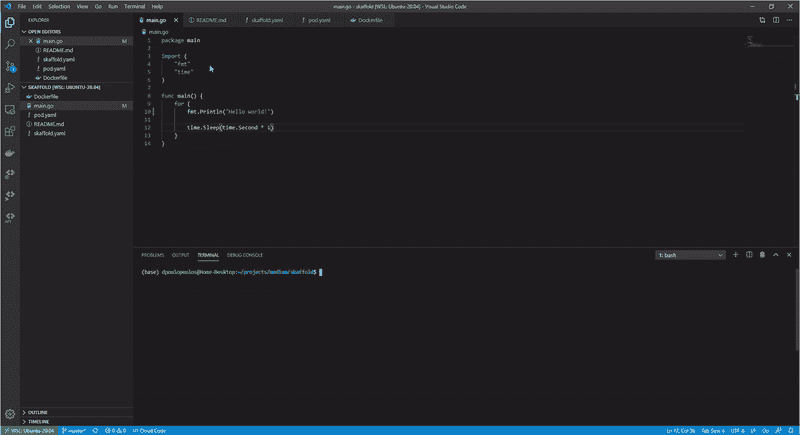
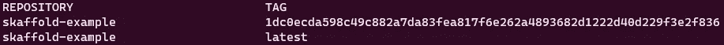

# Kubernetes 地方发展:正确的道路

> 原文：<https://towardsdatascience.com/kubernetes-local-development-the-correct-way-1bc4b11570d8?source=collection_archive---------12----------------------->

## 在 Kubernetes 上开发时，痛苦和苦难的无限循环已经成为过去。


图片来自[皮克斯拜](https://pixabay.com/?utm_source=link-attribution&utm_medium=referral&utm_campaign=image&utm_content=1199580)


[Kubernetes](https://kubernetes.io/) 是自动化部署、扩展和管理容器化应用程序的优秀工具。然而，Kubernetes 上的当地发展可能是一个痛苦的过程。典型的工作流程由几个不同的步骤组成；在本地检查代码的功能，构建并标记 docker 映像，创建部署配置并在 Kubernetes 上部署。如果有 bug 或需要升级，开发人员需要从头开始遵循相同的过程。在他们的 Next’19 演示中，谷歌工程师称这是痛苦和折磨的无限循环，**那么，有没有一种方法可以自动化降低生产力的部分，让开发人员专注于他们代码的逻辑？**介绍[斯卡福德](https://skaffold.dev/)；

Skaffold 是 Google 的一个轻量级开源项目，它促进了本地 Kubernetes 的开发。它跨环境运行，通过提供一组丰富的特性来优化开发过程，这些特性对于原生 Kubernetes 开发是必不可少的，包括图像标记、资源端口转发和日志记录、文件同步等等。

> [学习率](https://www.dimpo.me/newsletter?utm_source=article&utm_medium=medium&utm_campaign=skaffold&utm_term=skaffold_kubernetes)是为那些对 AI 和 MLOps 的世界感到好奇的人准备的时事通讯。你会在每周五收到我关于最新人工智能新闻和文章的更新和想法。在这里订阅！

# 斯卡福德来救援了！

Skaffold 提供了一个 CLI(命令行界面),可以在本地和远程集群上进行迭代开发。该工具提供了几个特性，使得在 Kubernetes 上进行本地开发成为一种乐趣。

*   **轻量级开源 CLI 工具。Skaffold 没有服务器端组件，因此您在集群上没有开销或维护负担。**
*   **检测源代码中的变化，并自动构建/推送/部署。**ska fold 会在源代码发生变化时检测到变化(只要您保存了文件)，自动启动管道来构建、标记、推送和部署您的应用程序。此外，Skaffold 聚合来自运行中的容器的日志，并将容器端口转发到主机。
*   增加项目的可移植性。斯卡福德让项目共享小菜一碟；您团队中的任何开发人员现在都可以`git clone`和`skaffold run`项目，并在几秒钟内运行应用程序。此外，让新成员加入您的团队比以往任何时候都容易；不再需要安装指南和配置更改。
*   **开发与生产。Skaffold 配置文件、用户级配置语句和环境标志可以描述如何在不同的环境中部署应用程序，甚至可以描述应用程序的哪个部分将被部署，从而实现细粒度的功能和集成测试。**

# 装置

要安装 Skaffold，请遵循[文档](https://skaffold.dev/docs/install/)中提供的说明，或者访问 GitHub [发布页面](https://github.com/GoogleContainerTools/skaffold/releases)获取特定版本。Skaffold 提供 Linux、OSX 和微软 Windows 的安装选项，以及 docker 镜像。例如，在 Linux 上安装 Skaffold CLI 就像执行以下命令一样简单:

```
curl -Lo skaffold https://storage.googleapis.com/skaffold/releases/latest/skaffold-linux-amd64
sudo install skaffold /usr/local/bin/
```

该命令安装 Skaffold 的最新稳定版本。如果您想要特定的版本(例如版本 1.10.1 ),只需将命令更改为以下内容:

```
curl -Lo skaffold [https://storage.googleapis.com/skaffold/releases/v1.10.1/skaffold-linux-amd64](https://storage.googleapis.com/skaffold/releases/v1.10.1/skaffold-linux-amd64) && chmod +x skaffold && sudo mv skaffold /usr/local/bin
```

# 简单的例子

在本节中，我们将使用 Skaffold GitHub 页面上提供的简单的 [Go](https://golang.org/) 应用程序示例。因此，有一个简单的 Go 应用程序可以打印" *Hello world！*“每秒钟:

现在我们需要一个 docker 文件来封装应用程序，并为 Kubernetes 部署做好准备:

```
FROM golang:1.12.9-alpine3.10 as builder
COPY main.go .
RUN go build -o /app main.goFROM alpine:3.10
ENV GOTRACEBACK=single
CMD ["./app"]
COPY --from=builder /app .
```

现在您可能会注意到这个 Dockerfile 文件的一些奇怪之处:它有两行`FROM`。这种技术被称为构建器模式，用于生成较小的容器。在这种情况下，我们使用第一个容器来编译代码，因为`golang:1.12.9-alpine3.1`映像为这项工作提供了所有必要的工具，而第二个映像只复制已编译的二进制文件并运行应用程序。因此，我们可以将集装箱的占地面积减少几个数量级。

现在我们有了 Dockerfile 文件，我们需要部署 YAML 配置文件:

```
apiVersion: v1
kind: Pod
metadata:
  name: getting-started
spec:
  containers:
  - name: getting-started
    image: skaffold-example
```

该文件获取图像`getting-started`并将其部署在 pod 中。这就是痛苦停止的地方。我们现在可以运行`skaffold init`并让工具检测我们的资源并生成斯卡福德 YAML 配置文件。

```
apiVersion: skaffold/v2beta4
kind: Config
metadata:
  name: skaffold
build:
  artifacts:
  - image: skaffold-example
deploy:
  kubectl:
    manifests:
    - pod.yaml
```

我们现在可以运行`skaffold run`，Skaffold 将构建我们的映像并将其部署到我们本地的 Kubernetes 集群。如果这还不够，尝试运行`skaffold dev`。这条语句将完全执行前面的命令，而且还会聚合容器的日志并打印出来。现在，如果您进行了更改并保存了文件，请注意，它会立即检测到更改并再次开始构建/标记/部署周期。



Kubernetes 与 Skaffold 的互动地方发展

默认情况下，Skaffold 使用 Git 标签来管理你的图片，因此如果你运行`docker image ls`，你会看到类似这样的内容:



斯卡福德 git 标签

要深入了解，请查看 Skaffold 的[文档](https://skaffold.dev/docs/quickstart/)示例或该工具的 [GitHub](https://github.com/GoogleContainerTools/skaffold/tree/master/examples) 页面。最后但同样重要的是，Skaffold 与其他 Kubernetes 工具配合得很好，例如 [Kustomize](https://kustomize.io/) 和 [Jib](https://github.com/GoogleContainerTools/jib) ，因此，您不必改变当前的工作流程。

# 结论

在这个故事中，我们介绍了每个试图在 Kubernetes 上进行本地开发的开发人员所经历的痛苦和折磨的无限循环。然后，我们介绍了 Skaffold，这是一个开源 CLI，它通过提供一组丰富的特性来优化开发工作流，这些特性对于原生 Kubernetes 开发来说是必不可少的，包括图像标记、资源端口转发和日志记录、文件同步等等。

在以后的文章中，我们将通过为 Skaffold 引入一种图形用户界面来使事情变得更简单，在这里你只需按一个按钮就可以做同样的事情。敬请期待！

编辑:新的故事现在出版了！点击下面的链接…

[](/kubernetes-development-beyond-configuration-files-f78d7ab9a43) [## Kubernetes 开发:超越配置文件

### 关注你的代码，而不是基础设施！

towardsdatascience.com](/kubernetes-development-beyond-configuration-files-f78d7ab9a43) 

# 关于作者

我叫[迪米特里斯·波罗普洛斯](https://www.dimpo.me/?utm_source=article&utm_medium=medium&utm_campaign=skaffold&utm_term=skaffold_kubernetes)，我是一名为[阿里克托](https://www.arrikto.com/)工作的机器学习工程师。我曾为欧洲委员会、欧盟统计局、国际货币基金组织、欧洲央行、经合组织和宜家等主要客户设计和实施过人工智能和软件解决方案。

如果你有兴趣阅读更多关于机器学习、深度学习、数据科学和数据运算的帖子，请关注我的 [Medium](https://towardsdatascience.com/medium.com/@dpoulopoulos/follow) 、 [LinkedIn](https://www.linkedin.com/in/dpoulopoulos/) 或 Twitter 上的 [@james2pl](https://twitter.com/james2pl) 。此外，请访问我的网站上的[资源](https://www.dimpo.me/resources/?utm_source=article&utm_medium=medium&utm_campaign=skaffold&utm_term=skaffold_kubernetes)页面，这里有很多好书和顶级课程，开始构建您自己的数据科学课程吧！