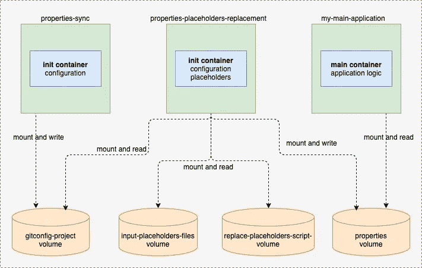

# 具有外部环境配置的应用程序的 Kubernetes 模式

> 原文：<https://towardsdatascience.com/kubernetes-pattern-for-applications-with-external-environment-configuration-a42d7bdd7e97?source=collection_archive---------21----------------------->

## [实践教程](https://towardsdatascience.com/tagged/hands-on-tutorials)

## 通过使用 git-sync、Kubernetes init-containers、配置映射和卷，将配置生命周期与应用程序生命周期分离



将配置生命周期与应用程序生命周期分离。(图片由作者提供)

每个应用程序都需要配置，我们需要在不重新创建应用程序工件或映像的情况下灵活地适应这种配置。这构成了连续交付方法的模式。

# 问题

在一个容器化的世界中，我们如何让应用适应不同的开发、试运行、沙盒和生产环境？答案是使用外部配置数据，这对于每个环境都是不同的。

通常，最好将所有配置数据保存在一个地方，而不是分散在不同的资源定义文件中。例如，一个这样的地方可以是具有以下两个主要优点的 Git 存储库:

*   您可以免费获得版本控制配置数据和审计。
*   所有工程师都有权限更改不同环境的配置，包括生产环境

坏处呢？您已经弄清楚了:围绕敏感配置数据的安全问题。在那里保存任何凭证是一种反模式，因此一个想法是使用占位符。

# 解决办法

Kubernetes 为常规和机密数据提供本地配置资源。这些是分别用于通用目的和敏感数据的**配置图**和**秘密**对象。我们可以以同样的方式使用这两者，因为它们都提供了键值对的存储和管理。除了实际的数据编码(对于机密来说是 Base64)之外，配置映射和机密的使用在技术上没有区别。

简单地说，我们问题的解决方案在于在应用程序启动之前使用 Git 存储库。占位符被替换为来自 Secrets 的值，Secrets 可以通过 Terraform 或任何用于 Kubernetes 的 GitOps 连续交付工具创建。

让我们来看一个例子:

假设您有一个 Git 存储库，其中包含为每个环境分组的文件，工程师可以在其中更改任何内容，安全凭证是不可见的，而是用占位符替换。

*database . properties***就是这样一个既有简单配置数据又有凭证的文件**

```
connectionHost=${mysql_hostname}
connectionUserName=${mysql_username}
connectionPassword=${mysql_password}
connectionPort=3306connectionPool.maxIdle=90
connectionPool.maxActive=100
connectionPool.maxWait=20000
connectionPool.testSQL=SELECT 1
```

**我们上面提到了用于替换占位符的秘密。一旦创建了秘密并保存了数据，我们就可以使用秘密的密钥作为映射到 Pod 中装载的卷的文件。一个秘密备份的卷包含与条目一样多的文件，映射的关键字作为文件名，映射的值作为文件内容。**

**当通过 Kubernetes API 更新密码时，安装的密码卷中的文件也会更新。因此，如果应用程序支持配置文件的热重新加载，它可以立即从这样的更新中受益。在我们的例子中，我们保持这个例子简单，我们将考虑一次性配置加载，而不是热重新加载。**

***输入-占位符-文件-秘密* 内容:**

```
apiVersion: v1data:input-placeholders.properties: bXlzcWxfaG9zdG5hbWU9bG9jYWxob3N0Cm15c3FsX3VzZXJuYW1lPXJvb3QKbXlzcWxfcGFzc3dvcmQ9cGFzc3dvcmQ=kind: Secretmetadata:creationTimestamp: "2020-09-27T10:04:01Z"name: input-placeholders-files-secretnamespace: my-main-applicationresourceVersion: "45565287"selfLink: /api/v1/namespaces/my-main-application/secrets/input-placeholders-files-secretuid: 818229c3-b986-44a9-a8a5-e235557f98a7type: Opaque
```

**现在我们有了秘密和属性项目，让我们把它们粘在一起。**

**Kubernetes 有另一个资源: **init 容器。**它通过为与初始化相关的任务提供独立的生命周期来分离关注点，与主应用程序容器不同。这允许保持容器的单一目的，并且应用程序容器可以由只关注应用程序逻辑的工程师创建。通常，init 容器应该很小，运行迅速，并成功完成。**

**Kubernetes 中的 Init 容器是 Pod 定义的一部分，它们按顺序一个接一个地执行，在应用程序容器启动之前，所有这些容器都必须成功终止。从这个意义上说，init 容器就像 Java 类中帮助对象初始化的构造函数指令。**

**除了 Kubernetes 中的 init 容器和秘密之外，Pod 中的**卷**共享非常适合这种配置和应用程序容器的链接。容器可以共享(外部)卷，但是它们还不能直接共享位于容器内的目录。**

**在我们的示例中，我们使用了一个init 容器**(*properties-sync*)**，它提供了 Git 客户端功能，其唯一目的是克隆一个 Git 存储库。在 Pod 上安装一个空目录，并在 [git-sync](https://github.com/kubernetes/git-sync) 的帮助下将 Git 存储库克隆到其中:******

*   ******一个简单的命令将 Git 存储库放入本地目录。******
*   ******可以一次或定期从分支的头、git 标签或特定的 git 散列中提取。******
*   ******可以通过认证或不认证的 HTTP 或 SSH。******

******另一个init 容器( *属性-占位符-替换*)用于占位符替换使用包含克隆项目的共享卷，并将最终结果移动到主应用程序容器使用这些文件的新文件夹中。******

****然而，对于*属性-占位符-替换* init 容器，我们需要一些来自基本映像的帮助来将配置数据复制到共享 Pod 卷。 [busybox](https://www.busybox.net/) 是一个不错的选择，它仍然很小，但是允许我们使用普通的 Unix cp 命令来完成这个任务。****

****因为两个 init 容器都是同一个 Pod 的一部分，所以它们可以访问同一个卷来共享数据。我们使用相同的机制将克隆的文件从 init 容器共享到主应用程序容器。****

*****替换-占位符-后缀-挂钩* ConfigMap 是用于占位符替换的实际脚本****

```
**kind: ConfigMap
apiVersion: v1
metadata:
  name: "replace-placeholders-poststart-hook"
  labels:
    app: "my-main-application"
data:
  replace-placeholders.sh: |
      replace() {

        local placeholders_input_files_location=$1
        local files_to_update_location=$2

        local input_file=merged-secret-files.properties
        rm $input_file

        echo "--- Starting to merge all the secret files."

          for properties_file in $placeholders_input_files_location/*.properties; do
                (cat "${properties_file}"; echo) >> $input_file;
          done

        echo "--- Finished to merge all the secret files."

        if [ -f "$input_file" ]
        then

          echo "--- $input_file will be used to replace the placeholders."

          while IFS='=' read -r placeholder_key placeholder_value
          do

              local placeholder_prefix='${'
              local placeholder_suffix='}'
              local placeholder_to_replace="${placeholder_prefix}${placeholder_key}${placeholder_suffix}"

              find $files_to_update_location -type f -exec sed -i "s+${placeholder_to_replace}+${placeholder_value}+g" {} \;

          done < "$input_file"

          echo "--- Copy properties files to correct location /properties"

          cp -R $files_to_update_location/*  /properties

        else
          echo "--- No input file found to replace the placeholders: $input_file."
        fi
      }

      replace "$INPUT_PLACEHOLDERS" "$GIT_SYNC_ROOT/sync/environments/$ENVIRONMENT_TYPE"**
```

****在主应用程序的以下部署中，它作为卷被引用和装载:****

```
**apiVersion: apps/v1
kind: Deployment
metadata:
  name: my-main-application
spec:
  replicas: 1
  strategy:
    type: RollingUpdate
  selector:
    matchLabels:
      app: my-main-application
  template:
    metadata:
      labels:
        app: my-main-application
    spec:
      imagePullSecrets:
        - name: gitlab-registry
      initContainers:
        - name: properties-sync
          image: "jlowin/git-sync"
          imagePullPolicy: Always
          volumeMounts:
            - name: gitconfig-project
              mountPath: /opt/properties_from_git
          env:
            - name: GIT_SYNC_REPO
              value: "https://gitlab.com/my-domain/properties-project.git"
            - name: GIT_SYNC_BRANCH
              value: "master"
            - name: GIT_SYNC_WAIT
              value: "30"
            - name: GIT_SYNC_USERNAME
              value: "<some-username>"
            - name: GIT_SYNC_PASSWORD
              value: "<some-password>"
            - name: GIT_SYNC_ROOT
              value: /opt/properties_from_git
            - name: GIT_SYNC_DEST
              value: sync
            - name: GIT_SYNC_ONE_TIME
              value: "true"
        - name: properties-placeholders-replacement
          image: busybox
          env:
            - name: ENVIRONMENT_TYPE
              value: "development"
            - name: INPUT_PLACEHOLDERS
              value: /opt/placeholders_from_secrets
            - name: GIT_SYNC_ROOT
              value: /opt/properties_from_git
          volumeMounts:
            - name: input-placeholders-files
              mountPath: /opt/placeholders_from_secrets/input-placeholders.properties
              subPath: input-placeholders.properties
            - name: replace-placeholders-script-volume
              mountPath: /opt/replace-placeholders.sh
              subPath: replace-placeholders.sh
            - name: gitconfig-project
              mountPath: /opt/properties_from_git
            - name: properties
              mountPath: /properties
          command: ['/bin/sh', '-c', '/opt/replace-placeholders.sh; echo finished;']
      containers:
        - name: my-main-application
          image: "registry.gitlab.com/my-domain/my-main-application-image-tag:v1"
          imagePullPolicy: IfNotPresent
          ports:
            - name: http
              containerPort: 8080
              protocol: TCP
          volumeMounts:
            - name: properties
              mountPath: /properties
      volumes:
        - name: input-placeholders-files
          secret:
            secretName: input-placeholders-files-secret
        - name: gitconfig-project
          emptyDir: {}
        - name: properties
          emptyDir: {}
        - name: replace-placeholders-script-volume
          configMap:
            defaultMode: 0755
            name: "replace-placeholders-poststart-hook"**
```

****部署的 Pod 模板规范包含以下内容:****

*   *****输入-占位符-文件*-包含秘密存储的*输入-占位符.属性*****
*   *****gitconfig-project* —类型为 *emptyDir，*它在托管此 Pod 的节点上创建为一个空目录；这里克隆了 Git 项目。****
*   *****属性* —配置数据的最终目的地，占位符替换为 Secret 中的值，由主应用程序容器使用****
*   *****replace-placeholders-script-volume*—包含用于替换 Git 项目中占位符的脚本，从 config map*replace-placeholders-poststart-hook*挂载****

****正如您所注意到的，部署包含两个 init 容器*属性-同步*和*属性-占位符-替换* 和主应用程序容器***my-main-application*。******

********属性-同步:********

*   ****在启动时被调用，并从映像[*jlowin/git-sync*](https://hub.docker.com/r/jlowin/git-sync/dockerfile)构建。****
*   *****GIT_SYNC_ONE_TIME* 告诉它只同步一次，这只是为了保持示例的简单，并且不使用 sidecar。****
*   ****从 *gitconfig-project* 挂载的 *GIT_SYNC_ROOT* 是 GIT 文件的目标文件夹。****
*   ****与下一个 init 容器共享 *gitconfig-project* 卷。****

******属性-占位符-替换:******

*   ****在 *properties-sync* 之后立即启动，并安装上述 4 个卷:*输入-占位符-文件、git config-项目、属性、替换-占位符-脚本-卷*****
*   ****最后是运行从 config map*replace-placeholders-post start-hook*挂载的*/opt/replace-placeholders . sh*脚本****

******我的主应用:******

*   ****正在挂载卷*属性*以访问由*属性-占位符-替换*初始化容器复制的配置。****

****使用这种模式，我们不仅可以使用版本化的配置数据，还可以克服存储在环境变量、配置映射或机密中的配置数据的大小限制。Kubernetes 配置资源有其局限性:由于 Secrets/ConfigMaps 的大小限制为 1 MB，它们不能存储任意大的数据，并且不太适合所有的配置应用程序数据。真实世界的 Kubernetes 集群还对每个名称空间或项目可以使用的 ConfigMap 的数量设置了单独的配额，因此 config map 并不是一个金锤。****

****我希望您喜欢阅读本分步指南，并理解如何使用不同的 Kubernetes 对象来定义配置模式，以便使应用程序适应云上不同的配置需求。****