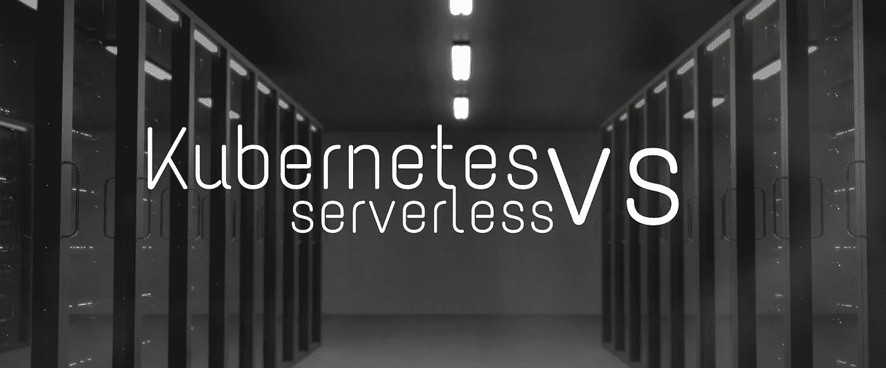
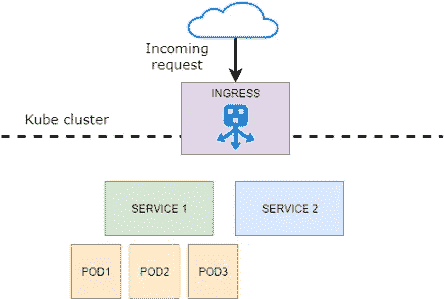

# 无服务器是 Kubernetes 的末日吗？

> 原文：<https://towardsdatascience.com/kubernetes-serverless-differences-84699f370609?source=collection_archive---------2----------------------->

## 对两种技术进行比较，以结束孰优孰劣的争论。

总部，我又做了一次。我用了这个醒目的标题，是为了一定要引起你的注意，对此表示抱歉。我需要你们的注意来介绍这个大主题，以供思考。你认为 Kubernetes 是 DevOps 世界上最后一个最好的广告技术吗？今天，技术比以往任何时候都更短暂，你必须为变化做好准备。我喜欢 Kubernetes，我很高兴再次谈论它。这是在 **DevOps** 场景中最热门的流行语。阅读这篇文章你会找到这个大问题的答案:

> 这是基础设施管理的最终解决方案，还是我们需要把赌注压在**无服务器**上，让我们的心远离运营团队？**记住，** [**NoOps**](https://medium.com/better-programming/devop-noops-difference-504dfc4e9faa) **来了。**

我认为技术上的变化是正常的。我们的祖先乘马车旅行，我们乘飞机。这是进步的一部分。

在过去的几年中，有一场小革命，将越来越多的应用程序从虚拟机带到了容器中，这主要归功于使用 Kubernetes 进行部署的机会。

当这场革命发生时，有一个小而有力的流行词。是“**无服务器**”。大多数人认为它是邪恶的，其他人喜欢白马王子，可以将开发商从噩梦中拯救出来。好吧，让我们来看看有哪些问题和机会——安静，没有威胁即将出现！

## Kubernetes 和 serverless 有什么区别？

**无服务器**是一种云模型，在这种模型中，您希望摆脱服务器和基础架构。目标是避免固定成本，减少上市时间和团队(运营和开发)之间的摩擦。具体来说，想象有一个层可以接收你的代码并负责执行。无服务器差不多就是这样。

> *你提供代码，供应商提供所有其他的。*

最常见的无服务器实现具有带 SDK 的无状态容器，允许您的代码集成到系统中，并根据资源的使用情况向您开具发票。在大多数情况下，我们可以将我们的功能上传到云中(*“FaaS”，功能即服务)*，该功能由 HTTP 调用激活。主要的云提供商提供类似的云体验:

*   亚马逊: [AWS Lambda](https://aws.amazon.com/lambda/)
*   微软 Azure: [Azure 功能](https://azure.microsoft.com/en-us/services/functions/)
*   谷歌云:[云功能](https://cloud.google.com/functions/)

当然，服务器并没有灭绝。你看不到它们，因为它们被供应商隐藏了，供应商使用它们来提供服务。服务器仍然存在，但你看不到任何内存、CPU 或磁盘空间。你只需要专注于代码。你可以把精力放在真正需要的地方。

还有什么是 **Kubernetes？**将 Kubernetes 视为一个框架，从简单的 docker 映像开始运行分布式系统。它可以满足您的扩展需求、部署和负载平衡。所有这些东西都可以很容易地用普通的 YAML 文件描述和重用，通过设计创建一个可复制的环境。

> Kubernetes 是你手上的基础设施。

只需更改一些配置文件，您就可以完全控制容器实例(服务和容器)、网络和部署。Kubernetes 可以满足您的扩展需求、故障转移、部署模式等等。对于 Kubernetes 的新手，我在 Kubernetes 上写了一篇很好的[介绍文章。](/what-exactly-is-kubernetes-52c9f1c4990b)

图片来自"[到底什么是 Kubernetes](/what-exactly-is-kubernetes-52c9f1c4990b) "

Kubernetes 和 serverless 一样，只需要系统管理员很少的努力就可以实现复杂的架构。这种技术将人力密集型的传统部署转变为智能和快速的部署。嘿伙计们，诺普斯来了！

## Kubernetes 有哪些优点？

使用 Kubernetes 的最大优势是，您可以像处理常规服务器场一样处理您的集群，但没有物理管理的成本。从逻辑上讲，您可以在服务器和集群组件之间重新创建并行性。您可以像实例化虚拟机一样实例化 pod 和服务。你有网络，存储等等。这意味着通过对集群的低级别访问，可以更深入地控制所有单个组件。

因此，我列出了使用 Kubernetes 而不是无服务器平台的优势:

*   与过去的兼容性很好。如果你在使用容器，那么迁移是很容易的，如果不是，那么只是容器化你的应用组件的成本。
*   对发生的事情有很大的控制力
*   更少的供应商锁定。Kubernetes 就是 Kubernetes，Docker 容器就是 Docker 容器。在纸面上，您只需点击一下鼠标就可以移动基础架构
*   微调每个组件的能力
*   也可以在本地运行(对于开发人员，或者极端情况，或者如果你只是疯了)
*   成本预测。您为群集的资源付费，这比无服务器方法更容易预测。

## 无服务器的优点是什么？

Kubernetes 在减少系统管理员工作量方面向前迈出了一大步，但并没有减少到零。基本上，无服务器方法避免了任何 sysadmin 组件，因为您唯一需要关心的是源代码。就像挑一套乐高积木，把它们拼在一起。每块砖都是独立工作的。你只需要让他们正常交流。就这样。FaaS 的解决方案似乎太难实施，因为它们需要思维方式的转变。在这种情况下，您可能会采用一些更软的无服务器解决方案，直接托管您的应用程序，无需更改。这种解决方案的一个很好的例子是 Heroku，它从服务器和传统 DevOps 中抽象出来，提供了一种 NoOps 无服务器体验，可以促进您的应用程序开发，减少所有托管摩擦(您还有一个免费层)。

## 无服务器是 Kubernetes 的末日吗？

如今，甚至无服务器似乎也是新事物，AWS Lambda 的首次发布是在 2014 年。那一年，Docker 正在迈出第一步(第一次正式发布是在 2013 年，我不确定在发布时它何时准备好用于生产场景)。Kubernetes 出生于 2014 年。因此，我们可以说，无服务器的出现与集装箱时代差不多。从这个角度来看，**无服务器并没有紧随 Kubernetes 之后，我们也不能认为无服务器是容器的替代品。**它们只是在 web 应用程序中实现托管部分的两种不同方法。也许在某些情况下，你可能更喜欢这个或那个。当一个和另一个。正确的答案是“视情况而定”，就像许多类似的问题一样。咨询师和优秀咨询师的区别在于，知道很多互补的解决方案，并根据场景找到最佳方案。

## 带什么回家

我们已经讨论了这两种解决方案的优点，然后我们可以说，仅仅通过了解技术，您就可以找到适合您的场景的最佳解决方案。使用像[谷歌云](https://medium.com/u/4f3f4ee0f977?source=post_page-----84699f370609--------------------------------)或其他大型云服务，你将准备好实施任何解决方案。只是时间来试验他提供的工具，并了解利弊。

觉得这篇文章有用？在 Medium 上关注我([丹尼尔·方塔尼](https://medium.com/@daniele.fontani))，看看我在下面 DevOps 上最受欢迎的文章！不要忘记👏这篇文章分享一下吧！

*   [DevOps 死了，NoOps 万岁](https://medium.com/better-programming/devop-noops-difference-504dfc4e9faa)
*   [DevOps，NoOps，现在又是 FinOps？](https://medium.com/better-programming/devops-noops-finops-64e0df91bcb8)
*   [如何使用 Kubernetes 部署 Web 应用程序](https://medium.com/swlh/how-to-deploy-an-asp-net-application-with-kubernetes-3c00c5fa1c6e)