# 进军深度学习:从零开始的字符识别

> 原文：<https://towardsdatascience.com/kuzushiji-recognition-part-1-character-recognition-6ebfcdfab2b0?source=collection_archive---------67----------------------->

## 使用自定义 CNN 分析汉字。

注意:对于本系列中的所有文章，我都遵循 fast.ai 关于实用深度学习的课程，并听从杰瑞米·霍华德的建议:做项目并写下它们。

这是一篇关于我参加 [Kuzujishi 识别卡格竞赛](https://www.kaggle.com/c/kuzushiji-recognition)的经历的文章。虽然目标是最终向竞赛提交参赛作品，但我使用了竞赛中的数据从头开始构建了一个字符识别网络。该数据集看起来像是常规 MNIST 数据集的一个不错的大胆扭曲 twist(修改后的国家标准与技术研究所)是一个包含超过 60，000 个用于识别任务的手写字符的数据库。

在这里，我讨论项目的第一部分:创建一个 Kuzushiji 字符识别模型。我跳过了数据的设置，因为这需要特定于数据最初是如何呈现的工作。尽管如此，在我的 GitHub repo 中仍然可以找到代码，链接在文章的末尾。

# 酷族世纪人物

当我开始这个项目时，我首先想知道的是“我需要识别多少个字符？”提供了每个字符及其 Unicode 表示的 csv，所以我加载了它并查看了一下:

```
unicodes = pd.read_csv(unicode_csv_path)
unicodes.shape(4781, 2)
```

有 4781 个字符！进一步检查发现，这些字符中有许多是与汉字字符集无关的符号。在创建数据集时过滤掉这些符号后，我剩下了 4213 个子文件夹。每个文件夹包含一个在数据集中至少出现过一次的字符样本。

在开始之前，让我们看一下我必须处理的一些图像:

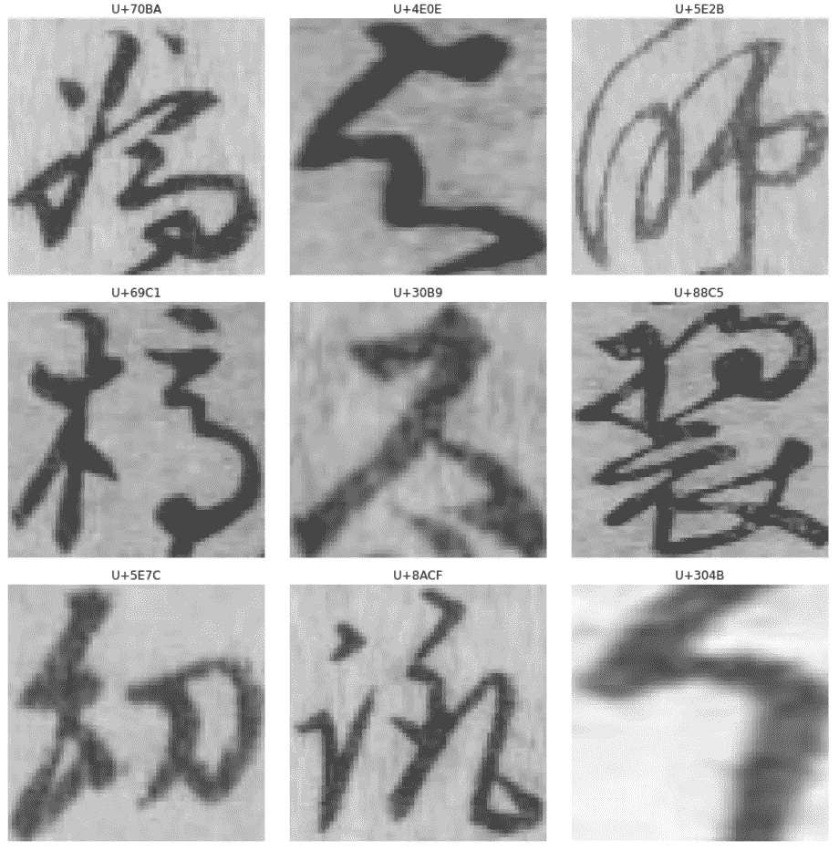

从数据集中提取带有 unicode 标签的 Kuzushiji 字符(图片由作者提供)

这就是我保存图像的方式，但这里有一个原始图像的例子，没有改变:

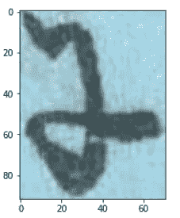

单个 Kuzushiji 字符(图片由作者提供)

唯一的区别是前后图像之间的灰度变换。

## 加载数据

加载数据是一个挑战，但不是以我预期的方式。下面是使用`data_block` api 创建 databunch 的完整实现:

```
db = ImageList.from_folder('./char_images') \
            .filter_by_func(filter_too_many) \
            .use_partial_data(0.3) \
            .split_by_rand_pct(0.3) \
            .label_from_folder() \
            .transform([[binarize()], [binarize()]], size=(32,32)) \
            .databunch(bs=16)
```

我将一次剖析这一行。

首先，我从`char_images`文件夹中创建了一个`ImageList`。接下来，我使用一个定制函数`filter_by_func(filter_too_many)`过滤数据，这个函数有一个简短的实现:

```
def filter_too_many(filename):
    num = filename.parts[-1].split('_')[-1].split('.')[0]
    return int(num) < 500
```

来回答“你为什么这么做？”我们需要看一下现有的数据。这是每个角色数量分布的直方图。

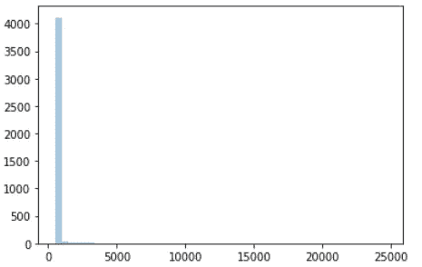

当我绘制这个图时，问题变得很明显。大约有 100 个字符，样本超过 1000 个。其他的 3212 个字符要少得多。事实上，很多只有 1 或 2 个样本。我很清楚这是一个非常不平衡的数据集。

为了客观地看待这个问题，这里有一个[链接，链接到一个 40，000 单词的数据集中的英语字符的分布](http://pi.math.cornell.edu/~mec/2003-2004/cryptography/subs/frequencies.html)。这里有一个[链接，链接到中文](http://hanzidb.org/character-list/by-frequency?page=100)中的汉字频率。在英语中，E 和 Z 的比例是 171 比 1。中文字符集的链接显示至少有 9000 个字符。Kuzushiji 有一半的字符计数。综上所述，Kuzushiji 并不特殊，在处理字符样本时，这种分布是可以预期的。

## 不平衡数据

不平衡数据是数据科学生态系统中一个研究得很好的问题。高质量、平衡的数据对于训练和验证模型至关重要。

在处理不平衡数据集时，您需要实施过采样和欠采样策略。您对少数数据进行过采样，以满足多数数据的数量。欠采样不太常见，因为这等同于丢弃数据。为了简化我的问题，我创建了 500 个少数民族字符的副本，对它们进行了过采样。然后，对于较大的标签，我也将这些字符类欠采样到 500。那是`filter_too_many`函数的责任。它会根据文件名过滤掉 500 份以上的副本。

关于我所采用的方法，有一个小小的警告:对于有一两个样本的角色，我每个都创建了 500 个副本，没有任何改动。在这之后，我把这些数据当作完美的。正如我从这篇关于主题的[文章中了解到的，这并不理想。这些拷贝同时出现在训练和验证数据中。这可能提高了模型的准确性，因为该角色的训练集和验证集中的图像是相同的。像数据扩充这样的技术可以大大降低这种危险，因为每个角色都以某种微妙的方式变得不同。](https://www.marcoaltini.com/blog/dealing-with-imbalanced-data-undersampling-oversampling-and-proper-cross-validation)

## 处理大型数据集

与其他数据集相比，我的实际上并没有那么大。然而，在我自己的机器上，用 NVIDIA GeForce GTX 1080，训练有点烦人。因此，对于我的最后一次迭代，我只使用了 30%的数据，通过`use_partial_data(0.3)`实现。为了达到这个阶段，我经历了我的 databunch 和 model 的各种版本，我将在本文的后面讨论。就目前而言，知道我试图训练模型并等待看到结果的耐心正在变得稀薄就足够了，所以我坚持 30%。现在我可以离开模型训练一夜，第二天早上在我的桌面上看到结果。

## 转换

接下来的两行很简单——我将数据分成 70%的训练数据和 30%的验证数据，并根据每个文件所在的文件夹对它们进行标记。下一条线`transform([[binarize()],[binarize()]], size=(32,32))`是我花了一些时间的地方。我想了解 fastai 的转换 api 是如何工作的，看看我是否可以为自己的数据集创建一个。

Kaggle 竞赛网站指出，一些页面的另一面显示出模糊的字符轮廓。该模型只需要识别最前面的字符，而不是下面字符的模糊标记。我决定，对于每个字符，必须有一个像素阈值来区分背景和字符。事实证明，这个想法效果很好，去除了模糊的背景轮廓，使人物轮廓清晰。有时会有伪像，但这取决于角色图像的原始质量。下面是一个之前和之后的例子:

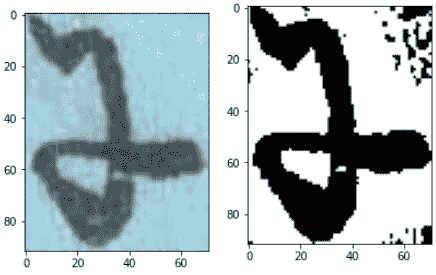

之前的示例图像，二值化。注意右上角和右下角的工件

当我为此编写代码时，有一些我没有预料到的复杂性。查看该函数的代码，并再次与调用它的代码行进行比较:

我首先创建了一个转换函数`_binarize`。它的实现包括使用 opencv 函数将张量转换成 numpy 数组，然后重新创建 torch 张量。在充分测试了这个函数之后，我用它实例化了一个`TfmPixel`。最后，我在一个列表中传递被调用的值，并重复这个过程两次。看来`TfmPixel`和`Transform`类有[一个已定义的 __call__ 函数](https://github.com/fastai/fastai/blob/54a9e3cf4fd0fa11fc2453a5389cc9263f6f0d77/fastai/vision/image.py#L468)。这也允许类作为一个函数，这就是为什么`binarize()`是有效的。除此之外，fastai 期望，对于定制转换，一个转换列表应用于训练集，一个转换列表应用于验证集。这就是为什么在代码中，我把`binarize()`放在两个列表中。这是 fastai api 中少数几个对我来说不太直观的部分之一。

## 批量大小和标准化

最后，我通过传递批量大小为 16 的数据并对数据进行规范化，完成了 databunch 的创建。就像我上面说的，这些也是我用来提高训练速度的变量，我会在后面提到。

# 创建 CNN

对我来说，将我在之前的文章中所做的应用迁移学习来解决这个问题是相当容易的，但是我没有。我从头开始构建我的模型有两个原因。首先，我可以学习如何正确地写出模型中的层次和交互。第二，理解模型的变化如何影响最终结果的变化。这是我最终模型的样子:

## 卷积、ReLU、BatchNorm

这三层包含了我在网络中使用的大部分魔法。但是我的模型并不像上面的代码那样。相反，我从小处着手，只有一两层，然后一步一步往上爬。其实我是先完全用 PyTorch 写的小网络，然后用 fastai 重写的。这迫使我钻研简单事情的源代码，例如“卷积滤波器的默认步长是多少”或“fastai 的`conv_layer`如何将所有这些层合并为一个层，它传递了哪些默认值？”

我编写了函数`_conv2d_layer`,让我可以快速决定要从多少个通道开始，而不用担心中间层的通道数。在每一步 2 回旋之后，我的网络在频道上加倍。我在查看 ResNet18 后做出了这个决定，因为我不想偏离那些经过良好测试的架构。这同样适用于我使用的频道数量。但是，即使在我写这篇文章的时候，我也反复地改变这个模型，因为新的想法不断涌现。在最终模型中，该架构在通过自适应池层之前在 512 个通道处截止。这是最终的架构，通过输出的镜头完全展开:

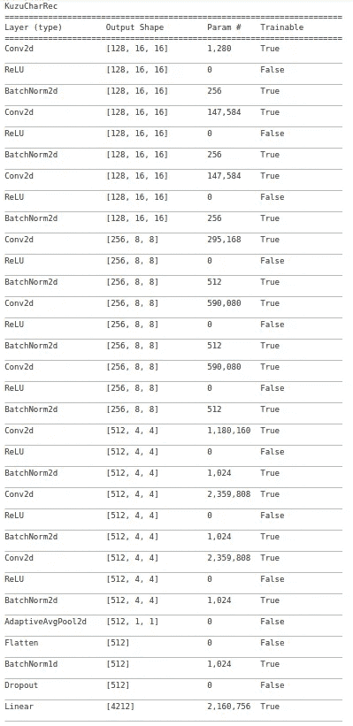

在他的 fast.ai 课程中，Jeremy 讨论了使用卷积的具体顺序，然后是校正线性单元(简称 ReLU)，最后是批量归一化层。ReLU 选择并清除负激活。在数学上，只是`max(0,x)`其中 x 是激活。批量标准化有很多工作要做，我不认为我可以用数学来解释，但根据 Jeremy 的说法，它的要点可以归结为定义类似于`y=ax+b`的东西，其中批量标准化添加了`a`和`b`项，以将均值和方差转移到我们想要的位置。[顺序问题](https://forums.fast.ai/t/lesson-7-further-discussion/32555/16)，直观地说，ReLU 之后的批量范数层意味着试图移动均值和方差的工作不会浪费，因为激活不会被 ReLU 归零。

非常重要的是要注意，如果你正在阅读 fastai v1 文档，它说自定义`conv_layer` ["返回 nn 的序列。Conv2D，BatchNorm 和一个 ReLU"](https://docs.fast.ai/layers.html#conv_layer) 。这意味着批处理规范化在 ReLU 之前完成。但是，[源代码讲述了一个不同的故事](https://github.com/fastai/fastai/blob/master/fastai/layers.py#L122)，一个 ReLU before batch norm。我发现这一点是因为我很困扰，因为医生暗示的序列与我的直觉告诉我的不同。直觉和一点“信任但核实”大有帮助。

## 头部

在将卷积层定制为我认为最有效的层之后，剩下的简单任务就是将这些激活映射到 1-hot 向量的 4212 个输出，我的网络将使用这些输出来预测结果。这被称为网络的“头”。例如，当使用预先训练的模型时，通常希望将模型的头部换成一组更特定于任务的层。网络卷积层的权重仍然存在，但最终层需要一点训练。

我保持我的最终层简单明了，应用一个池层，然后是批量标准化，下降，和完全连接的线性层。上面的代码使用了`PoolFlatten`和`bn_drop_lin`，都是 fastai 函数。

`PoolFlatten`先创建一个`AdaptiveAvgPool2d` [图层](https://pytorch.org/docs/stable/nn.html#adaptiveavgpool2d)。然后，它加上一个 flatten 来创建大小为 512 的秩 1 张量。请记住，在此之前，该架构演示了卷积如何在增加通道数量的同时减少输入的宽度和高度。激活范围从 128x16x16 到 256x8x8 到 512x4x4。然后汇集发生，创建大小为 512 的秩一张量。我仍在学习自适应平均池的细节，包括何时使用它与最大池或两者都用。无论如何，在 CNN 的结尾，建议使用某种池来将激活转换为最后一层的正确输出形状。

`bn_drop_lin`是另一个 fastai treat，通过源代码比文字更好地解释[。我要补充的唯一一点是，dropout 层减少了过度拟合，我知道我的模型可能会因为数据集中只有一个样本的字符而受到影响。](https://github.com/fastai/fastai/blob/master/fastai/layers.py#L44)

虽然您看不到它，但最终的 softmax 层也存在于网络中。Fastai 足够聪明，知道模型最终想要一个 softmax 层来创建一个合适的概率分布。它知道这是由于输出的性质，一个热码编码向量，和损失函数，交叉熵，用于分类任务。

# 训练 CNN

这是一个非常耗时的过程。我将回顾我所做的一切实验，但不幸的是，这是我记忆中的日志，而不是记事本或日志。下一次我准备这样做的时候，我需要把它写在一个单独的地方，这样我就可以查看我尝试过的所有变量。

## 优化 GPU 的使用

最初，我的训练需要两个小时或更长时间，使用 NVIDIA GeForce GTX 1080，我知道我会留下一些东西。果然，在查看`gpustat -cp -i`时，我只看到了 3–10%的 GPU 使用率。最初，我使用 128 或 256 的批处理大小，因为我没有用完内存。在阅读了大量论坛帖子后，我意识到，在这一点上，也许我的内存不是瓶颈，但通过我的`binarize`转换器的图像才是。许多作者建议使用优化的图像库，但是我认为这对于我的简单任务来说太难了。相反，我首先从我的数据中提取了一小部分。然后，我大幅减少了批量。最后，我不断地热然一个`fit_one_cycle`，不在乎最后的结果。我只是运行它，观察速度，内存使用，GPU 使用，然后停止它，重复。

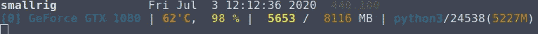

GPU 处于最大使用率(是的，我已经将我的桌面命名为 smallrig)

对于 64x64 的图像，我开始看到批量大小为 4 的 GPU 得到了很好的利用。对于 32x32 的图像，一批 16 个似乎就可以了，而且速度快得多。

起初，我认为在将它们映射到一个 4212 独热编码张量之前，我需要更多的最终激活，所以我将最终通道大小强制增加到 1024。但是没有足够的通道起始数量，图像太小，以至于模型开始在 1×1 像素上进行步长 1 卷积。那没有任何意义。我必须提高我的通道的初始数量，以便输入激活不会减少到 1x1，直到最后的步幅 2 卷积。但是另一个问题突然出现了。训练后，错误率在 3%左右，训练损失为 0.02，验证损失为 0.15。策划损失并不愉快；验证损失并没有以任何稳定的方式减少，即使训练损失在减少。显然，我是过度拟合，即使与辍学层。因此，我退出了通道，并让激活设置为 512x4x4 张量，然后通过头部获得字符概率。这个模型经过训练后表现良好。

因此，我坚持使用 32x32 的图像，模型的批量大小为 16，512 个最终通道，以及最终的 512x4x4 激活张量，然后通过头部输入以获得字符概率。这个模型经过训练后表现良好。

## 实际训练

这里没有太多描述，只是一点点代码和图片。首先，我试图找到最佳的学习速度:

```
learn.lr_find()
learn.recorder.plot(skip_end=20)
```

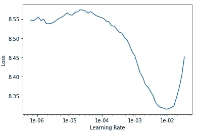

一个很棒的图表。最初，我感到气馁，因为我的初始图形看起来非常平坦，在非常大的峰值之前，只有一个小的波谷。然而，正如我从论坛上了解到的，我需要切掉图的尾端。如果没有这一点，损失爆炸使 y 轴气球，这反过来使图表的其余部分变得无足轻重。用`skip_end=20`参数重试效果非常好。事实上，我忍不住创造了这个迷因:

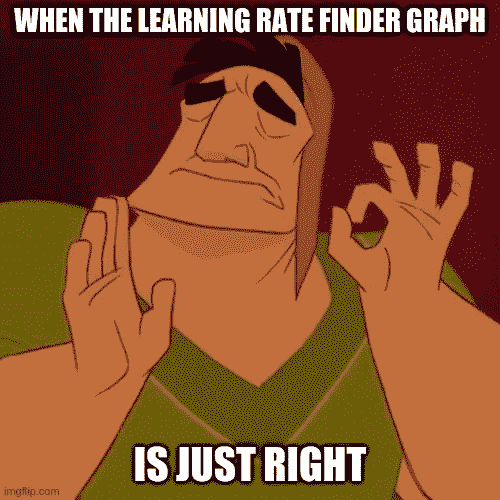

我也可以这样初始化权重。或者当一个难懂的概念最终实现时。不要让我开始。

然后，我拟合了一段时间的模型

```
learn.fit_one_cycle(7, slice(1e-3), callbacks=[SaveModelCallback(learn,every='epoch', name='30pct32sz16bsN_model')])
```

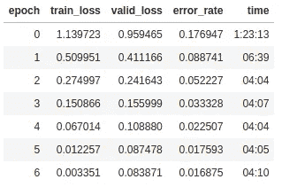

看到 0.017 的错误率，我非常激动。看一下损失图表:

```
learn.recorder.plot_losses()
```

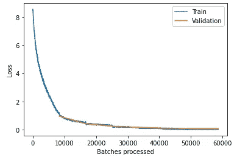

训练和验证的最终损失分别为 0.003 和 0.084。请记住，与验证相比，培训的损失较低是预期的，也是健康的，只要差异不是很大，并且两者仍呈下降趋势。当我查看纪元表时，我惊讶地发现错误率、验证损失和训练损失都在下降，因此可能有更多纪元的空间。不过在这一点上，我对结果很满意。

我也试着看看最高亏损，但是，每当我跑的时候

```
interp = ClassificationInterpretation.from_learner(learn)
```

我以这个结尾:

```
RuntimeError: [enforce fail at CPUAllocator.cpp:64] . DefaultCPUAllocator: can't allocate memory: you tried to allocate 3870777456 bytes. Error code 12 (Cannot allocate memory)
```

果然，我的 RAM 看起来总是这样，post 尝试:

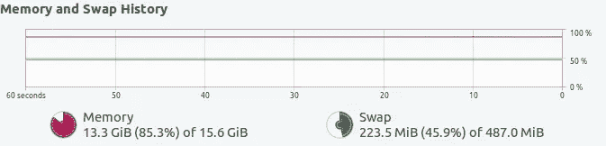

内存不足(内存接近 100%)

我还没有调查我需要做什么才能得到这份工作。也许我需要删除对象，停止运行不和谐，等等。任何能找回额外记忆的东西。或者只做简单的事情，买更多的内存。

## 热图和挂钩

杰里米在他的一堂课中做了一件很酷的事情，他看了看最终卷积的热图，并将其叠加在一只猫的图像上，他的模型预测这只猫是一只缅因猫。我决定也尝试一下，因为这是对 fastai 提供的回调功能的一个非常温和的介绍。这篇文章变得相当长，所以我将省去代码(在我的 GitHub 上总是可以找到)并提供一张图片来代替。

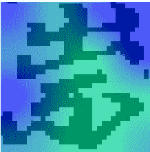

它负责识别的字符的最终卷积的热图

热图很好地勾勒出了角色的细节。它错过了人物的右上部分，但仅此而已。请记住，此热图是由最终卷积生成的。因此，它只是通过对 512x4x4 张量的 512 个通道进行平均而产生的 4x4 图像。然后对该图像进行插值以适合 32×32 的图像。

# 结束:吸取的教训

创建 CNN 实际上是这个字符识别练习中最简单的部分。PyTorch 和 fastai 的 API 都非常容易使用。在我想了解更多的情况下，我通常只需要查看 fastai 源代码。我喜欢用 PyTorch 写代码，然后用 fastai 重写，同时理解我写的所有东西。当然，对于像`PoolFlatten`这样的一些层，我需要回去确保我理解了更好的细节，但是我仍然对它是什么以及为什么它适合有一个直观的理解。

实验是艰苦的工作。我应该遵守纪律，跟踪每一个变化的变量，了解它对网络性能的影响。我希望在决定采用最大化速度的方法之前，我已经在自述文件中写下了我尝试的每种组合。这还没有开始考虑网络的变化，以了解模型的错误率是如何受到影响的，因为我需要几个时期才能看到这一点。唯一有帮助的是能够快速旋转笔记本，测试一两个功能，并将其复制到我的主笔记本上进行应用。

这很有趣，也很有收获。MNIST 变得无聊。Kuzushiji 的角色是我所期待的——有点挑战性。我花了大约三周时间浏览视频、阅读文档、查看数据等。在我的[上一篇文章](/foray-into-deep-learning-transfer-learning-and-fast-ai-ca0c44c03874?source=friends_link&sk=04da3db568cde065dd428390012323b3)中，我提到了数据准备和培训之间的 80/20 分割。由于培训的时间，这个项目是 40/60 分裂。操纵模型的参数，看看什么可行，什么不可行，这占用了我大部分时间。

和往常一样，我的代码[可以在我的 github repo](https://github.com/abcde13/KuzushijiRecognizer) 中找到。如果你真的看了代码，我恳求你，请浏览一下自述文件，这样你就不会被我的几个笔记本完全弄糊涂了。

谢谢你坚持到最后！欢迎评论和提问。