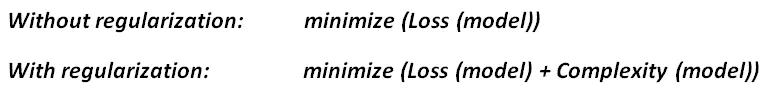
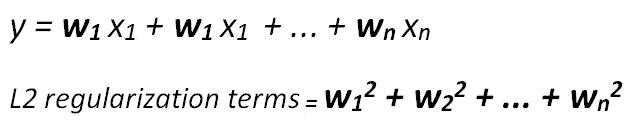
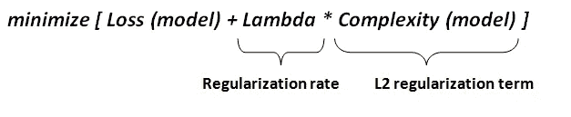
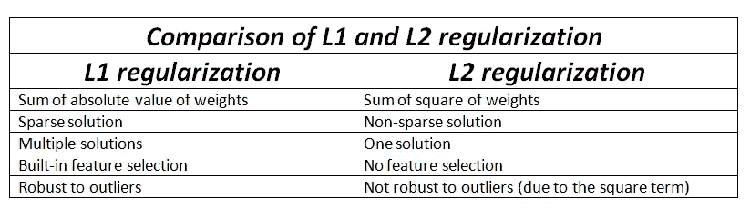

# L1 和 L2 正则化-解释

> 原文：<https://towardsdatascience.com/l1-and-l2-regularization-explained-874c3b03f668?source=collection_archive---------13----------------------->

## 如何控制模型的复杂性

克里斯·莱佩尔特在 [Unsplash](https://unsplash.com/s/photos/control?utm_source=unsplash&utm_medium=referral&utm_content=creditCopyText) 上的照片

过拟合是数据科学领域中的一个重要问题，需要小心处理，以便建立一个健壮和准确的模型。当模型试图很好地拟合训练数据，以至于不能推广到新的观察结果时，就会出现过度拟合。过度拟合模型捕捉训练数据中的细节和噪声，而不是总体趋势。因此，即使是特征的微小变化也会极大地改变模型的结果。过度拟合模型似乎在训练数据上表现突出，但在新的、以前看不到的观察上表现不佳。

过拟合的主要原因是模型复杂。因此，我们可以通过控制复杂性来防止模型过度拟合，这正是正则化所做的。**正则化**通过惩罚模型中较高的项来控制模型的复杂性。如果增加一个正则项，该模型试图最小化损失和模型的复杂性。

在这篇文章中，我将介绍两种常用的正则化技术，分别是 **L1** 和 **L2** 正则化。导致模型复杂的两个主要原因是:

*   特征总数(由 L1 正则化处理)，或
*   特征的权重(由 L2 正则化处理)

**L1 正规化**

它也被称为针对稀疏性的正则化。顾名思义，它用于处理主要由零组成的稀疏向量。稀疏向量通常导致非常高维的特征向量空间。因此，模型变得很难处理。

L1 正则化通过在每次迭代中从权重中减去一个小的量来强制无信息特征的权重为零，从而最终使权重为零。

> L1 正则化惩罚|权重|。

**L2 正规化**

为了简单起见，它也被称为正则化。如果我们把模型的复杂度作为权重的函数，那么特征的复杂度与它的权重的绝对值成正比。

L2 正则化迫使权重趋向于零，但并不使它们完全为零。L2 正则化就像在每次迭代中去除一小部分权重的力。因此，权重永远不会等于零。

> L2 正则化惩罚(权重)

有一个额外的参数来调整 L2 正则项，称为**正则化率(λ)。**正则化率是一个标量并乘以 L2 正则化项。

**注意:**为λ选择一个最佳值很重要。如果 lambda 太高，模型就会变得太简单，而且往往会不符合要求。另一方面，如果λ太低，调节的效果变得可以忽略不计，模型可能会过拟合。如果 lambda 设置为零，那么正则化将被完全移除(过度拟合的高风险！).

> **注:** **岭回归**使用 L2 正则化，而**套索回归**使用 L1 正则化。**弹性网回归**结合了 L1 和 L2 正则化。

# 结论

过度拟合是机器学习模型的一个关键问题，需要小心处理。我们建立机器学习模型来预测未知。我们希望模型能够学习训练数据中的趋势，并在评估新的观察结果时应用这些知识。因此，模型需要很好地概括底层结构，而不是过于关注训练点的细节。正则化有助于模型实现这个目标。

感谢您的阅读。如果您有任何反馈，请告诉我。