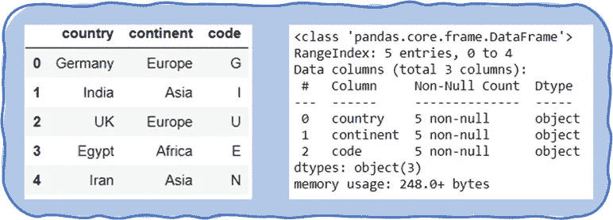

# Python 中的标签编码器和 OneHot 编码器

> 原文：<https://towardsdatascience.com/label-encoder-and-onehot-encoder-in-python-83d32288b592?source=collection_archive---------17----------------------->

## 通过示例了解标签编码器、OneHot 编码器和 Pandas 虚拟变量


杰西卡在 [Unsplash](https://unsplash.com/s/photos/number-for-alphabet?utm_source=unsplash&utm_medium=referral&utm_content=creditCopyText) 上的

M 机器学习算法理解数字而不是文本。因此，所有“文本”列都必须转换为“数字”列，以便算法能够理解。

这是将标签或分类或 ***文本*** 值转换成数字或 ***数值*** 值的故事。简单来说，

> 编码是将单词转换成数字的过程

在 Python 中， **OneHot 编码**和**勒贝尔编码**是将分类列编码成数值列的两种方法。而这些都是最常用的 Python 库的一部分: ***Scikit-Learn***

但是等等，你不会想在笔记本里导入 Scikit-Learn 吧？？

没问题，⚡️熊猫会来帮你的。

让我们深入这个将分类变量转换成数字变量的故事，以便 ML 算法理解它。

# 分类数据

任何数据集都包含多个包含数值和分类值的列。


作者图像:分类列的数据类型

分类变量代表可以分组的数据类型。它有有限且通常固定数量的可能值，称为 ***类别*** 。性别、社会阶层、血型、国家代码等变量都是分类数据的例子。

但是，如果该数据被编码成数值，那么只有它可以在机器学习算法中被处理。

让我们考虑下面的例子，以简单的方式理解编码。

```
import pandas as pdcountries = ["Germany","India","UK","Egypt","Iran"]
continents = ["Europe","Asia","Europe","Africa","Asia"]
code = ["G","I","U","E","N"]
d={"country": countries, "continent":continents, "code":code}
df = pd.DataFrame(d)
```



作者图片:示例数据框架

将“代码”列的数据类型从对象转换为类别

```
df['code'] = df.code.astype('category')
```


按作者分类的图像:所有列的数据类型

通过这个例子让我们了解编码过程。

# Python 中的标签编码

标签编码是一种简单直接的方法。这会将分类列中的每个值转换为数值。分类列中的每个值称为标签。

> 标签编码:根据字母顺序为每个标签分配一个唯一的整数

让我用上面的例子向您展示标签编码在 python 中是如何工作的，

```
from sklearn.preprocessing import LabelEncoderle = LabelEncoder()
df["labeled_continent"] = le.fit_transform(df["continent"])
df
```

列`**continent**`中的标签将被转换成数字，并存储在新列 `**labeled_continent**`中

输出将是，


作者图片:Python 中的标签编码

用更简单的话来说，标签按字母顺序排列，从 0 开始给每个标签分配一个唯一的索引*。*


作者图片:了解 Python 中的标签编码

一切正常吗？？干得好，⁉️

这里涉及到标签编码的问题。它使用序列中的数字来引入标签之间的比较。在上面的例子中，列`**continent**`中的标签没有顺序或等级。但是标签编码后，这些标签是按字母顺序排列的。由于这些数字，机器学习模型可以将这种排序解释为`Europe > Asia > Africa`

为了解决标签编码的排序问题，OneHot 编码应运而生。

# Python 中的 OneHot 编码

在 OneHot 编码中，为列中的每个标签创建一个*二进制列*。这里，每个标签都被转换为一个新列或新要素，并被赋予 1(热)或 0(冷)值。

让我先给你看一个例子来理解上面的陈述，

```
from sklearn.preprocessing import OneHotEncoderohe = OneHotEncoder()
df3 = pd.DataFrame(ohe.fit_transform(df[["continent"]]).toarray())
df_new=pd.concat([df,df3],axis=1)
df_new
```


作者图片:Python 中的 OneHot 编码

在这个场景中，最后三列是 OneHot 编码的结果。非洲、亚洲和欧洲的标签分别被编码为 0、1、2。OneHot 编码将这些标签转换成列。因此，查看最后 3 列，我们有`3 labels → 3 columns`

> OneHot 编码:在一行中只有一个标签是热的

在特定的行中，只有一个标签的值为 1，所有其他标签的值为 0。在将这样的编码数据集输入到机器学习模型之前，可以进行更多的转换，如 OneHot Encoding [文档](https://scikit-learn.org/stable/modules/generated/sklearn.preprocessing.OneHotEncoder.html#sklearn.preprocessing.OneHotEncoder)中所述。

快速浏览这篇文章，了解合并两个数据帧的更多选项

[](/join-the-tables-ab7fd4fac26b) [## 加入表格

### 了解 Python pandas 中的 merge()和 concat()

towardsdatascience.com](/join-the-tables-ab7fd4fac26b) 

# Python 中的 pandas.get_dummies()

OneHot 编码可以以更简单的方式实现，无需导入 ***Scikit-Learn。***

⚡️赞成！！熊猫是你的朋友。这个简单的函数`pandas.get_dummies()`会将指定列中的所有标签快速转换成单独的二进制列

```
df2=pd.get_dummies(df[["continent"]])
df_new=pd.concat([df,df2],axis=1)
df_new
```


图片作者:熊猫虚拟变量

上述数据帧的最后 3 列与 OneHot 编码中观察到的相同。

pandas.get_dummies()为列`**continent**`中的每个标签生成虚拟变量。因此，*非洲大陆、亚洲大陆、*和*欧洲大陆*分别是非洲、亚洲和欧洲标签的虚拟**二元变量**。

# 通过我的故事，

我向您介绍了将分类变量转换为数值变量的方法。每种方法都有自己的优点和局限性，因此理解所有的方法很重要。根据您想要实现的数据集和机器学习模型，您可以在 Python 中选择上述三种标签编码方法中的任意一种。

这里有一些资源可以帮助你解决这个问题:

1.  [Python 中的标签编码](https://scikit-learn.org/stable/modules/generated/sklearn.preprocessing.LabelEncoder.html)
2.  [Python 中的 OneHot 编码](https://scikit-learn.org/stable/modules/generated/sklearn.preprocessing.OneHotEncoder.html#sklearn.preprocessing.OneHotEncoder)
3.  [使用熊猫获取虚拟变量](https://pandas.pydata.org/pandas-docs/stable/reference/api/pandas.get_dummies.html)

喜欢我讲故事的方式吗？？

这里有一个有趣的***fun&learn***活动供你创建自己的数据集。看一看。

[](/web-scraping-make-your-own-dataset-cc973a9f0ee5) [## 网页抓取—制作您自己的数据集

### 从网页中提取数据并将其存储到 excel 中—只需 4 个简单的步骤

towardsdatascience.com](/web-scraping-make-your-own-dataset-cc973a9f0ee5) 

***感谢您的宝贵时间！***

我总是乐于接受建议和新的机会。请随时添加您的反馈，并通过 [LinkedIn](https://www.linkedin.com/in/surajgurav17/) 与我联系。