# 标签传播去神秘化

> 原文：<https://towardsdatascience.com/label-propagation-demystified-cd5390f27472?source=collection_archive---------4----------------------->

## 基于图的标签传播的简单介绍

社交媒体网络已经遍布全球，并且与日俱增。考虑一个社交媒体网络，你知道一些人的兴趣，你想预测其他人的兴趣，这样我们就可以有针对性地开展营销活动。为此，我们可以使用基于图的半监督机器学习技术，称为**标签传播**。在本文中，我将通过一些例子和样本代码来解释标签传播过程。

# 什么是标签传播？

**标签传播算法(LPA)** 是一种迭代算法，其中我们通过在数据集内传播标签来将标签分配给未标记的点。该算法由**小金朱**和**邹斌·格拉马尼**【1】于 2002 年**首次提出。LPA 属于**直推学习**，因为我们想要预测已经给我们的未标记数据点的标签。**

**假设我们有一个如下所示的人的网络，有两个标签类别“*对板球感兴趣*”和“*对板球不感兴趣*”。那么问题来了，我们能预测剩下的人是否对板球感兴趣吗？**

**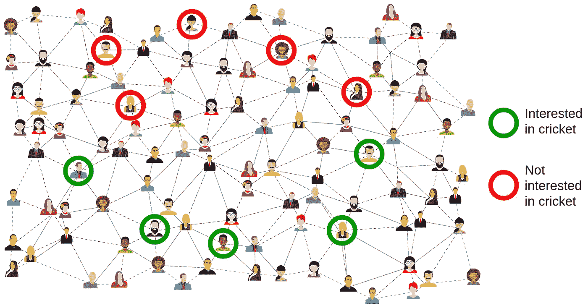**

**来自 [Pixabay](https://pixabay.com/?utm_source=link-attribution&utm_medium=referral&utm_campaign=image&utm_content=3846597) 的 [Gordon Johnson](https://pixabay.com/users/GDJ-1086657/?utm_source=link-attribution&utm_medium=referral&utm_campaign=image&utm_content=3846597) 的原始图片。**

**对于 LPA 在这种情况下的工作，我们必须做一个假设；连接两个节点的边带有相似性的概念。即，如果两个人联系在一起，这意味着这两个人很可能有相同的兴趣。我们可以做出这样的假设，因为人们倾向于和其他有相似兴趣的人联系。**

# **在图中随机行走**

**考虑图 1 中给出的示例图，其中我们有 2 个标签类(红色和绿色)和 4 个彩色节点(每个类 2 个)。我们想预测节点 4 的标签。**

**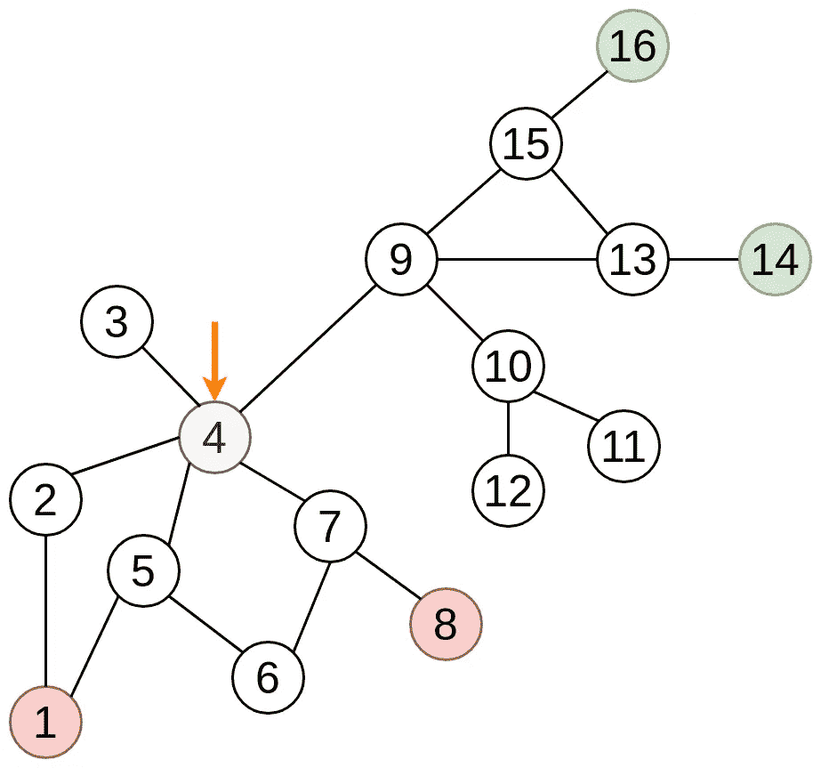**

**图一。样本图表 1**

**我们可以在图中随机行走，从节点 4 开始，直到我们遇到任何标记的节点。当我们碰到一个有标签的节点时，我们停止行走。因此，这些被标记的节点被称为**吸收态**。让我们考虑从节点 4 开始的所有可能的路径。在所有可能的遍历中，下面的遍历将以绿色节点结束。**

1.  **4 → 9 → 15 → 16**
2.  **4 → 9 → 13 → 14**
3.  **4 → 9 → 13 → 15 → 16**
4.  **4 → 9 → 15 → 13 → 14**

**下面的遍历将以红色节点结束。**

1.  **4 → 7 → 8**
2.  **4 → 7 → 6 → 5 → 1**
3.  **4 → 5 → 1**
4.  **4 → 5 → 6 → 7 → 8**
5.  **4 → 2 → 1**

**基于从节点 4 开始的所有可能的随机行走，我们可以看到大多数行走都以红色节点结束。所以，我们可以把节点 4 涂成红色。这是 LPA 背后的基本直觉。**

# **数学公式**

**设`Xₗ`为被标记节点的集合，`Yₗ`为被标记数据的独热标签(如果不了解独热编码，可以参考这个[链接](https://medium.com/@michaeldelsole/what-is-one-hot-encoding-and-how-to-do-it-f0ae272f1179))。假设有`{1,…,C}`类标签。`Xᵤ`是未标注的顶点。我们不知道`Yᵤ`，因此`Yᵤ`将包含零。**

**我们可以将随机游走表示如下。**

**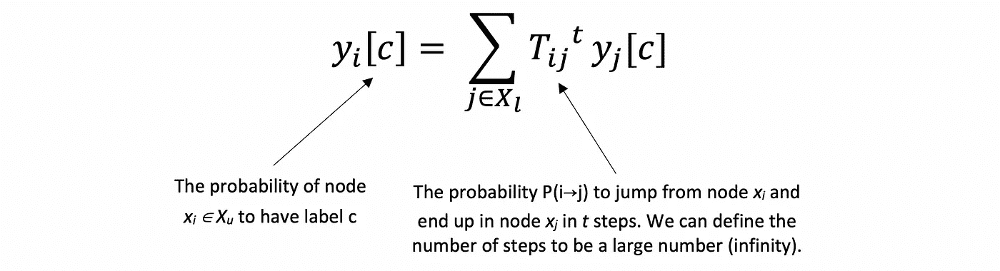**

**图二。随机漫步**

**在矩阵形式中，该方程将如下所示。**

**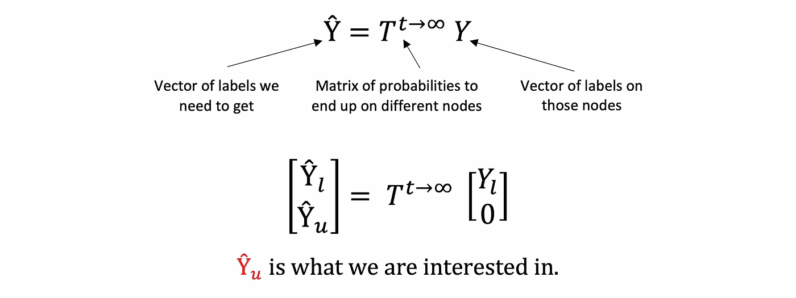**

**图三。矩阵形式的随机游动**

**如果我们可以计算概率转移矩阵 **T** ，我们就可以计算所有未标记节点的标记概率。**

# **如何计算概率转移矩阵？**

**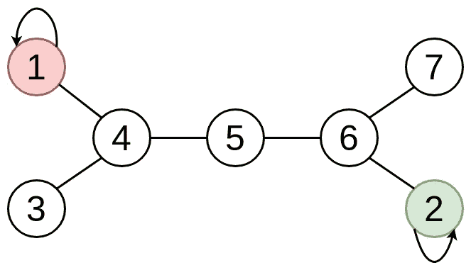**

**图 4。样本图表 2**

**考虑如图 4 所示的具有吸收态的样本图。对于每个节点，我们都要计算跳到其他节点的概率。当我们到达吸收状态时，行走结束，因为我们陷入吸收状态(在图中表示为自循环)。这是一个无向图，所以我们可以向任何方向移动。**

**假设从一个节点转移到其邻居的概率是相等的，我们可以将 T 写成如下。**

**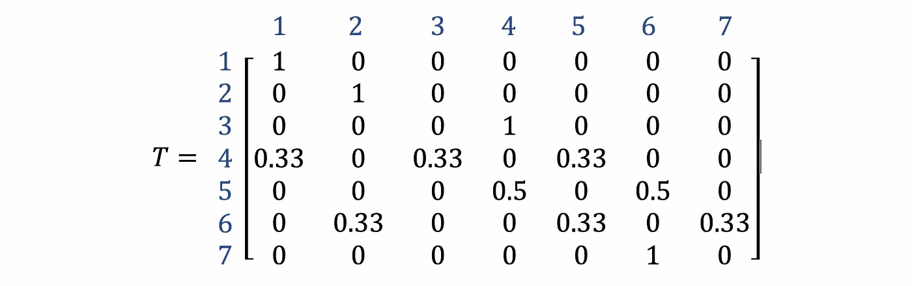**

**图五。图 4 中样本图 2 的矩阵 T**

**从节点 1 到节点 1 的概率是 1，因为节点 1 处于吸收状态。从节点 1，我们无法到达任何其他节点。因此，从节点 1 到达其他节点的概率将是 0。同样的方法也适用于节点 2。**

**从节点 4，您可以转到节点 1、3 和 5。因此，从节点 4 移动到节点 1、3 和 5 是同样可能的，每个节点的概率为 0.33。类似地，从节点 5，我们可以移动到节点 4 和 6，每个节点的概率为 0.5。**

**注意，我们可以使用图的度矩阵(D)和邻接矩阵(A ),使用下面的等式来计算 T。**

> **`T = D⁻¹A`**

**现在请注意，我们可以拆分矩阵 T，如图 6 所示。**

**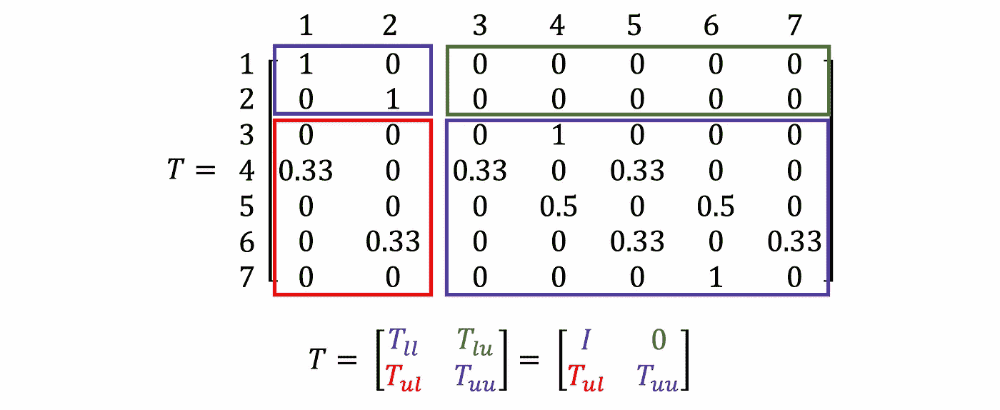**

**图六。t 可以分成 4 块**

*   **Tₗₗ —从标记节点到标记节点的概率**
*   **Tₗᵤ —从标记节点到未标记节点的概率**
*   **Tᵤₗ —从未标记节点到标记节点的概率**
*   **Tᵤᵤ —从未标记节点到未标记节点的概率**

*****注:*** Tₗₗ将是一个单位矩阵，而 Tₗᵤ将是一个零矩阵，因为我们不能从被标记的节点移出，因为它们是吸收态。**

**如果我们将矩阵 T 乘以 *t* 倍，然后将 *t* 送至无穷大(∞)，会发生什么？你可以在 MATLAB 中输入这个矩阵，得到 T ⁰⁰.你会得到这样的结果。**

**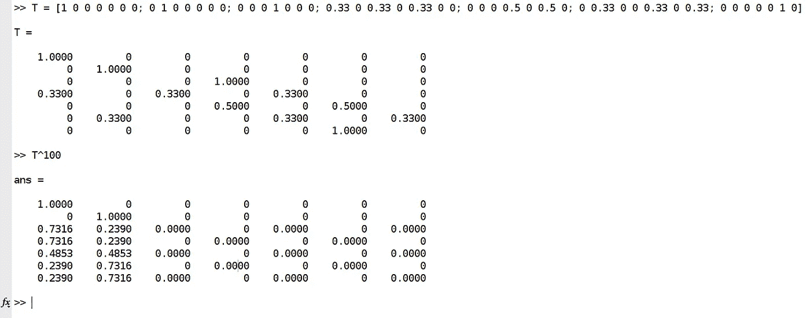**

**图 7。t 在 MATLAB 上自乘 100 次**

**当你将 T 提高到更大的幂时，概率将停止变化(达到饱和)并导致稳定的转移概率。您现在可以看到，只有前两列包含非零值，其余列都为零。**

**我们可以用数学方法描述如下。**

**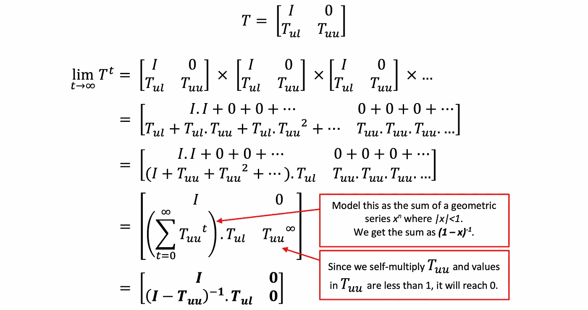**

**图 7。T 乘以自身无限倍的公式**

# **获得最终答案**

**最后，带标签的矩阵看起来像这样，我们可以得到带标签节点的标签向量和不带标签节点的标签向量。**

**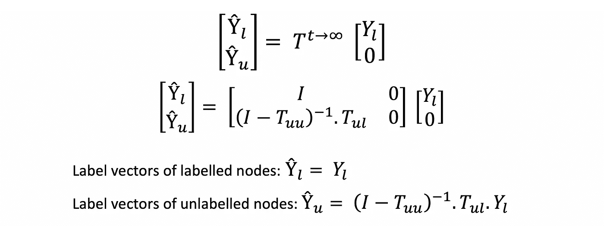**

**图 8。有标号和无标号节点的一键标号公式**

**现在让我们考虑图 4 中的示例图 2，我们希望预测未标记节点的标签。使用我们的 MATLAB 结果，我们可以得到如下标签。**

**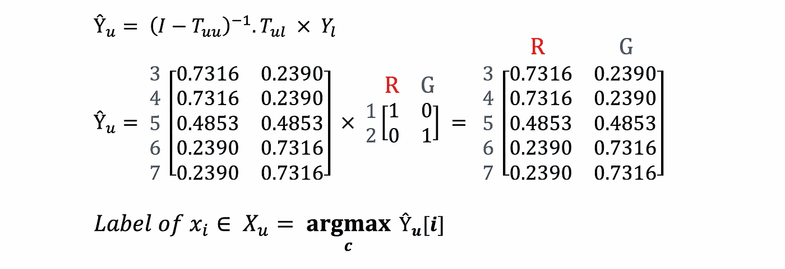**

**图九。获取未标记节点的标签**

**对于每个未标记的节点，我们分配具有最大概率的类别标签。但是，你可以看到节点 5 有相等的概率是红色和绿色。因此，我们的最终标记图将如图 10 所示。**

**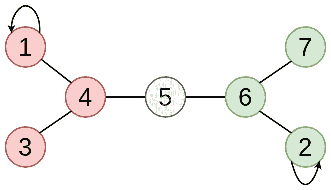**

**图 10。样本图的最终标记 2**

# **示例代码**

**带有 LPA 简单实现的示例代码**

**你也可以阅读我以前的文章[用 Python-igraph 可视化图形数据](/visualising-graph-data-with-python-igraph-b3cc81a495cf)来学习如何用 Python 表示图形数据。**

** [## 用 Python-igraph 可视化图形数据

### 使用 CiteSeer 数据集介绍 python-igraph 模块

towardsdatascience.com](/visualising-graph-data-with-python-igraph-b3cc81a495cf) 

# 最后的想法

LPA 使用已标记节点的标签作为基础，并试图预测未标记节点的标签。然而，如果初始标记是错误的，这会影响标记传播过程，并且错误的标记可能被传播。为了克服这个问题，标签扩散被引入，其中我们在学习无标签节点的标签的同时也学习有标签节点的标签。这也应用了一些标签修正。你可以从周等人的文章[学习本地和全球一致性](https://papers.nips.cc/paper/2506-learning-with-local-and-global-consistency.pdf)中了解更多关于标签传播的信息。

希望你觉得这个解释有用。我很想听听你的想法。感谢您的阅读。

干杯！

# 参考

[1]朱小金和邹斌·格拉马尼。利用标签传播从有标签和无标签数据中学习。宾夕法尼亚州匹兹堡市卡内基梅隆大学计算机科学学院，技术报告。CMU CALD 2002 年 2 月 107 日。

[2]网络分析。第十七讲(第一部分)。列昂尼德·茹科夫([https://youtu.be/hmashUPJwSQ](https://youtu.be/hmashUPJwSQ))教授的图的标号传播。**