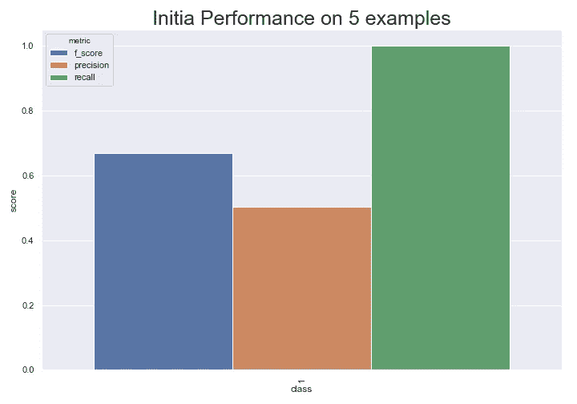
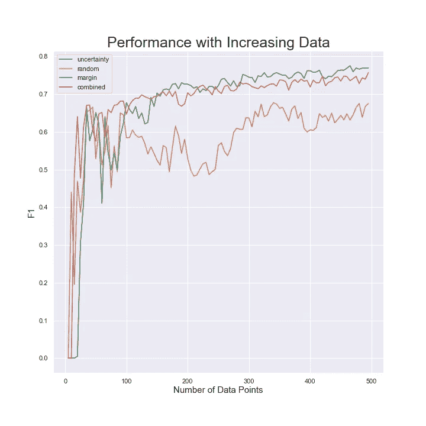

# 主动学习导论

> 原文：<https://towardsdatascience.com/label-smarter-not-more-4f5bbc3fbcf5?source=collection_archive---------63----------------------->

## 标签更聪明而不是更多。


从[像素](https://www.pexels.com/photo/man-running-on-street-2886982/?utm_content=attributionCopyText&utm_medium=referral&utm_source=pexels)运行 4 个 FFWPU

# 介绍

想象一下你的学生时代为考试而学习。你是随机阅读笔记的某一部分，还是在书的后面随机做题？不要！好吧，至少我希望你没有像对待早餐一样严格对待你的学业。你可能做的是找出哪些话题对你来说很难掌握，并在这些话题上努力工作。只对你认为你理解的想法做一些小的更新。那么我们为什么要区别对待我们的机器学生呢？

我们需要更多的数据！这是我作为一名数据科学家经常听到的响亮号召，而且大多数时候都是如此。这通常是因为一些问题没有足够的数据来获得好的结果。一个经理问你需要多少数据。你多说。他们雇佣一些实习生或者众包一些贴标机，花上几千美元，你就能获得更多的性能。增加一个步骤，让您的模型告诉您它想要了解更多的内容，这可以大大提高您的性能，而只需要很少的数据和成本。我说的是做一些，为流行词做好准备，主动学习。

在本文中，我们将运行一些与主动学习和数据选择相关的基础实验。我们将在 [IMDB 情感数据集的一个小子集上训练一个随机森林。](https://www.kaggle.com/lakshmi25npathi/imdb-dataset-of-50k-movie-reviews/version/1)然后，我们将通过随机采样，以及通过采样模型想要了解的数据点来增加训练集。我们将比较我们在数据增长方面的性能提升，并展示智能标记如何节省时间、金钱和提高性能。该项目的代码在这里的要点[中，也包括在本文的底部。让我们开始吧。](https://gist.github.com/nbertagnolli/004862c45808fb4054e0fc3ca73acc7a)

# TLDR

如果您的问题需要更多数据，请尝试在分类器的帮助下进行标注。为此，要么选择置信度最低的例子，要么选择最高和第二高概率最接近的例子。这在大多数情况下有效，但不是万灵药。我见过随机抽样和这些主动学习方法做得一样好。

# 数据

对于这个问题，我们将查看 [IMDB 情感数据集](https://www.kaggle.com/lakshmi25npathi/imdb-dataset-of-50k-movie-reviews/version/1)，并尝试预测一部电影评论的情感。我们将为这个数据集获取整个测试集，以及一小部分训练数据。我们将基于不同的采样策略逐渐增加训练集的大小，并观察我们的性能提升。

在训练集中有大约 34，881 个示例，而在测试集中只有 15，119 个。我们首先将数据加载到熊猫数据框中。

```
df = pd.read_csv("IMDB_Dataset.csv")
df["split"] = np.random.choice(["train", "test"], df.shape[0], [.7, .3])
x_train = df[df["split"] == "train"]
y_train = x_train["sentiment"]
x_test = df[df["split"] == "test"]
y_test = x_test["sentiment"]
```

# 基本模型

对于本教程，我们将看一个简单的随机森林。你可以将这些技术应用到你能想到的任何模型上。这个模型只需要告诉你它对任何给定的预测有多大的信心。因为我们正在处理文本数据，所以我们的基本模型将使用原始文本中的 TF-IDF 特性。我知道，我知道，我们应该在这里使用深度变压器模型，但这是一个关于主动学习的教程，而不是关于 SOTA 的，所以请原谅我。如果你想知道如何使用像[伯特检查我的其他教程在这里](/build-a-bert-sci-kit-transformer-59d60ddd54a5)。

我们将我们的 RandomForest 模型定义为仅使用 unigram 特性的 SciKit-Learn 管道:

```
from sklearn.ensemble import RandomForestClassifier
from sklearn.pipeline import Pipeline
from sklearn.feature_extraction.text import TfidfVectorizerclf = RandomForestClassifier(n_estimators=100, random_state=0)
model = Pipeline(
            [
                ("tfidf", TfidfVectorizer(ngram_range=(1,1))),
                ("classifier", clf),
            ]
        )
```

现在我们可以称之为**。fit()** 在一个文本输入列表上，管道将处理剩下的部分。让我们使用 5 个例子的初始训练集，看看我们在测试集上做得如何。

```
# Get five random examples for training.
rand_train_df = x_train.sample(5)
model.fit(rand_train_df["review"], rand_train_df["sentiment"])
```



测试集上 5 个示例随机森林的初始性能。

从这里，我们可以看到数据集是相当平衡的，因为预测所有的正数给了我们几乎 0.5 的精度。这个模型是相当蹩脚的，因为它只预测积极的。让我们看看我们是否可以使用主动学习来比随机采样新点更快地获得更好的性能。

# 选择好的数据点进行标注

所以我们现在有了一个分类器。最多是 meh，我们需要更多的数据。让我们使用分类器对我们的其他训练数据进行预测，并查看模型对哪些点最没有信心。对于大多数 Sci-Kit 学习评估者来说，这是非常容易。我们可以使用。 **predict_proba()** 函数获取每个类的概率。要手动完成这项工作，您还可以查看树的单个预测，并计算每个类的投票数。不过 **predict_proba** 就方便多了:)。

```
preds = model.predict_proba(x_test["review"])
```

这将给我们一个概率的 numpy 数组，其中每一列是一个类，每一行是一个例子。大概是这样的:

```
[[.1, .9],
 [.5, .5],
 [.2, .8]...
```

## 不确定抽样

挑选好的点进行标记的最简单的“智能”策略是使用模型最没有信心的点。在上面的例子中，这是第二点，因为任何类别的最大概率都是最小的。

```
def uncertainty_sampling(df, preds, n):
    """samples points for which we are least confident"""
    df["preds"] = np.max(preds, axis=1)
    return df.sort_values("preds").head(n).drop("preds", axis=1)
```

这里我们有一个函数，它接受训练示例的数据帧、相关的预测概率以及我们想要采样的点数。然后，它获取每行中的最大值，将数据点从最小到最大排序，并获取具有最小最大概率的`n`个示例。

如果我们将不确定性采样应用于上面的三个示例概率，我们会说我们应该首先标记[.5，. 5]，因为最大概率小于所有其他最大概率。(. 8 和. 9)哪个直观上讲得通！

## 边际抽样

不确定性采样很好，但在多类设置中，它不能很好地捕捉不确定性。如果你有以下预测会怎样？

```
[[.01, .45, .46],
 [.28, .28, .44],
 [0.2, 0.0, .80]...
```

该模型似乎最不确定的数据点是第一个，因为它仅预测了 0.01 的类别 3！但是不确定性采样会说，示例 2 是标记的最佳点，因为 0.44 是最小的最大概率。他们都是很好的候选人，但第一个直觉上更有意义。边际抽样迎合了这种直觉；最好标记的点是那些预测之间具有最小差值的点。我们可以使用以下函数来执行边缘采样:

```
def margin_sampling(df, preds, n):
    """Samples points with greatest difference between most and second most probably classes"""
    # Sort the predictions in increasing order
    sorted_preds = np.sort(preds, axis=1)

    # Subtract the second highest prediction from the highest 
    # We need to check if the classifier has more than one class
    if sorted_preds.shape[1] == 1:
        return df.sample(n)
    else:
        df["margin"] = sorted_preds[:, -1] - sorted_preds[:, -2]
        return df.sort_values("margin").head(n).drop("margin", axis=1)
```

在这段代码中，我们对预测的概率进行排序。然后我们检查数组是否有多个维度。如果它只有一个概率，那么它只看到了一个类，而没有关于其他类存在的信息。在这种情况下，我们只需要随机抽样。否则，我们通过从最高概率中减去第二高的概率并对结果进行排序来找到余量。

# 实验

我进行了一个简单的实验，从五个随机采样点开始，然后应用每个采样策略再获得五个点。我重复这样做 100 次，直到我采样了大约 500 个点。我在每个时间点绘制测试集上的 f1 分数，并查看我们的性能如何随着每个采样策略而提高。



你可以看到，对于这个问题，边际抽样和不确定抽样都比随机抽样做得好。在二进制分类的情况下，它们是相同的。当我开始写这篇文章时，我没有想到这一点😅。我创建了一个叫做`combined`的额外抽样策略，它做了一点边际抽样、一点不确定性抽样和一点随机抽样。对于我的许多项目，我喜欢这种结合的方法，因为有时随机抽样确实有帮助。如果我们总是根据边际或不确定性进行采样，我们就不能从我们的数据集中均匀地采样，并且可能会错过一些重要的信息。有趣的是，我发现抽样中的一点随机通常会有回报。虽然不相信我，因为我还没有运行任何好的实验来证明这一点😅。

# 结论

主动学习可以通过选择向模型添加最多信息的新点，帮助您用更少的数据获得更好的性能。这种策略在大多数时候都很有效，但并不保证会做得更好。当您考虑标注一些附加数据时，这是一个很好的工具。

# 密码