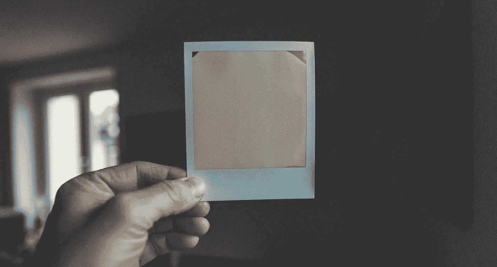
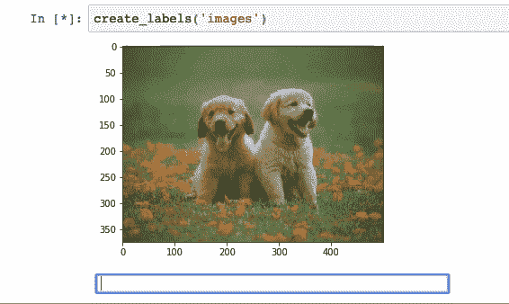
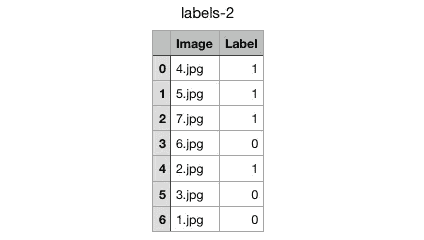

# 用 Jupyter 笔记本电脑标记图像的有效方法

> 原文：<https://towardsdatascience.com/label-your-images-easily-using-this-jupyter-notebook-code-4102037b7821?source=collection_archive---------17----------------------->

照片由[马库斯·斯皮斯克](https://unsplash.com/@markusspiske?utm_source=unsplash&utm_medium=referral&utm_content=creditCopyText)在 [Unsplash](https://unsplash.com/s/photos/paper-photo?utm_source=unsplash&utm_medium=referral&utm_content=creditCopyText) 拍摄

你可能会遇到这样的情况，你需要为你的图片添加标签。或者你已经做了。一种标记方法是手动查看每张图像，并将其标签写在文件中，这是一个痛苦的过程。

在这篇博文中，我将分享你如何让这个过程变得简单快捷。仅仅通过在 Jupyter 笔记本上写几行代码。先看演示吧。

# 演示

我的`Image`目录里有一些**猫**和**狗**的图片。我想给猫贴上`0`的标签，给狗贴上`1`的标签。我只需要通过传递图像目录来调用一个函数。我可以用互动的方式给我的图片贴标签，比如 following。

标记图像

一旦您标记了所有图像，一个**标记**。 **csv** 文件被创建并保存在您的计算机中，该文件包含所有图像名称和相应的标签。

下面是`create_labels()`函数的实现，它完成了上面显示的所有工作。

我将继续创造和发布更多这样的工具，让日常的 ML 任务变得简单。以下是该项目的 Git-Hub 链接。

 [## 希瓦维尔玛/Easy-ML

### 让 ML 任务变得简单而轻松的工具。为 shivaverma/Easy-ML 开发贡献一份力量

github.com](https://github.com/shivaverma/Easy-ML)