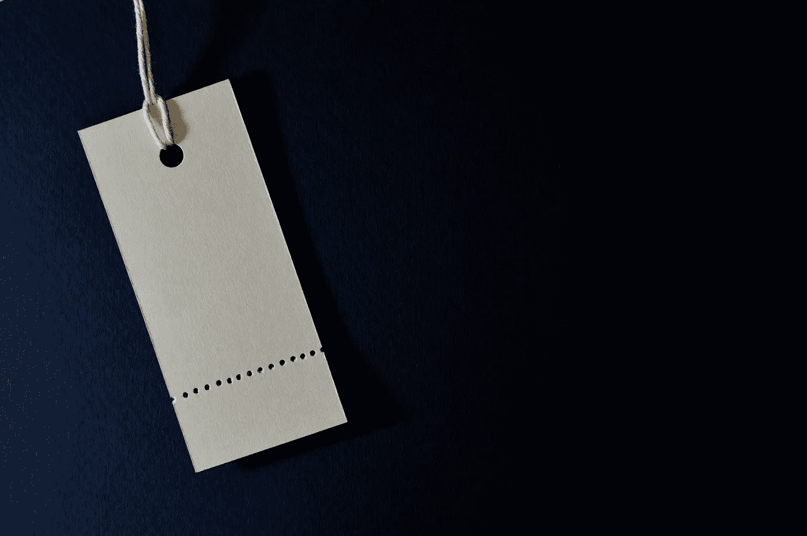
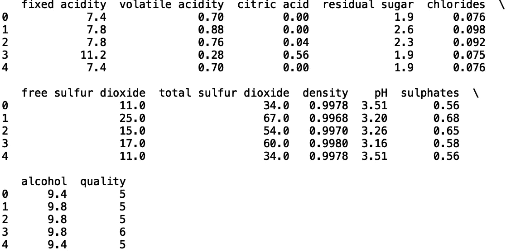
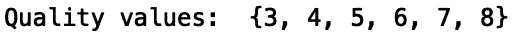
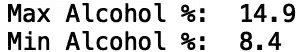
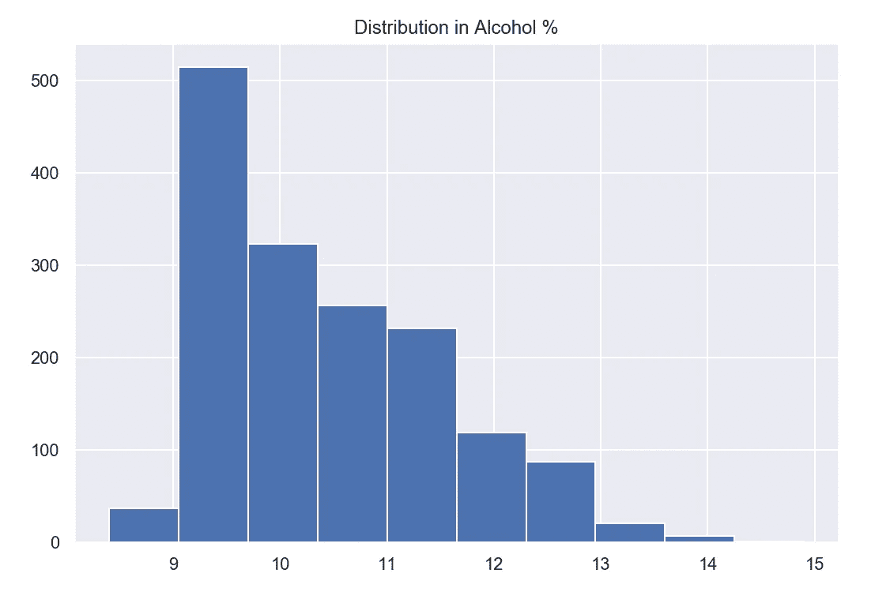
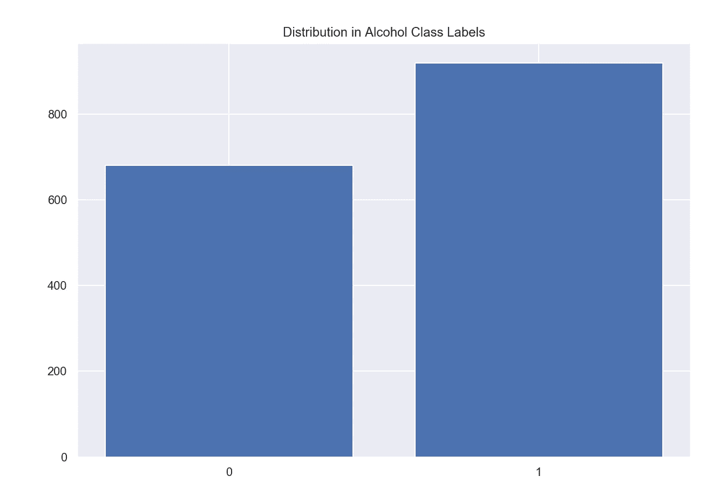
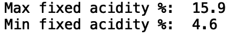
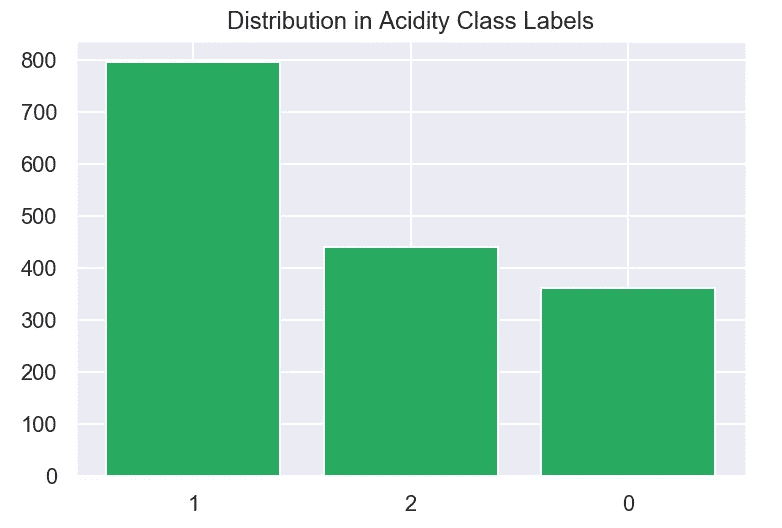

# 用熊猫标注数据

> 原文：<https://towardsdatascience.com/labeling-data-with-pandas-9e573ce59c42?source=collection_archive---------9----------------------->

## 熊猫数据标签简介



[来源](https://www.pexels.com/photo/white-product-label-1111319/)

数据标注是将信息标签分配给数据子集的过程。有许多标记数据集的例子。包含癌性和健康肺的 x 射线图像以及它们各自的标签的数据是标记数据的一个例子。另一个例子是消费者信用数据，它指定消费者是否拖欠贷款。在获得标记的数据集后，机器学习模型可以在标记的数据上训练，并用于预测新的未标记的例子。拥有良好的标记数据对于构建高性能机器学习模型至关重要。在本帖中，我们将讨论使用 python 熊猫库生成有意义标签的过程。

我们开始吧！

我们将考虑标记数字数据的任务。出于我们的目的，我们将使用*红酒质量数据集*，它可以在[这里](https://www.kaggle.com/uciml/red-wine-quality-cortez-et-al-2009)找到。

首先，让我们将数据读入熊猫数据框:

```
import pandas as pd
df_wine = pd.read_csv("winequality-red.csv")
```

接下来，让我们使用。“head()”方法。

```
print(df_wine.head())
```



该数据对应于质量分数在 0 到 10 之间的葡萄酒。让我们看看数据中的值:

```
print("Quality values: ", set(df_wine['quality']))
```



假设我们对另一个分类问题感兴趣，而不是对葡萄酒质量进行分类。让我们考虑一下对一种酒的酒精含量是否在 10%以上进行分类的问题。让我们来看看酒精百分比的最小值和最大值:

```
print("Max Alcohol %: ", df_wine['alcohol'].max())
print("Min Alcohol %: ", df_wine['alcohol'].min())
```



让我们也画出分布图:

```
import matplotlib.pyplot as plt
plt.title("Distribution in Alcohol %")
df_wine['alcohol'].hist()
```



如果酒精百分比高于或等于 10%，我们将用“1”标记数据，否则用“0”标记数据:

```
import numpy as np
df_wine['alcohol_class'] = np.where(df_wine['alcohol']>=10.0, '1', '0')
```

我们现在可以用二进制标签来可视化分布:

```
from collections import Counter
plt.title("Distribution in Alcohol Class Labels")
plt.bar(dict(Counter(df_wine['alcohol_class'])).keys(), dict(Counter(df_wine['alcohol_class'])).values())
```



该数据被适当地标记用于训练二元分类模型。现在让我们考虑二进制分类以外的问题。如果我们看一下“固定酸度”的最小值和最大值，我们会发现这些值的范围比酒精%的范围更宽:

```
print("Max fixed acidity %: ", df_wine['fixed acidity'].max())
print("Min fixed acidity %: ", df_wine['fixed acidity'].min())
```



我们可以用熊猫的。loc[]'方法将三元标签分配给数据，这将把数据分成三组。标签“0”将被分配给值(4–7)，“1”将被分配给值(7–9)，“2”将被分配给值(9–16):

```
df_wine.loc[(df_wine['fixed acidity']>4.0) & (df_wine['fixed acidity']<=7.0), 'acidity_class'] = 0
df_wine.loc[(df_wine['fixed acidity']>7.0) & (df_wine['fixed acidity']<=9.0), 'acidity_class'] = 1
df_wine.loc[(df_wine['fixed acidity']>9.0) & (df_wine['fixed acidity']<=16.0), 'acidity_class'] = 2
```

我们现在可以直观地看到三元标签中的分布:

```
plt.title("Distribution in Alcohol Class Labels")
plt.bar(dict(Counter(df_wine['acidity_class'])).keys(), dict(Counter(df_wine['acidity_class'])).values())
```



数据现在被适当地标记，用于训练三元分类模型。这可以很容易地扩展到四进制、五进制等。我就讲到这里，但是我鼓励你自己动手处理数据和编写代码。

# 结论

总之，在这篇文章中，我们讨论了如何使用熊猫来标注数据。首先，我们考虑了为葡萄酒数据分配二进制标签的任务，该标签指示葡萄酒的酒精含量是否高于 10%。然后，我们看了看指定三元标签，表明葡萄酒中固定酸度的水平。我希望你觉得这篇文章有用/有趣。这篇文章的代码可以在 GitHub 上找到。感谢您的阅读！