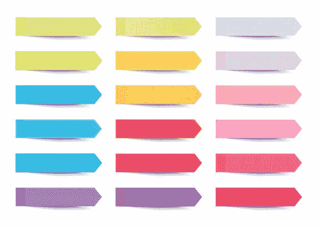
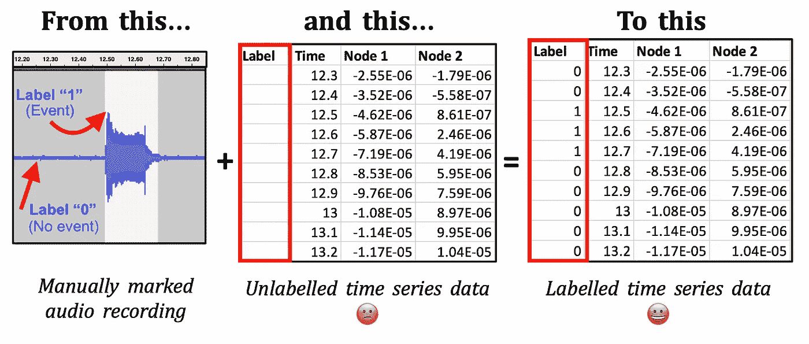
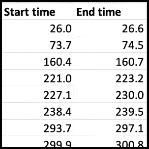

# 用 Python 标记时间序列数据

> 原文：<https://towardsdatascience.com/labelling-time-series-data-in-python-af62325e8f60?source=collection_archive---------28----------------------->

## *用于监督机器学习*



图片来源:Freepik

最近，我在进行一个[研究项目](https://github.com/LucyRothwell/Classifying-Stutters-Neuroscience/blob/master/README.md)，我必须标记 112，000 行时间序列数据，这样我就可以在监督机器学习中使用它。我需要数据中的行在事件发生时显示“1 ”,在事件没有发生时显示“0”。但是标签的信息被嵌入了 3 个小时的录音。

本质上我必须去…



作者创建的图像

本文解释了我为此创建的过程和代码。

简而言之，步骤如下:

1.  **将您的数据加载到脚本** ( *时间序列数据* & *事件标记*)
2.  **将事件的起止时间分解为一列秒/十分之一秒**
3.  **将列表转换成一列 1 和 0**
4.  **将 1 和 0 列写入数据文件**的“标签”列

您需要的所有代码都在本文中。您在脚本开始时输入了三个变量。之后，你只需点击运行，带标签的数据文件就会神奇地出现在你的目录中，随时可以用于 SVM、逻辑回归或你正在使用的任何机器学习算法。

*注意:假设您已经以适合您的数据类型的方式预处理了您的时间序列数据，并且它与事件标记数据时间同步。*

# **步骤 0:数据准备**

开始之前，检查您的数据是否为脚本正确格式化。该脚本使用 2 个文件；您的*时间序列数据*和您的*事件标记*。每一个都有一个假设:

1.  **时间序列数据:** *时间序列数据*是事件发生时你所做的测量(例如，在 20 分钟的说话时间内所做的神经读数测量)。**假设**:您的时间列是 csv 文件的第一列(col[0])。
2.  **事件标记数据:**事件标记是显示事件发生和未发生的持续时间。(例如，如果您正在使用神经数据来测量一个人说话时大脑活动的变化，则事件将在这个人说话时发生)。**假设**:你的*事件标记*是这样的开始和结束时间形式:



例如，这可以是显示该人每次开始说话和何时停止说话的几个事件。(*图片由作者*创作)。

*注意:如果您的事件数据已经在您的首选采样率的一列中，您只需执行步骤 1、3 和 4。*

**提示**:如果你用音频记录了你的活动，并把它们保存在. mp3 或。wav 文件，我建议使用 [Audacity 软件](https://www.audacityteam.org/download/)。它可爱又免费，允许你在音频记录上标记事件，并且导出事件标记，就像上面显示的那样。

# **1。将您的数据载入脚本**

现在，您可以加载(1)您的*时间序列数据* , (2)您的*事件标记数据*,( 3)您的时间序列数据的采样率(即您是否以十秒、秒等为单位进行记录)。下面的代码块是唯一需要编辑的代码部分。

```
import pandas as pd
import numpy as np*# YOUR DATA FILE & NAME* data_file_name = 'data_time_series.csv' data = pd.read_csv(data_file_name, encoding='utf-8', skiprows=0)

*# YOUR EVENT MARKINGS FILE* events = pd.read_csv("event_durations.csv", encoding='utf-8', skiprows=1)

*# YOUR SAMPLE RATE (ie seconds, deciseconds)* sample_rate = 0.1  *#Deci-seconds*
```

从这一点开始，剩下的代码就可以运行了——不需要进一步的编辑。完成后，带标签的文件将出现在您的工作目录中。

# **2。将开始-结束时间分成一列秒/十分之一秒**

该函数仅从您的*事件标记*数据帧中提取持续时间，并将其转换为一列秒/十分之一秒(取决于您在步骤 1 中输入的采样率)。

```
**def addRange (events):**
    global events_split events_split = pd.DataFrame()
    events = np.array(events)
    row = 0
    for _row in events:
        x = round(events[row,0],1) *# Start time* y = round(events[row,1],1) *# End time* events_split = events_split.append(pd.DataFrame([x]))
        while x < y:
            x = round((x + sample_rate),1)
            events_split = events_split.append(pd.DataFrame([x]))
        row = row + 1
    return events_splitaddRange(events)
```

接下来，我们将使用该函数的输出来创建一列标签。

# **3。将该列表转换为一列 1 和 0**

对于这个函数，我们需要首先创建一个包含您的*时间序列数据*的“time”列的 iterable 变量:

```
data_time_col = pd.DataFrame([data.iloc[:,0]])
data_time_col = data_time_col.T
```

然后，下面的函数使用这个变量，以及新分解的*事件标记数据*，创建一列 1 和 0，与您的*时间序列数据*上的行完全匹配。

```
**def createLabels(data_time_col):**
    global labels_01_df
    labels_01_df = pd.DataFrame() for i in data_time_col.values:
        if i in events_split.values:
            labels_01_df = labels_01_df.append([1], ignore_index=True)
        else:
            labels_01_df = labels_01_df.append([0], ignore_index=True)
    return labels_01_df

createLabels(data_time_col)
```

# **4。将 1 和 0 列写入数据文件**的“标签”列

最后，我们需要将您的 0 和 1 列表插入到您的*时间序列*数据帧中，并将其导出到 csv。(新列将插入到索引[0]中，并推动其他列)。带有标签的新文件将出现在您的目录中，与原始文件同名，但末尾带有“标签”。

```
data.insert(loc=0, column="labels", value=labels_01_df)
data.to_csv(data_file_name + " - LABELLED.csv", index=False)
```

瞧，你的文件已经准备好了，可以用于 scikit-learn 或你选择的 ML 库:)

完整的脚本可以在我的 GitHub 页面上找到。

希望那有用！如果你有任何问题，请直接在 LinkedIn 上给我发消息。也可以**邮箱** **订阅我的帖子** [这里](https://medium.com/subscribe/@LuRoth_)。

最后，如果你想进一步支持 Medium 上的作者，你可以在这里注册成为会员。