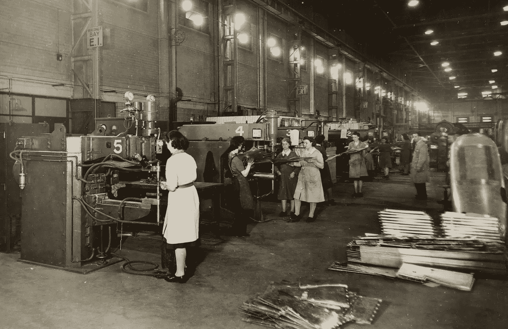
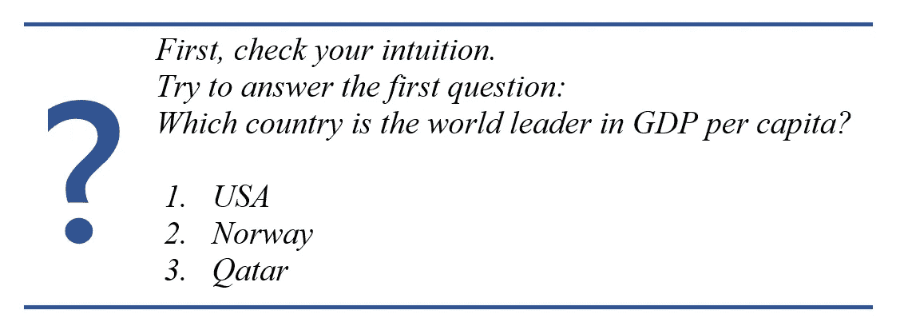
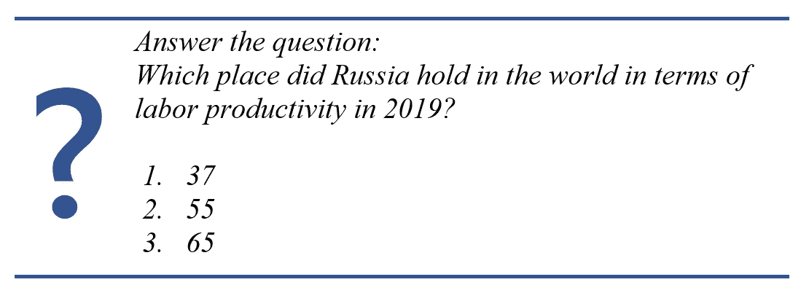
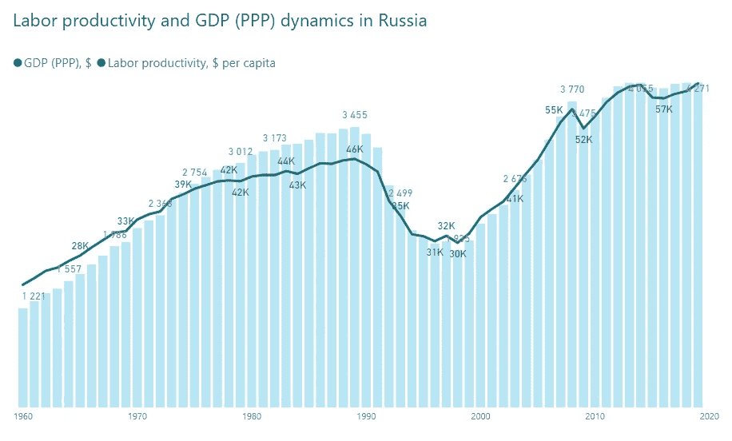
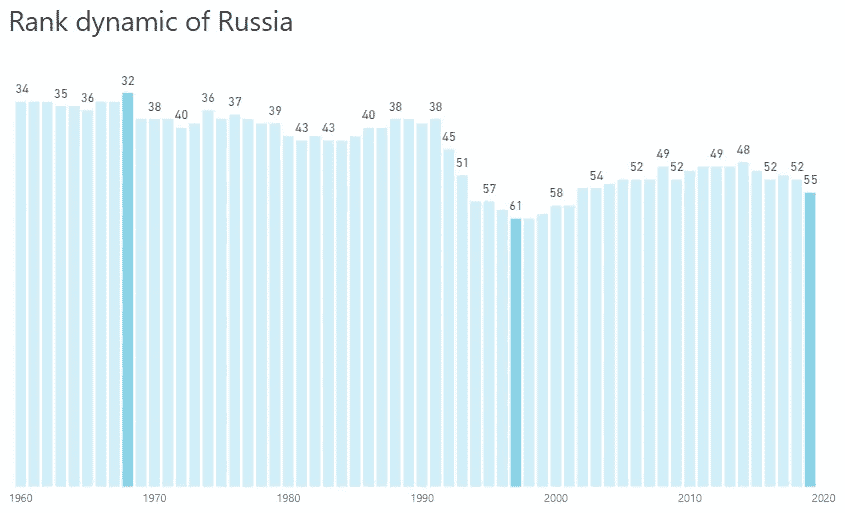
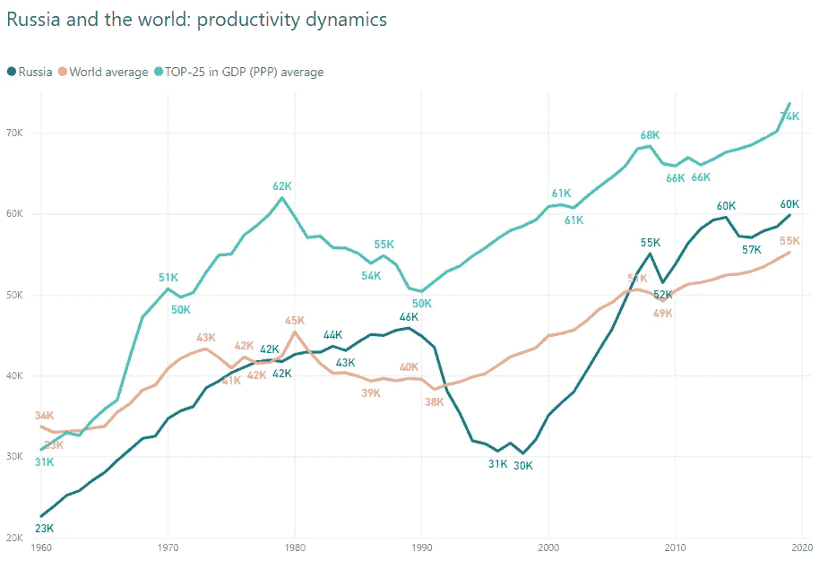

# 劳动生产率和其他冒险

> 原文：<https://towardsdatascience.com/labor-productivity-and-other-adventures-67212d1d199b?source=collection_archive---------37----------------------->

伯明翰博物馆信托基金会在 [Unsplash](https://unsplash.com/?utm_source=unsplash&utm_medium=referral&utm_content=creditCopyText) 上拍摄的照片

劳动生产率被认为是衡量一个国家福祉的最重要指标之一。不过，我们对它了解的并不多，让我们试着弄清楚它是如何计算的，世界上的事情是如何与它*(数据来源:* [*总经济数据库*](https://www.conference-board.org/data/economydatabase/total-economy-database-archive) *)。*

稍后我们会找到答案。

劳动生产率客观地反映了一个经济体的健康程度，它基于两个指标:该国的人均 GDP 和就业人口比例。同样的公式可以用另一种方式来写:

**注:本文使用国内生产总值数据(购买力平价)。数据来源总体经济数据库*

我们来修正一下什么是 GDP 和人均 GDP。GDP 是国内生产总值，代表一个国家生产的所有最终商品和服务的总市场价值。人均 GDP 表示一个人平均生产多少国内生产总值(GDP /人口)。这两项指标每年都进行测量，并以同一种货币——美元——进行比较。

图表显示，高 GDP 并不意味着人均 GDP 也会高。例如，中国的国内生产总值排名第一，生产的商品和服务数量世界第一。但无论是人均 GDP 还是劳动生产率都没有进入前 10 名，它们分别排在第 61 位和第 78 位，与哥伦比亚和巴西处于同一水平(顺便提一下，这两个国家也是 GDP 排名前 10 的国家):

为什么会出现这种不匹配？首先，中国是人口最多的国家。当按每 14 亿人分配 250 亿 GDP 时，该值比大多数国家低几倍。其次，人们在那里工作很多-2019 年就业人口的比例为 55.6%，高于平均水平 10-12%。第三，中国有廉价或低技术含量的产品。

## **该国劳动生产率高的 3 个原因:**

1.  最终产品成本低，但生产量大+就业率低。这些条件适用于生产廉价石油的阿拉伯国家，并且不需要花费大量的精力和时间。
2.  高人均国内生产总值+高或平均百分比的就业人口。这是美国和大多数西欧国家的典型模式——所有劳动适龄人口都工作并生产高价值产品。卡塔尔出人意料地成为这个群体的一员。它的高劳动生产率不是像其他产油国那样由低比例的就业人口保证的，而是由更高的成品成本和大量的生产保证的。
3.  高人均 GDP 低就业率。这种情况很少见，但这是未来的趋势——有一小部分就业人口生产昂贵的产品。

# **俄罗斯**

我们已经考察了主要经济指标中的领先者。现在我们会在这些评级中发现俄罗斯。就国内生产总值而言，俄罗斯领先于许多国家——新闻和经济书籍告诉我们这一点。事实上，在 2019 年，俄罗斯在世界 GDP 排名(PPP)中排名第 6。但并没有成为劳动生产率的领先者。

我们再来测试一下你的直觉。

我们在一个仪表板上收集了所有最重要的宏观经济指标。

仪表板显示什么？自 20 世纪 60 年代初以来，俄罗斯的劳动生产率(RSFSR)主要是积极的。苏联解体后，俄罗斯和独联体国家的生产率指数大幅下降，直到 2005 年才恢复到 1989 年的水平。劳动生产率的积极动态被 2008 年的危机所拖累，但在 2010 年开始再次增长，并在 2019 年达到最大值(人均 5.99 万美元)。

俄罗斯的劳动生产率随着 GDP 的变化而变化。当图线与柱顶不重合时，第二个因素(就业人数)会产生影响:图下方的柱顶表示就业人数百分比下降，图上方的柱顶表示工作人口百分比上升。

## 俄罗斯和世界

俄罗斯的劳动生产率从未在世界上处于领先地位。在苏联时期，它上升到了收视率的最高位置。历年最好成绩是 1968 年的第 32 名，最差成绩是 1997 年和 1998 年的第 61 名。之后俄罗斯一直没有升到评级 48 线以上。2019 年，俄罗斯排名世界第 55 位。

在世界平均指数和 GDP 领先的前 25 个国家的平均水平的背景下，观察俄罗斯劳动生产率的动态也很有趣。俄罗斯从未在后一项指标上表现出色。

现在是一些积极的时刻。自 1982 年以来，俄罗斯的劳动生产率超过了世界平均水平。苏联解体后，直到 2006 年，它再次低于平均指标，但在 2007 年赶上了平均指标，不再低于平均指标，并趋于赶上 GDP 领先国家。即使是 2008 年的危机也没有打破这一积极趋势。

# **我们来总结一下**

劳动生产率是衡量一个国家福祉的一个重要而有趣的指标。观察它的动态就像观察 GDP 的动态一样令人着迷。

评分第一是一个相对的概念。你总是可以选择一个让图表看起来更积极的尺度。在我们的分析课程中，您可以学习如何避免数据操纵，并使数据清晰可见。欢迎给我写信，我们会讨论你所有的问题。