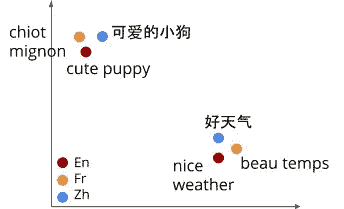
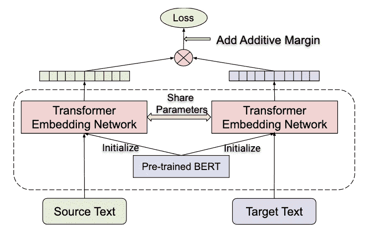
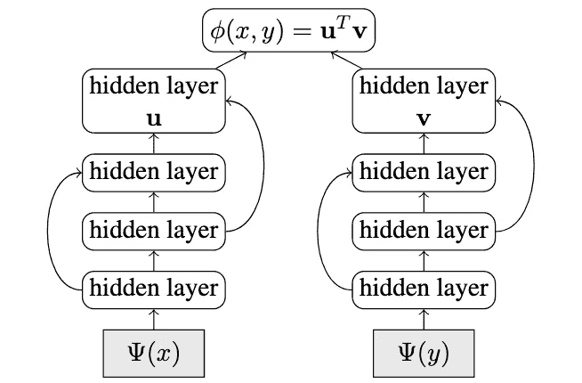
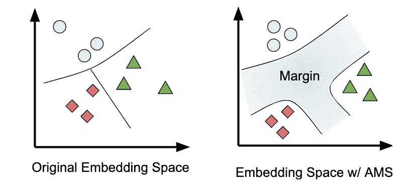
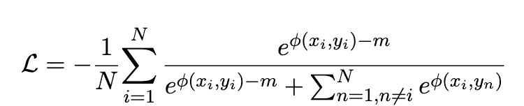
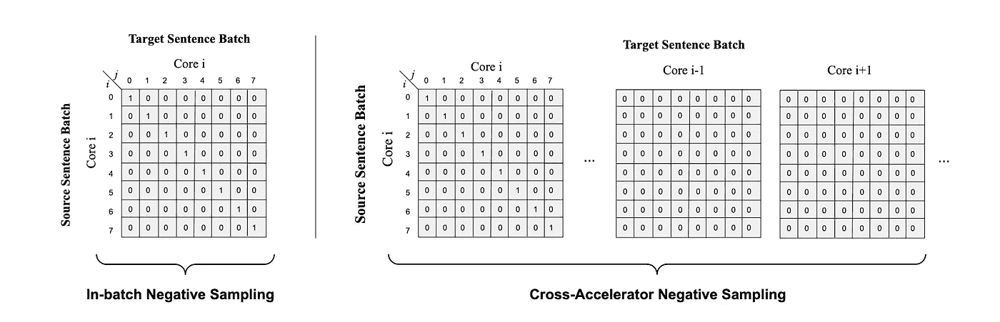
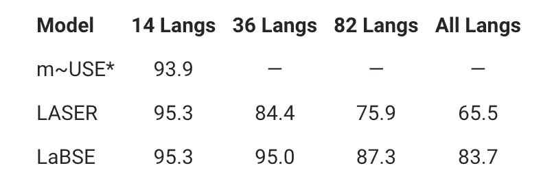
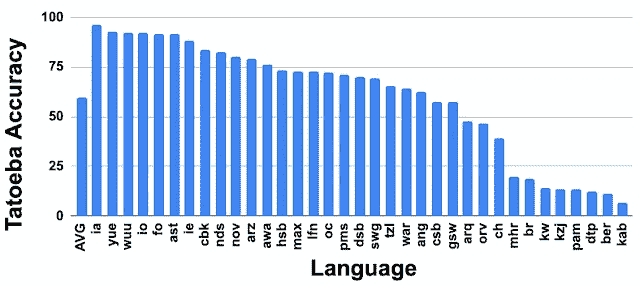

# LaBSE:由 Google AI 嵌入语言不可知的 BERT 句子

> 原文：<https://towardsdatascience.com/labse-language-agnostic-bert-sentence-embedding-by-google-ai-531f677d775f?source=collection_archive---------16----------------------->

## 谷歌人工智能如何将多语言句子嵌入的限制推向 109 种语言

通过[谷歌人工智能博客](https://ai.googleblog.com/2020/08/language-agnostic-bert-sentence.html)的多语言嵌入空间

多语言嵌入模型是将多种语言的文本映射到共享向量空间(或嵌入空间)的模型。这意味着，在这个嵌入空间中，**相关或相似的词将位于彼此更近的**，而**不相关的词将位于彼此更远的**(参见上图)。

在这篇文章中，我们将讨论冯等人最近在 T18 提出的**LaBSE**:**L**anguage-**A**gnostic**B**ERT**S**entence**E**mbed ing。艾尔。这是句子嵌入的最新技术。

# 现有方法

现有的方法大多涉及在大量并行数据上训练模型。型号如 [**激光:** **L** 语言-**A**gnostic**SE**tence**R**presentations](https://research.fb.com/downloads/laser-language-agnostic-sentence-representations/)和 [**m-USE:** **M** 多语言 **U** 通用 **S** entence **E** 编码器](https://ai.googleblog.com/2019/07/multilingual-universal-sentence-encoder.html)它们在多种语言中表现得相当好。然而，它们的表现不如专用的双语建模方法，如[翻译排名](https://www.aclweb.org/anthology/W18-6317/)(我们即将讨论)。此外，由于有限的训练数据(尤其是低资源语言)和有限的模型容量，这些模型**不再支持更多的语言**。

NLP 的最新进展表明，在掩蔽语言建模(MLM)或类似的预训练目标上训练语言模型，然后在下游任务上对其进行微调。像 [XLM](https://arxiv.org/abs/1901.07291) 这样的模型是对 MLM 目标的扩展，但是是在跨语言环境下。这些对下游任务很有效，但是**由于缺少句子级目标而产生了糟糕的句子级嵌入**。

> 相反，与其他下游任务类似，从 MLMs 产生的句子嵌入必须通过微调来学习。
> 
> — [LaBSE 论文](https://arxiv.org/abs/2007.01852)

# 语言无关的 BERT 句子嵌入

双向双编码器，带附加余量 Softmax 和通过 [LaBSE 纸](https://arxiv.org/abs/2007.01852)共享的参数

所提出的架构是基于一个**双向双编码器** [**(郭等。艾尔。**](https://www.aclweb.org/anthology/W18-6317/) **)与加性边距 Softmax (** [**)杨等人**](https://www.ijcai.org/Proceedings/2019/746) **)** 与改进。在接下来的几个小节中，我们将深入解读该模型:

## 翻译排名任务

通过[谷歌人工智能博客](https://ai.googleblog.com/2020/08/language-agnostic-bert-sentence.html)的翻译排名任务

[先事后人，郭等人。艾尔。](https://www.aclweb.org/anthology/W18-6317/)使用翻译排序任务，本质上**按照与源**的兼容性对所有目标句子进行排序。这通常不是“所有”的句子，而是一些“ ***K - 1*** ”的句子。目标是**最大化源句子与其真实翻译**之间的兼容性**最小化与其他** ( **负采样**)。

## 双向双编码器

双编码器架构经[郭等人。艾尔。](https://www.aclweb.org/anthology/W18-6317/)

双编码器架构本质上使用**并行编码器**对两个序列进行编码，然后使用**点积**获得两种编码之间的**兼容性得分**。[郭等人的模特。艾尔。](https://www.aclweb.org/anthology/W18-6317/)基本上是在一个平行语料库上训练的，用于上一节讨论的翻译分级任务。

就“双向”而言；它基本上在两个“方向”上获取兼容性得分，即从**源到目标以及从目标到源**。例如，如果从源 ***x*** 到目标 ***y*** 的兼容性由***【y _ I)****表示，则分数***【ɸ(y_i，x_i)*** 也被考虑在内，并且各个损失被求和。*

> *损耗= L+L′*

## *最大附加利润(AMS)*

**

*嵌入空间有无加性余量 Softmax 经[杨等](https://www.ijcai.org/Proceedings/2019/746)*

*在向量空间中，分类边界可能非常窄，因此很难**分离向量**。AMS 建议在原 softmax loss 中引入一个参数 ***m*** 来增加向量之间的可分性。*

**

*AMS via [LaBSE 论文](https://arxiv.org/abs/2007.01852)*

*请注意参数 ***m* 是如何从正样本**中减去的，而不是负责分类边界的负样本。*

*如果你有兴趣更好地了解 AMS，你可以参考这个博客。*

## *交叉加速器负采样*

**

*通过 [LaBSE 纸](https://arxiv.org/abs/2007.01852)进行交叉加速器负采样*

*翻译分级任务建议对“***”K-1***”和源句子的潜在不兼容翻译的其他句子使用负采样。这通常是通过**从该批**的其他人那里获取句子来完成的。这种批内负采样如上图所示(**左**)。然而，LaBSE 利用 BERT 作为其编码器网络。对于像这样的大型网络，批量大到足以为训练提供足够的负样本是不可行的。因此，提出的方法**利用分布式训练方法**在不同的加速器(GPU)之间共享批处理，并在最后广播它们。这里，所有的共享批次都被认为是负样本，只有本地批次中的句子被认为是正样本。如上图所示(**右**)。*

## *预训练和参数共享*

*最后，如前所述，建议的架构使用 BERT 编码器，并在掩蔽语言模型(MLM)上进行预训练，如 [Devlin 等人所述。艾尔](https://arxiv.org/abs/1810.04805)。和翻译语言模型(TLM)目标如在 [XLM(康诺和兰普尔)](https://arxiv.org/abs/1901.07291)。此外，这些是使用 **3 阶段渐进堆叠算法**训练的，即首先针对 ***L / 4*** 层，然后针对 ***L / 2*** 层，最后针对 ***L*** 层，训练**L/2**层。*

*更多关于 BERT 前期训练的内容，你可以[参考我的博客](https://medium.com/swlh/bert-pre-training-of-transformers-for-language-understanding-5214fba4a9af)。*

# *把所有的放在一起*

*LaBSE，*

1.  *将所有现有方法(即预训练和微调策略)与双向双编码器翻译排序模型相结合。*
2.  *是一个庞大的模型，支持 109 种语言。*

# *结果*

**

*通过[谷歌人工智能博客](https://ai.googleblog.com/2020/08/language-agnostic-bert-sentence.html)在 [Tatoeba 数据集](https://github.com/facebookresearch/LASER/tree/master/data/tatoeba/v1)上的平均准确率(%)*

*LaBSE 在所有语言上的平均准确率达到 83.7%，明显优于其竞争对手。*

**

*通过[谷歌人工智能博客](https://ai.googleblog.com/2020/08/language-agnostic-bert-sentence.html)进行零拍设置*

*LaBSE 还能够在没有训练数据的语言上产生不错的结果(零命中率)。*

> *有趣的事实:该模型使用 500k 的词汇量来支持 109 种语言，并为甚至零命中率的情况提供跨语言支持。*

# *结论*

*我们讨论了语言不可知的 BERT 句子嵌入模型，以及如何结合预训练方法来获得最先进的句子嵌入。*

*该模型在 [TFHub 这里](https://tfhub.dev/google/LaBSE/1)开源。*

# *参考*

*LaBSE 论文:【https://arxiv.org/abs/2007.01852 *

*带 AMS 的双编码器:[https://www.ijcai.org/Proceedings/2019/746](https://www.ijcai.org/Proceedings/2019/746)*

*双编码器和翻译排名任务:[https://www.aclweb.org/anthology/W18-6317/](https://www.aclweb.org/anthology/W18-6317/)*

*[https://arxiv.org/abs/1901.07291](https://arxiv.org/abs/1901.07291)XLM 纸*

* [## 伯特:语言理解变形金刚的前期训练

### 了解基于变压器的自监督架构

medium.com](https://medium.com/swlh/bert-pre-training-of-transformers-for-language-understanding-5214fba4a9af)  [## 附加边际软最大损失(AM-Softmax)

### 了解 L-Softmax、A-Softmax 和 AM-Softmax

towardsdatascience.com](/additive-margin-softmax-loss-am-softmax-912e11ce1c6b)*