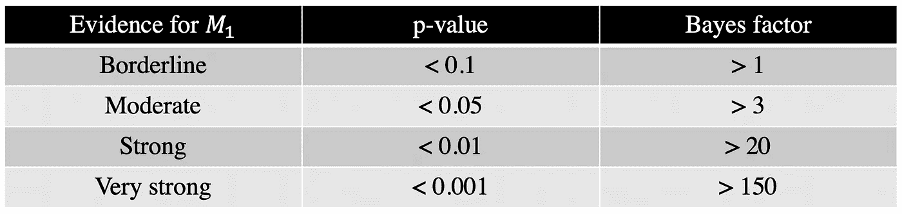
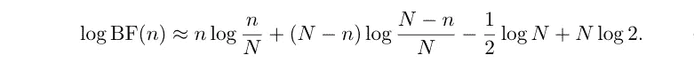
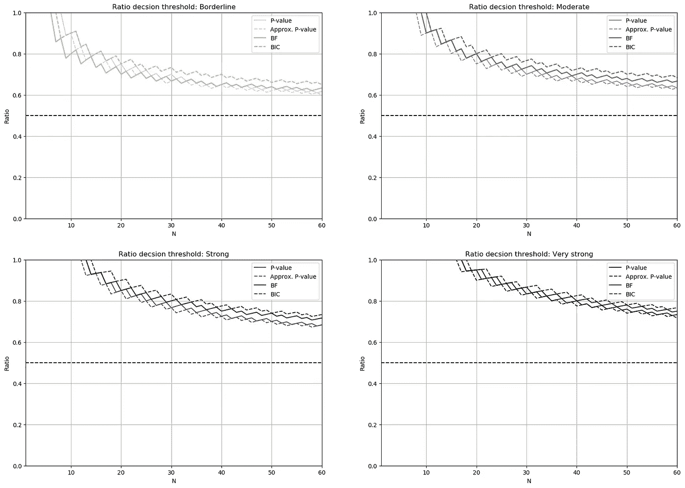
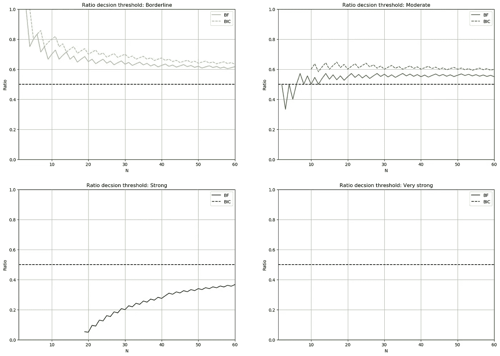

# 女士品茶:贝叶斯方法

> 原文：<https://towardsdatascience.com/lady-tasting-tea-a-bayesian-approach-1b0b94ca1530?source=collection_archive---------38----------------------->

## 假设检验的贝叶斯方法和频率方法的介绍和比较

一位女士声称，她可以通过品尝来发现一杯奶茶是先加茶还是先加牛奶。我们如何评价她的主张？通过解决这个被称为[女士品茶](https://en.wikipedia.org/wiki/Lady_tasting_tea)问题的问题，[罗纳德·费雪](https://en.wikipedia.org/wiki/Ronald_Fisher)先生首次引入了[假设检验](https://en.wikipedia.org/wiki/Statistical_hypothesis_testing)和 [p 值](https://en.wikipedia.org/wiki/P-value)的概念。

在本文中，我重温了 Fisher 的解决方案(即频率主义方法)，使用贝叶斯方法解决女士品茶的问题，并比较他们的结果。

# 问题的正式陈述

给一杯奶茶，我们假设这位女士会以概率 *p* 猜出正确答案(即先加茶还是先加奶)。如果她随机猜测，我们预计 *p* 等于 0.5——也就是所谓的机会水平。如果她有某种神奇的技能，那么我们期望找到大于 0.5 的概率。

因此，要决定她是否说谎，我们应该测试是否 *p=0.5* (称为[零假设](https://en.wikipedia.org/wiki/Null_hypothesis)，通常用 *H₀* 或 *M₀* 或 *p > 0.5* (称为替代假设，用 *H₁* 或 *M₁* 表示)。为此，我们请她品尝了 N 杯奶茶，并告诉我们她的猜测。我们用 n 表示她猜对的次数。

现在的问题是:我们如何利用这些信息(即 *n* 和 *N* )来决定她是否说谎？

# 常客方法

检验零假设的 frequentist 方法基于 [p 值](https://en.wikipedia.org/wiki/P-value)的计算。对于这位女士品茶的例子，p 值是假设**这位女士在她的能力上撒了**谎，在 *N 个*杯子中有超过或等于 *n 个*正确猜测的概率。如果这种概率非常小，那么很难相信她能做出这么多正确的选择仅仅是因为纯粹的偶然。因此，对于 p 值非常小的情况，我们将拒绝零假设。

因此，p 值有多小将是接受女士主张的标准(即替代假设， *M₁* )。拒绝零假设有一些传统的阈值。下表提供了总结。

表 1。接受替代假设的阈值

现在的问题是:我们应该如何计算 p 值？

## 精确 p 值

对于一个任意的 *p* ，在 *N* 次猜测中有 *m* 次正确猜测的概率是

给定零假设，我们有 *p=0.5* ，因此，我们可以计算 p 值为

## 近似 p 值

随着 *N* 增加，根据[中心极限定理](https://en.wikipedia.org/wiki/Central_limit_theorem) ⁴.，具有 *m* 个正确猜测的分布收敛到具有均值 *Np* 和方差 *Np(1-p) —* 的高斯分布然后，p 值可以近似为 by⁵

其中第二项是值为 *n* 的高斯分布的累积密度函数(cdf)，平均值为 *N/2* ，方差为 *N/4* 。

# 贝叶斯方法

从贝叶斯的角度来看，无效假设和替代假设可以分别看作是两个不同的模型 *M₀* 和 *M₁* ，它们都是生成数据的候选对象。那么，贝叶斯假设检验就相当于贝叶斯模型选择:哪个模型更好地解释数据？

贝叶斯模型选择的思想是在给定观察数据的情况下计算每个模型的后验概率，例如在我们的设置中的 *P(M₀|n)* 。奇后验比定义为两个后验概率的比值，如下所示

其中右边第一项称为奇数先验比，第二项称为 [**【贝叶斯因子】**](https://en.wikipedia.org/wiki/Bayes_factor) ⁶ **。**如果两个模型之间没有先验偏好(即，当我们在模型上有一致的先验时)，奇数后验比等于贝叶斯因子。

贝叶斯因子是贝叶斯假设检验和 selection⁷.模型中的核心概念贝叶斯因子的高值告诉我们，在给定观察值的情况下，替代模型比零模型更有可能。因此，贝叶斯因子有多大将是接受这位女士的说法的标准(即替代假设， *M₁* )。类似于 p 值的情况，有一些传统的阈值用于拒绝零假设，总结在表 1 中。

现在的问题是:我们应该如何计算贝叶斯因子？

## 什么是 *M₀和 M₁？*

对于女士品茶的问题，每个模型都可以通过单次正确猜测的概率的先验分布来表征。零模型的特征是直接的，没有任何模糊: *p* 等于 0.5——先验是 0.5 处的δ分布。因此，条件概率 *P(n|M₀)* 可以使用上一节提到的公式轻松计算。

然而，替代车型 *M₁* 的特性并不简单。我们知道先验分布必须使其整个质量在 *p > 0.5* 上，但是我们需要精确地指定先验的形式——这对于 *P(n|M₁)* 的计算是必要的。那么，什么是好的先验选择呢？

## 先验选择的精确贝叶斯因子

一个非常简单但直观的先验选择是在*【0.5，1】*的区间上均匀分布。使用此先验，对数贝叶斯因子可以计算为

我们用数值计算积分。

## 使用 BIC 的贝叶斯因子的先验独立近似

可以证明 that⁸，如果先验分布在参数 *p* 的最大似然(ML)估计的邻域内非零，那么随着 *N* 的增加，对数条件概率 log(*p(n|m₁)*可以通过(常数 times⁹) [贝叶斯信息准则](https://en.wikipedia.org/wiki/Bayesian_information_criterion) (BIC)来估计。令人惊讶但真实的是，随着 *N* 的增加，先验的影响消失了。因此，对于较大的 *N* ，贝叶斯因子可以近似为(无论何时 *n > N/2* )

当 *n* ≤ *N/2* 时，我们有 logBF( *n* )≈-log(N)/2，但它可能不再是一个精确的近似值，因为 *p* 的 ML 估计超出了先验的支持——小于 *0.5* 。

# 对比:我们什么时候相信这位女士？

对于 *N* 和 *n* 的不同选择，我们计算了精确和近似的 p 值和贝叶斯因子。然后，对于每个显著性水平，根据表 1，我们计算正确猜测的临界比率(即 *n/N* ) ，超过该比率我们拒绝零假设。图 1 示出了“临界”、“中等”、“强”和“非常强”4 种不同水平的界限。

图一。对于每个 N，显示了表 1 中提到的不同显著性水平的拒绝零假设的比率决策阈值。绿线对应于贝叶斯方法，紫线对应于频率主义方法。虚线是近似版本，实线是精确版本。

这里有一些有趣的信息:

1.  贝叶斯和频率主义方法有非常相似的拒绝零假设的标准，而贝叶斯方法更保守一些。
2.  随着 *N* 的增加，近似值变得更好，同时即使对于 *N* 的小值，它们也相当精确。
3.  当 *N* 小于大约 8 或 9 时，我们无法做出任何陈述，我们需要至少 17 到 19 个样本才能做出非常有力的陈述。
4.  正如所料，随着 *N* 的增加，我们能够检测到相对于 *p=0.5* 的更小偏差。

与 frequentist 方法相反，用于假设检验的 Bayesian 方法也可以做出关于接受零假设的声明。逻辑是一样的，我们只需要看负的对数贝叶斯因子。可以找到一组相似的正确猜测的临界比率，在该比率以下，我们将接受零假设(女士说谎)。边界如图 2 所示。

图二。对于每个 N，对于表 1 中提到的不同显著性水平，显示了接受零假设的比率决定阈值。虚线是近似版本，实线是精确版本。

结果可以概括为三点:

1.  近似版本和精确版本不再那么接近，原因是 *p* 的最大似然估计小于 0.5。
2.  即使样本少于 5 个，我们也可以接受零假设。
3.  少于 20 个样本不可能做出任何强有力的陈述，少于(至少！)60 个样本！

# 结论

我们从贝叶斯和频率论的角度研究了假设检验，以女性品茶为例。三个一般性结论是:

1.  这些方法的决策界限非常相似。
2.  正态分布和 BIC 的近似值相当准确，只要它们的假设得到满足。
3.  贝叶斯假设检验在拒绝零假设方面稍微保守一些，但是它使得陈述也接受零假设是可行的。

# 承认

我非常感谢 [Navid Ardeshir](https://www.linkedin.com/in/navid-ardeshir-983ab739/) 、Kian Kalhor、Mohammad Tinati 和 [Parnian Kassraie](https://scholar.google.com/citations?user=GFDOkb0AAAAJ&hl=en) 在过去几年中就相关主题进行了许多有益且有趣的讨论。

# 代码:

分析的代码(用 Julia 语言编写)可以在这里找到。

# 脚注:

请参阅 A. C. Davison 的《统计模型》第七章或 l .乏色曼的《所有统计学》第十章，从频率主义者的角度进一步研究假设检验。

值得一提的是，frequentist 的假设检验方法的目的只是拒绝零假设，它不能对接受零假设做出任何声明。

该表由 B. Efron 和 T. Hastie 的[“计算机时代统计推断”](https://web.stanford.edu/~hastie/CASI/)和 L. Held 和 M. Ott 的[“关于 p 值和 Bayes 因子”](https://www.zora.uzh.ch/id/eprint/148600/)的信息组合而成。

⁴ *m* 可以看作是概率为 1 的 *N* 伯努利随机变量求和的输出。因此，对于大的 *N* ，其分布收敛于高斯分布。

⁵:这相当于在这些 *N* 试验中使用单样本 t 检验。

⁶好奇的读者可以思考一下奈曼-皮尔逊引理中贝叶斯因子和似然比之间的关系。

⁷看到 A. Neath 和 J. Cavanaugh 的惊人文章[“贝叶斯信息标准:背景、推导和应用”](https://onlinelibrary.wiley.com/doi/full/10.1002/wics.199?casa_token=e2HHDRri8CkAAAAA%3Aa9DQrgcaQLtDP8Wg_O3NPGhwrrN06qCGOJFcA7b8GpOhiJdE5Wzro_Jp1449XFpbYDQHpF3H-N5G3Hze)和 B. Efron 和 T. Hastie 的[“计算机时代统计推断”](https://web.stanford.edu/~hastie/CASI/)的第 13 章，以获得进一步的研究。

⁸对贝叶斯模型选择的介绍见 B. Efron 和 T. Hastie 的[“计算机时代统计推断”](https://web.stanford.edu/~hastie/CASI/)第 13 章，t 检验和回归检验的贝叶斯替代方法见 [Rouder 等人(2009)](https://link.springer.com/article/10.3758/PBR.16.2.225) 和 [Rouder 等人(2012)](https://pubmed.ncbi.nlm.nih.gov/26735007/) 。

⁹常数取决于 BIC 的定义。如果我们取[“计算机时代统计推断”](https://web.stanford.edu/~hastie/CASI/)中提到的定义，常数为 1，但如果我们取[维基百科](https://en.wikipedia.org/wiki/Bayesian_information_criterion)中的定义，我们需要常数为 *-0.5* 。

# 附录！

几周前我发现了这首歌。这是非常可爱和有趣的，而深深的黑暗和悲伤。我真的很喜欢它，所以我决定利用它的封面显示两位女士喝茶(咖啡？)并将其链接放在本文末尾！