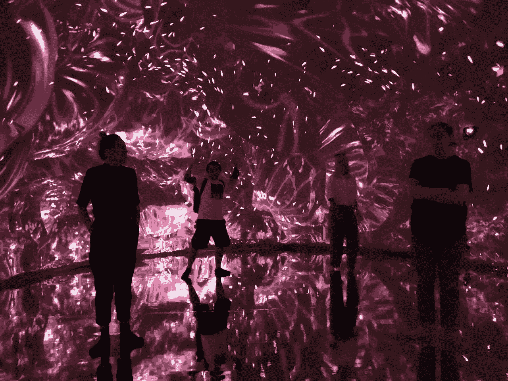
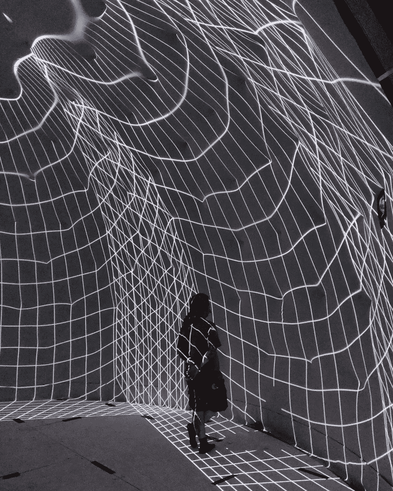
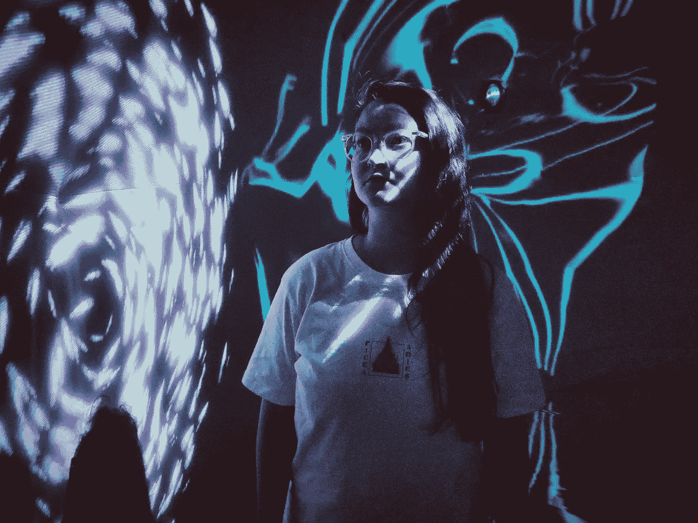
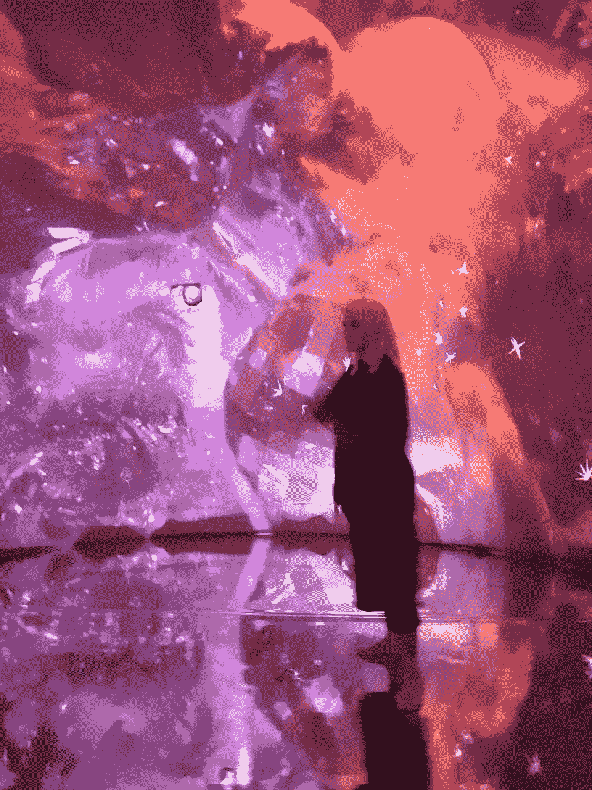

# 莱拉:Ekho 集体的想法

> 原文：<https://towardsdatascience.com/laila-ekho-collectives-thoughts-c83a95b554a0?source=collection_archive---------66----------------------->

## Ekho 集体:超越系列的歌剧

## 我们如何创造我们的视听沉浸式体验，让游客与人工智能互动

在我之前关于我们项目的博文中，我研究了我们在 T2 的 Ekho 集体在新冠肺炎期间如何改变建造我们的沉浸式装置 Laila 的过程。现在我们的项目已经接近尾声，2020 年 8 月在赫尔辛基的[门票已经开始发售。在这里，我收集了我们集体成员对建设莱拉过程的想法。](https://oopperabaletti.fi/en/repertoire-and-tickets/laila/)

莱拉的机器人(人工智能代理)蜂拥在游客周围。解释如下！

# **尤纳斯·尼斯宁**

Joonas Nissinen 是我们的**创意技术专家**，拥有计算机图形和人工智能背景。他认为莱拉是一个数字世界，它平衡了人类可以理解的戏剧弧线和程序生成技术:

尤纳斯·尼斯宁，我们的创意技术专家

当创造一个歌剧体验时，我们需要有一个传统的情节和叙事。通过在莱拉使用人工智能，我们给了技术自己的机构。引入代理意味着不能保证直截了当的叙述。目前，我们正致力于平衡一个混乱的系统，它有自己的意愿以某种特定的方式运行，并编排该系统的部分以适应我们的叙述。这很难。

我们在 Laila 中以 boids 的形式使用人工智能，boids 是一种计算代理，可以根据一组简单的规则做出决定。Boids(又名鸟形生物)是仿生的。它们表现出群集行为，这在自然界中以鱼群、蚁群，当然还有鸟类群集的形式存在。在莱拉，机器人实际上构成了一个超个体:它们是一种群体智能，表现出涌现的特性。根据简单规则局部互动的代理人的协同作用导致一个更高层次的整体，其行为比每个单独的代理人复杂得多。通过这一点，莱拉变成了一个复杂的系统:没有人能够预测将要发生的一切。

为了解决设计机器人的问题，我创造了一个系统，允许我们在一个尺度上切换机器人的动机:它们对分离的敏感程度，它们排列的容易程度，以及它们运动的凝聚力。此外，boids 的环境由使用各种伪随机噪声函数生成的不断变化的矢量场组成。磁场的作用有点像河流中的水流——朝某个方向流动比较容易，朝另一个方向流动就比较困难。这些向量场也可以用来增强戏剧性，例如通过鼓励 boids 在体验中的某一点以螺旋方式移动。

莱拉内部

因此，我们的机器人遵循各种各样的行为模型，并对他们世界的几种力量(例如重力)做出反应。然后，我们通过激光雷达跟踪莱拉的游客，将他们引入机器人的世界。有了追踪，访问者就有了自己的代理和影响范围。机器人被指定以特定的方式对“自己的”访客做出反应。游客们还介绍了世界矢量场的变化，创造了其电流流动的变化。

当我们的机器人穿越莱拉的时间线并对这种影响的聚合做出反应时，蝴蝶效应就产生了。这意味着最初由 boids 的相互作用产生的系统中的小变化可能会累积成以后更大的变化。这给莱拉带来了不可预测性和神秘感。

# 奥利·基尔皮

奥利·基尔皮是我们的**动作设计师和视觉艺术家**，图中他正在评估莱拉的投影的清晰程度。他分享了他在建造 Laila 期间学到的东西，以及他对该项目目前阶段的感受:

奥利·基尔皮，动作设计师和视觉艺术家

在这个项目的这一点上，接近完成时，我们正在努力平衡体验的确定性和它自己产生的程度。我们想给游客自由和故事中的角色。我们也想向游客讲述我们自己的故事。我们正在寻找这两件事之间的平衡——用户将如何互动，以及他们能在多大程度上影响他们的体验。

我以前做过虚拟现实和美术，但是设计一个 360 度的穹顶带来了全新的挑战。在 VR 中，像素更多，精度更高。然而，在 360°我们有一个人的全视野作为我们的舞台——而不是大多数 VR 护目镜提供的有限的隧道视野。在虚拟现实中，用户的视角随着他们一起移动，因为他们独自在体验中。在这里，我为我们所有的参观者同时建立了视觉效果，因为空间和视角是共享的。

关于这个项目一个有趣的事情是，由于这是一个新的设计领域，没有现有的规则。我意识到，在 360°的背景下，平面页面上存在的传统构图规则并不适用。这种环境更加自然，就像在大自然中行走一样——它不是一个环境的快照，或通过某个镜头看到的环境，而是一个环境本身。

# Saara-henrikka m kinen

我们的**体验和视觉设计师**saara-henrikka mkinen 讲述了她在用户测试中对 Laila 的了解:

saara-henrikka m kinen，体验和视觉设计师

由于我们精心制作了 Laila 来对它的访客做出反应，所以看看我们的访客给作品带来了多少层次的重塑是很有趣的。每个人都有自己的个性、记忆和先入之见，这些都会影响他们对作品的解读。这些事情也会影响他们如何互动——既与作品互动，也与各自的访客群体成员互动。例如，我们的一个测试访问者评论说“我没有动，因为其他人也没有动”。另一个人评论道，“我是那种想解散团队的人——我想独立行动。”显然，一些人将莱拉视为一个游戏场:他们开始控制甚至主导这一体验。话又说回来，有些来访者不想被注意，宁愿消失在作品内部。

因为他们包含不同类型的人，每个群体都有独特的经历——在精神和具体层面上。例如，如果两个朋友加入不同的小组，然后讨论 Laila，他们可能不会认可对方谈论的所有内容。由于群体动力影响视觉和声音的产生，其他群体的访问者可能没有体验过特定的部分。

通过 Laila，我们希望为人们一起提供对作品的见解的可能性。他们通过观察彼此来了解莱拉是如何互动的。从这个意义上说，莱拉既是一次个人的旅程，也是一次共同的旅程。

# **明娅·阿克塞尔松(这篇博客的作者)**

我是一名**体验设计师和机器人研究员。下面是我对《莱拉》中含义的一些看法:**

Minja Axelsson(作者)，体验设计师和机器人研究员

莱拉是我们未来的幻想——反乌托邦、乌托邦和现实主义。我们的游客体验所有这些可能性，并参与它们的创造。我希望通过这一点，参观者可以获得一些作品的所有权。即使参观者决定将莱拉作为一个被动的接受者来体验，他们的存在仍然会影响作品的展开。这与现实世界有相似之处:被动也是一种会带来后果的选择。我是一个有点激进的人，所以我通过这个镜头来解释这个作品:我们做出的选择很重要。

在莱拉，没有人能自己选择将会发生什么。这是一个复杂的系统，通过人工智能和访客的互动建立起来。Laila 背后的想法受到了混沌理论和蝴蝶效应的启发:一个系统初始状态的小变化如何能够在后来的状态中产生大的影响(即几周前一只遥远的蝴蝶扇动翅膀影响了龙卷风的路径)，以及一个看似随机的系统如何具有潜在的模式和相互联系。Laila 有很多参数，理论上有无限多的事情可以发生，在一定的框架内。当参观者进入作品时，一个特定的现实被创造出来，机会打开又关闭。这与哥本哈根的解释有关——当某种现实被衡量时，它就被创造出来，而其他的选择就从潜在的存在中消失了。

虽然莱拉是一个传统意义上的故事情节，但我认为这种哲学仍然存在于作品中。人们在进入莱拉之前贡献了一段自己的录音，通过这段录音，他们积极参与了莱拉世界的建设。我希望这能给人们一种感觉，他们的声音是重要的，他们正在把自己融入一个复杂的整体。我很高兴听到参观者说他们把这项工作当成了冥想。我认为这证明了它给了他们停下来思考的空间。我很想知道它对我们的人性、技术、它们之间的关系以及我们将共同建设什么样的未来引发了什么样的思考。

# 埃西·霍塔里

我们的**人工智能交互设计师** Essi Huotari 讨论了讲故事在为 Laila 设计人工智能交互中的作用:

Essi Huotari，人工智能交互设计师

我认为 Laila 有三个基本要素:故事、人工智能和访客互动。我最大的设计挑战是平衡我们对莱拉故事的控制和赋予人工智能和游客影响这个故事的权力。在拥有和失去控制之间交替是我们工作的动力。

我认为定义讲故事的是时间的意义:一个时间线，即使是一个抽象的时间线，构建一个故事，并赋予它意图。某些事情发生在其他事情之后。由于莱拉有一个故事情节，我们有时需要从访客和人工智能那里掌握控制权，以推动故事向前发展。这将 Laila 与许多其他交互式装置区分开来，这些装置的功能更像是一个游戏场，有一套始终有效的给定规则。找到合适的地方进行干预是真正的挑战。我认为讲故事和给访问者完全的控制权是一个光谱的两端。莱拉在故事情节中沿着这个光谱移动。

我认为设计过程中最有趣的部分是为实验创造空间，并利用快乐的意外。设计一个拥有自己代理的人工智能代理的体验是很有趣的。我不得不在 Laila 中寻找参数、目标和物理定律的正确组合，而不是选择预先确定的动作，从而产生我们正在寻找的人工智能行为。作为一名设计师，我习惯于决定成品的具体外观和感觉。在这里，我必须放弃一些控制权。作为回报，我们发现了令人愉快的人工智能行为和互动，这是我们事先无法想象的。

# 伊娜·泰琼拉蒂

我们的**编舞** Iina Taijonlahti 对游客如何在 Laila 中移动很感兴趣，并谈到了它在作品中的意义:

编舞伊娜·泰琼拉蒂

从本质上说，社交舞蹈是由莱拉内部的游客创造的。莱拉和外面的世界有着同样的习俗。即使在杂货店里，人们也在不知不觉中创造舞蹈动作。人们移动的方式取决于大量的参数:你是否认识某人，你来自哪种文化，你带着什么设备移动。另一件有趣的事情是，根据参观者的视角，他们可以作为观众的一员，或者是作品中的表演者。这很有趣:我是被观察，还是我是观察者？在某种程度上，参观者进入 Laila 的窗帘就像一个舞台的入口。

我认为莱拉所在的空间技术非常先进。莱拉的球体是非传统的，令人身临其境，这是一直 360 度看东西的结果。游客们评论说他们失去了时间和地点感。

关于 Laila 的一件有趣的事情是，我们给了非人类的 actants 代理权。这是通过莱拉的人工智能代理——它的群体智能——来完成的。这样，莱拉就与后人文主义的概念相关联，因为它关注的是非人类的视角。我一直在思考的问题是:我们如何才能放弃理性主义和人文主义的理想，在那里人类的智慧是至关重要的？我们如何给其他感官空间，以及体验和分配力量的新方式？

# 海基·海斯卡宁

我们的**媒体技术工程师** Heikki Heiskanen 回顾了他创作《莱拉》的经历:

Heikki Heiskanen，媒体技术工程师

与这么多来自不同领域的有才华的人一起工作——比如软件开发、视觉艺术、声音设计和歌剧——令人着迷。由于莱拉是一种新型的艺术概念，它需要不同领域的知识。随着我们将新的信息和知识整合到 Laila 中，它的概念也在不断发展。在这种工作过程中，来自多种观点的观点汇集在一起，并被整合成一个连贯的整体，这种工作过程包括其自身独特的挑战和成功。

随着我们准备向游客开放莱拉，我希望它将被视为沉浸式互动技术讲故事能力的一个例子。声景令人惊叹，视觉效果极具想象力——我会把莱拉描述为一次神奇的经历。